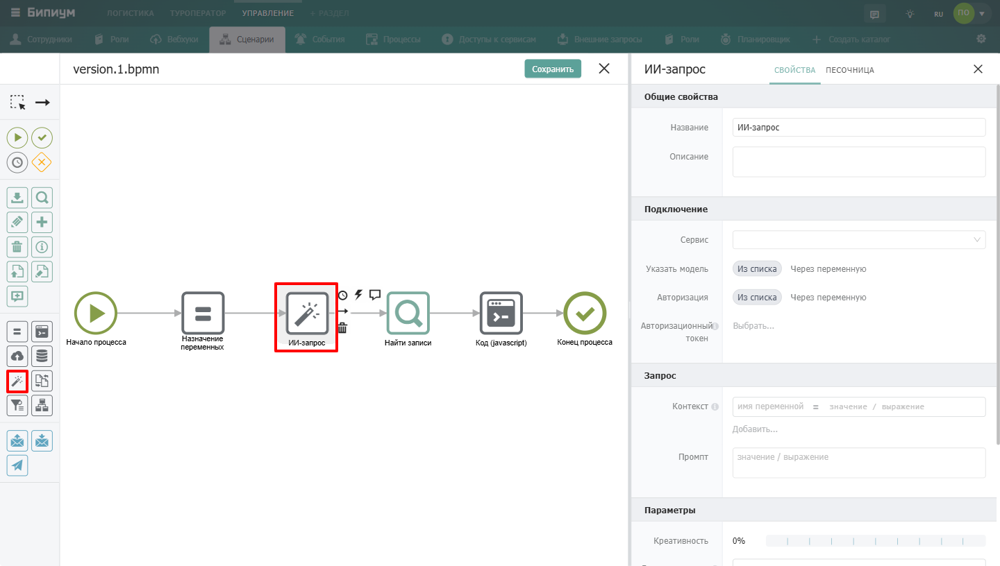
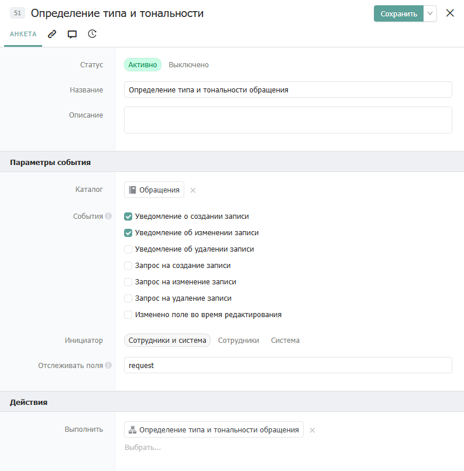
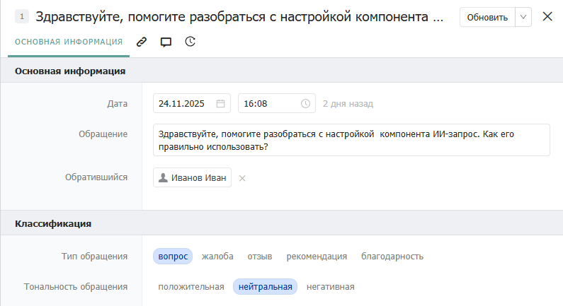

Компонент для выполнения запросов к большим языковым моделям (LLM). Позволяет использовать искусственный интеллект для обработки текста, классификации, генерации ответов и других задач.

{width=1440px height=816px}

## Когда использовать

Используйте **ИИ-запрос**, когда нужно применить возможности языковой модели к данным в сценарии. Типичные примеры:

-  Определение тональности обращения клиента

-  Классификация текста по категориям

-  Генерация ответов на вопросы

-  Извлечение сущностей из текста (даты, имена, суммы)

-  Перевод текста на другой язык

## Настройка компонента

### Секция «Общие свойства»

| Поле     | Описание                                                                                                         |
|----------|------------------------------------------------------------------------------------------------------------------|
| Название | По умолчанию «ИИ-запрос». Можно изменить на своё -- например, «Определить тональность» или «Сгенерировать ответ» |
| Описание | Необязательное поле. Можно добавить комментарий для себя или коллег                                              |

### Секция «Подключение»

.png> "Секция Подключение"){width=652px height=291px}

| Поле                                | Описание                                                                                                                                                                        |
|-------------------------------------|---------------------------------------------------------------------------------------------------------------------------------------------------------------------------------|
| Сервис                              | Выбор языковой модели. Доступны: `Deepseek`, `Grok`, `Sonar (Perplexity)`, `YandexGpt`, `GigaChat`                                                                              |
| Указать модель                      | Способ указания модели: «Из списка» (выбрать из предустановленных) или «Через переменную»                                                                                       |
| Модель                              | Конкретная модель для подключения. Появляется при выборе соответствующего способа                                                                                               |
| Каталог Yandex Cloud                | (Только для YandexGpt) Способ указания идентификатора каталога: через переменную или выбор из списка [«Доступы к сервисам»](./../../../systemcatalogs/upravlenie/oauthservices) |
| Идентификатор каталога Yandex Cloud | ID каталога в Яндекс Облаке                                                                                                                                                     |
| Авторизация                         | Способ указания токена: через переменную или выбор из списка [«Доступы к сервисам»](./../../../systemcatalogs/upravlenie/oauthservices)                                         |
| Авторизационный токен               | Токен для доступа к выбранному сервису                                                                                                                                          |

### Секция «Запрос»

.png> "Секция Запрос"){width=652px height=201px}

| Поле     | Описание                                                                                                                                                                      |
|----------|-------------------------------------------------------------------------------------------------------------------------------------------------------------------------------|
| Контекст | Набор переменных, которые выступают в роли инструкции для ИИ. Формат: список пар «имя переменной = значение / выражение». Каждая новая пара добавляется кнопкой «Добавить...» |
| Промпт   | Основной текстовый запрос (инструкция) для языковой модели. Подробно опишите задачу, которую должен выполнить ИИ. Формат: текст в кавычках или выражение                      |

### Секция «Параметры»

.png> "Секция Параметры"){width=649px height=327px}



---

*  

   Поле

*  

   Описание

---

*  

   Креативность

*  

   Контролирует степень случайности и творчества в ответах модели. Определяет, насколько модель отклоняется от наиболее вероятных шаблонов. Формат: шкала прогресса (0–100%)

---

*  

   Словарный запас

*  

   Частота повторения одних и тех же слов или фраз в ответах. Формат: шкала прогресса (0–100%)

---

*  

   Уровень рассуждения

*  

   Глубина анализа и сложность логических цепочек, которые модель применяет при генерации ответа. Влияет на качество решения сложных задач, требующих многошагового мышления

---

*  

   Охват поиска

*  

   Объём информационного пространства, используемого при поиске (для моделей с доступом в интернет)

---

*  

   Фильтрация доменов

*  

   Домены, которые будут использоваться моделью для поиска

---

*  

   Дополнительные параметры

*  

   Продвинутые параметры API для тонкой настройки модели. Формат: список пар «параметр = значение / выражение». Подробности о доступных параметрах можно найти на официальном сайте сервиса



### Секция «Результат»

.png> "Секция Результат"){width=650px height=149px}



---

*  Поле

*  Описание

---

*  Результат

*  Определяет, что будет возвращено:

   • **Ответ текстом** -- только текстовый ответ модели

   • **Ответ текстом** -- только текстовый ответ модели

   • **Все параметры** -- полный объект ответа от API

---

*  Сохранить в

*  Имя переменной, в которую сохраняется результат. В зависимости от выбранного формата ответа переменная будет содержать строку, JSON-объект или полный объект API



## Пограничные события

Компонент поддерживает 2 типа пограничных событий:

-  Ошибка -- выход из компонента, если произошла какая-либо ошибка

-  Таймаут -- выход из компонента, спустя заданное ограничение по времени

Если компонент завершился с ошибкой, но на нем не было пограничного события, то процесс завершается. Сообщение ошибки возвращается в результатах процесса.

## Использование

Рассмотрим вариант использования компонента ИИ-запрос для определения тональности обращения в техническую поддержку.

### **Структура каталогов**

#### **Каталог «Обращения»**

Создайте каталог «Обращения» и добавьте в него следующие поля:

{width=1487px height=719px}

-  **Дата** (Дата)

   Описание: Дата обращения. Заполняется вручную. Настройки: Дата с временем.

-  **Обращение** (Текст)

   Описание: Текст поступившего обращения. Заполняется вручную. Настройки: Многострочный текст.

-  **Обратившийся** (Сотрудник)

   Описание: Сотрудник, обратившийся с вопросом. Заполняется вручную.

-  **Тип обращения** (Статус) \
   Описание: Тип обращения. Заполняется автоматически в зависимости от текста обращения. Настройки: вопрос, жалоба, отзыв, рекомендации, благодарность.

-  **Тональность обращения** (Статус)

   Описание: Тональность обращения. Заполняется автоматически в зависимости от текста обращения Настройки: Текст.

### **Создание автоматизаций**

#### Определение типа и тональности обращения

Для запуска сценария по определению типа и тональности обращения используется событие с типами «Уведомление о создании записи» и «Уведомление об изменении записи», которое отслеживает изменение поля с Обращением. Пример события:

{width=793px height=805px}

При изменении поля с Обращением в карточке каталога событие запускает [сценарий автозаполнения](https://drive.google.com/file/d/1Jl-2ff9-5jOnZF6UE9O2TIcSeMqxaEpl/view?usp=drive_link).\
Сценарий для определения типа и тональности обращения выглядит следующим образом:

.png> "Сценарий определения типа и тональности"){width=1192px height=529px}

**Сценарий выполняет:**

-  Получает структуру каталога Обращения

-  Получение типа и тональности Обращения. Компонентом «ИИ-Запрос» сценарий обращается к «YandexGpt» и пытается получить ответ на запрос. Формат получаемых данных – JSON.

-  После обработки полученного JSON сценарий записывает необходимые значения в текущую запись.

**В сценарии необходимо изменить следующие компоненты:**

-  Компонент «ИИ-Запрос». Замените Идентификатор каталога Yandex Cloud и Авторизационный токен в секции Подключение.

### Тестирование

Создайте новую запись в созданном (измененном) каталоге Обращения и введите Дату, Обращение и выберите Обратившегося и сохраните запись.

.png> "Пример обращения. ИИ-запрос"){width=794px height=444px}

После сохранения записи срабатывает событие и ИИ-запрос определяет Тип и Тональность обращения.

{width=795px height=433px}