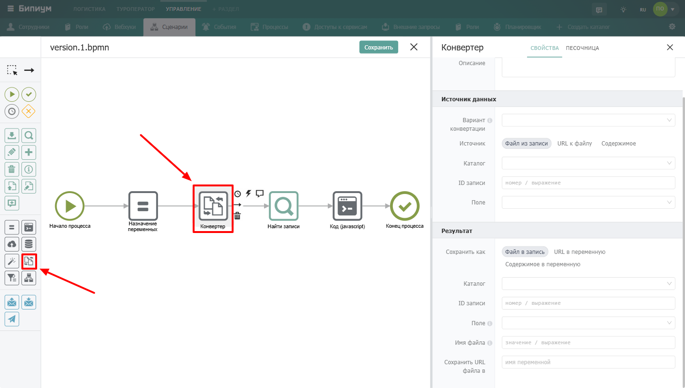
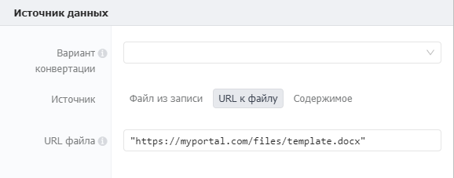
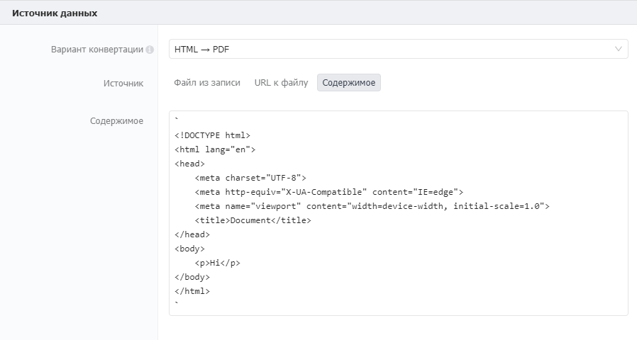
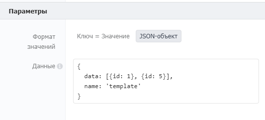

Компонент для преобразования данных и файлов из одного формата в другой. Позволяет генерировать PDF из HTML или DOCX, конвертировать Excel в JSON, преобразовывать XML в JSON и выполнять другие операции с файлами.

{width=1440px height=816px}

## Когда использовать

Используйте **Конвертер**, когда нужно изменить формат данных для дальнейшей обработки или интеграции. Типичные примеры:

-  Сгенерировать PDF-счёт из HTML-шаблона

-  Преобразовать загруженный Excel-файл в JSON для анализа

-  Сконвертировать DOCX-договор в PDF для отправки клиенту

## Настройка компонента

### Секция «Общие свойства»



---

*  

   Поле

*  

   Описание

---

*  

   Название

*  

   По умолчанию «Конвертер». Можно изменить на своё -- например, «Создать PDF из договора»

---

*  

   Описание

*  

   Необязательное поле. Можно добавить комментарий для себя или коллег



### Секция «Источник данных»

{width=524px height=278px}

#### **Вариант конвертации**

Выберите тип преобразования:



---

*  

   Вариант

*  

   Описание

---

*  

   HTML -> PDF

*  

   Генерация PDF из HTML-разметки. Принимает HTML-файл из записи, ссылку на файл или произвольную HTML-разметку

---

*  

   DOCX -> PDF

*  

   Генерация PDF из DOCX-файла. Принимает файл из записи или ссылку на файл

---

*  

   Excel -> JSON

*  

   Преобразование Excel-таблицы в JSON-объект. Результат записывается в переменную

---

*  

   XML -> JSON

*  

   Преобразование XML-разметки в JSON-объект. Результат записывается в переменную



#### **Источник**

Способ указания исходных данных:



---

*  

   Способ

*  

   Описание

---

*  

   **Файл из записи**

*  

   Берёт файл из поля типа «Файл» в указанной записи Бипиума. Требует указать каталог, ID записи и поле

---

*  

   **URL к файлу**

*  

   Берёт файл по публичной ссылке. Если вариант подразумевает использование шаблона, по ссылке должен находиться он

---

*  

   **Содержимое**

*  

   Принимает данные напрямую в виде строки (HTML-разметка или буферные данные). Для использования переменных сценария в качестве встраиваемых значений используйте обратные кавычки `` ` `` |



**Файл из записи** \
Принимает значение из поля типа «Файл» в записи Бипиума. Указанный файл будет сконвертирован.

<figure>


<figcaption>


</figcaption>

</figure>

-  **Каталог**\
   Список доступных каталогов для поиска записей. Формат: список каталогов.

-  **ID записи**  \
   Идентификатор записи, в которой находится файл для конвертации.

   Формат: значение/выражение.

-  **Поле**\
   Идентификатор поля записи, в которой находится файл для конвертации.

**URL к файлу**\
URL к файлу, который находится в открытом для системы доступе. Если вариант подразумевает использование шаблона, по ссылке должен находится он.



**Содержимое**\
Поле для ввода содержимого к конвертации. В поле может храниться произвольная HTML-разметка (для варианта конвертации HTML -> PDF) или буферные данные, на основе которых будет производиться конвертация.

Формат данных в поле – строка. Данные могут храниться в произвольных кавычках. Для использования переменных сценария в качестве встраиваемых значений используйте одинарные обратные кавычки «\`». Пример заполнения поля HTML-разметки представлен ниже:



### Секция «Параметры»

{width=522px height=181px}

Данные можно вводить в формате «Ключ = значение» или в виде JSON-объекта.

Секция появляется только в том случае, если выбранный вариант конвертации поддерживает формат работы с параметрами.

В зависимости от варианта конвертации, поддерживаются следующие параметры:

#### **HTML -> PDF**

| Параметр            | Тип              | Описание                                                                                                                                                        | По умолчанию |
|---------------------|------------------|-----------------------------------------------------------------------------------------------------------------------------------------------------------------|--------------|
| Width               | string \| number | Устанавливает ширину бумаги. Передается число или строка с единицей измерения.                                                                                  |              |
| Height              | string \| number | Устанавливает высоту бумаги. Передается число или строка с единицей измерения.                                                                                  |              |
| Format              | string           | Возможные размеры формата: Letter, Legal, Tabloid, Ledger, A0, A1, A2, A3, A4, A5, A6. Если передаются Width и(или) Height вместе с Format, применяется Format. | 'A4'         |
| Margin              | string \| object | Отступы страницы. Можно передать строку или объект с top/left/right/bottom.                                                                                     | '1cm'        |
| Landscape           | boolean          | Альбомная ориентация страницы.                                                                                                                                  | false        |
| printBackground     | boolean          | Печать фоновой графики.                                                                                                                                         | true         |
| Scale               | number           | Масштаб отображения страницы (0.1–2).                                                                                                                           | 1            |
| pageRanges          | string           | Диапазоны страниц для конвертации (например, '1-5').                                                                                                            | ' '          |
| displayHeaderFooter | boolean          | Показывать колонтитулы.                                                                                                                                         | false        |
| headerTemplate      | string           | HTML-шаблон верхнего колонтитула (date, title, url, pageNumber, totalPages).                                                                                    |              |
| footerTemplate      | string           | HTML-шаблон нижнего колонтитула.                                                                                                                                |              |

#### **XML -> JSON**

| Параметр              | Описание                                       | По умолчанию |
|-----------------------|------------------------------------------------|--------------|
| attrkey               | Префикс для доступа к атрибутам                | \$           |
| charkey               | Префикс для содержимого символа                | \_           |
| trim                  | Обрезать пробелы в текстовых узлах             | false        |
| normalizeTags         | Приводить теги к нижнему регистру              | false        |
| normalize             | Обрезать внутренние пробелы                    | false        |
| explicitRoot          | Возвращать корневой узел                       | true         |
| emptyTag              | Значение пустых узлов                          | " "          |
| explicitArray         | Всегда использовать массивы для дочерних узлов | true         |
| ignoreAttrs           | Игнорировать атрибуты XML                      | false        |
| mergeAttrs            | Объединять атрибуты с дочерними элементами     | false        |
| validator             | Функция валидации результата                   | null         |
| xmlns                 | Добавлять namespace информацию                 | false        |
| explicitChildren      | Отдельное свойство для дочерних элементов      | false        |
| childkey              | Префикс для дочерних элементов                 | \$\$         |
| preserveChildrenOrder | Сохранять порядок дочерних узлов               | false        |
| charsAsChildren       | Символы как дочерние узлы                      | false        |
| includeWhiteChars     | Включать пробельные текстовые узлы             | false        |
| attrNameProcessors    | Обработчики имён атрибутов                     | null         |
| attrValueProcessors   | Обработчики значений атрибутов                 | null         |
| tagNameProcessors     | Обработчики имён тегов                         | null         |
| valueProcessors       | Обработчики значений элементов                 | null         |

#### **Формат значений**

Позволяет выбрать способ передачи параметров конвертации. Возможные значения: Ключ = значение, JSON-объект.

**Формат «ключ = значение»**\
Параметры передаются в виде Наименование параметра = Значение параметра


**Формат «JSON -- объект»**\
Параметры передаются в виде JSON-объекта.



В отличие от формата «Ключ-значение» этот формат может принимать в качестве ключа атрибута значение переменной:

```json
{
    key1: value1,      // Ключ = значение
    key2: {            // Ключ с вложенным ключом
        key3: value3    
    },
    [key4]: value4     // Переменная в качестве ключа.
}
```

### Секция «Результат»

{width=521px height=345px}



---

*  

   Поле

*  

   Описание

---

*  

   Сохранить как

*  

   Способ сохранения результата:

   • **Файл в запись** -- сохраняет файл в поле типа «Файл» указанной записи

   • **URL в переменную** -- сохраняет ссылку на файл в переменную

   • **Содержимое в переменную** -- сохраняет результат в переменную для дальнейшего использования



В зависимости от выбранного варианта появляются дополнительные поля:

**При выборе «Файл в запись»**

 (1).png>)

| Поле                  | Описание                                                                                       |
|-----------------------|------------------------------------------------------------------------------------------------|
| Каталог               | Список доступных каталогов для поиска записи                                                   |
| ID записи             | Идентификатор записи, в которую сохраняется файл. Формат: номер или выражение                  |
| Поле                  | Идентификатор поля типа «Файл», в которое сохраняется файл                                     |
| Имя файла             | Название, под которым файл будет сохранён в файловом хранилище. Формат: значение или выражение |
| Сохранить URL файла в | Имя переменной, в которую будет записана ссылка на файл                                        |

**При выборе «URL в переменную»**

 (1).png>)

| Поле                  | Описание                                                                                       |
|-----------------------|------------------------------------------------------------------------------------------------|
| Имя файла             | Название, под которым файл будет сохранён в файловом хранилище. Формат: значение или выражение |
| Сохранить URL файла в | Имя переменной, в которую будет записана ссылка на файл                                        |

**При выборе «Содержимое в переменную»**

 (1).png>)

| Поле                   | Описание                                        |
|------------------------|-------------------------------------------------|
| Сохранить содержимое в | Имя переменной, в которую сохраняется результат |

## Формат результата

В зависимости от выбранного варианта конвертации результат сохраняется в разном формате.

**HTML -> PDF**

Результатом является **PDF-файл**. В зависимости от выбранного способа сохранения:

-  **Файл в запись** -- файл сохраняется в указанное поле типа «Файл»

-  **URL в переменную** -- в переменную сохраняется ссылка на файл

-  **Содержимое в переменную** -- в переменную сохраняется буфер PDF-файла

**DOCX -> PDF**

Результатом является **PDF-файл**. Формат результата аналогичен HTML -> PDF.

**Excel -> JSON**

Результатом будет объект, где ключи -- названия листов Excel, а значения -- массивы с данными строк. Каждая строка представлена в виде объекта, где ключи -- буквы колонок (A, B, C и т.д.), а значения -- содержимое ячеек.

```json
{
  "Лист1": [
    { "A": "ячейка А1", "B": "ячейка B1", "C": "ячейка C1" },
    { "A": "ячейка А2", "B": "ячейка B2", "C": "ячейка C2" }
  ],
  "Лист2": [
    { "A": "ячейка А1", "C": "ячейка C1" },
    { "A": "ячейка А2", "B": "ячейка B2", "C": "ячейка C2" }
  ]
}
```

*Примечание: если ячейка не заполнена, она отсутствует в объекте строки.*

**XML -> JSON**

Результатом будет JSON-объект, построенный из структуры XML-документа.

**Пример XML:**

```xml
<CAT>
  <NAME>Izzy</NAME>
  <BREED>Siamese</BREED>
  <AGE>6</AGE>
  <ALTERED>yes</ALTERED>
  <DECLAWED>no</DECLAWED>
  <LICENSE>Izz138bod</LICENSE>
  <OWNER>Colin Wilcox</OWNER>
</CAT>
```

**Результат конвертации:**

```json
{
  "CAT": {
    "NAME": "Izzy",
    "BREED": "Siamese",
    "AGE": "6",
    "ALTERED": "yes",
    "DECLAWED": "no",
    "LICENSE": "Izz138bod",
    "OWNER": "Colin Wilcox"
  }
}
```

## Пограничные события


Компонент поддерживает 2 типа пограничных событий:

-  Ошибка -- выход из компонента, если произошла какая-либо ошибка

-  Таймаут -- выход из компонента, спустя заданное ограничение по времени

Если компонент завершился с ошибкой, но на нем не было пограничного события, то процесс завершается. Сообщение ошибки возвращается в результатах процесса.