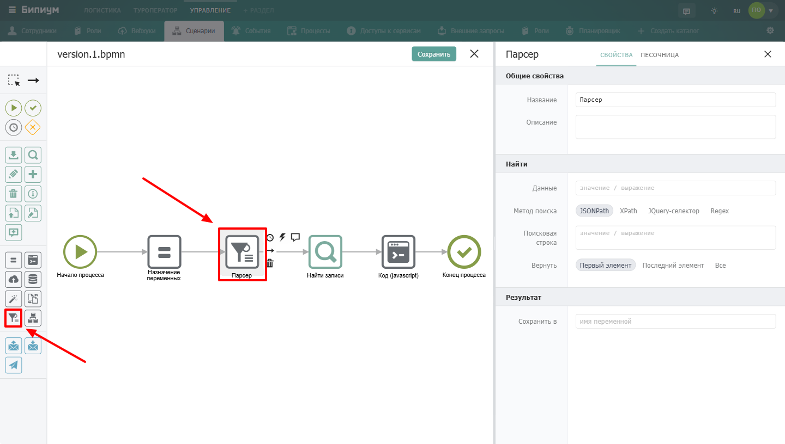
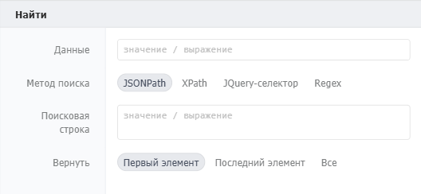
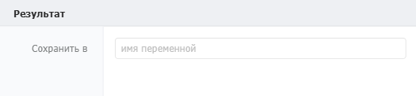

Компонент для поиска и извлечения фрагментов из текстовых данных. Позволяет находить нужные элементы в JSON, XML, HTML или обычном тексте с помощью разных методов поиска.

{width=1440px height=816px}

## Когда использовать

Используйте **Парсер**, когда нужно извлечь конкретные данные из структурированного или неструктурированного текста. Типичные примеры:

-  Получить значение поля из JSON-ответа API

-  Извлечь текст из HTML-страницы по CSS-селектору

-  Найти все ссылки на странице с помощью XPath

-  Вытащить номер заказа из текста по регулярному выражению

## Настройка компонента

### Общие свойства



---

*  

   Поле

*  

   Описание

---

*  

   Название

*  

   По умолчанию «Парсер». Можно изменить на своё -- например, «Извлечь email из ответа» или «Найти цену в HTML»

---

*  

   Описание

*  

   Необязательное поле. Можно добавить комментарий для себя или коллег



### Секция «Найти»

{width=528px height=244px}



---

*  

   Поле

*  

   Описание

---

*  

   Данные

*  

   Строка с текстовыми данными, в которой требуется найти нужный фрагмент. Данные могут быть любого формата (JSON, XML, HTML, текст). Формат: текст в кавычках или выражение

---

*  

   Метод поиска

*  

   Способ поиска вхождений в исходной строке. Доступны четыре метода: `JSONPath`, `XPath`, `jQuery-селектор`, `Regex`

---

*  

   Поисковая строка

*  

   Выражение, описывающее что искать. Формат зависит от выбранного метода. Формат: текст в кавычках или выражение

---

*  

   Возвращаемое значение

*  

   Поле появляется для некоторых методов поиска. Указывает, что именно вернуть из найденного элемента

---

*  

   Вернуть

*  

   Какое из найденных значений вернуть: «Первый элемент», «Последний элемент» или «Все»



**Методы поиска**

| Метод           | Для чего используется                                                         | Пример поисковой строки                     |
|-----------------|-------------------------------------------------------------------------------|---------------------------------------------|
| JSONPath        | Поиск элементов в JSON-объекте или JS-объекте                                 | `"$.store.book[*].author"`                  |
| XPath           | Поиск элемента в XML или HTML-документе                                       | `"/element/"`                               |
| jQuery-селектор | Поиск элемента или данных в HTML-документе. Поддерживает все jQuery-селекторы | `"#elementid"`, `".classname"`, `"p:first"` |
| Regex           | Поиск с помощью регулярных выражений                                          | `"/[0-9]+/"`                                |

**Возвращаемое значение**

Поле доступно при выборе метода **jQuery-селектор**. Указывает, что именно вернуть у найденного элемента:

<figure>

 (1) (1) (1) (1) (1).png>)

<figcaption>


</figcaption>

</figure>



---

*  

   Вариант

*  

   Что возвращает

---

*  

   **HTML элемента**

*  

   Внутренний HTML-код элемента

---

*  

   **Текст элемента**

*  

   Текстовое содержимое элемента

---

*  

   **Значение элемента (val)**

*  

   Значение элемента (для input-полей)

---

*  

   **Элемент**

*  

   Сам DOM-элемент

---

*  

   **Атрибут**

*  

   Значение указанного атрибута



Поле также доступно для метода **Regex** -- указывает индекс поисковой подстроки (по умолчанию 0), если регулярное выражение содержит несколько групп (заключенных в круглые скобки).

<figure>

 (1) (1) (1) (1) (1).png>)

<figcaption>


</figcaption>

</figure>

### Секция «Результат»

{width=525px height=122px}



---

*  

   Поле

*  

   Описание

---

*  

   Сохранить в

*  

   Имя переменной, в которую сохраняются найденные данные. В качестве переменной можно указать ключ объекта -- тогда найденные данные сохранятся как значение этого ключа



## Пограничные события


Компонент поддерживает 2 типа пограничных событий:

-  Ошибка -- выход из компонента, если произошла какая-либо ошибка

-  Таймаут -- выход из компонента, спустя заданное ограничение по времени

Если компонент завершился с ошибкой, но на нем не было пограничного события, то процесс завершается. Сообщение ошибки возвращается в результатах процесса.

## Примеры

#### JSONPath

**Данные:**

```json
{
  "store": {
    "book": [
      { "author": "Толстой", "title": "Война и мир" },
      { "author": "Достоевский", "title": "Преступление и наказание" }
    ]
  }
}
```



---

*  

   Поле

*  

   Значение

---

*  

   Метод поиска

*  

   `JSONPath`

---

*  

   Поисковая строка

*  

   `"$.store.book[*].author"`

---

*  

   Вернуть

*  

   `Все`



**Результат:** `["Толстой", "Достоевский"]`

#### jQuery-селектор

**Данные:** HTML-страница с элементом `<span class="price">1500 ₽</span>`



---

*  

   Поле

*  

   Значение

---

*  

   Метод поиска

*  

   `jQuery-селектор`

---

*  

   Поисковая строка

*  

   `".price"`

---

*  

   Вернуть

*  

   `Первый элемент`

---

*  

   Возвращаемое значение

*  

   `Текст элемента`



**Результат:** `"1500 ₽"`

#### Regex

**Данные:** `"Ваш заказ №12345 подтверждён"`



---

*  

   Поле

*  

   Значение

---

*  

   Метод поиска

*  

   `Regex`

---

*  

   Поисковая строка

*  

   `"/№(\d+)/"`

---

*  

   Возвращаемое значение

*  

   `1` (индекс подстроки в скобках)

---

*  

   Вернуть

*  

   `Первый элемент`



**Результат:** `"12345"`