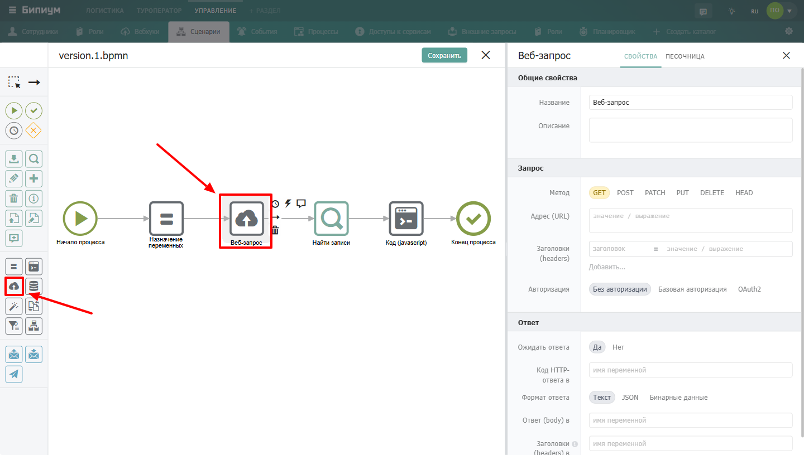
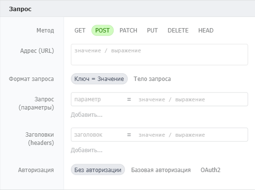
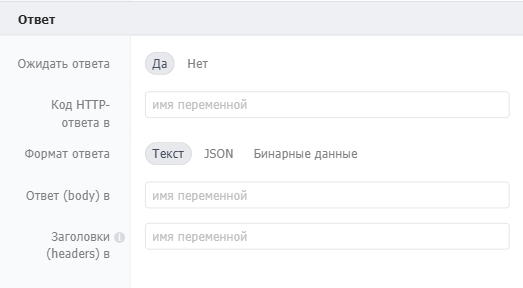

Компонент для выполнения HTTP-запросов к внешним системам. Позволяет отправлять данные в сторонние сервисы и получать ответы -- от API погоды до корпоративных CRM.

{width=1440px height=816px}

## Когда использовать

Используйте **Веб-запрос**, когда сценарию нужно обменяться данными с внешней системой. Типичные примеры:

-  Отправить уведомление в Telegram

-  Получить курс валют с публичного API

-  Загрузить данные в корпоративную CRM

-  Вызвать веб-хук другого сервиса

## Настройка компонента

### Секция «Общие свойства»

| Поле     | Описание                                                                                                       |
|----------|----------------------------------------------------------------------------------------------------------------|
| Название | По умолчанию «Веб-запрос». Можно изменить на своё -- например, «Отправить заказ в CRM» или «Получить курс USD» |
| Описание | Необязательное поле. Можно добавить комментарий для себя или коллег                                            |

### Секция «Запрос»

{width=525px height=392px}



---

*  

   Поле

*  

   Описание

---

*  

   Метод

*  

   Тип HTTP-запроса: `GET`, `POST`, `PATCH`, `PUT`, `DELETE`, `HEAD` (по умолчанию `GET`)

---

*  

   Адрес (URL)

*  

   Адрес, на который отправляется запрос. Может содержать GET-параметры. Формат: текст в кавычках или выражение

---

*  

   Заголовки (headers)

*  

   Дополнительные заголовки HTTP-запроса. Формат: список пар «заголовок = значение / выражение». Если указать заголовок, который уже задан системой (например, `Content-Type`), будет использовано указанное вами значение



**Формат запроса (для POST, PATCH, PUT, DELETE)**

При выборе методов `POST`, `PATCH`, `PUT`, `DELETE` появляется дополнительная настройка -- **Формат запроса**:



---

*  

   Формат

*  

   Описание

---

*  

   Ключ/значение

*  

   Параметры передаются как форма (`application/x-www-form-urlencoded`). Появляется поле «Запрос (параметры)» -- список пар «параметр = значение / выражение»

---

*  

   Тело запроса

*  

   Данные передаются в теле запроса. Появляются поля: «Запрос (body)» (текст или выражение) и «Тип данных» (`JSON`, `XML`, `SOAP`, `Plain text`)



**Авторизация**



---

*  

   Тип

*  

   Описание

---

*  

   Без авторизации

*  

   Запрос отправляется без учётных данных

---

*  

   Базовая авторизация (Basic)

*  

   Появляются поля «Логин» и «Пароль» (текст в кавычках или выражение)

---

*  

   OAuth2

*  

   Появляется поле «Токен» -- можно выбрать или создать шаблон авторизационных ключей из каталога «[Доступы к сервисам](./../../../systemcatalogs/upravlenie/oauthservices)»



### Секция  «Ответ»

{width=523px height=288px}



---

*  

   Поле

*  

   Описание

---

*  

   **Ожидать ответа**

*  

   `Да` (по умолчанию) или `Нет`. Если выбрать `Нет`, компонент не дожидается ответа от сервера и продолжает выполнение сценария

---

*  

   **Код HTTP-ответа в**

*  

   Выходной параметр. Сохраняет код ответа в указанную переменную. Формат: имя переменной

---

*  

   **Формат ответа**

*  

   Способ сохранения тела ответа:

   • **Текст** -- сохраняет ответ «как есть», без преобразований

   • **JSON** -- преобразует ответ в объект через `JSON.parse()`

---

*  

   **Ответ (body) в**

*  

   Выходной параметр. Сохраняет тело ответа в указанную переменную. Формат: имя переменной

---

*  

   **Заголовки (headers)**

*  

   Выходной параметр. Сохраняет массив заголовков ответа в указанную переменную. Формат: имя переменной



***Куки***. Сервер может установить несколько куков, передав их в нескольких заголовках set-cookie. Компонент «Веб-запрос» преобразовывает их в коллекцию cookies. Ключи коллекции -- имена установленных кук, значение -- объект с значением (value) и параметрами куки (такие как время жизни, домен). Например, если вы сохранили заголовки в переменную headers, то значение куки sessionId будет доступно по выражению headers\['cookies'\]\['sessionId'\].\['value'\] или его эквиваленту headers.cookies.sessionId.value.

## Пограничные события

Компонент поддерживает 2 типа пограничных событий:

-  Ошибка -- выход из компонента, если произошла какая-либо ошибка

-  Таймаут -- выход из компонента, спустя заданное ограничение по времени

Если компонент завершился с ошибкой, но на нем не было пограничного события, то процесс завершается. Сообщение ошибки возвращается в результатах процесса.