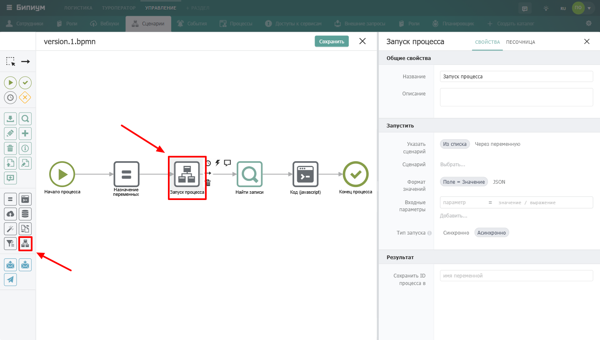
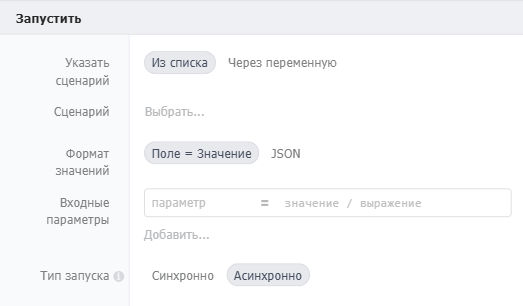
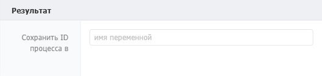

Компонент для вызова одного сценария из другого. Позволяет переиспользовать готовые автоматизации, не дублируя их логику.

{width=1440px height=816px}

## Когда использовать

Используйте **Запуск процесса**, когда нужно вынести повторяющуюся логику в отдельный сценарий и вызывать его из разных мест. Типичные примеры:

-  Вычисление сложных формул, которые используются в нескольких сценариях

-  Отправка уведомлений по единому шаблону

-  Обработка данных по стандартному алгоритму

-  Разделение сложного сценария на более простые части

## Настройка компонента

### Секция «Общие свойства»



---

*  

   Поле

*  

   Описание

---

*  

   Название

*  

   По умолчанию «Запуск процесса». Можно изменить на своё -- например, «Вызвать расчёт скидки» или «Отправить уведомление»

---

*  

   Описание

*  

   Необязательное поле. Можно добавить комментарий для себя или коллег



### Секция «Запустить»

{width=523px height=306px}



---

*  

   Поле

*  

   Описание

---

*  

   Указать сценарий

*  

   Способ выбора вызываемого сценария:

   • **Из списка** -- выбрать из существующих сценариев

   • **Через переменную** -- указать переменную, в которой хранится идентификатор сценария

---

*  

   Сценарий

*  

   Выбранный сценарий (появляется при выборе «Из списка»)

---

*  

   Формат значений

*  

   Способ передачи входных параметров:

   • **Поле = Значение** -- параметры передаются в виде пар «имя = значение»

   • **JSON** -- параметры передаются в виде JSON-объекта

---

*  

   Входные параметры

*  

   Набор переменных, которые будут переданы в дочерний сценарий. Слева -- имя переменной, которую ожидает дочерний сценарий, справа -- значение из родительского. Каждая новая пара добавляется кнопкой **«Добавить...»**

---

*  

   Тип запуска

*  

   Режим выполнения:

   • **Синхронно** -- родительский сценарий ждёт завершения дочернего и получает результат

   • **Асинхронно** -- дочерний сценарий запускается без ожидания, родительский продолжает выполнение



## Секция «Результат»

{width=529px height=125px}



---

*  

   Поле

*  

   Описание

---

*  

   Сохранить ответ в

*  

   Имя переменной, в которую сохраняется результат выполнения дочернего сценария. Доступно только при **синхронном** запуске

---

*  

   Сохранить ID процесса в

*  

   Имя переменной, в которую сохраняется идентификатор (PID) запущенного дочернего процесса. Доступно для обоих типов запуска



**Формат результата (при синхронном запуске):**\
Результат сохраняется в переменную в формате JSON, где ключи -- имена переменных дочернего сценария, а значения -- их значения:

```json
{
  "переменная1": "значение1",
  "переменная2": 123,
  "переменная3": ["a", "b", "c"]
}
```

### Пограничные события

 (1).png>)

Компонент поддерживает 2 типа пограничных событий: Ошибка -- выход из компонента, если произошла какая-либо ошибка Таймаут -- выход из компонента, спустя заданное ограничение по времени Если компонент завершился с ошибкой, но на нем не было пограничного события, то процесс завершается. Сообщение ошибки возвращается в результатах процесса.