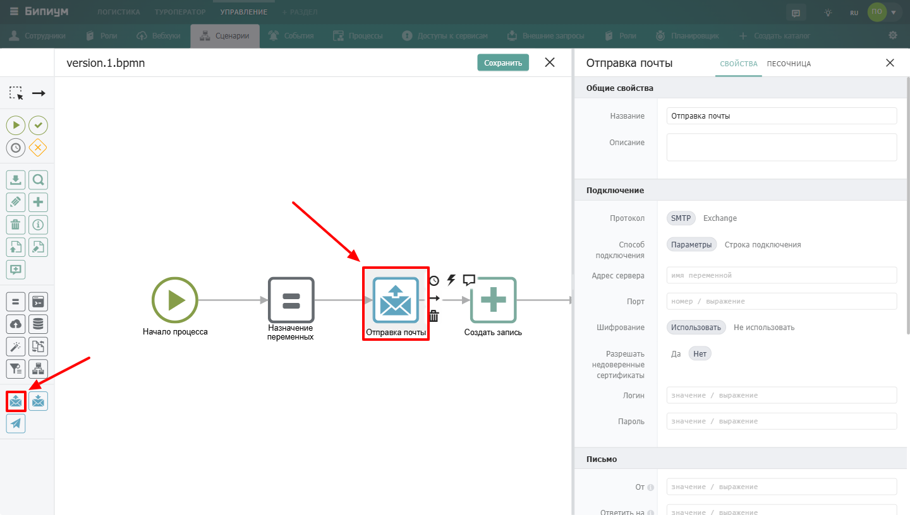
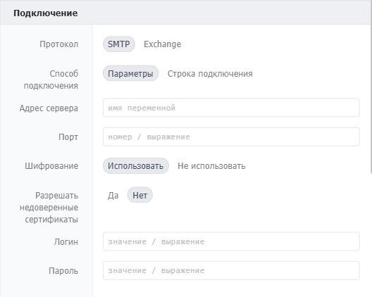
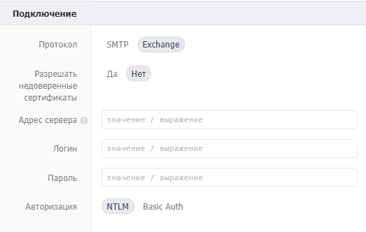
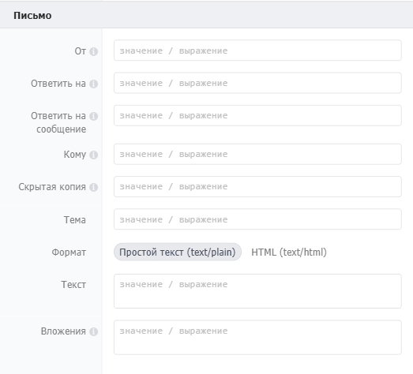
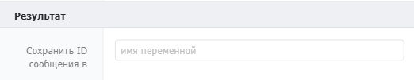
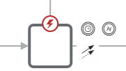

Компонент для отправки email-сообщений по протоколу SMTP. Поддерживает отправку текстовых и HTML-писем с вложениями.

{width=1440px height=816px}

## Когда использовать

Используйте **Отправка почты**, когда сценарий должен отправить письмо. Типичные примеры:

-  Отправить клиенту подтверждение заказа

-  Выслать отчёт руководителю по расписанию

-  Уведомить сотрудника о назначенной задаче

-  Переслать сформированный документ на почту

## Настройка компонента

### Секция «Общие свойства»



---

*  

   Поле

*  

   Описание

---

*  

   Название

*  

   По умолчанию «Отправка почты». Можно изменить на своё -- например, «Отправить подтверждение заказа»

---

*  

   Описание

*  

   Необязательное поле



### Секция «Подключение»

Протокол -- определяет протокол отправки почты. Доступные варианты: [**SMTP**](https://ru.ruwiki.ru/wiki/SMTP?ysclid=mnrfvlm4fc407645813) или [**Exchange**](https://ru.ruwiki.ru/wiki/Microsoft_Exchange_Server?ysclid=mnrfw5d9dg679713385).

**Протокол: SMTP**

{width=528px height=422px}

Способ подключения -- определяет как задаются параметры подключения. Доступные варианты: **Параметры** или **Строка подключения**.

**Способ подключения: Параметры**



---

*  

   Параметр

*  

   Описание

*  

   Пример

---

*  

   **Адрес сервера**

*  

   Домен или IP-адрес SMTP-сервера без протокола

*  

   `"smtp.yandex.ru"`

---

*  

   **Порт**

*  

   Порт почтового сервера

*  

   `465`

---

*  

   **Шифрование**

*  

   Использовать SSL. Вариант «Не использовать» сначала пробует STARTTLS, при неуспехе -- без шифрования

*  

   Использовать

---

*  

   **Логин**

*  

   Логин для авторизации, как правило совпадает с адресом почты

*  

   `"user@yandex.ru"`

---

*  

   **Пароль**

*  

   Пароль от почтового ящика

*  

   `"пароль"`



**Способ подключения: Строка подключения**

Строка подключения -- все параметры единой строкой. Формат: [nodemailer](https://nodemailer.com/smtp/).

**Протокол: Exchange**

{width=522px height=332px}

Используется для подключения к корпоративным почтовым серверам Microsoft Exchange.



---

*  

   Параметр

*  

   Описание

---

*  

   Разрешать недоверенные сертификаты

*  

   Да / Нет -- разрешает подключение к серверам с самоподписанными или недоверенными SSL-сертификатами. Используйте «Да» только для внутренних корпоративных серверов

---

*  

   Адрес сервера

*  

   Адрес Exchange-сервера, включая протокол. Например: `https://mail.company.ru`

---

*  

   Логин

*  

   Логин для авторизации на сервере Exchange

---

*  

   Пароль

*  

   Пароль от учётной записи

---

*  

   Авторизация

*  

   **NTLM** -- авторизация через Windows-аутентификацию (для серверов в домене). **Basic Auth** -- стандартная авторизация по логину и паролю



### Секция «Письмо»

{width=523px height=474px}



---

*  

   Параметр

*  

   Описание

---

*  

   От

*  

   Адрес отправителя. Можно указать просто email или строку с именем: `"Бипиум <[email protected]>"`

---

*  

   Кому

*  

   Адрес получателя или список адресов через запятую. Формат: `"[email protected]"` или выражение

---

*  

   Тема

*  

   Заголовок письма. Формат: значение в кавычках или выражение

---

*  

   Текст

*  

   Содержание письма. Для многострочного текста с переменными удобно использовать шаблоны в обратных кавычках

---

*  

   Формат

*  

   **Простой текст** -- без форматирования. **HTML** -- письмо в формате HTML с поддержкой тегов

---

*  

   Вложения

*  

   Файлы для прикрепления к письму. Поддерживаются файлы из интернета и файловых полей каталогов



Пример использования шаблона для текста письма:

```
`Здравствуйте, ${name}!
Рады сообщить вам, что...`
```

Формат вложения (один файл):

```
{
  title: 'Договор.doc',
  url: 'http://URL к файлу'
}
```

Формат вложений (несколько файлов):

```
[
  {
    title: 'Договор.doc',
    url: 'http://URL к файлу'
  },
  {
    title: 'Счёт.xls',
    url: 'http://URL к файлу'
  }
]
```

#### Пример прикрепления файлов из поля записи каталога

Файлы в записях каталога хранятся в массиве и могут передаваться в вложения напрямую -- система возьмёт значения по ключам `title` и `url`:

```
[
  {
    id: 1,
    title: "Документ.pdf",
    size: 1024,
    url: "https://...",
    mimeType: "application/pdf",
    metadata: null
  }
]
```

### Секция «Результат»

{width=522px height=102px}

| Поле                     | Описание                                                                                                                                                          |
|--------------------------|-------------------------------------------------------------------------------------------------------------------------------------------------------------------|
| Сохранить ID сообщения в | Имя переменной, в которую сохраняется идентификатор отправленного сообщения (message ID). Может пригодиться для отслеживания статуса отправки или для логирования |

## Параметры подключения к популярным сервисам

| Параметр      | Яндекс                    | Gmail                     |
|---------------|---------------------------|---------------------------|
| Адрес сервера | `"smtp.yandex.ru"`        | `"smtp.gmail.com"`        |
| Порт          | `465`                     | `465`                     |
| Шифрование    | Использовать              | Использовать              |
| Логин         | Полный адрес эл. почты    | Полный адрес эл. почты    |
| Пароль        | Пароль от почтового ящика | Пароль от почтового ящика |

:::note 

**Если письма не отправляются через Gmail:** Google может заблокировать отправку с серверов Бипиума как подозрительную. Перейдите на [myaccount.google.com/device-activity](https://myaccount.google.com/device-activity) -- вы увидите попытку входа из Дублина/Ирландии. Подтвердите что это ваше подключение.

:::

## Пограничные события



Компонент поддерживает 2 типа пограничных событий:

-  Ошибка -- выход из компонента, если произошла какая-либо ошибка

-  Таймаут -- выход из компонента, спустя заданное ограничение по времени

Если компонент завершился с ошибкой, но на нем не было пограничного события, то процесс завершается. Сообщение ошибки возвращается в результатах процесса.