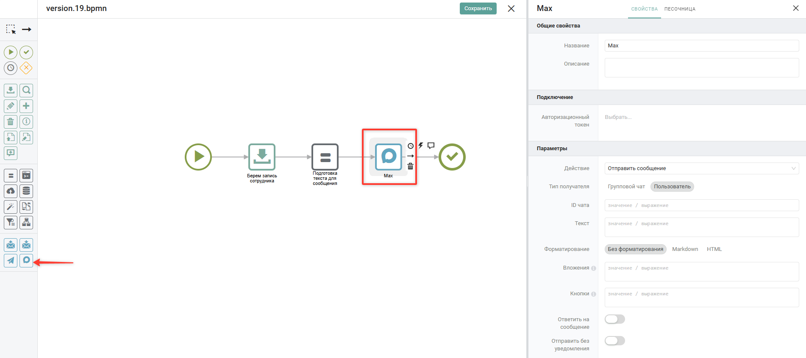
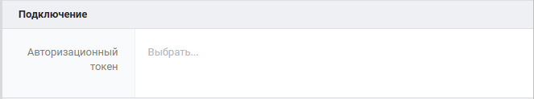
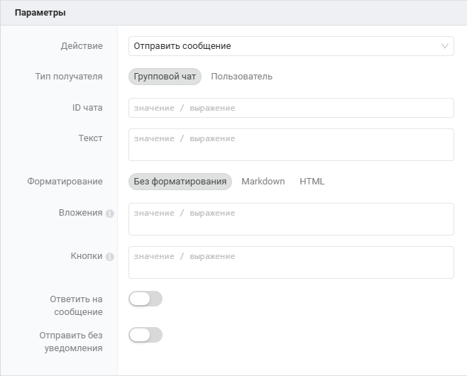
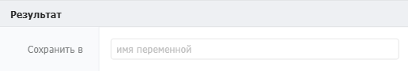
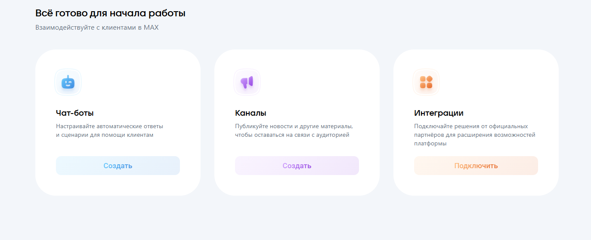
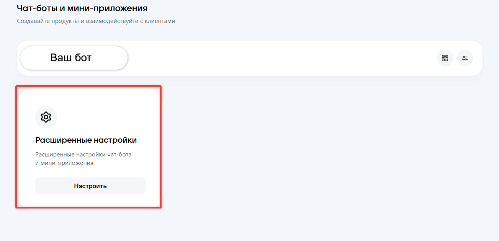
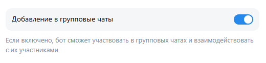
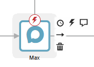
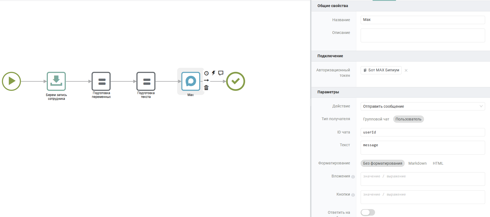

Компонент для взаимодействия с мессенджером MAX из сценариев автоматизации Бипиум с использованием бота MAX.

{width=1902px height=846px}

## Когда использовать

Компонент MAX можно использовать для следующих функций:

-  Отправка сообщений в диалог с пользователем;

-  Отправка сообщений в групповые чаты;

-  Получить информацию о чатах;

-  Управление вебхуками бота;

-  Получение информации о боте;

-  Загрузка и отправка файлов.

:::info 

Отправка сообщений в мессенджер MAX из компонента сценария Бипиум возможна только с использованием бота MAX.

:::

## Настройка компонента

### Секция «Подключение»

{width=663px height=123px}

Доступно к редактированию только поле «Авторизационный токен», для авторизации вашего запроса.



---

*  Поле

*  

   Описание

---

*  Авторизационный токен

*  

   Ключ доступа вашего бота (обязательное поле). Инструкция по получению токена приведена в разделе «[Получение авторизационного токена](./max-2#получение-авторизационного-токена)»



### Секция «Параметры»

{width=658px height=530px}

### Описание параметров для каждого действия бота

#### **Отправить сообщение**



---

*  

   Поле

*  

   Описание

---

*  

   Действие

*  

   «Отправить сообщение». Отправка сообщения в указанный чат

---

*  

   Тип получателя

*  

   Определение получаемого чата

---

*  

   ID чата

*  

   Уникальный идентификатор чата, куда будет отправлено сообщение. Указывается в виде числового `chat_id`. Можно использовать статическое значение, указанное в кавычках или передавать динамически через выражения (например `{allValues.chat_id}`)

---

*  

   Текст

*  

   Текстовая часть отправляемого сообщения. Можно использовать статический текст или динамические данные через выражения (например `{allValues.message}`)

---

*  

   Форматирование

*  

   Форматирование текста сообщения. Поддерживаются Markdown и HTML.

---

*  

   Вложения

*  

   При указании нескольких файлов, необходимо указывать как массив файлов: `[{"title":"...","url":"https://..."}]`.

   Обязательные параметры:

   `url: "https://..."` - адрес к файлу.  Если не указан параметр `title`, наименование файла определяется автоматически на основании URL.

   Опциональные параметры:

   `"title":"файл.docx"` - наименование файла. При указании наименования файла необходимо указывать его расширение (.docx; .xlsx и т.д.).

   :::info 

   **Ограничения на отправку вложений:**

   -  **Изображения** -- до 12 изображений. Все изображения отправляются одним сообщением в виде альбома.

   -  **Файлы** -- до 5 файлов. Каждый файл отправляется отдельным сообщением.

   :::

---

*  

   Кнопки

*  

   Создание кнопок под отправляемым сообщением. Возможные типы кнопок:

   1. Callback-кнопка. Обязательные параметры:

      1. `"type": "callback"`

      2. `"text": "Отображаемое наименование кнопки"`

      3. `"payload": "данные, которые бот будет получать при нажатии"`

   2. Кнопка со ссылкой. Обязательные параметры:

      1. `"type": "link"`

      2. `"text": "Отображаемое наименование кнопки"`

      3. `"url": "ссылка для перехода по нажатию на кнопку"`

   3. Кнопка для отправки контакта. Обязательные параметры:

      1. `"type": "request_contact"`

      2. `"text": "Отображаемое наименование кнопки"`

   4. Кнопка для отправки геолокации. Обязательные параметры:

      1. `"type": "request_geo_location"`

      2. `"text": "Отображаемое наименование кнопки"`

   5. Кнопка отправки текстового сообщения (отправляет боту наименование выбранной кнопки). Обязательные параметры:

      1. `"type": "message"`

      2. `"text": "Отображаемое наименование кнопки"`

   6. Кнопка копирования payload (после нажатия на кнопку, копирует в буфер обмена указанный payload). Обязательные параметры:

      1. `"type": "clipboard"`

      2. `"text": "Отображаемое наименование кнопки"`

      3. `"payload": "ваш текст для копирования пользователем"`

   Пример заполнения:

   ```
   [
   	[
   		{
   			"type": "link",
   			"text": "Открыть сайт",
   			"url": "https://example.com"
   		}
   	]
   ]
   ```

---

*  

   Ответить на сообщение

*  

   Отправка как ответ на сообщение (становится доступно поле ID сообщения, в которое необходимо передать MAX ID сообщения, на которое бот должен ответить)

---

*  

   Отправить без уведомления

*  

   Бесшумная отправка без push-уведомлений



#### **Отправить геолокацию**



---

*  

   Поле

*  

   Описание

---

*  

   Действие

*  

   «Отправить геолокацию». Отправка геолокации в указанный чат

---

*  

   Тип получателя

*  

   Определение получаемого чата

---

*  

   ID чата

*  

   Уникальный идентификатор чата, куда будет отправлено сообщение. Указывается в виде числового `chat_id`. Можно использовать статическое значение, указанное в кавычках или передавать динамически через выражения (например `{allValues.chat_id}`)

---

*  

   Геолокация

*  

   Указывается в формате объекта `{latitude: 55.796127,  longitude: 49.106414}`

---

*  

   Кнопки

*  

   См. описание параметров для действия «Отправить сообщение»

---

*  

   Ответить на сообщение

*  

   Отправка как ответ на сообщение (становится доступно поле ID сообщения, в которое необходимо передать MAX ID сообщения, на которое бот должен ответить)

---

*  

   Отправить без уведомления

*  

   Бесшумная отправка без push-уведомлений



#### **Отправить контакт**



---

*  

   Поле

*  

   Описание

---

*  

   Действие

*  

   «Отправить контакт». Отправка контакта в указанный чат

---

*  

   Тип получателя

*  

   Определение получаемого чата

---

*  

   ID чата

*  

   Уникальный идентификатор чата, куда будет отправлено сообщение. Указывается в виде числового `chat_id`. Можно использовать статическое значение, указанное в кавычках или передавать динамически через выражения (например `{allValues.chat_id}`)

---

*  

   Контакт

*  

   Указывается в формате объекта. Обязательные параметры:

   `name: "имя пользователя"`

   `contact_id: "MAX ID контакта"`

   `vcf_info: "информация о контакте"`

   `vcf_phone: "номер телефона"`

---

*  

   Кнопки

*  

   См. описание параметров для действия «Отправить сообщение»

---

*  

   Ответить на сообщение

*  

   Отправка как ответ на сообщение (становится доступно поле ID сообщения, в которое необходимо передать MAX ID сообщения, на которое бот должен ответить)

---

*  

   Отправить без уведомления

*  

   Бесшумная отправка без push-уведомлений



#### **Переслать сообщение**



---

*  

   Поле

*  

   Описание

---

*  

   Действие

*  

   «Переслать сообщение». Переслать сообщение бота в указанный чат

---

*  

   Тип получателя

*  

   Определение получаемого чата

---

*  

   ID чата

*  

   Уникальный идентификатор чата, куда будет отправлено сообщение. Указывается в виде числового `chat_id`. Можно использовать статическое значение, указанное в кавычках или передавать динамически через выражения (например `{allValues.chat_id}`)

---

*  

   ID сообщения

*  

   MAX ID сообщения, которое необходимо переслать

---

*  

   Отправить без уведомления

*  

   Бесшумная отправка без push-уведомлений



#### **Редактировать сообщение**



---

*  

   Поле

*  

   Описание

---

*  

   Действие

*  

   «Редактировать сообщение». Редактировать сообщение бота. После редактирования сообщения, в мессенджере не указывается, что сообщение было отредактировано

---

*  

   ID сообщения

*  

   MAX ID сообщения, которое необходимо переслать

---

*  

   Текст

*  

   Текстовая часть отправляемого сообщения. Можно использовать статический текст или динамические данные через выражения (например `{allValues.message}`)

---

*  

   Форматирование

*  

   Форматирование текста сообщения. Поддерживаются Markdown и HTML.

---

*  

   Вложения

*  

   См. описание параметров для действия «Отправить сообщение»

---

*  

   Кнопки

*  

   См. описание параметров для действия «Отправить сообщение»

---

*  

   Ответить на сообщение

*  

   Отправка как ответ на сообщение (становится доступно поле ID сообщения, в которое необходимо передать MAX ID сообщения, на которое бот должен ответить)

---

*  

   Отправить без уведомления

*  

   Бесшумная отправка без push-уведомлений



#### **Удалить сообщение**



---

*  

   Поле

*  

   Описание

---

*  

   Действие

*  

   «Удалить сообщение». Удалить сообщение бота

---

*  

   ID сообщения

*  

   MAX ID сообщения, которое необходимо удалить



#### **Получить групповые чаты**



---

*  

   Поле

*  

   Описание

---

*  

   Действие

*  

   «Получить групповые чаты». Получить информацию о групповых чатах, к которым у бота есть доступ

---

*  

   ID чата (опциональный параметр)

*  

   Уникальный идентификатор чата, по которому необходимо получить информацию. Указывается в виде числового `chat_id`. Можно использовать статическое значение, указанное в кавычках или передавать динамически через выражения (например `{allValues.chat_id}`)

---

*  

   Количество

*  

   Количество чатов, которое необходимо получить. Максимальное значение = 100

---

*  

   Маркер пагинации

*  

   Маркер из предыдущего ответа для получения следующей страницы сообщений. В секции результата появляется дополнительное поле «Сохранить маркер пагинации в»



#### **Получить сообщения**



---

*  

   Поле

*  

   Описание

---

*  

   Действие

*  

   «Получить сообщения». Получить сообщения  из указанного чата

   :::info 

   Получение сообщений из личных диалогов работает только при указании MAX ID сообщений

   :::

   :::info 

   Для того чтобы бот смог получить список сообщений группового чата, необходимо назначить бота администратором чата

   :::

---

*  

   ID чата (опциональный параметр)

*  

   Уникальный идентификатор чата, из которого необходимо получить сообщения бота. Указывается в виде числового `chat_id`. Можно использовать статическое значение, указанное в кавычках или передавать динамически через выражения (например `{allValues.chat_id}`)

---

*  

   ID сообщений (опциональный параметр)

*  

   MAX ID сообщений, которые необходимо получить. Указывается в формате значений массива

---

*  

   Начало периода

*  

   Дата и время, начиная с которых будут запрошены сообщения. Если параметр не указан, будут выбраны все сообщения от текущего момента

---

*  

   Конец периода

*  

   Дата и время, до которых будут запрошены сообщения. Если параметр не указан, будут выбраны все сообщения до начала чата

---

*  

   Количество

*  

   Количество сообщений, которое необходимо получить. Максимальное значение = 100

---

*  

   Вложения

*  

   Формат передачи вложений из сообщений.

   -  Получить ссылки MAX:

      -  возвращает стандартный перечень параметров для работы с файлами в MAX (id файла, token, url, type)

   -  Загрузить:

      -  возвращает стандартный перечень параметров для работы с файлами в MAX и загружает файл в файловое хранилище Бипиум, возвращая параметры, необходимые для работы с файлами в Бипиум (id, url, filename, size, mimetype)



#### Ответить на нажатие кнопки



---

*  

   Поле

*  

   Описание

---

*  

   Действие

*  

   «Ответить на нажатие кнопки». Отправить ответ пользователю после нажатия callback-кнопки

---

*  

   ID кнопки

*  

   Уникальный идентификатор кнопки MAX

   :::info 

   Для получения `callback_id` необходимо зарегистрировать вебхук, нажать кнопку и получить идентификатор из данных, переданных в событии вебхука.

   :::

---

*  

   Текст

*  

   Текстовая часть отправляемого сообщения. Можно использовать статический текст или динамические данные через выражения (например `{allValues.message}`)

---

*  

   Форматирование

*  

   Форматирование текста сообщения. Поддерживаются Markdown и HTML.

---

*  

   Вложения

*  

   См. описание параметров для действия «Отправить сообщение»

---

*  

   Кнопки

*  

   См. описание параметров для действия «Отправить сообщение»

---

*  

   Уведомление

*  

   Текст уведомления, отображаемого пользователю после обработки callback-запроса

---

*  

   Ответить на сообщение

*  

   Отправка как ответ на сообщение (становится доступно поле ID сообщения, в которое необходимо передать MAX ID сообщения, на которое бот должен ответить)

---

*  

   Отправить без уведомления

*  

   Бесшумная отправка без push-уведомлений



#### **Получить участников группового чата**



---

*  

   Поле

*  

   Описание

---

*  

   Действие

*  

   «Получить участников группового чата». Получить информацию об участниках указанного группового чата

---

*  

   ID чата

*  

   Уникальный идентификатор чата, по которому необходимо получить информацию об участниках. Указывается в виде числового `chat_id`. Можно использовать статическое значение, указанное в кавычках или передавать динамически через выражения (например `{allValues.chat_id}`)

---

*  

   ID участников (опциональный параметр)

*  

   Перечисление MAX ID участников чата. Указывается в формате массива значений

---

*  

   Количество

*  

   Количество участников, которое необходимо получить. Максимальное значение = 100

---

*  

   Маркер пагинации

*  

   Маркер из предыдущего ответа для получения следующей страницы участников. В секции результата появляется дополнительное поле «Сохранить маркер пагинации в»



#### **Добавить участников в групповой чат**



---

*  

   Поле

*  

   Описание

---

*  

   Действие

*  

   «Добавить участников в групповой чат». Добавление новых участников в указанный групповой чат

---

*  

   ID чата

*  

   Уникальный идентификатор чата, в который необходимо добавить новых участников. Указывается в виде числового `chat_id`. Можно использовать статическое значение, указанное в кавычках или передавать динамически через выражения (например `{allValues.chat_id}`)

---

*  

   ID участников

*  

   MAX_ID пользователей мессенджера MAX. Возможно указание в строчном формате (в случае добавления одного участника) и указание в формате массива (для перечисления нескольких участников)



#### **Удалить участника из группового чата**



---

*  

   Поле

*  

   Описание

---

*  

   Действие

*  

   «Удалить участника из группового чата». Удаление участников из указанного группового чата

---

*  

   ID чата

*  

   Уникальный идентификатор чата, из которого необходимо удалить участников. Указывается в виде числового `chat_id`. Можно использовать статическое значение, указанное в кавычках или передавать динамически через выражения (например `{allValues.chat_id}`)

---

*  

   ID участников

*  

   MAX_ID пользователей мессенджера MAX. Возможно указание в строчном формате (в случае удаления одного участника) и указание в формате массива (для перечисления нескольких участников)



#### **Получить вебхуки**



---

*  

   Поле

*  

   Описание

---

*  

   Действие

*  

   «Получить вебхуки». Возвращает все вебхуки, на которые подписан бот



#### Подписаться на вебхук



---

*  

   Поле

*  

   Описание

---

*  

   Действие

*  

   «Подписаться на вебхук». Позволяет подписать бота на определенный вебхук

---

*  

   URL вебхука

*  

   HTTPS-адрес вебхука. Обязательно использование 443 порта и доверенного SSL-сертификата

---

*  

   Типы событий

*  

   Перечисление событий, на которые должен срабатывать бот. Возможные события указаны в официальной документации [MAX API](https://dev.max.ru/docs-api/objects/Update).

   Если оставить поле пустым - подписка зарегистрируется на все события

---

*  

   Секрет вебхука

*  

   Строчное значение. Код для валидации входящих запросов

   При указании секрета, MAX будет отправлять указанный секрет в заголовках при каждом срабатывании вебхука. Вы сможете валидировать значение секрета по заголовку `x-max-bot-api-secret` в сценарии Бипиум



#### Отписаться от вебхука



---

*  

   Поле

*  

   Описание

---

*  

   Действие

*  

   «Отписаться от вебхука». Отписка от указанного вебхука

---

*  

   URL вебхука

*  

   HTTPS-адрес, от которого необходимо отписать бота



#### Получить информацию о боте



---

*  

   Поле

*  

   Описание

---

*  

   Действие

*  

   «Получить информацию о боте». Возвращает информацию о боте. Возвращаемые параметры:

   user_id - числовое

   first_name - строка

   username - строка

   is_bot - логический

   last_activity_time - Unix timestamp в мс

   description - строка (описание бота)

   avatar_url - ссылка на сжатый аватар

   full_avatar_url - ссылка на полное изображение аватара

   name - строка



#### Загрузить файл



---

*  

   Поле

*  

   Описание

---

*  

   Действие

*  

   «Загрузить файл». Позволяет загрузить файл в хранилище MAX и возвращает токен загруженного файла

---

*  

   URL файла

*  

   Адрес файла, который необходимо загрузить

---

*  

   Имя файла

*  

   Наименование загружаемого файла



### Секция «Результат»

{width=516px height=90px}



---

*  

   Поле

*  

   Описание

---

*  

   Сохранить результат в

*  

   Переменная, куда записывается ответ MAX API (включая `mid` и данные сообщения)



## Получение авторизационного токена

:::info 

Получение токена для подключения к чат-боту доступно только для юрлиц, ИП и самозанятых, согласно политике MAX

:::

Для получения токена необходимо иметь верифицированный профиль на платформе MAX для партнеров. Для верификации необходимо пройти процедуру верификации согласно официальной документации [MAX](https://dev.max.ru/docs/maxbusiness/connection#%D0%92%D0%B5%D1%80%D0%B8%D1%84%D0%B8%D0%BA%D0%B0%D1%86%D0%B8%D1%8F).

После успешной верификации, необходимо перейти на платформу [MAX для партнеров](https://business.max.ru/self/services). На главном меню выбрать создание чат-бота.

{width=1373px height=558px}

Далее указать всю необходимую информацию для бота. Все поля обязательны к заполнению.

Информацию о боте можно будет редактировать после прохождения процедуры модерации.

После указания информации о боте, будет отправлен запрос на модерацию бота. Статус проверки будет направляться в личные сообщения в мессенджере MAX в чате с ботом «MAX для бизнеса». При успешной проверке статус вашего бота станет «Создан».

Далее, после успешной проверки бота, необходимо перейти во вкладку «Чат-боты» на платформе MAX для партнеров. В открывшемся списке отобразится перечень ваших ботов. Для получения токена доступа необходимо перейти в меню «Расширенные настройки».

{width=1303px height=630px}

После открытия расширенных настроек бота, в поле «Токен доступа» отображается ваш авторизационный токен для использования бота в автоматизациях.

Также, для возможности использования бота в групповых чатах, необходимо переключить переключатель «Добавление в групповые чаты» в положение Активно в расширенных настройках бота.

{width=520px height=123px}

После получения токена авторизации, вернитесь в систему Бипиум, в раздел Управление, каталог «Доступы к сервисам». Создайте новую запись с полученным токеном, который будет использовать компонент MAX.

## Пограничные события

{width=192px height=136px}

Компонент поддерживает 2 типа пограничных событий:

-  Ошибка -- выход из компонента, если произошла какая-либо ошибка;

-  Таймаут -- выход из компонента, спустя заданное ограничение по времени.

Если компонент завершился с ошибкой, но на нем не было пограничного события, то процесс завершается с ошибкой. Сообщение ошибки возвращается в результатах процесса.

## Вариант использования

### **Уведомление клиента о статусе заказа**

Цель: При изменении статуса заказа на «Готов к выдаче» отправить уведомление клиенту в «MAX».

Создайте сценарий, инициируемый изменением статуса в каталоге «Заказы».

1. Добавьте компонент «MAX» в холст процесса.

2. Настройте подключение: в поле Авторизационный токен выберите заранее настроенное подключение к MAX API.

3. Заполните параметры:

   -  Действие: Отправить сообщение.

   -  ID чата: MAX ID пользователя, которому необходимо отправить сообщение

   -  Текст: "Уважаемый клиент! Ваш заказ № \$\{allValues.goods}, готов к выдаче. Ждем вас по адресу: г. Казань, ул. Примерная, д. 1".

4. Сохраните сценарий.

Теперь при смене статуса заказа клиент будет автоматически получать уведомление в MAX с актуальной информацией о его заказе.

{width=1803px height=800px}