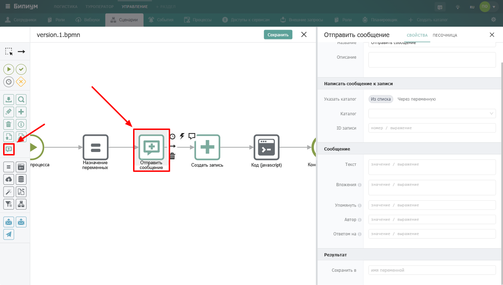
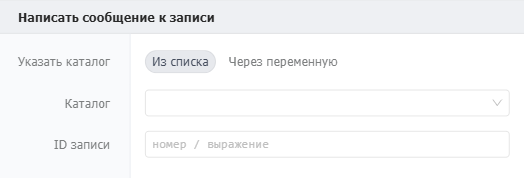
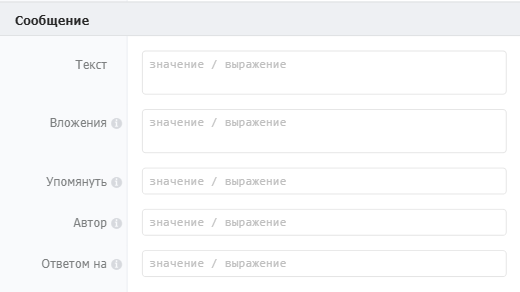
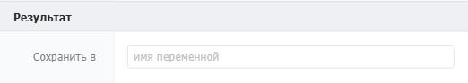
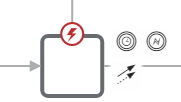

Компонент для отправки сообщений в записи Бипиума.

{width=1440px height=816px}

## Когда использовать

Используйте **Отправить сообщение**, когда сценарий должен оставить комментарий или уведомление в записи. Типичные примеры:

-  Добавить комментарий в заявку о результате автоматической обработки

-  Упомянуть ответственного сотрудника при изменении статуса

-  Прикрепить сгенерированный файл к записи

-  Оставить лог выполнения сценария в служебной записи

## Настройка компонента

## Секция «Общие свойства»



---

*  

   Поле

*  

   Описание

---

*  

   Название

*  

   По умолчанию «Отправить сообщение». Можно изменить на своё

---

*  

   Описание

*  

   Необязательное поле



## Секция «Написать сообщение к записи»

{width=524px height=178px}



---

*  

   Поле

*  

   Описание

---

*  

   Указать каталог

*  

   Способ выбора каталога для отправки сообщения. Доступные варианты:\
   • **Из списка** -- подходит, когда вы знаете, в какой каталог хотите отправить сообщение\
   • **Через переменную** -- используется, если нужно отправить сообщение в запись в разных каталогах в зависимости от логики сценария

---

*  

   Каталог

*  

   Доступно при выборе «Из списка». Выбор каталога из числа доступных в системе для отправки сообщения. Формат: выбор из списка каталогов

---

*  

   ID каталога

*  

   Доступно при выборе «Через переменную». Идентификатор каталога, в котором находится запись. Формат: значение или выражение

---

*  

   ID записи

*  

   Идентификатор записи, в которую нужно отправить сообщение. Формат: значение или выражение



## Секция «Сообщение»

{width=520px height=292px}



---

*  

   Поле

*  

   Описание

---

*  

   Текст

*  

   Текст сообщения для отправки в запись. Формат: текст в кавычках или выражение.\
   \
   В тексте в любой позиции можно использовать конструкцию для упоминания пользователя или любого другого объекта системы.\
   \
   **Формат упоминания:** `<@catalogId:recordId;Title/@>`\
   \
   **Пример:** `<@$users:7;Anton/@>`\
   \
   Где:\
   • `$users` -- системное название каталога «Сотрудники» (вместо него можно использовать ID, например `3`)\
   • `7` -- ID сотрудника из каталога «Сотрудники»\
   • `Anton` -- текст, которым будет отображено упоминание

---

*  

   Вложения

*  

   Вложения к сообщению. Бипиум поддерживает прикрепление файлов, размещённых в интернете (например, файлов из записей каталогов, хранящихся в облачном хранилище). Вложений может быть несколько.\
   \
   **Формат:**\
   `json[{ "title": "Название файла с расширением", "url": "URL к файлу" }]`\
   \
   **Пример:**\
   `json[{"title": "Договор.docx","url": "http://storage.ru/dogovor.docx"},{"title": "Счет.xls","url": "http://storage.ru/schet.xls"}]`

---

*  

   Упомянуть

*  

   Свойство для упоминания пользователей в системе. Для пользователей, которые упоминаются, будет выведен кружок красного цвета в разрезе секции/каталога/записи, чтобы сразу обратить внимание на сообщение.\
   \
   **Формат:**\
   `json[{"catalogId": "$users","recordId": "id-пользователя"}]`\
   \
   **Пример:**\
   `json[{"catalogId": "$users","recordId": "1"},{"catalogId": "$users","recordId": "5"}]`

---

*  

   Автор

*  

   ID сотрудника из каталога «Сотрудники», от имени которого отправляется сообщение. Если сотрудник не выбран, то автором сообщения автоматически будет выбрана «Система»

---

*  

   Ответом на

*  

   ID сообщения, на которое нужно ответить



## Секция «Результат»

{width=522px height=93px}



---

*  

   Поле

*  

   Описание

---

*  

   Сохранить в

*  

   Имя переменной, в которую сохраняется ID отправленного сообщения



## Пограничные события

{width=181px height=102px}

Компонент поддерживает 2 типа пограничных событий:

-  Ошибка -- выход из компонента, если произошла какая-либо ошибка

-  Таймаут -- выход из компонента, спустя заданное ограничение по времени

Если компонент завершился с ошибкой, но на нем не было пограничного события, то процесс завершается. Сообщение ошибки возвращается в результатах процесса.