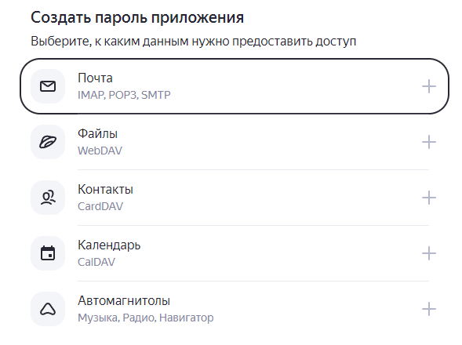
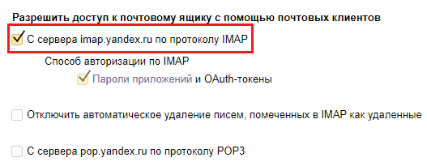

# Получение почты

<figure><figcaption></figcaption></figure>

## Когда использовать

Используйте **Получение почты**, когда сценарий должен прочитать письма из почтового ящика. Типичные примеры:

* Автоматическая обработка входящих заявок с корпоративной почты
* Проверка наличия подтверждающих писем от внешних систем
* Импорт данных из писем с вложениями
* Мониторинг почтового ящика для запуска сценариев

## **Настройка компонента**

### Секция «Общие свойства»

<table data-header-hidden><thead><tr><th width="170.36358642578125"></th><th></th></tr></thead><tbody><tr><td>Поле</td><td>Описание</td></tr><tr><td><strong>Название</strong></td><td>По умолчанию «Получение почты». Можно изменить на своё</td></tr><tr><td><strong>Описание</strong></td><td>Необязательное поле</td></tr></tbody></table>

### Секция «Подключение»

<table data-header-hidden><thead><tr><th width="199.45458984375"></th><th></th></tr></thead><tbody><tr><td>Поле</td><td>Описание</td></tr><tr><td><strong>Протокол</strong></td><td>Протокол подключения. Доступен: <code>IMAP</code></td></tr><tr><td>Способ подключения</td><td>Определяет как задаются параметры подключения к почтовому серверу. Доступные варианты: <strong>Параметры</strong> (каждый параметр отдельно) или <strong>Строка подключения</strong> (все параметры единой строкой).</td></tr></tbody></table>

**Способ подключения: Параметры**

<figure><figcaption></figcaption></figure>

<table><thead><tr><th width="177.18182373046875">Параметр</th><th width="373.181884765625">Описание</th><th>Пример</th></tr></thead><tbody><tr><td><strong>Адрес сервера</strong></td><td>Домен или IP-адрес IMAP-сервера</td><td><code>"imap.yandex.ru"</code></td></tr><tr><td><strong>Порт</strong></td><td>Порт почтового сервера</td><td><code>993</code></td></tr><tr><td><strong>Шифрование</strong></td><td>• <strong>Использовать</strong> — включить SSL<br>• <strong>Не использовать</strong> — сначала STARTTLS, при неуспехе — без шифрования</td><td>Использовать</td></tr><tr><td><strong>Логин</strong></td><td>Логин для авторизации, как правило совпадает с адресом почты</td><td><code>"user@yandex.ru"</code></td></tr><tr><td><strong>Пароль</strong></td><td>Пароль приложения (не основной пароль от почты)</td><td><code>"пароль_приложения"</code></td></tr></tbody></table>

**При выборе «Строка подключения»**

<figure><figcaption></figcaption></figure>

<table data-header-hidden><thead><tr><th width="170.3636474609375"></th><th></th></tr></thead><tbody><tr><td><strong>Строка подключения</strong></td><td>Строка подключения к почтовому серверу со всеми параметрами.</td></tr></tbody></table>

### **Секция «Критерии поиска писем»**

<table data-header-hidden><thead><tr><th width="170.3636474609375"></th><th></th></tr></thead><tbody><tr><td><strong>Тип фильтра</strong></td><td><p>Определяет способ фильтрации получаемых писем. Доступные варианты: </p><ul><li><strong>Стандартный</strong> (набор предопределённых фильтров) </li><li><strong>Расширенный</strong> (пользовательские фильтры в формате node-imap).</li></ul></td></tr></tbody></table>

**Тип фильтра: Стандартный**

<table><thead><tr><th width="170.36370849609375">Параметр</th><th>Описание</th></tr></thead><tbody><tr><td><strong>Категория писем</strong></td><td>Фильтр по категории: Все / Отвеченные / Черновик / Удалённые / Новые / Недавние / Непрочитанные / Без флага</td></tr><tr><td><strong>Дата писем «от»</strong></td><td><p>Начальная дата для фильтрации. Формат RFC или ISO. </p><ul><li><code>2022-08-31T11:38:18.167Z</code> //Дата в формате ISO </li><li><code>Fri, 29 Dec 1995 11:24:28</code> //Дата в формате RFC2822 </li><li><code>moment( ‘08.20.2012’ ).toISOString()</code> //Преобразование даты 20.08.2012 к формату ISO</li></ul></td></tr><tr><td><strong>Дата писем «до»</strong></td><td>Конечная дата для фильтрации. Тот же формат.</td></tr><tr><td><strong>Отправитель</strong></td><td>Фильтрация по email отправителя. Формат: <code>"user@example.com"</code> или выражение</td></tr><tr><td><strong>Тема</strong></td><td>Фильтрация по вхождению в тему письма</td></tr></tbody></table>

**Тип фильтра: Расширенный**

<table><thead><tr><th width="181.272705078125"></th><th></th></tr></thead><tbody><tr><td>Пользовательские фильтры</td><td>Массив флагов для поиска сообщений. Формат: <a href="https://www.npmjs.com/package/node-imap">https://www.npmjs.com/package/node-imap</a><strong>.</strong></td></tr></tbody></table>

### **Секция «Правила получения письма»**

<figure><figcaption></figcaption></figure>

#### Секция «Правила получения письма»

<table><thead><tr><th width="294.9090576171875">Параметр</th><th>Описание</th></tr></thead><tbody><tr><td><strong>Порядковый номер</strong></td><td>Порядковый номер письма из массива найденных. Письмо с этим номером сохраняется в переменную из поля «Сохранить письмо в»</td></tr><tr><td><strong>Вложения</strong></td><td><strong>Не получать</strong> — вложения игнорируются.<br><strong>Получить ссылки</strong> — вложения возвращаются как массив с файлами и URL.<br><strong>Получить содержимое</strong> — вложения возвращаются как файловый буфер.</td></tr><tr><td><strong>Отметить письмо прочитанным</strong></td><td>Да / Нет — отмечает полученное письмо как прочитанное в почтовом ящике</td></tr></tbody></table>

Формат вложений при варианте **«Получить ссылки»**:

```json
attachments: [
  {
    "filename": "Имя_файла.расширение",
    "contentType": "тип_файла",
    "size": "размер_файла",
    "fileId": "идентификатор_файла",
    "url": "ссылка на файл"
  }
]
```

Формат вложений при варианте **«Получить содержимое»**:

```json
attachments: [
  {
    "filename": "Имя_файла.расширение",
    "contentType": "тип_файла",
    "size": "размер_файла",
    "content": {
      "type": "Buffer",
      "data": [ … ]
    }
  }
]
```

### **Секция «Результат»**

<figure><figcaption></figcaption></figure>

<table><thead><tr><th width="220.3636474609375">Параметр</th><th>Описание</th></tr></thead><tbody><tr><td><strong>Сохранить письмо в</strong></td><td>Переменная для записи тела полученного письма и его вложений</td></tr><tr><td><strong>Сохранить количество найденных писем</strong></td><td>Переменная для записи полного количества писем, найденных по фильтрам</td></tr></tbody></table>

## **Параметры подключения к популярным сервисам**

<table><thead><tr><th width="164.45458984375">Параметр</th><th width="292.8182373046875">Яндекс.Почта</th><th>Gmail</th></tr></thead><tbody><tr><td>Адрес сервера</td><td><code>"imap.yandex.ru"</code></td><td><code>"imap.gmail.com"</code></td></tr><tr><td>Порт</td><td><code>993</code></td><td><code>993</code></td></tr><tr><td>Шифрование</td><td>Использовать</td><td>Использовать</td></tr><tr><td>Логин</td><td><p>Полный адрес эл. почты </p><p>(В кавычках)</p></td><td><p>Полный адрес эл. почты </p><p>(В кавычках)</p></td></tr><tr><td>Пароль</td><td>Пароль приложения (В кавычках)</td><td>Пароль приложения (В кавычках)</td></tr></tbody></table>

## **Разрешения на получение почты через Бипиум**

Для возможности получать письма через протокол IMAP нужно дать соответствующий доступ в настройках вашего почтового ящика. Настройки доступов для сервисов Яндекс.Почта и Gmail описаны ниже. Оба сервиса требуют использование пароля приложений вместо портального пароля.

### **Яндекс.Почта**

#### **Получения пароля приложения**

1. Перейдите на [https://id.yandex.ru/security](https://id.yandex.ru/security) и авторизуйтесь.
2. На странице найдите секцию «Доступ к вашим данным» и перейдите на страницу «Пароли приложений»:

<figure><figcaption></figcaption></figure>

3. В секции «Создать пароль приложения» выберите «Почта» и следуйте подсказкам.

<figure><figcaption></figcaption></figure>

4. Сохраните созданный пароль и используйте его в поле «Пароль» компонента.

#### **Включение IMAP**

1. Войдите на сервис [https://mail.yandex.ru](https://mail.yandex.ru) и авторизуйтесь под своей учетной записью
2. Откройте «Все настройки» учётной записи.

<figure><figcaption></figcaption></figure>

3. Перейдите на страницу «Почтовые программы».

<figure><figcaption></figcaption></figure>

4. Включите чек-бокс для разрешения доступа по IMAP.

<figure><figcaption></figcaption></figure>

### Gmail

#### **Получения пароля приложения**

1. Войдите на сервис [https://gmail.com](https://gmail.com) и авторизуйтесь своей учетной записью.
2.  Кликните на иконку своего аккаунта и перейдите по ссылке «Управление аккаунтом Google»:<br>

    <figure><figcaption></figcaption></figure>
3.  Перейдите на вкладку «Безопасность»:<br>

    <figure><figcaption></figcaption></figure>
4.  В отделе «Вход в аккаунт Google» нажмите на пункт «Двухэтапная аутентификация». Завершите процесс настройки двухэтапной аутентификации, следуя подсказкам

    <figure><figcaption></figcaption></figure>
5. После завершения процесса настройки двухэтапной аутентификации вновь перейдите на вкладку «Безопасность» (п. 3 выше).
6.  В отделе «Вход в аккаунт Google» нажмите на появившийся пункт «Пароли приложений»:

    <figure><figcaption></figcaption></figure>
7.  В окне создания пароля укажите приложение «Бипиум» и нажмите «Создать»:


    <figure><figcaption></figcaption></figure>
8. Сохраните созданный пароль приложения и используйте его в качестве пароля в компоненте «Получение почты»:

<figure><figcaption></figcaption></figure>

#### **Разрешение на получение почты через IMAP**


1. Войдите на сервис [https://gmail.com](https://gmail.com/) и авторизуйтесь своей учетной записью.
2. Нажмите на иконку шестеренки возле иконки учетной записи и перейдите по ссылке «Все настройки»:.png>)
3.  Перейдите в отдел «Пересылка и POP/IMAP»:

    <figure><figcaption></figcaption></figure>
4. Нажмите на «Включить IMAP»:

<figure><figcaption></figcaption></figure>
