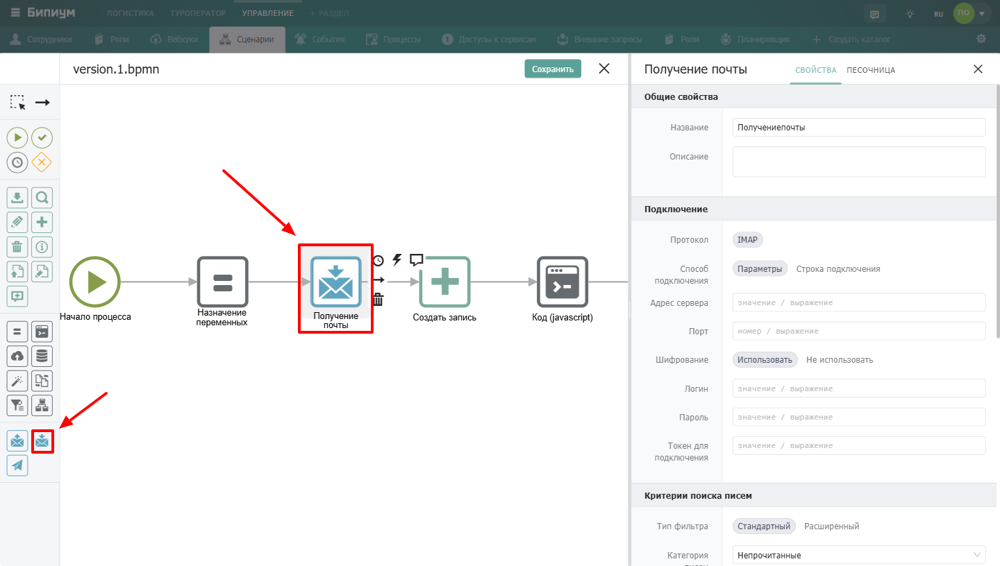
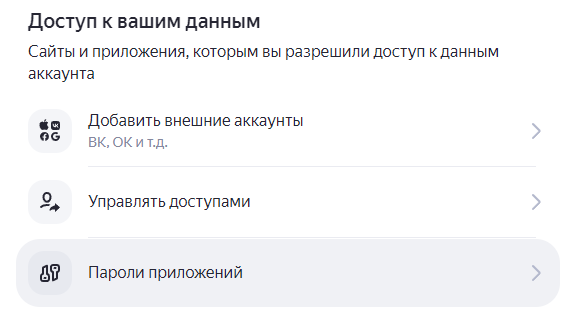
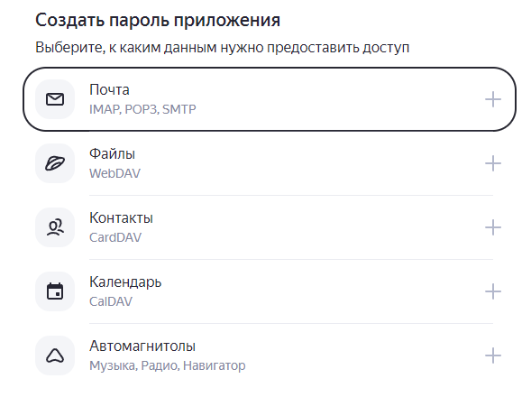
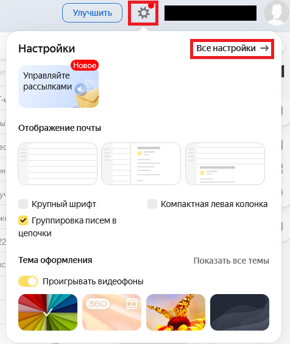
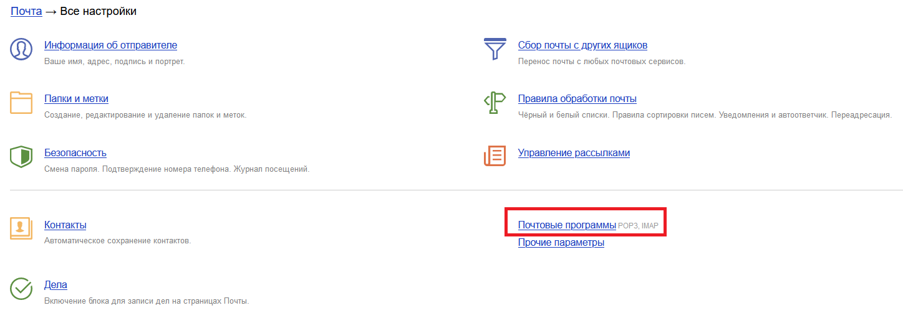
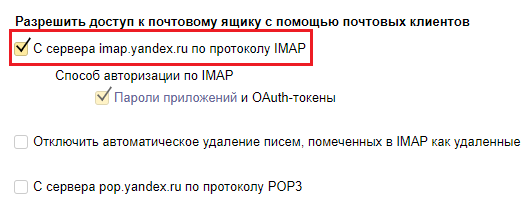
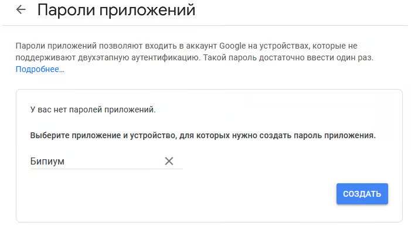

Компонент для получения email-сообщений по протоколу IMAP. Позволяет читать письма из почтового ящика, фильтровать их по различным критериям и сохранять содержимое и вложения в переменные процесса.

{width=1440px height=816px}

## Когда использовать

Используйте **Получение почты**, когда сценарий должен прочитать письма из почтового ящика. Типичные примеры:

-  Автоматическая обработка входящих заявок с корпоративной почты

-  Проверка наличия подтверждающих писем от внешних систем

-  Импорт данных из писем с вложениями

-  Мониторинг почтового ящика для запуска сценариев

## **Настройка компонента**

### Секция «Общие свойства»



---

*  

   Поле

*  

   Описание

---

*  

   Название

*  

   По умолчанию «Получение почты». Можно изменить на своё

---

*  

   Описание

*  

   Необязательное поле



### Секция «Подключение»



---

*  

   Поле

*  

   Описание

---

*  

   Протокол

*  

   Протокол подключения. Доступен: IMAP

---

*  

   Способ подключения

*  

   Определяет как задаются параметры подключения к почтовому серверу. Доступные варианты: **Параметры** (каждый параметр отдельно) или **Строка подключения** (все параметры единой строкой)



**Способ подключения: Параметры**

.png> "Секция Подключение -- Способ подключения: Параметры"){width=651px height=430px}



---

*  Параметр

*  Описание

*  Пример

---

*  Адрес сервера

*  Домен или IP-адрес IMAP-сервера

*  `"imap.yandex.ru"`

---

*  Порт

*  Порт почтового сервера

*  `993`

---

*  Шифрование

*  • **Использовать** -- включить SSL\
   • **Не использовать** -- сначала STARTTLS, при неуспехе -- без шифрования

*  Использовать

---

*  Логин

*  Логин для авторизации, как правило совпадает с адресом почты

*  `"user@yandex.ru"`

---

*  Пароль

*  Пароль приложения (не основной пароль от почты)

*  `"пароль_приложения"`



**Способ подключения: Строка подключения**

.png> "Секция Подключение -- Способ подключения: Строка подключения"){width=647px height=218px}

| Поле               | Описание                                                    |
|--------------------|-------------------------------------------------------------|
| Строка подключения | Строка подключения к почтовому серверу со всеми параметрами |

### **Секция «Критерии поиска писем»**

| Поле                                                              | Описание                                                           |
|-------------------------------------------------------------------|--------------------------------------------------------------------|
| Тип фильтра                                                       | Определяет способ фильтрации получаемых писем. Доступные варианты: |
| • **Стандартный** -- набор предопределённых фильтров              |                                                                    |
| • **Расширенный** -- пользовательские фильтры в формате node-imap |                                                                    |

**Тип фильтра: Стандартный**

| Параметр                                                      | Описание                                                                                                    |
|---------------------------------------------------------------|-------------------------------------------------------------------------------------------------------------|
| Категория писем                                               | Фильтр по категории: Все / Отвеченные / Черновик / Удалённые / Новые / Недавние / Непрочитанные / Без флага |
| Дата писем «от»                                               | Начальная дата для фильтрации. Формат RFC или ISO.                                                          |
| Примеры:                                                      |                                                                                                             |
| • `2022-08-31T11:38:18.167Z` -- ISO                           |                                                                                                             |
| • `Fri, 29 Dec 1995 11:24:28` -- RFC2822                      |                                                                                                             |
| • `moment('08.20.2012').toISOString()` -- преобразование даты |                                                                                                             |
| Дата писем «до»                                               | Конечная дата для фильтрации. Используется тот же формат                                                    |
| Отправитель                                                   | Фильтрация по email отправителя. Формат: `"user@example.com"` или выражение                                 |
| Тема                                                          | Фильтрация по вхождению в тему письма                                                                       |

**Тип фильтра: Расширенный**

| Параметр                 | Описание                                              |
|--------------------------|-------------------------------------------------------|
| Пользовательские фильтры | Массив флагов для поиска сообщений. Формат: node-imap |

### **Секция «Правила получения письма»**

.png> "Секция Правила получения письма"){width=651px height=206px}



---

*  Параметр

*  Описание

---

*  Порядковый номер

*  Порядковый номер письма из массива найденных. Письмо с этим номером сохраняется в переменную из поля «Сохранить письмо в»

---

*  Вложения

*  **Не получать** -- вложения игнорируются.

   **Получить ссылки** -- вложения возвращаются как массив с файлами и URL.

   **Получить содержимое** -- вложения возвращаются как файловый буфер

---

*  Отметить письмо прочитанным

*  Да / Нет -- отмечает полученное письмо как прочитанное в почтовом ящике



Формат вложений при варианте **«Получить ссылки»**:

```json
attachments: [
  {
    "filename": "Имя_файла.расширение",
    "contentType": "тип_файла",
    "size": "размер_файла",
    "fileId": "идентификатор_файла",
    "url": "ссылка на файл"
  }
]
```

Формат вложений при варианте **«Получить содержимое»**:

```json
attachments: [
  {
    "filename": "Имя_файла.расширение",
    "contentType": "тип_файла",
    "size": "размер_файла",
    "content": {
      "type": "Buffer",
      "data": [ … ]
    }
  }
]
```

### **Секция «Результат»**

.png> "Секция Результат"){width=647px height=160px}

| Параметр                             | Описание                                                              |
|--------------------------------------|-----------------------------------------------------------------------|
| Сохранить письмо в                   | Переменная для записи тела полученного письма и его вложений          |
| Сохранить количество найденных писем | Переменная для записи полного количества писем, найденных по фильтрам |

## **Параметры подключения к популярным сервисам**

| Параметр      | Яндекс.Почта                        | Gmail                               |
|---------------|-------------------------------------|-------------------------------------|
| Адрес сервера | `"imap.yandex.ru"`                  | `"imap.gmail.com"`                  |
| Порт          | `993`                               | `993`                               |
| Шифрование    | Использовать                        | Использовать                        |
| Логин         | Полный адрес эл. почты (в кавычках) | Полный адрес эл. почты (в кавычках) |
| Пароль        | Пароль приложения (в кавычках)      | Пароль приложения (в кавычках)      |

## **Разрешения на получение почты через Бипиум**

Для возможности получать письма через протокол IMAP нужно дать соответствующий доступ в настройках вашего почтового ящика. Настройки доступов для сервисов Яндекс.Почта и Gmail описаны ниже. Оба сервиса требуют использование пароля приложений вместо портального пароля.

### **Яндекс.Почта**

#### **Получения пароля приложения**

1. Перейдите на <https://id.yandex.ru/security> и авторизуйтесь.

2. На странице найдите секцию «Доступ к вашим данным» и перейдите на страницу «Пароли приложений»:

   {width=582px height=325px}

3. В секции «Создать пароль приложения» выберите «Почта» и следуйте подсказкам.

   {width=589px height=440px}

4. Сохраните созданный пароль и используйте его в поле «Пароль» компонента.

#### **Включение IMAP**

1. Войдите на сервис <https://mail.yandex.ru> и авторизуйтесь под своей учетной записью

2. Откройте «Все настройки» учётной записи.

   {width=476px height=565px}

3. Перейдите на страницу «Почтовые программы».

   {width=1448px height=503px}

4. Включите чек-бокс для разрешения доступа по IMAP.



### Gmail

#### **Получения пароля приложения**

1. Войдите на сервис <https://gmail.com> и авторизуйтесь своей учетной записью.

2. Кликните на иконку своего аккаунта и перейдите по ссылке «Управление аккаунтом Google»:

    (1) (1).png>)

3. Перейдите на вкладку «Безопасность»:

    (1) (1).png>)

4. В отделе «Вход в аккаунт Google» нажмите на пункт «Двухэтапная аутентификация». Завершите процесс настройки двухэтапной аутентификации, следуя подсказкам

    (1) (1).png>)

5. После завершения процесса настройки двухэтапной аутентификации вновь перейдите на вкладку «Безопасность» (п. 3 выше).

6. В отделе «Вход в аккаунт Google» нажмите на появившийся пункт «Пароли приложений»:

    (1) (1).png>)

7. В окне создания пароля укажите приложение «Бипиум» и нажмите «Создать»:

   {width=701px height=386px}

8. Сохраните созданный пароль приложения и используйте его в качестве пароля в компоненте «Получение почты»:

.png>)

#### **Разрешение на получение почты через IMAP**


1. Войдите на сервис [https://gmail.com](https://gmail.com/) и авторизуйтесь своей учетной записью.

2. Нажмите на иконку шестеренки возле иконки учетной записи и перейдите по ссылке «Все настройки»:.png>)

3. Перейдите в отдел «Пересылка и POP/IMAP»:

   .png>)

4. Нажмите на «Включить IMAP»:

.png>)