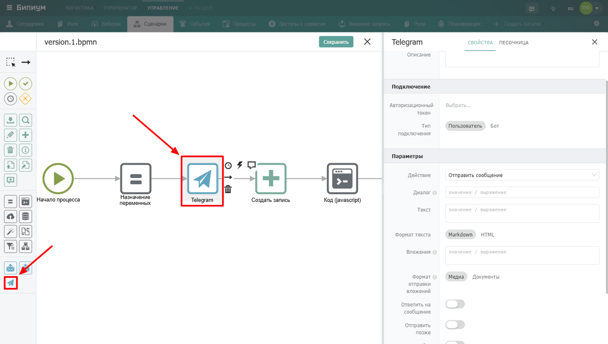
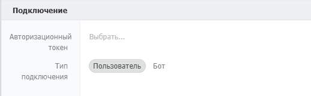
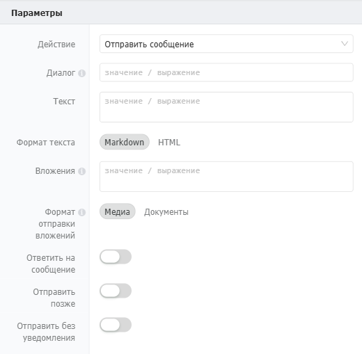

Компонент для автоматической отправки и получения сообщений и медиафайлов в чатах и каналах Telegram прямо из бизнес-процессов Бипиума.

{width=1200px height=680px}

## Когда использовать

Используйте **Telegram** для мгновенных уведомлений и взаимодействия с пользователями через Telegram. Типичные примеры:

-  Уведомление о новых заявках или изменении статусов

-  Отправка ежедневных отчётов руководителю

-  Получение команд от пользователей через бота

-  Рассылка сообщений с кнопками-действиями

:::info 

**Возможности:** отправка как с личных аккаунтов, так и через ботов, полученных от BotFather.

:::

## Настройка компонента

### Секция «Подключение»

{width=518px height=161px}

Перед использованием компонента его необходимо авторизовать.



---

*  

   Поле

*  

   Описание

---

*  

   Авторизационный токен

*  

   Ключ доступа вашего аккаунта или бота (обязательное поле). Чтобы получить токен, ознакомьтесь с правилами работы сервиса токенов Бипиума

---

*  

   Тип подключения

*  

   Определяет контекст, от имени кого будет отправлено сообщение (обязательное поле). Доступные варианты: **Пользователь**, **Бот**



### Секция «Параметры»

{width=520px height=509px}



---

*  

   Поле

*  

   Описание

---

*  

   Действие

*  

   Выберите действие, которое должен выполнить компонент. Доступные действия: «Отправить сообщение», «Отправить геолокацию», «Отправить контакт», «Переслать сообщение», «Изменить сообщение», «Удалить сообщение», «Получить диалоги», «Получить профиль», «Получить сообщения»

---

*  

   Диалог

*  

   Уникальный идентификатор чата, куда будет отправлено или откуда получено сообщение. Это может быть:\
   • `@username` пользователя или публичного канала\
   • числовой `chat_id` группового чата или личного диалога\
   • номер телефона в формате `"+79991234567"`

---

*  

   Текст

*  

   Текстовая часть отправляемого сообщения. Можно использовать статический текст или динамические данные через выражения (например `{allValues.message}`)

---

*  

   Формат текста

*  

   Разметка: **Markdown** или **HTML**

---

*  

   Вложения

*  

   Массив файлов: `[{"title":"...","url":"https://..."}]`

---

*  

   Формат отправки вложений

*  

   • **Медиа** -- сжатые файлы\
   • **Документы** -- без сжатия (недоступно для бота)

---

*  

   Ответить на сообщение

*  

   Отправка как ответ на сообщение (появляется поле ID сообщения)

---

*  

   ID сообщения

*  

   `message_id` сообщения, на которое отвечаем

---

*  

   Отправить позже

*  

   Отложенная отправка сообщения

---

*  

   Дата отправки

*  

   Дата отправки (ISO, timestamp, Date или moment)

---

*  

   Отправить без уведомления

*  

   Бесшумная отправка без push-уведомлений

---

*  

   Кнопки

*  

   JSON клавиатуры (inline/reply/remove)



### Секция «Результат»

{width=516px height=90px}



---

*  

   Поле

*  

   Описание

---

*  

   Сохранить результат в

*  

   Переменная, куда записывается ответ Telegram API (включая `message_id` и данные сообщения)



## Получение авторизационного токена

Для получения токена понадобится API ID и API Hash от Telegram.

### Получение API ID и API Hash

Чтобы получить API ID и API Hash перейдите по адресу <https://my.telegram.org/auth> и войдите с помощью номера телефона, который хотите привязать в качестве отправителя.

 (1) (1) (1) (1) (1) (1) (1) (1) (1) (1) (1) (1) (1).png>)

Перейдите в API development tools и создайте новое приложение, заполнив поля:

-  **App title:** придумайте и введите полное название своего приложения, которое регистрируется для получения доступа к инструментам разработчика в Telegram.

-  **Short name:** придумайте и введите короткое название своего приложения.

-  **URL:** введите ссылку сайта Бипиум `https://bpium.ru`

-  **Platform:** выберите операционную систему приложения. По умолчанию можно выбрать `Desktop`

-  **Description:** заполните поле описания (обязательный шаг)

Нажмите `Create application`  чтобы получить поля конфигурации API (App api_id, App api_hash).

 (1) (1) (1) (1) (1) (1) (1) (1) (1) (1) (1) (1) (1).png>)

.png>)

Автоматизации: сервис получения токенов. Заполнение полей конфигурации API

### Получение токена

-  Откройте [tokens.bpium.ru](https://tokens.bpium.ru/) и выберите сервис telegram.

 (1) (1) (1) (1) (1) (1) (1) (1) (1) (1) (1) (1) (1) (1).png>)

-  В открывшемся окне введите ранее полученные  `API ID` и `API Hash`, а также Номер телефона, который был использован при получении  `API ID` и `API Hash`.

 (1) (1).png>)

Автоматизации: сервис получения токенов

-  После подтверждения авторизации на 3 шаге вы получите ключ, который необходимо скопировать. Этот ключ и есть необходимый вам токен.

.png>)

Автоматизации: сервис получения токенов

-  Вернитесь в систему Бипиум, в раздел Управление и там в каталоге "Доступы к сервисам" создайте запись с полученным токеном, который будет использовать компонент Telegram.

## Пограничные события

Компонент поддерживает 2 типа пограничных событий:

-  Ошибка -- выход из компонента, если произошла какая-либо ошибка

-  Таймаут -- выход из компонента, спустя заданное ограничение по времени

Если компонент завершился с ошибкой, но на нем не было пограничного события, то процесс завершается. Сообщение ошибки возвращается в результатах процесса.

## Вариант использования

### Уведомление клиента о статусе заказа

Цель: При изменении статуса заказа на «Готов к выдаче» отправить уведомление клиенту в «Telegram».

Создайте сценарий, инициируемый изменением статуса в каталоге «Заказы».

1. Добавьте компонент «Telegram» в холст процесса.

2. Настройте подключение: в поле Авторизационный токен выберите заранее настроенное подключение к Telegram API.

3. Заполните параметры:

   -  Действие: Отправить сообщение.

   -  Диалог: allValues.phone (номер телефона клиента из записи)

   -  Текст: "Уважаемый клиент! Ваш заказ № \$\{allValues.goods}, готов к выдаче. Ждем вас по адресу: г. Казань, ул. Примерная, д. 1".

4. Сохраните сценарий.

Теперь при смене статуса заказа клиент будет автоматически получать уведомление в Telegram с актуальной информацией о его заказе.