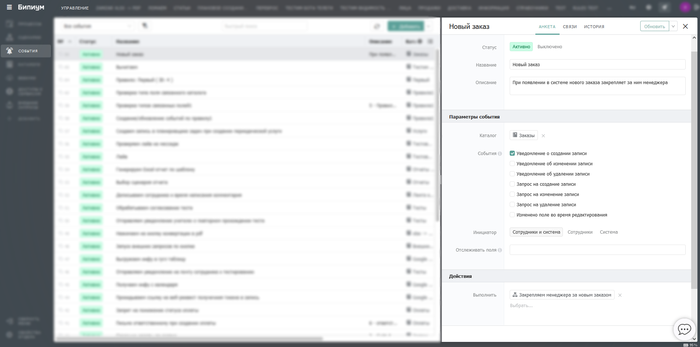

# Изменение данных

## Подписка на событие

* В отделе «Управление» в каталоге «[События](../../systemcatalogs/events.md)» добавьте новую запись (событие, по которому будет запускаться процесс).
* Укажите название для быстрой идентификации. Например, кратко опишите задачу, которую выполняет процесс.
* Выберите каталог, в котором хотите отслеживать изменение записей.
* Выберите тип события для запуска сценария. Подробнее в статье «[События](../../systemcatalogs/events.md)».
* В поле «Выполнить» выберите или создайте новый сценарий.

<figure><figcaption></figcaption></figure>

## События

События делятся на уведомления, запросы и действия:

* **Уведомления (after)** срабатывают после сохранения изменений в базу, то есть поле того, когда запись уже создана, изменена или удалена
* **Запросы (before)** срабатывают перед тем как данные сохранены в базу, то есть непосредственно во время срабатывания события в данных в базе еще нет. Эти события могут отменить операцию сохранения/изменения/удаления записи.
* **Действия** срабатывают во время редактирования записи сотрудником, еще до того как он отправил данные на сохранения. Эти события могут подменять значения полей в карточке на экране сотрудника без сохранения их в базу.


### Уведомление о создании записи (after create)

Срабатывает _ПОСЛЕ_ того как создана новая запись в каталоге, и эта операция сохранена в базу.



```javascript
event: {
    id: "1",
    type: "$record.after.create",
    async: true
},
script: {
    id: "7"
},
user: {
    id: "2"
},

catalogId: "15",
recordId: "1234",
values: {
    "2": "Record Title", // текстовое поле
    "14": 123 // числовое поле
}
```

**Общие параметры событий**

* `event`(объект) — параметры сработавшего события. _Доступно с версии 1.5.2._
  * `id`(строка) — идентификатор события в каталоге События.
  * `type`(строка) — название типа события.
  * `async`(булево) — признак запуска: `true` — асинхронно, `false` — синхронно.
* `script`(объект) — параметры запущенного сценария. _Доступно с версии 1.5.2._
  * `id`(строка) — идентификатор сценария в каталоге Сценарии.
* `user`(объект) — сотрудник, вызвавший событие.
  * `id`(строка) — идентификатор сотрудника или `null`, если вызвал другой процесс (событие вызвано системой).

**Дополнительные параметры события**

* `catalogId`(строка) — идентификатор каталога, в котором создана запись.
* `recordId`(строка) — идентификатор созданной записи.
* `values`(объект) — коллекция значений заполненных полей созданной записи.\
  Ключи объекта — идентификаторы (ID) заполненных полей. Формат описан ниже.



События типа уведомлений (after) не ожидают ответа.




### Уведомление об изменении записи (after update)

Срабатывает _ПОСЛЕ_ того как запись в каталоге была изменена, и эта операция сохранена в базу.



```javascript
event: {
    id: "2",
    type: "$record.after.update",
    async: true
},
script: {
    id: "7"
},
user: {
    id: "2"
},

catalogId: "15",
recordId: "1234",
values: {
    "2": "Title", // текстовое поле
    "14": 4562, // поле число
    "15": "2017-10-11T08:01:28:000Z1" // поле дата
},
prevValues: {
    "2": "Record Title", // текстовое поле
    "14": 123 // числовое поле
}
```

**Общие параметры событий**

* `event`(объект) — параметры сработавшего события. _Доступно с версии 1.5.2._
  * `id`(строка) — идентификатор события в каталоге Событий.
  * `type`(строка) — название типа события.
  * `async`(булево) — признак запуска: `true` — асинхронно, `false` — синхронно.
* `script`(объект) — параметры запущенного сценария. _Доступно с версии 1.5.2._
  * `id`(строка) — идентификатор сценария в каталоге Сценарии.
* `user`(объект) — сотрудник вызвавший событие.
  * `id`(строка) — идентификатор сотрудника или `null`, если вызвал другой процесс (событие вызвано системой).

**Дополнительные параметры события**

* `catalogId`(строка) — идентификатор каталога, в котором изменили запись.
* `recordId`(строка) — идентификатор измененной записи.
* `values`(объект) — коллекция значений измененных полей измененной записи.\
  Ключи объекта — идентификаторы (ID) измененных полей. Формат описан ниже.
* `prevValues`(объект) — коллекция предыдущих значений всех полей записи.\
  Формат аналогичен объекту `values`.



События типа уведомлений (after) не ожидают ответа.




### Уведомление об удалении записи (after delete)

Срабатывает _ПОСЛЕ_ того как запись в каталоге была удалена и эта операция сохранена в базу.



```javascript
event: {
    id: "3",
    type: "$record.after.delete",
    async: true
},
script: {
    id: "7"
},
user: {
    id: "2"
},

catalogId: "15",
recordId: "1234",
values: {
    "2": "Title", // текстовое поле
    "14": 4562, // поле число
    "15": "2017-10-11T08:01:28:000Z1", // поле дата
    "16": [ // поле связанный объект
        {
            "sectionId": "3",
            "catalogId": "5",
            "catalogTitle": "Клиенты",
            "catalogIcon": "users-10",
            "recordId": "33",
            "recordTitle": "Место работы"
        }
    ]
}
```

**Общие параметры событий**

* `event`(объект) — параметры сработавшего события. _Доступно с версии 1.5.2._
  * `id`(строка) — идентификатор события в каталоге Событий.
  * `type`(строка) — название типа события.
  * `async`(булево) — признак запуска: `true` — асинхронно, `false` — синхронно.
* `script`(объект) — параметры запущенного сценария. _Доступно с версии 1.5.2._
  * `id`(строка) — идентификатор сценария в каталоге Сценарии.
* `user`(объект) — сотрудник вызвавший событие.
  * `id`(строка) — идентификатор сотрудника или `null`, если вызвал другой процесс.

**Дополнительные параметры события**

* `catalogId`(строка) — идентификатор каталога, в котором удалили запись
* `recordId`(строка) — идентификатор удаленной записи
* `values`(объект) — коллекция значений всех полей удаленной записи.\
  Ключи объекта — идентификаторы (ID) всех полей. Формат описан ниже.



События типа уведомлений (after) не ожидают ответа.




### Запрос на создание записи (before create)

Срабатывает _ДО_ того как создана новая запись в каталоге, данные еще не сохранены в базу и могут быть отменены событием.



```javascript
event: {
    id: "4",
    type: "$record.before.create",
    async: false
},
script: {
    id: "7"
},
user: {
    id: "2"
},

catalogId: "15",
values: {
    "2": "Record Title", // текстовое поле
    "14": 123 // числовое поле
}
```

**Общие параметры событий**

* `event`(объект) — параметры сработавшего события. _Доступно с версии 1.5.2._
  * `id`(строка) — идентификатор события в каталоге Событий.
  * `type`(строка) — название типа события.
  * `async`(булево) — признак запуска: `true` — асинхронно, `false` — синхронно.
* `script`(объект) — параметры запущенного сценария. _Доступно с версии 1.5.2._
  * `id`(строка) — идентификатор сценария в каталоге Сценарии.
* `user`(объект) — сотрудник вызвавший событие.
  * `id`(строка) — идентификатор сотрудника или `null`, если вызвал другой процесс (событие вызвано системой).

**Дополнительные параметры события**

* `catalogId`(строка) — идентификатор каталога, в котором хотят создать запись
* `values`(объект) — коллекция значений заполненных полей созданной записи.\
  Ключи объекта — идентификаторы (ID) заполненных полей. Формат описан ниже.


`recordId` отсутствует, так как запись в базе еще не создана и ей не присвоен ID.



**Как проверить задан ли recordId?**

Если вы используете один и тот же сценарий на изменение записи и на создание, то вероятно захотите узнать, задан ли `recordId` или нет. Если вы проверите наличие выражением `! recordId`, то процесс завершится с ошибкой, когда параметр не задан. Так происходит так как переменная не определена.

Проверить наличие входного параметра можно с помощью шлюза «или».\
Для этого на выходящую из шлюза ветку, которая соответствует отсутствию параметра `recordId`, нужно задать условие`typeof recordId === 'undefined'`.\
А на вторую ветку, которая соответствует ситуации, когда параметр `recordId` задан: `typeof recordId !== 'undefined'`.




Событие ожидает разрешения применить или заблокировать сохранение данных.

Чтобы вернуть значения как результат процесса, нужно создать переменные в сценарии с такими названиями до компонента «Конец процесса», например с помощью компонента «[Назначение переменных](../components/deistviya/setvariables.md)».

```javascript
$status = 400
$body = {
    "message": "Не верно указано поле 2",
    "values": {
        "2": "Extra new Title", //Текстовое поле
        "14": 999, //Поле число
    }
}
```

* `$status`(число) — код [http-ответа](https://www.wikiwand.com/ru/%D0%A1%D0%BF%D0%B8%D1%81%D0%BE%D0%BA_%D0%BA%D0%BE%D0%B4%D0%BE%D0%B2_%D1%81%D0%BE%D1%81%D1%82%D0%BE%D1%8F%D0%BD%D0%B8%D1%8F_HTTP):
  * 200 — разрешить операцию
  * 4xx (например, 400) — запретить операцию и выдать ошибку
* `$body`(объект) — объект с дополнительными параметрами:&#x20;
  * &#x20;`message` (строка) — сообщение для отображения сотруднику, в случае запрета.&#x20;
  * values (объект) — коллекция значений полей для подстановки в карточку.\
    Ключи объекта — идентификаторы (ID) полей. Формат описан ниже.




### Запрос на изменение записи (before update)

Срабатывает _ДО_ того как изменения записи сохранены в базу, и могут быть отменены событием.



```javascript
event: {
    id: "5",
    type: "$record.before.update",
    async: false
},
script: {
    id: "7"
},
user: {
    id: "2"
},

catalogId: "15",
recordId: "1234",
values: {
    "2": "Title", // текстовое поле
    "14": 4562, // поле число
    "15": "2017-10-11T08:01:28:000Z1" // поле дата
},
prevValues: {
    "2": "Record Title", // текстовое поле
    "14": 123 // числовое поле
}
```

**Общие параметры событий**

* `event`(объект) — параметры сработавшего события. _Доступно с версии 1.5.2._
  * `id`(строка) — идентификатор события в каталоге Событий.
  * `type`(строка) — название типа события.
  * `async`(булево) — признак запуска: `true` — асинхронно, `false` — синхронно.
* `script`(объект) — параметры запущенного сценария. _Доступно с версии 1.5.2._
  * `id`(строка) — идентификатор сценария в каталоге Сценарии.
* `user`(объект) — сотрудник вызвавший событие.
  * `id`(строка) — идентификатор сотрудника или `null`, если вызвал другой процесс (событие вызвано системой).

**Дополнительные параметры события**

* `catalogId`(строка) — идентификатор каталога, в котором изменили запись.
* `recordId`(строка) — идентификатор измененной записи.
* `values`(объект) — коллекция значений измененных полей измененной записи.\
  Ключи объекта — идентификаторы (ID) измененных полей. Формат описан ниже.
* `prevValues`(объект) — коллекция предыдущих значений всех полей записи.\
  Формат аналогичен объекту `values`.



Событие ожидает разрешения применить или заблокировать сохранение данных.

Чтобы вернуть значения как результат процесса, нужно создать переменные в сценарии с такими названиями до компонента «Конец процесса», например с помощью компонента «[Назначение переменных](../components/deistviya/setvariables.md)».

```javascript
$status = 400
$body = {
    "message": "Не верно указано поле 2",
     "values": {
        "2": "Extra new Title", //Текстовое поле
        "14": 999, //Поле число
    }
}
```

* `$status`(число) — код [http-ответа](https://www.wikiwand.com/ru/%D0%A1%D0%BF%D0%B8%D1%81%D0%BE%D0%BA_%D0%BA%D0%BE%D0%B4%D0%BE%D0%B2_%D1%81%D0%BE%D1%81%D1%82%D0%BE%D1%8F%D0%BD%D0%B8%D1%8F_HTTP):
  * 200 — разрешить операцию
  * 4xx (например, 400) — запретить операцию и выдать ошибку
* `$body`(объект) — объект с дополнительными параметрами:&#x20;
  * &#x20;`message` (строка) — сообщение для отображения сотруднику, в случае запрета.&#x20;
  * values (объект) — коллекция значений полей для подстановки в карточку.\
    Ключи объекта — идентификаторы (ID) полей. Формат описан ниже.



###

### Запрос на удаление записи (before delete)

Срабатывает _ДО_ того как изменения записи сохранены в базу, и могут быть отменены событием.



```javascript
event: {
    id: "6",
    type: "$record.before.delete",
    async: false
},
script: {
    id: "7"
},
user: {
    id: "2"
},

catalogId: "15",
recordId: "1234",
values: {
    "2": "Title", // текстовое поле
    "14": 4562, // поле число
    "15": "2017-10-11T08:01:28:000Z1", // поле дата
    "16": [ // поле связанный объект
        {
            "sectionId": "3",
            "catalogId": "5",
            "catalogTitle": "Клиенты",
            "catalogIcon": "users-10",
            "recordId": "33",
            "recordTitle": "Место работы"
        }
    ]
}
```

**Общие параметры событий**

* `event`(объект) — параметры сработавшего события. _Доступно с версии 1.5.2._
  * `id`(строка) — идентификатор события в каталоге Событий.
  * `type`(строка) — название типа события.
  * `async`(булево) — признак запуска: `true` — асинхронно, `false` — синхронно.
* `script`(объект) — параметры запущенного сценария. _Доступно с версии 1.5.2._
  * `id`(строка) — идентификатор сценария в каталоге Сценарии.
* `user`(объект) — сотрудник вызвавший событие.
  * `id`(строка) — идентификатор сотрудника или `null`, если вызвал другой процесс.

**Дополнительные параметры события**

* `catalogId`(строка) — идентификатор каталога, в котором удалили запись
* `recordId`(строка) — идентификатор удаленной записи
* `values`(объект) — коллекция значений всех полей удаленной записи.\
  Ключи объекта — идентификаторы (ID) всех полей. Формат описан ниже.



Событие ожидает разрешения применить или заблокировать сохранение данных.

Чтобы вернуть значения как результат процесса, нужно создать переменные в сценарии с такими названиями до компонента «Конец процесса», например с помощью компонента «[Назначение переменных](../components/deistviya/setvariables.md)».

```javascript
$status = 400
$body = {
    "message": "Не верно указано поле 2"
}
```

* `$status`(число) — код [http-ответа](https://www.wikiwand.com/ru/%D0%A1%D0%BF%D0%B8%D1%81%D0%BE%D0%BA_%D0%BA%D0%BE%D0%B4%D0%BE%D0%B2_%D1%81%D0%BE%D1%81%D1%82%D0%BE%D1%8F%D0%BD%D0%B8%D1%8F_HTTP):
  * 200 — разрешить операцию
  * 4xx (например, 400) — запретить операцию и выдать ошибку
* `$body`(объект) — объект с дополнительными параметрами:&#x20;
  * &#x20;`message` (строка) — сообщение для отображения сотруднику, в случае запрета.&#x20;




### Изменено поле во время редактирования (updating)

Срабатывает _ВО ВРЕМЯ_ того как сотрудник редактирует карточку записи. Изменения еще не отправлены на сервер и вообще могут быть не сохранены. Событие может вернуть новые данные полей, которые будут подставлены в карточку на экране сотрудника.

Событие поддерживается начиная с версии 1.5.2.



```javascript
event: {
    id: "7",
    type: "$record.updating",
    async: false
},
script: {
    id: "7"
},
user: {
    id: "2"
},

catalogId: "15",
recordId: "1234",
values: {
    "2": "New title" // текстовое поле
}
allValues: {
    "2": "Title", // текстовое поле
    "14": 4562, // поле число
    "15": "2017-10-11T08:01:28:000Z1", // поле дата
    "16": [] // категории, набор галочек
}
```

**Общие параметры событий**

* `event`(объект) — параметры сработавшего события. _Доступно с версии 1.5.2._
  * `id`(строка) — идентификатор события в каталоге Событий.
  * `type`(строка) — название типа события.
  * `async`(булево) — признак запуска: `true` — асинхронно, `false` — синхронно.
* `script`(объект) — параметры запущенного сценария. _Доступно с версии 1.5.2._
  * `id`(строка) — идентификатор сценария в каталоге Сценарии.
* `user`(объект) — сотрудник вызвавший событие.
  * `id`(строка) — идентификатор сотрудника или `null`, если вызвал другой процесс (событие вызвано системой).

**Дополнительные параметры события**

* `catalogId`(строка) — идентификатор каталога, в котором редактируют запись
* `recordId`(строка) — идентификатор редактируемой записи. Если сотрудник редактирует новую запись, то переменная `recordId` будет не задана.
* `values`(объект) — коллекция значений измененных полей, вызвавших событие. Позволяет узнать какое именно поле менял сотрудник, изменяя запись.\
  Ключи объекта — идентификаторы (ID) измененных полей. Формат описан ниже.
* `allValues`(объект) — коллекция значений всех полей редактируемой записи.\
  Ключи объекта — идентификаторы (ID) всех полей. Формат аналогичен `values`.


`recordId` может отсутствовать для новых записей.



**Как проверить задан ли recordId?**

Если вы проверите наличие `recordId`выражением `! recordId`, то процесс завершится с ошибкой, когда параметр не задан. Так происходит так как переменная не определена.

Проверить наличие входного параметра можно с помощью шлюза «или».\
Для этого на выходящую из шлюза ветку, которая соответствует отсутствию параметра `recordId`, нужно задать условие`typeof recordId === 'undefined'`.\
А на вторую ветку, которая соответствует ситуации, когда параметр `recordId` задан: `typeof recordId !== 'undefined'`.




Событие возвращает значения, для подстановки в карточку записи на экране сотрудника.

Чтобы вернуть значения как результат процесса, нужно создать переменные в сценарии с такими названиями до компонента «Конец процесса», например с помощью компонента «[Назначение переменных](../components/deistviya/setvariables.md)».

```javascript
$body = {
    "message": "Не верно указано поле 2",
    "values": {
        "2": "Extra new Title", // текстовое поле
        "14": 999, // поле число
    }
}
```

* `$body`(объект) — объект с дополнительными параметрами:&#x20;
  * `message` (строка) — сообщение для отображения сотруднику, в случае запрета.
  * `values`(объект) — коллекция значений полей для подстановки в карточку.\
    Ключи объекта — идентификаторы (ID) полей. Формат описан ниже.



Этот тип события не поддерживался в версиях Бипиума ранее 1.5.2. Реализовать поддержку события можно было используя механизм вебхуков.


**Через вебхуки**

* Во[ внешних запросах ](https://docs.bpium.ru/processes/events/webrequests)необходимо создать адрес для обращения вебхука.
* На это событие, нужно создать [вебкух](../../systemcatalogs/webhooks.md) «во время редактирования».
* Во время изменения данных сработает созданный вебхук.
* В качестве адреса вебхука должен быть указан адрес [внешнего запроса](webrequests.md), который слушает Бипиум.
* Получив запрос на этот адрес, Бипиум запустит связанный с ним процесс.
* Процесс на вход получит те же данные, которые получил вебхук.
* После того как ваш процесс отрабатывает, он вернет результаты Бипиуму, Бипиум перешлет их вебхуку, вебхук пробросит результат процесса сотруднику в его открытое приложение.

**Коротко:** Изменение данных → вебхук → (веб-запрос) → внешний запрос → процесс → (результат) → Бипиум → вебхук → карточка, открытая у сотрудника.




## Структура объекта values, allValues, prevValues

Все события во входных параметрах содержат объект values — значения всех  полей созданной/измененной записи. Ключи объекта — идентификаторы полей. Формат значений для разных типов полей разный:

* **Однострочный текст** = `"Однострочный текст"`
* **Многострочный текст** = `"Многострочный текст"`
* **Дата** = `"2015-11-06T21:00:00.000Z"`&#x20;
* **Категория / набор галочек** = `[2]` или несколько значений `[2,3,4]`, без значения `[]`
* **Вопрос** = `2`
* **Число** = `3.2`
* **Прогресс** = `28`(допустимо от 0 до 100)
* **Звезды** = `5` (допустимо от 0 до 5)
* **Контакт** = массив объектов:`[ {"contact": "8-901-234-56-78", comment: "Секретарь"}, {...} ]`
* **Связанная запись** = массив объектов:\
  `[ {catalogId: '11', recordId: '91', catalogTitle: 'Название каталога', recordTitle: 'Название записи', isRemoved: false}, {...} ]`
* **Сотрудник** = массив объектов:\
  `[ {id: '21', title: 'Имя', isRemoved: false}, {...} ]`
*   **Файл** = массив объектов:

    `[ {title: "имя", url: "http://путь", size: 45654, mimeType: "image/png"}, {...} ]` \
    где `mimeType`— [допустимые значения](https://www.wikiwand.com/ru/%D0%A1%D0%BF%D0%B8%D1%81%D0%BE%D0%BA_MIME-%D1%82%D0%B8%D0%BF%D0%BE%D0%B2)​


**Как получить значение измененного поля?**

Чтобы получить значение, например, 4-го поля в измененных данных, используйте компонент [назначение переменных](../components/deistviya/setvariables.md) и укажите выражение `values['4']`. Если 4-е поле было изменено, вы получите его значение, если нет, то переменная будет пуста.

**Как получить значение сложного поля?**

Для сложных типов полей (значения которых представлены массивом, например: категория, связанный объект, контакт, сотрудник, файл) значение переменной будет равно массиву. Чтобы узнать сколько значений в массиве используйте выражение `values['4'].length`, а чтобы получить значение, например, 0-го элемента массива: `values['4'][0]`, чтобы обратится к его свойству, например _recordId_ у поля типа связанный объект: `values['4'][0].recordId`.

Однако, если вы обратитесь к параметру (например _recordId_) к элементу массива, которого нет (например, когда поле не было изменено, и в _values_ нет ключа с идентификатором поля), то сценарий прервется с ошибкой. Поэтому, прежде чем получить свойство у объекта в массиве, нужно сначала проверить что массив не пустой. А прежде чем проверить, что он не пустой, нужно проверить что он существует (поле было изменено и в _values_ есть ключ с этим идентификатором). Это можно сделать с помощью компонентов ветвления сценария (шлюзов) и проверки условий на исходящих соединительных линиях, или с помощью выражения: `values['4'] && values['4'].length && values['4'][0].recordId`.

Это выражение проверяет наличие изменения в 4-м поле, и если оно есть, то проверяет что в 4-м поле в массиве есть они элементы, и если есть хотя бы одно, то берется значение свойства _recordId_ в 0-м элементе. Именно это значение будет присвоено переменной. Если что-то не выполняется, то переменной будет присвоено false.

