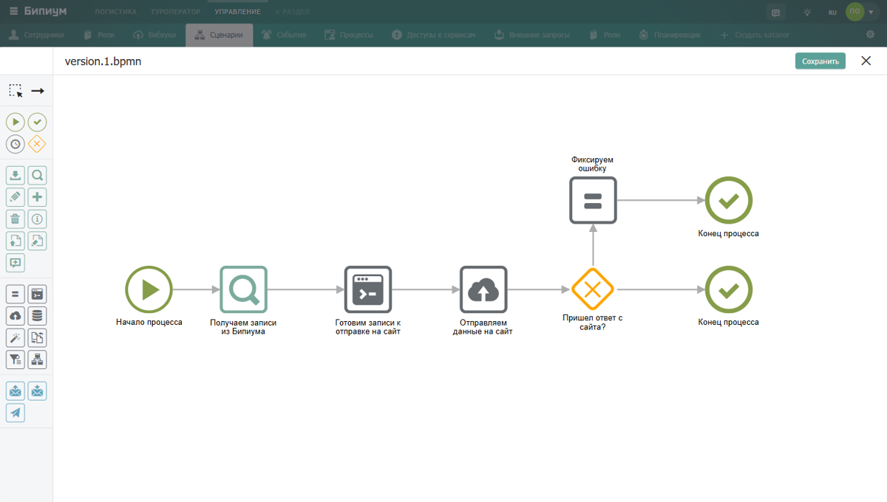

Сценарий -- блок-схема процесса, описывающая алгоритм его выполнения. Сценарии строятся в графическом редакторе из компонентов и хранятся в каталоге «Управление -> Сценарии».

## Как создать сценарий

1. В разделе «Управление» откройте каталог «[Сценарии](./../../systemcatalogs/upravlenie/scripts)» и создайте новую запись.

2. Укажите название сценария и нажмите «Создать» в поле «Сценарий» -- откроется графический редактор.

3. Из панели компонентов выберите нужные, расположите их в правильной последовательности и задайте свойства каждого.

{width=1200px height=680px}

## Компоненты

Для описания схемы процессов Бипиум использует нотацию [BPMN 2.0](https://ru.wikipedia.org/wiki/BPMN) -- самую распространённую нотацию на рынке BPM-систем. Схема процесса состоит из компонентов трёх типов: события, действия и ветвления.

Описание всех компонентов и их свойств -- в статье [Компоненты](./../components/_index).

## Переменные

Процесс во время исполнения накапливает данные, доступные всем компонентам. Для передачи данных между компонентами используются переменные. Переменные могут создавать компоненты из своих выходных параметров.

Описание формата и типа переменных смотрите в статье «[Переменные](./variables)».

### Входные и выходные переменные

Переменные также используются для приема входных параметров от инициирующих событий и возврата им результата. В зависимости от события, Бипиум запускает процесс, передавая определенные входные переменные и ожидает от процесса в ответ определенных выходных переменных для возврата их инициатору события.

Подробнее о входных и выходных параметрах событий в статье «[События и процессы](./../events/_index)».

## Выражения

Бипиум позволяет манипулировать с переменными в свойствах компонентов: склеивать строки, делать математические вычисления, работать с датами и сложными объектами. Для манипуляции с переменными используется синтаксис выражений.

Описание синтаксиса выражений смотрите в статье «[Выражения](./expression)».

### Из чего состоит раздел



---

*  

   Статья

*  

   Что описывает

---

*  

   [Входные и выходные параметры](./input-parameters)

*  

   Как передавать данные в компоненты и получать результаты из них

   

---

*  

   [Выражения](./expression)

*  

   Синтаксис вычисляемых конструкций: текст, переменные, функции, шаблоны

---

*  

   [Переменные](./variables)

*  

   Типы данных, правила именования, проверка наличия переменной

---

*  

   [Примеры настройки](./cases/_index)

*  

   Примеры настройки сценариев с применением[ Шлюза «Или» (условного ветвления)](./../components/sistemnye/shlyuz-ili-uslovnoe-vetvlenie)


