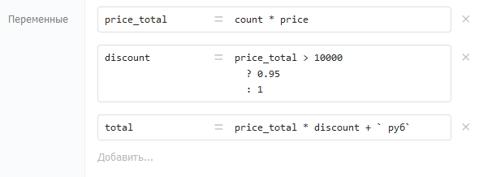

Большинство компонентов принимают на вход параметры в формате выражений. Выражения -- вычисляемые конструкции из текста, переменных и различных функций. Переменные также могут принимать значения в формате выражений (компонент «[Назначение переменных](./../components/deistviya/setvariables)»).

{width=590px height=218px}

## Синтаксис

Выражения вычисляются по правилам JavaScript. Поддерживаются переменные, операторы и встроенные функции базовых объектов JS.



---

*  

   Выражение

*  

   Результат

---

*  

   `"Текст"`

*  

   Строка «Текст»

---

*  

   `variable`

*  

   Значение переменной `variable`

---

*  

   `["1"]`

*  

   Массив с одним элементом «1»

---

*  

   `"Текст с " + variable + " внутри"`

*  

   Строка с подставленным значением переменной

---

*  

   `5*5+5`

*  

   30

---

*  

   `user.name.substr(0,3)`

*  

   Первые 3 символа свойства `name` объекта `user`

---

*  

   `{name: "Пётр", age: 21}`

*  

   Объект со свойствами `name` и `age`



Полный список встроенных функций: [базовые объекты JavaScript](https://developer.mozilla.org/ru/docs/Web/JavaScript/Reference/Global_Objects).

Для сложных вычислений используйте компонент Код (JavaScript) -- он даёт доступ к библиотекам Lodash и Moment.js.

#### Текстовые константы

Чтобы передать в компонент текстовую строку -- оберните её в одинарные (`'`) или двойные (`"`) кавычки. Без кавычек Бипиум попытается вычислить значение как выражение.

Экранирование кавычек внутри строки: `"Текст с \"кавычками\" внутри"`

#### Шаблоны -- многострочный текст с переменными

Для многострочного текста с переменными внутри используйте обратные кавычки (клавиша «ё»). Переменные и выражения внутри шаблона оборачиваются в `${...}`.

```javascript
`Здравствуйте, ${name}!
Рады сообщить вам, что...`
```

Обратная кавычка (`` ` ``) — это не обычная одинарная кавычка (`'`). Находится на клавише «ё» на русской раскладке.

## **Результат**

### Успешное вычисление

В зависимости от выражения и используемых функций результат выражений может быть строкой, числом, датой, объектом или массивом. Переменные внутри процесса могут быть любого из этих форматов.

### Ошибка при вычислении

Если выражение некорректно, то Бипиум завершит процесс с возвратом ошибки. Возможные ошибки в выражениях:

-  некорректный синтаксис

-  использованы несуществующие переменные

-  использованы недоступные функции