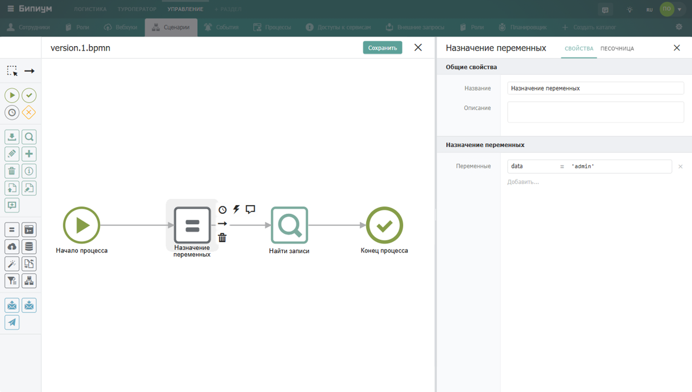
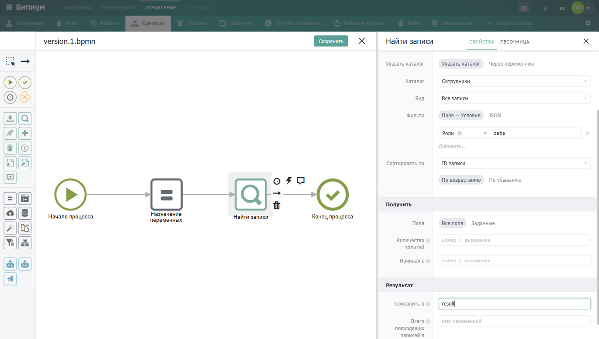
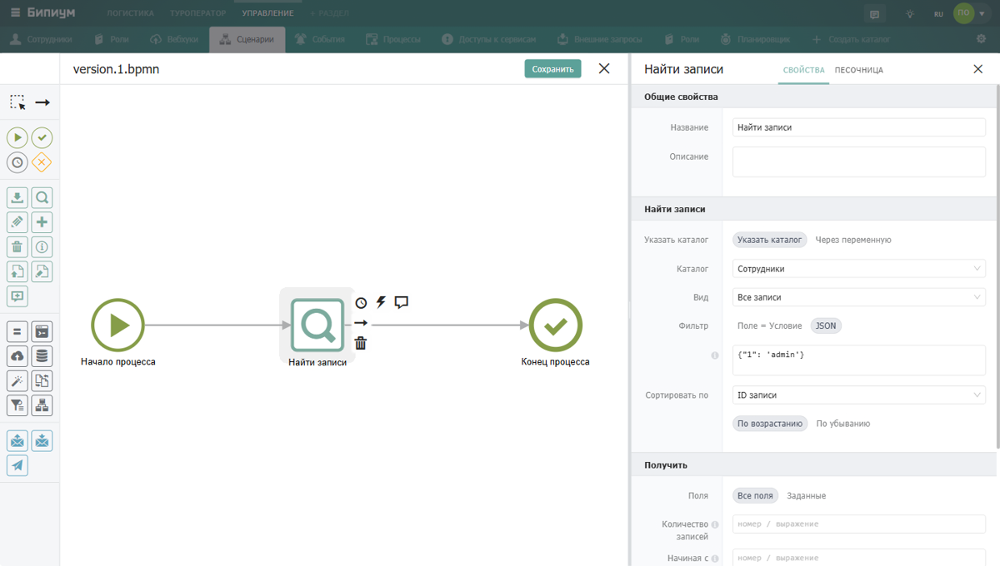
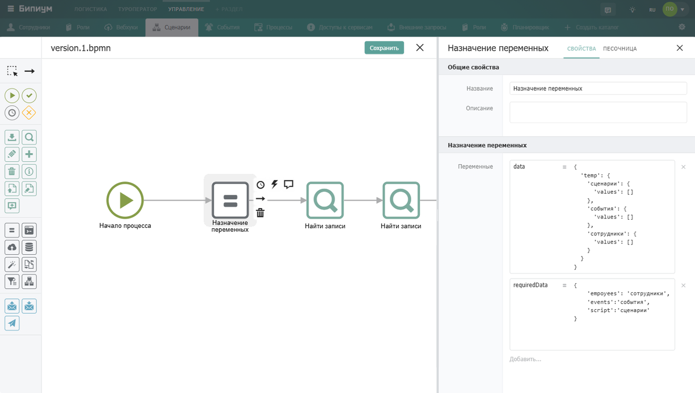
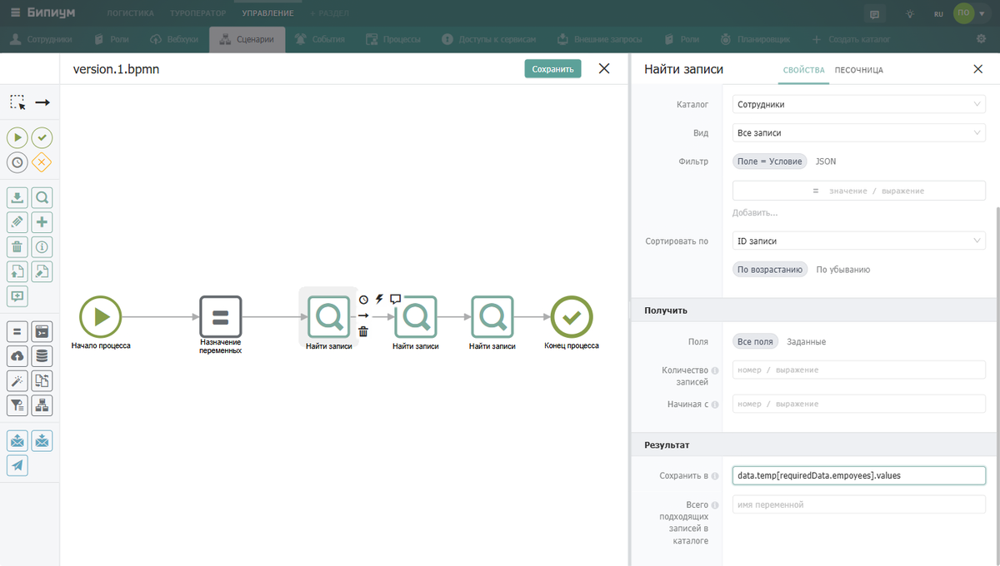
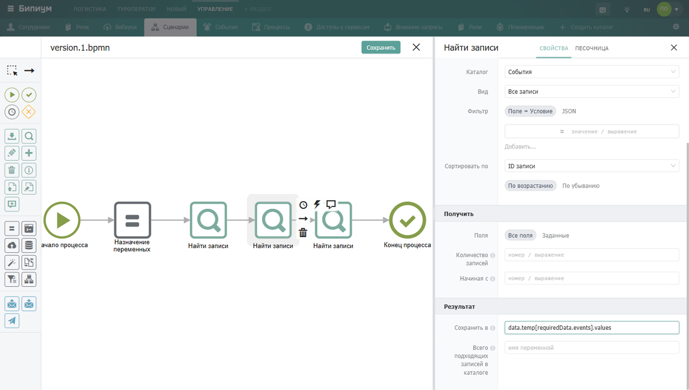
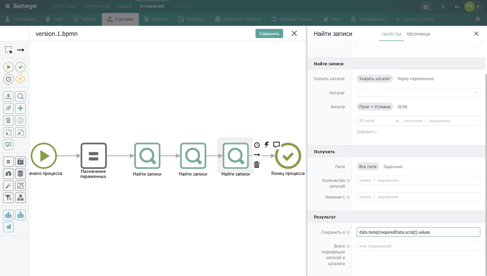

Компоненты сценария принимают входные параметры и возвращают выходные. Параметры можно передавать через переменные или через идентификаторы полей каталога.

## **Входные параметры**

Входные параметры можно задавать тремя способами:

-  **Переменными** -- значения, хранящиеся в переменных процесса

-  **Идентификатором поля** -- числовой ID поля или вложенный шаблон

-  **JSON** -- передать фильтр в виде JSON-строки

### Передача значений через переменные

Переменные могут быть заданы внутри сценария или переданы как входные параметры при запуске процесса. Там где в поле компонента указано «значение / выражение» -- можно использовать имя переменной.

#### **Пример**

Создадим в «Назначении переменных» переменную `data` со значением `'admin'` и передадим её в фильтр компонента «Найти записи»:

{width=1200px height=680px}

Далее передадим в компоненте «Найти записи» в фильтр следующие значения:

{width=1200px height=680px}

Результат выполнения данного сценария выглядит следующим образом:

```javascript
"data": "admin",
"result": [
 {
  "id": "1",
  "title": "admin",
  "values": {
   "1": "admin",
   "2": "admin",
   "3": "",
   "4": [
   "$user"
   ],
   "5": []
   }
  }
 ]
```

Таким образом мы передали в фильтр значение ‘admin’ и получили все записи подходящие по критериям.

### **Передача переменных через JSON**

JSON позволяет задать фильтр в виде структурированной строки с указанием поля, условия и значения.

{width=1200px height=680px}

Результат выполнения данного сценария выглядит следующим образом:

```json
"result": [
        {
            "values": {
                "1": "admin",
                "2": "admin@bpium.ru",
                "9": [],
                "10": "admin",
                "$name": "admin",
                "$email": "admin@bpium.ru"
            }
        }
    ]
```

## **Выходные параметры**

Выходные параметры компонентов сохраняются в переменные процесса. Это можно делать двумя способами:

-  **В переменную** -- результат сохраняется как самостоятельная переменная

-  **В ключ объекта** -- результат сохраняется как значение ключа внутри существующего объекта

**Пример**

Создадим объект `data.temp` с ключами «сценарии», «события», «сотрудники». Затем запустим три компонента «Найти записи» и каждый результат сохраним в соответствующий ключ объекта:

{width=1200px height=680px}

Далее создаем 3 компонента «Найти записи» и в секции «Результат» в поле «Сохранить в» указываем следующие значения:

{width=1200px height=680px}

{width=1200px height=680px}

{width=1200px height=680px}

### **Результат**

Результатом выполнения данного сценария выглядит следующим образом:

```javascript
"data": {
        "temp": {
            "сценарии": {
                "values": [
                    {
                        "id": "1",
                        "title": "Импорт",
                        "values": {
                            "1": "Импорт",
                            "2": "",
                            "3": [
                                {
                                    "id": 8,
                                    "title": "version.7.bpmn",
                                    "size": 15375,
                                    "url": "http://192.168.0.40:2020/storage/1/e1a8939a-4270-415d-82dd-985456f96a80/version.7.bpmn",
                                    "mimeType": "application/bpmn+xml",
                                    "metadata": null
                                }
                            ]
                        }
                    }
                ]
            },
            "события": {
                "values": [
                    {
                        "id": "1",
                        "title": "тест",
                        "values": {
                            "1": "тест",
                            "2": "",
                            "4": [
                                {
                                    "catalogId": "1",
                                    "catalogTitle": "Каталоги",
                                    "catalogIcon": "content-8",
                                    "recordId": "20",
                                    "recordTitle": "321",
                                    "isRemoved": false
                                }
                            ],
                            "5": [
                                "$record.after.create"
                            ],
                            "6": "",
                            "8": []
                        }
                    }
                ]
            },
            "сотрудники": {
                "values": [
                    {
                        "id": "1",
                        "title": "admin",
                        "values": {
                            "1": "admin",
                            "2": "admin",
                            "3": "",
                            "4": [
                                "$user"
                            ],
                            "5": []
                        }
                    },
                    {
                        "id": "2",
                        "title": "1",
                        "values": {
                            "1": "1",
                            "2": "shamil.vagapov@bpium.ru",
                            "3": "",
                            "4": [
                                "$extuser"
                            ],
                            "5": []
                        }
                    }
                ]
            }
        }
    },
```

Таким образом результаты исполнения компонентов «Найти записи» записались в свойства указанных объектов.

:::info 

В поле «Сохранить в» можно указать ключ объекта через точечную нотацию: `data.temp.сотрудники`. Тогда результат будет записан именно туда, не перезаписывая другие ключи.

:::