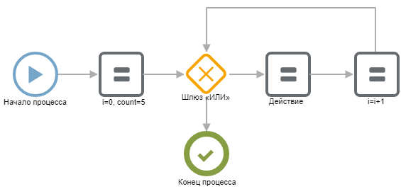

В этом разделе приведены примеры настройки типовых кейсов и фрагментов сценариев.

**Условие**

{width=495px height=268px}

Подробнее в статье «[Условие](./ispolzovanie-shlyuza-ili)».

**Цикл**

{width=565px height=267px}

Подробнее в статье «[Цикл](./ispolzovanie-shlyuza-ili)».