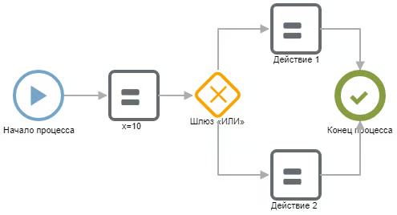
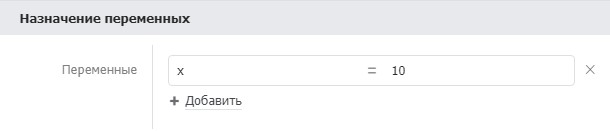
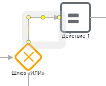
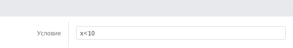

Условие -- ветвление внутри сценарии. Настраивается с помощью компонента «[Шлюз ИЛИ](./../../components/sistemnye/shlyuz-ili-uslovnoe-vetvlenie)» задания условий на выходящие соединительные линии.

## Сценарий

{width=495px height=268px}

### Описание сценария

#### Компоненте «x=10»

В компоненте присвоения мы присваиваем переменной x значение 10.

#### Шлюз «Или»

Условное ветвление сценария задает компонент «Шлюз ИЛИ». Этот компонент может иметь несколько выходов. В зависимости от условий сценарий продолжит свою работу по одной из линий.

Условия задаются на выходных линиях:

Синтаксис условий соответствует синтаксису Javascript. Выражение должно вернуть `true` или `false` или их эквивалент. Условие может быть составным из нескольких подусловий. Примеры:

-  `i<count`

-  `summ > 0`

-  `values[3].length`

-  `values[7].indexOf("2")>=0`

-  `(a > 10 &&  b < 3) || ! has_x`

## Возможные ошибки

Все выходные линии из шлюза обязаны иметь условия. Если условие не задано, сценарий не будет исполнен и вернет ошибку:

`bpmn:ExclusiveGateway <ExclusiveGateway_...> diverging flow (bpmn:SequenceFlow <SequenceFlow_...>) has no condition`

Чтобы найти линию с незаданным условием в сценарии -- нажмите ctrl-f. В появишемся поисковом поле введите название линии:`SequenceFlow_...`.