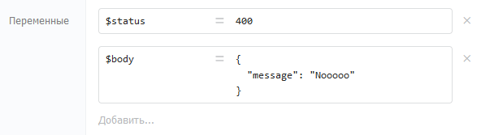

Процесс во время исполнения накапливает данные, доступные всем компонентам. Для передачи данных между компонентами используются переменные. Переменные могут создавать компоненты из своих выходных параметров и компонент «[Назначение переменных](./../components/deistviya/setvariables)».

{width=592px height=167px}

## Правила именования

Имена переменных задаются по правилам JavaScript:

-  Первый символ -- латинская буква (верхний или нижний регистр), символ подчёркивания `_` или знак доллара `$` (используется для служебных переменных Бипиума)

-  Последующие символы -- латинские буквы, цифры или `_`

-  Имя не должно совпадать с зарезервированным словом JavaScript

-  Имена чувствительны к регистру: `Name` и `name` -- разные переменные

Примеры корректных имён: `recordId`, `RecordId`, `$status`

### Типы данных

| Тип        | Пример значения                       | Когда используется                        |
|------------|---------------------------------------|-------------------------------------------|
| **Строка** | `"текст"`                             | Большинство компонентов возвращают строки |
| **Число**  | `123`                                 | Математические вычисления, ID записей     |
| **Дата**   | `Date()`                              | Работа с датами и временем                |
| **Объект** | `{ id: 3, email: 'user@bpium.ru' }`   | Структурированные данные                  |
| **Массив** | `[ {catalogId: '3', recordId: '4'} ]` | Списки записей, множественные значения    |
| **Шаблон** | `` `текст с ${varname}` ``            | Многострочный текст с переменными внутри  |

### Проверка наличия переменной

Если обратиться к несуществующей переменной через обычное условие (`!somevar`) -- процесс завершится с ошибкой. Для проверки наличия переменной используйте `typeof`:

-  Переменная не задана: `typeof somevar === ''`

-  Переменная задана: `typeof somevar !== ''`

Чтобы проверить и при необходимости установить значение по умолчанию -- используйте компонент «Назначение переменных» с выражением:

```
typeof somevar !== '' ? somevar : "значение по умолчанию"
```

:::info 

Для ветвления по наличию переменной удобно использовать шлюз «Или»: на одну ветку вешать условие `typeof somevar === ''`, на другую -- `typeof somevar !== ''`.

:::