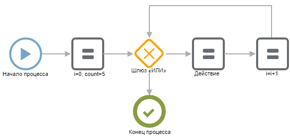
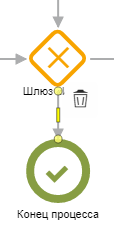

# Цикл

Цикл — повторение некоторой последовательности действий внутри сценарии. Применяется, например, для последовательного обхода найденных записей. Настраивается с помощью компонента «[Шлюз ИЛИ](broken-reference)»,задания условий на выходящие [соединительные линии](../../components/kommunikacii/line.md) и использования переменных.

## Сценарий

### Описание сценария

#### Компоненте «i=0, count=5»

В компоненте присвоения создаем переменную для отсчета итераций цикла (i) и задаем число повторов (count).

#### Шлюз «Или»

С помощью шлюза будем проверять число пройденных повторов. Если мы выполни нужно число повторов — завершим цикл, если нет — будем выполнять действия цикла. Условия задаются на выходных линиях из шлюза.

**Условие для выполнение действий итерации цикла.** Если переменная i (шаг цикла) меньше заданного числа шагов(count), то выполняем новый шаг:

Условие для выхода из цикла. Если переменная i (шаг цикла) больше или равна заданного числа шагов (count), то выходим. Так как наш цикл начинается с нуля, то когда переменная i станет равна count, это будет означать, что цикл уже выполнился 5 раз.

Подробнее об условных ветвлениях в разделе «[Условие](if.md)».

#### Компоненте «Действие»

Вместо этого компонента могут быть расположены любые компоненты, организующие алгоритм, который должен быть повторен несколько раз (в цикле).

#### Компоненте «i=i+1»

После выполнение полезных компонентов шага цикла установим компонент присвоения, в котором увеличим значение переменной i на один:

## Возможные ошибки

### Бесконечный цикл

Если ошибиться с условием выхода из цикла, то цикл будет выполнятся бесконечно. Бипиум постепенно начнет замедлять исполнение такого процесса. И завершит его после превышения [разрешенного времени](../../limits.md) исполнения процессов.

Вы можете прервать процесс самостоятельно. Для этого удалите процесс из каталога Управление/Процессы.
