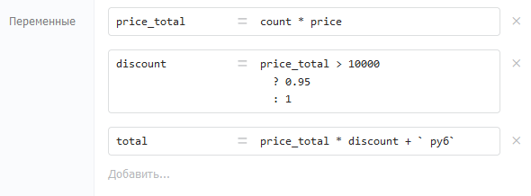

# Выражения

Большинство компонентов принимают на вход параметры в формате выражений. Выражения — вычисляемые конструкции из текста, переменных и различных функций. Переменные также могут принимать значения в формате выражений (компонент «[Назначение переменных](../components/deistviya/setvariables.md)»).



## Синтаксис

Выражения вычисляются по правилам JavaScript. Поддерживаются переменные, операторы и встроенные функции базовых объектов JS.

<table><thead><tr><th width="276.727294921875">Выражение</th><th>Результат</th></tr></thead><tbody><tr><td><code>"Текст"</code></td><td>Строка «Текст»</td></tr><tr><td><code>variable</code></td><td>Значение переменной <code>variable</code></td></tr><tr><td><code>["1"]</code></td><td>Массив с одним элементом «1»</td></tr><tr><td><code>"Текст с " + variable + " внутри"</code></td><td>Строка с подставленным значением переменной</td></tr><tr><td><code>5*5+5</code></td><td>30</td></tr><tr><td><code>user.name.substr(0,3)</code></td><td>Первые 3 символа свойства <code>name</code> объекта <code>user</code></td></tr><tr><td><code>{name: "Пётр", age: 21}</code></td><td>Объект со свойствами <code>name</code> и <code>age</code></td></tr></tbody></table>

Полный список встроенных функций: [базовые объекты JavaScript](https://developer.mozilla.org/ru/docs/Web/JavaScript/Reference/Global_Objects).

Для сложных вычислений используйте компонент Код (JavaScript) — он даёт доступ к библиотекам Lodash и Moment.js.

#### Текстовые константы

Чтобы передать в компонент текстовую строку — оберните её в одинарные (`'`) или двойные (`"`) кавычки. Без кавычек Бипиум попытается вычислить значение как выражение.

Экранирование кавычек внутри строки: `"Текст с \"кавычками\" внутри"`

#### Шаблоны — многострочный текст с переменными

Для многострочного текста с переменными внутри используйте обратные кавычки (клавиша «ё»). Переменные и выражения внутри шаблона оборачиваются в `${...}`.

```javascript
`Здравствуйте, ${name}!
Рады сообщить вам, что...`
```

Обратная кавычка (`` ` ``) — это не обычная одинарная кавычка (`'`). Находится на клавише «ё» на русской раскладке.

## **Результат**

### Успешное вычисление

В зависимости от выражения и используемых функций результат выражений может быть строкой, числом, датой, объектом или массивом. Переменные внутри процесса могут быть любого из этих форматов.

### Ошибка при вычислении

Если выражение некорректно, то Бипиум завершит процесс с возвратом ошибки. Возможные ошибки в выражениях:

* некорректный синтаксис
* использованы несуществующие переменные
* использованы недоступные функции
