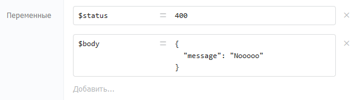

# Переменные

Процесс во время исполнения накапливает данные, доступные всем компонентам. Для передачи данных между компонентами используются переменные. Переменные могут создавать компоненты из своих выходных параметров и компонент «[Назначение переменных](../components/deistviya/setvariables.md)».



## Правила именования

Имена переменных задаются по правилам JavaScript:

* Первый символ — латинская буква (верхний или нижний регистр), символ подчёркивания `_` или знак доллара `$` (используется для служебных переменных Бипиума)
* Последующие символы — латинские буквы, цифры или `_`
* Имя не должно совпадать с зарезервированным словом JavaScript
* Имена чувствительны к регистру: `Name` и `name` — разные переменные

Примеры корректных имён: `recordId`, `RecordId`, `$status`

### Типы данных

<table><thead><tr><th width="131.72723388671875">Тип</th><th>Пример значения</th><th>Когда используется</th></tr></thead><tbody><tr><td><strong>Строка</strong></td><td><code>"текст"</code></td><td>Большинство компонентов возвращают строки</td></tr><tr><td><strong>Число</strong></td><td><code>123</code></td><td>Математические вычисления, ID записей</td></tr><tr><td><strong>Дата</strong></td><td><code>Date()</code></td><td>Работа с датами и временем</td></tr><tr><td><strong>Объект</strong></td><td><code>{ id: 3, email: 'user@bpium.ru' }</code></td><td>Структурированные данные</td></tr><tr><td><strong>Массив</strong></td><td><code>[ {catalogId: '3', recordId: '4'} ]</code></td><td>Списки записей, множественные значения</td></tr><tr><td><strong>Шаблон</strong></td><td><code>`текст с ${varname}`</code></td><td>Многострочный текст с переменными внутри</td></tr></tbody></table>

### Проверка наличия переменной

Если обратиться к несуществующей переменной через обычное условие (`!somevar`) — процесс завершится с ошибкой. Для проверки наличия переменной используйте `typeof`:

* Переменная не задана: `typeof somevar === 'undefined'`
* Переменная задана: `typeof somevar !== 'undefined'`

Чтобы проверить и при необходимости установить значение по умолчанию — используйте компонент «Назначение переменных» с выражением:

```
typeof somevar !== 'undefined' ? somevar : "значение по умолчанию"
```


Для ветвления по наличию переменной удобно использовать шлюз «Или»: на одну ветку вешать условие `typeof somevar === 'undefined'`, на другую — `typeof somevar !== 'undefined'`.

