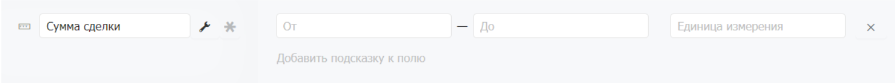
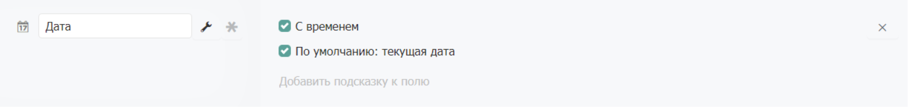
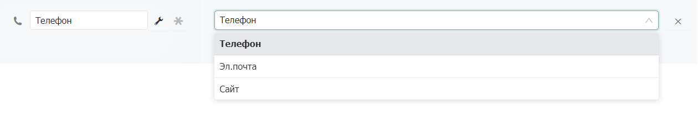
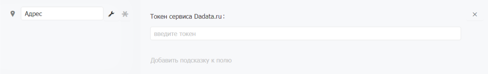
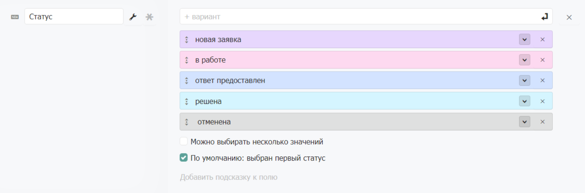
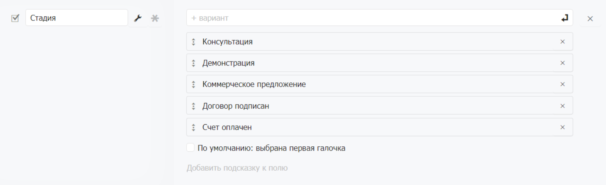
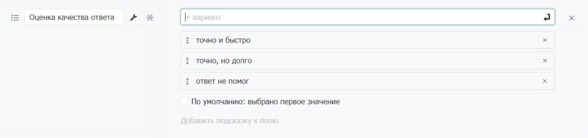
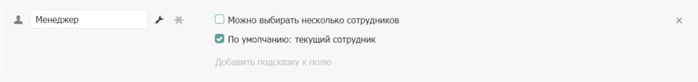
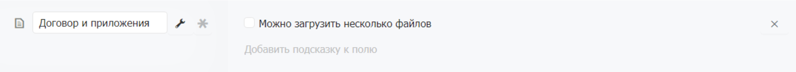

# Типы полей

## Основные

### Текст

**Тип поля**

* **Текст** для заполнения однострочного текстового поля.
* **Текст по маске** позволяет задавать конкретные требования к заполнению текстового поля в зависимости от требуемых символов в необходимом количестве.
* **Многострочный текст** для заполнения многострочного текстового поля.

.png>)

В **Текст по маске** необходимо ввести строку символов (маску), которая позволит ограничивать и контролировать вводимую информацию. Шаблон маски задается полностью такой длины, какой длины вводится строка.

Использование масок ввода снизит вероятность некорректного внесения информации. Например, в случаях, когда в компании принята определенная нумерация договоров и счетов.

В строке маски допустимо использование следующих специальных символов:

* Символ «1» — разрешает ввод любой цифры;
* Символ «A» — разрешает ввод любой заглавной буквы;
* Символ «а» — разрешает ввод любой строчной буквы;
* Символ «\*» — разрешает ввод любой буквы или цифры;
* Символ «#» — разрешает ввод заглавной буквы или цифры;&#x20;
* Любые другие символы считаются частью шаблона. Например, маска «Б11» разрешит ввести любое значение начинающееся на букву Б с двумя любыми последующими цифрами;
* Символ «\» — указывает, что следующий символ необходимо рассматривать в качестве постоянного символа, даже если он является служебным символом маски. Например, «\А» будет выводить в маске букву А, «\\\» будет выводить в маске символ \\, а «\1» — 1.


**Примеры шаблонов масок ввода.**

Ниже приведены примеры использования масок ввода и их расшифровка.

* `1111 №111111` — серия и номер паспорта
* `ДС № 11111`— номер договора, которая начинается с букв ДС
* `1111 1111 1111 1111` — номер кредитной карты банка


### Текстовый редактор

### Число

Поле для ввода чисел. Допустимы отрицательные и положительные нецелые числа.

**Минимальное и максимальное значения.** Поле позволяет задавать диапазон разрешенных чисел.

**Единица измерения** позволяет указать величину измерения введенных чисел.

### Дата

Поле для ввода даты. Поле дата без времени хранится без учета часового пояса.

**Галочка «С временем»** позволяет указывать также и время. Поле дата с временем учитывает часовой пояс сотрудников. Например, запись с указанным временем совещания сотрудники в разных часовых поясах увидят по разному, для каждого будет применен его часовой пояс.

**Галочка «По умолчанию: текущая дата»** устанавливает в поле текущую дату при создании новой записи.

## Контактные данные

### Телефон

Поле для хранения контактных данных: телефонов, адресов электронной почты и сайтов. Позволяет создавать несколько контактов одного типа в одном поле. Помимо добавления нескольких контактов в одно поле можно так же указать дополнительное наименование каждого из них для удобства идентификации. Например, можно добавить несколько телефонов, с собственным описанием: личный, рабочий и т.д.

### Электронная почта

### Сайт/Ссылка

### Адрес

Поле для хранения почтовых адресов. Поле работает через сторонний сервис Dadata.ru. Сервис позволяет быстро внести корректные данные по ходу их ввода в поле. Подсказки помогут ввести почтовый адрес разбитый по справочникам адресов — КЛАДР или ФИАС. Без опечаток, с номером квартиры и почтовым индексом. С районом города и координатами. Ищет адреса по любой части адреса от региона до дома.

Например, если ввести в поле «тверская нижний 14», то появится подсказка «Нижегородская обл, г Нижний Новгород, ул Тверская, д 12». Также ищет по почтовому индексу. Например, «105568» — «г Москва, ул Магнитогорская».

**Токен сервиса Dadata.ru** это код доступа стороннего сервиса Dadata.ru.


**Как получить токен сервиса Dadata.ru**

Для того, чтобы получить токен необходимо зарегистрироваться на [Dadata.ru](https://dadata.ru/clean/#registration_popup). Далее в в разделе «Ключи» в  [Личном кабинете](https://dadata.ru/profile/#info) нужно сгенерировать уникальный API-ключ (токен). Полученный API-ключ необходимо ввести в поле «Токен сервиса Dadata.ru» в Бипиуме.

При необходимости также можно выбрать подходящий тариф на сервисе. Платные тарифы позволяют увеличить число обращений к сервису в сутки. Также есть и бесплатный тариф, но число обращений в сутки в нем ограничено значением в 10000.


Если нет необходимости вводить полный и точный адрес, то можно использовать обычное поле для заполнения адреса.

## Дополнительные

### Статус

Поле для выбора одного или нескольких значений из предустановленных вариантов. Каждый вариант имеет цвет для визуального отличия данных в таблице. Подходит для отображения статусов или состояний. Варианты значений можно пересортировать мышкой.

**Галочка «Можно выбирать несколько значений»** включает возможность одновременно выбирать несколько вариантов для каждой записи.

**Галочка «По умолчанию: выбран первый статус»** выделяет первый элемент при создании новой записи.

В режиме просмотра анкеты варианты значений показаны в ряд.

### Набор галочек

Поле схожее по смыслу со «статусом». Позволяет выбирать несколько значений. Подходит для отображения этапов, статусов, чек-листов. В режиме просмотра анкеты варианты значений показаны списком в виде галочек с подписями.

**Галочка «По умолчанию: выбрана первая галочка»** устанавливает галочку у первого элемента при создании новой записи.

### Выбор значения

Поле схожее по смыслу со «статусом». Позволяет выбирать только одно из возможных значений. Подходит для отображения вопросов в анкетах. В режиме просмотра анкеты варианты значений показаны списком в виде группы радио-баттонов.

**Галочка «По умолчанию: выбрано первое значение»** делает выбранным первый элемент при создании новой записи.

### Выпадающий список

### Переключатель

### Прогресс

Шкала от 0 до 100%. Подходит для отображения процесса или вероятностей. Не имеет параметров.

### Оценка звёздами

Вариант прогресса в виде звёзд от 0 до 5. Подходит для отображения оценок. Не имеет параметров.

### Сотрудник

Поле для выбора сотрудника. Подходит для фиксации исполнителя, участников проекта.

**Галочка «Можно выбирать несколько сотрудников»** включает возможность одновременно закреплять несколько сотрудников.

**Галочка «По умолчанию: текущий сотрудник»** устанавливает в поле запись сотрудника, создающего новую запись.

### Связанный каталог

.png>)

Поле позволяет связывать записи разных каталогов между собой. Например, привязывать заказы к клиентам, обращения к контактным лицам, клиентов к партнерам.

**Выпадающий список с записями из другого каталога.** Поле может ссылаться сразу на несколько каталогов или [правовых видов](https://docs.bpium.ru/rights/views) этих каталогов. Например, для карточки события действующими лицами могут быть клиенты, лиды и контактные лица. Любой из объектов может быть выбран в таком поле.

Если поле ссылается на правовой вид, то сотрудники при заполнении карточки смогут привязывать записи не к любым записям другого каталога, а только к тем, которые попадают в правовой вид. При этом сам правовой вид может быть и не доступен сотруднику. Например, можно указать, что оплаты могут быть привязаны только к правовому виду «Клиенты». Правовые виды отображаются в формате **«Каталог / Вид»**. Подробнее о правовых видах в статье «[Виды](https://docs.bpium.ru/ecm/structure/views)».

**Расширенные (дополнительные)** **поля** позволяют отобразить необходимые поля выбранного каталога непосредственно в записи настраиваемого каталога. Например, можно отобразить поля ФИО, должность и телефон из карточки «Контакты».

**Права.** Выбор расширенных полей связанных записей из карточки родительской записи позволяет не только видеть данные поля, но и изменять их. Например, можно сразу же заполнить или измененить контакты сотрудников.

**Галочка «Можно выбирать несколько значений»** включает возможность одновременно связывать текущую запись с несколькими записями из других каталогов. Например, выбрать в участниках встречи несколько контактных лиц из разных каталогов.

**Галочка «При выборе видны только доступные записи»** определяет будет ли применяться правовая политика для отображения возможных для связывания записей или нет. Если галочка не стоит, то при заполнении анкеты сотрудник увидит все записи связанного каталога, даже если не имеет до них доступ (анкеты этих записей он открыть не сможет). Если галочка стоит, то увидит только те записи, до которых у него есть доступ. Подробнее о доступе в статье «[Права](https://docs.bpium.ru/rights)».

### Кнопка

<figure><figcaption></figcaption></figure>

Кнопка для инициации события. Кнопка становится активной при создании события типа [«Изменено поле во время редактирования»](https://docs.bpium.ru/manual/processes/events/datachanged#izmeneno-pole-vo-vremya-redaktirovaniya-updating), отслеживающее изменение в поле, в котором находится кнопка. Не имеет параметров.

### Файл

Поле для прикрепления файлов к записи. Позволяет сохранять документы, фотографии и другие файлы.

**Галочка «Можно загрузить несколько файлов»** включает возможность одновременно прикрепить несколько файлов.

