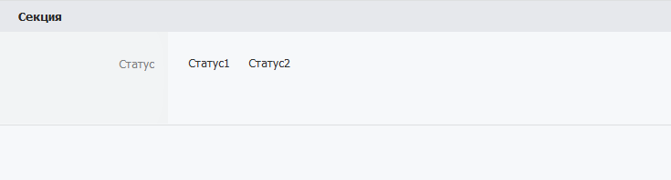

# Настройка каталогов

## Свойства полей

.png>)

Структура каталога состоит из полей разного типа. В левой части расположен список возможных элементов (типов полей). В правой — карточка каталога. Поля в карточке разбиты на секции. Секции объединяют близкие по смыслу поля для большего порядка.

Чтобы добавить в каталог новое поле, мышкой перетащите его из левой панели в свободное место анкеты справа.

Поля в карточке можно менять местами перетаскиванием, схватив за иконку поля.

Каждое поле имеет:

* заголовок
* признак обязательного поля ()
* свойства в зависимости от типа поля
* подсказку, которая отображается сотрудникам при заполнении поля
* свойство, которое разрешает редактирование только через API

.png>)

.png>)

## Формулы

## Видимость полей

С помощью данной настройки вы можете скрыть поле, пока в другом поле не будет указано нужное значение.

В данном примере, поле будет скрыто пока пользователь не укажет "Статус1".

Настройка производится в панели свойств поля. Для того, чтобы открыть панель свойств необходимо выделить нужное поле:

.png>)

Далее в панели свойств поля откройте секцию "Видимость" и выберите значения других полей, при которых открытое на редактирование поле должно быть видимым:

.png>)

## Зависимости полей
