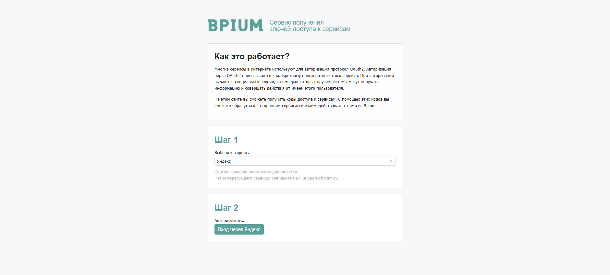

# Доступы к сервисам

[Процессы](../../processes/) в ходе выполнения могут делать веб-запросы к внешним системам, сайтам и сервисам. Некоторые сервисы в интернете используют для авторизации протокол OAuth 2.0 — они не принимают логин и пароль напрямую, а требуют специальных ключей доступа. Эти ключи может получить только человек, авторизовавшись в браузере.

Поэтому администратор получает ключи заранее и сохраняет их в каталоге «Доступы к сервисам». Автоматизации в момент выполнения берут ключи отсюда и используют их для запросов к API сервиса.

### Свойства записи

<table data-header-hidden><thead><tr><th width="185"></th><th></th></tr></thead><tbody><tr><td>Поле</td><td>Описание</td></tr><tr><td>Название</td><td>Имя сервиса для идентификации в сценариях автоматизаций. Используйте понятное название — по нему сценарий обращается к нужной записи.</td></tr><tr><td>Коды доступа</td><td>Набор ключей авторизации в формате JSON. Получается через <a href="http://tokens.bpium.ru/">tokens.bpium.ru</a>.</td></tr></tbody></table>

### Как добавить доступ к сервису

Бипиум предоставляет специальный сайт [tokens.bpium.ru](http://tokens.bpium.ru/) — он помогает быстро получить ключи для популярных сервисов без технических знаний.

1. Откройте [tokens.bpium.ru](http://tokens.bpium.ru/).
2.  Выберите сервис из списка — например, «Яндекс».

    <figure><figcaption></figcaption></figure>
3. &#x20;Нажмите кнопку авторизации и войдите под нужным аккаунтом.
4. &#x20;Сайт сформирует JSON с ключами доступа и покажет срок действия и возможность     автопродления           &#x20;
5.  Нажмите «Скопировать в буфер обмена».

    <figure><figcaption></figcaption></figure>
6. В Бипиуме перейдите в «Управление → Доступы к сервисам», создайте новую запись.
7. Введите название сервиса и вставьте скопированный JSON в поле «Коды доступа».

### Свойства записи

| Поле         | Описание                                                                                                                              |
| ------------ | ------------------------------------------------------------------------------------------------------------------------------------- |
| Название     | Имя сервиса для идентификации в сценариях автоматизаций. Используйте понятное название — по нему сценарий обращается к нужной записи. |
| Коды доступа | Набор ключей авторизации в формате JSON. Получается через [tokens.bpium.ru](http://tokens.bpium.ru/).                                 |

### Срок действия и автопродление

Ключи доступа могут быть ограничены по времени — каждый сервис устанавливает свой срок: от 1 часа до нескольких месяцев или бессрочно. Сайт tokens.bpium.ru показывает срок действия полученных ключей и поддерживает ли сервис автопродление.

Если сервис поддерживает автопродление — Бипиум обновляет ключи автоматически при каждом запросе. Если нет — администратору нужно обновлять коды доступа вручную до истечения срока, иначе автоматизации начнут завершаться с ошибкой авторизации.

<figure><figcaption></figcaption></figure>


Если нужного сервиса нет на tokens.bpium.ru — напишите на support@bpium.ru. Список доступных сервисов пополняется по запросу.

