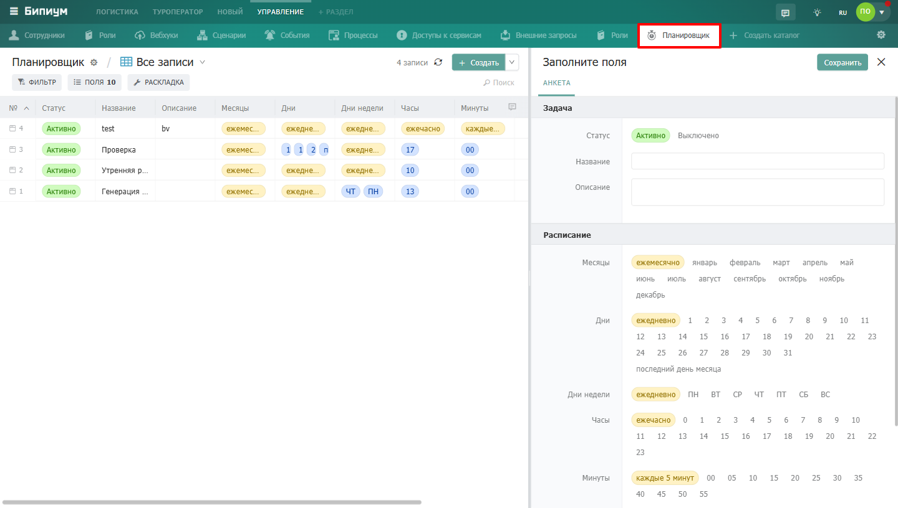

Каталог «Планировщик» позволяет запускать сценарии автоматически по расписанию -- без участия сотрудника и без привязки к изменениям в данных. Каждая запись в каталоге -- это одна задача с настроенным расписанием и набором сценариев для запуска.

{width=1440px height=816px}

:::info 

Каталог «Планировщик» доступен только администраторам системы.

:::

## Как это работает

Администратор создаёт задачу и задаёт расписание -- когда и как часто запускать. В нужный момент Бипиум автоматически запускает указанные сценарии. Результат каждого запуска фиксируется в каталоге [Процессы](./processes).

## Свойства задачи

### Секция «Задача»



---

*  

   Поле

*  

   Описание

---

*  

   **Статус**

*  

   **Активно** -- задача работает по расписанию.

   **Выключено** -- задача приостановлена, сценарии не запускаются.

---

*  

   **Название**

*  

   Произвольное название задачи -- для идентификации в каталоге.

---

*  

   **Описание**

*  

   Комментарий о назначении задачи -- что она делает и зачем.



### Секция «Расписание»

Расписание задаётся комбинацией пяти параметров. Каждый параметр допускает множественный выбор -- задача сработает когда одновременно совпадут все выбранные условия.



---

*  

   Поле

*  

   Описание

*  

   Доступные значения

---

*  

   **Месяцы**

*  

   В какие месяцы запускать задачу

*  

   Ежемесячно, Январь … Декабрь

---

*  

   **Дни**

*  

   В какие дни месяца запускать задачу

*  

   Ежедневно, 1 … 31, Последний день месяца

---

*  

   **Дни недели**

*  

   В какие дни недели запускать задачу

*  

   Ежедневно, ПН … ВС

---

*  

   **Часы**

*  

   В какой час запускать задачу

*  

   Ежечасно, 0 … 23

---

*  

   **Минуты**

*  

   На какой минуте запускать задачу

*  

   Каждые 5 минут, 00, 05, 10 … 55

---

*  

   **Часовой пояс**

*  

   Смещение от UTC по которому рассчитывается расписание. Укажите смещение вашего города.

*  

   −12 … +14



:::tip 

Если выбрать «Ежемесячно», «Ежедневно» и «Ежечасно» -- задача будет запускаться каждый час каждого дня. Если выбрать конкретные значения, например Дни недели = ПН, ЧТ и Часы = 9, Минуты = 00 -- задача запустится в 9:00 по понедельникам и четвергам.

:::

### Секция «Действия»



---

*  

   Поле

*  

   Описание

---

*  

   **Выполнить**

*  

   Один или несколько сценариев из каталога [Сценарии](./scripts), которые будут запущены при срабатывании задачи.



## Как создать задачу

1. Перейдите в раздел «Управление» -> каталог «Планировщик».

2. Нажмите «+ Создать».

3. Задайте название и при необходимости описание.

4. Настройте расписание -- выберите нужные месяцы, дни, часы и минуты. Укажите часовой пояс.

5. В секции «Действия» выберите сценарии для запуска.

6. Убедитесь что статус установлен в «Активно».

7. Нажмите «Сохранить» -- задача сразу встанет в расписание.

## Включение и выключение задачи

Чтобы временно остановить задачу без удаления -- откройте карточку и переключите статус на «Выключено». Расписание и сценарии сохранятся, но задача перестанет срабатывать. Чтобы возобновить -- переключите обратно на «Активно».

## Мониторинг выполнения

Каждый запуск задачи создаёт запись в каталоге [Процессы](./processes). Там можно посмотреть когда задача запускалась, успешно ли выполнилась и если была ошибка -- прочитать её описание.