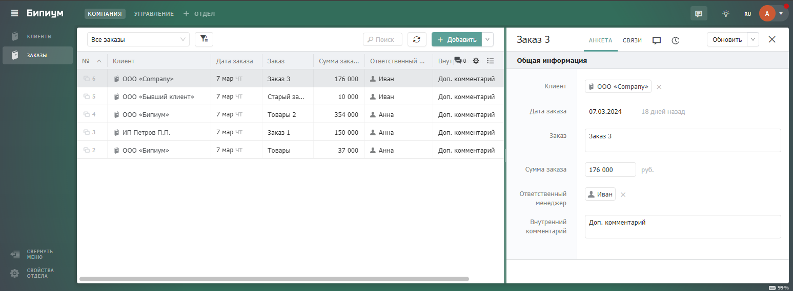

# Автоматизация оплаты счетов

## **1. Введение**

В вашей системе можно согласовывать оплаты из различных источников с руководителем.&#x20;

Бипиум позволяет:

* Хранить оплаты в одном месте
* Автоматизировать процесс согласования оплат с руководителем
* Уведомлять ответственных сотрудников о создании оплат в системе**.**

## **2. Как это будет работать у вас**

Заявки на оплату фиксируются в каталоге «Заявки на оплату». При создании записи указываются параметры заявки (счет, сумма) и ответственный, который должен ее согласовать. После создания заявки согласовывать может только сотрудник, указанный в поле «Ответственный»:

<figure><figcaption></figcaption></figure>

Если ответственный сотрудник согласует оплату, то в каталоге «Оплаты» создается новая запись. Статус заявки переводится в значение «Оплата создана» и сотрудники больше не могут редактировать эту запись:

<figure><figcaption></figcaption></figure>

При создании записи оплаты на адрес электронной почты ответственного сотрудника приходит уведомление о создании новой оплаты:

<figure><figcaption></figcaption></figure>

Созданная запись оплаты выглядит следующим образом:

<figure><figcaption></figcaption></figure>

Статус оплаты отслеживает текущее состояние оплаты, только ответственный за оплату сотрудник может изменять его.

После указания статуса «Оплачено» оплата считается совершенной и никто, включая ответственного, не может редактировать запись. То же самое происходит при статусе оплаты «Отказ»:

<figure><figcaption></figcaption></figure>

Если сумма заявки на оплату меньше 100 000, то этап согласования минуется и оплата создается сразу. Остальные этапы аналогичны этапам выше. При необходимости, вы можете убрать это ограничение и согласовывать каждую оплату (или изменить его величину).

## **3. Принцип работы**

<figure><figcaption></figcaption></figure>

Заявитель оставляет запись в каталоге «Заявки на оплаты». В данном примере стоит ограничение по сумме: если она менее 100 000 руб., то оплата создается автоматически, без согласования. Если сумма больше, то для создания оплаты требуется согласование ответственного лица.

После создания оплаты ответственному за согласование человеку приходит уведомление и платёжная квитанция на его электронную почту.

## **4. Реализация**

### **4.1. Структура каталогов**

#### **Каталог «Заявки на оплаты»**

Создайте каталог «Заявки на оплаты». Этот каталог хранит все заявки на оплаты, которые должны быть согласованы. Настройте структуру каталога следующим образом:

<figure><figcaption></figcaption></figure>

* **Дата и время создания** (дата)\
  Описание: Дата и время создания заявки.\
  Настройки: С временем; По умолчанию: текущая дата; Редактируемое только через API.
* **Статус** (статус)\
  Описание: Статус заявки на оплату\
  Настройки: По умолчанию: первый элемент; Редактируемое только через API.
* **Счет** (текст)\
  Описание: Название счёта.\
  Настройки: Текст; обязательное поле.
* **Сумма** (число)\
  Описание: Сумма на оплату.\
  Настройки: От 0; Единица измерения: руб; обязательное поле.
* **Лицо, создавшее заявку** (Сотрудник)\
  Описание: Сотрудник, создавший запись заявки.\
  Настройки: По умолчанию: текущий сотрудник; Редактируемое только через API.
* **Согласование оплаты**  (статус)\
  Описание: Статус необходимости согласования оплаты.\
  Настройки: По умолчанию: первый элемент; обязательное поле; Редактируемое только через API.
* **Ответственный** (Сотрудник)\
  Описание: Сотрудник, ответственный за оплату.\
  Настройки: Обязательное поле.
* **Согласование ответственным** (статус)\
  Описание: Согласование оплаты ответственным.\
  Настройки: По умолчанию: первый элемент; обязательное поле; Видимость: Согласование — Требуется согласование оплаты.
* **Созданная оплата**  (Секция)\
  Описание: созданная оплата по заявке.\
  Настройки: Видимость: Статус — Оплата создана.
* **Оплата  (связанный каталог)**\
  Описание: созданная оплата по заявке.\
  Настройки: Редактируемое только через API.

#### **Каталог «Оплаты»**

Создайте каталог «Оплаты». Этот каталог содержит согласованные оплаты, которые можно учитывать в расходах вашей компании.

<figure><figcaption></figcaption></figure>

* **Дата и время создания** (дата)\
  Описание: Время создания оплаты.\
  Настройки: С временем; По умолчанию: текущая дата; Редактируемое только через API.
* **Статус** (статус)\
  Описание: Статус оплаты\
  Настройки: По умолчанию: первый элемент; обязательное поле.
* **Счет** (текст)\
  Описание: Наименование счета.\
  Настройки: Текст; обязательное поле.
* **Сумма** (число)\
  Описание: Сумма на оплату.\
  Настройки: От 0; Единица измерения: руб; обязательное поле.
* **Ответственный** (Сотрудник)\
  Описание: Ответственный за оплату сотрудник.\
  Настройки: Обязательное поле.
* **Оповещения** (статус)\
  Описание: Статус отправки сообщения на почту.\
  Настройки: Редактируемое только через API.
* **Дополнительная информация** (Секция)\
  Описание: Секция для разделения полей с дополнительной информацией.
* **Оплата создана** (статус)\
  Описание: Способ создания оплаты.\
  Настройки: По умолчанию: первый элемент; Редактируемое только через API.
* **Заявка на оплату** (связанный каталог)\
  Описание: Заявка, по которой создана оплата.\
  Настройки: Редактируемое только через API; Видимость: Оплата создана - На основе заявки на оплату.
* **Лицо, создавшее заявку** (Сотрудник)\
  Описание: Сотрудник, создавший заявку.\
  Настройки: По умолчанию: текущий сотрудник; Видимость: Оплата создана - Сотрудником. Редактируемое только через API.

### **4.2. Создание автоматизаций**

#### Проверка необходимости согласования оплаты

Создайте событие для запуска сценария «[Проверка необходимости согласования оплаты](https://drive.google.com/file/d/1YKeADBq-OThJaxapTalZfxWjL7mDcCN6/view?usp=sharing)».

<figure><figcaption></figcaption></figure>

Сценарий проверки необходимости согласования выглядит следующим образом:

<figure><figcaption></figcaption></figure>

Сценарий проверяет сумму оплаты, и, если она свыше 100000, то проставляет статус согласования оплаты.

Поменяйте id полей в компонентах:

* **«Сумма заполнена и она больше 100 000?»**\
  Например, 4 - id поля «Сумма» каталога «Заявки на оплаты».\
  Также вы можете поменять сумму, при которой необходимо согласование ответственного.
* **«Согласование оплаты не требуется»**\
  Компонент проставляет статус в карточку, если согласовывать оплату не нужно (те сумма меньше 100 000 руб.).\
  6 - id поля «Согласование оплаты», 1 - API поля «Согласование оплаты» каталога «Заявки на оплаты».
* **«Требуется согласование оплаты»**\
  Компонент проставляет статус в карточку, если нужно согласовывать оплату (т.е. сумма меньше 100 000 руб.).\
  6 - id поля «Согласование оплаты», 2 - API поля «Согласование оплаты»  каталога «Заявки на оплаты».

#### **Создание оплаты по заявке**

Создайте событие для запуска сценария «[Создание оплаты по заявке](https://drive.google.com/file/d/12Crx8ZZTE4zj8S9HH4W9xyACU6R9ZxQR/view?usp=sharing)».

<figure><figcaption></figcaption></figure>

Сценарий создания оплаты по заявке выглядит следующим образом:

<figure><figcaption></figcaption></figure>

Сценарий создает оплаты, основанный на заявке, по условиям и проставляет соответствующий статус.

Поменяйте id полей в компонентах:

* **Условие «Нужно согласовать заявку?»**\
  Если нужно согласование заявки на оплату, но оно еще не согласовано.\
  6 - id поля «Согласование оплаты», 2 - API поля «Согласование оплаты» («Требуется согласование оплаты»). 10 - id поля «Согласование ответственным», 1 - API поля «Согласование ответственным» («Ожидается»).
* **«На согласовании»**\
  Проставляем статус карточки «На согласовании».\
  11 - id поля «Статус», 2 - API поля «Статус» («На согласовании»).
* **Условие «Заявка не согласована»**\
  Если нужно согласование заявки на оплату и ответственный отказал в согласовании.\
  6 - id поля «Согласование оплаты», 2 - API поля «Согласование оплаты» («Требуется согласование оплаты»). 10 - id поля «Согласование ответственным», 3 - API поля «Согласование ответственным» («Отказ»).
* **«Отменена»**\
  Переводим статус карточки в «Отменена».\
  11 - id поля «Статус», 5 - API поля «Статус» («Отменена»).
* **Условие «Заполнены нужные поля?»**\
  Проверяем заполнены ли необходимые поля для создания оплаты.\
  3 - id поля «Счет»,  4 - id поля «Сумма», 7 -  id поля «Ответственный».
* **«Ошибка создания записи»**\
  Переводим статус карточки «Ошибка создания записи».\
  11 - id поля «Статус», 3 - API поля «Статус» («Ошибка создания записи»).
* **«Подготавливаем данные для создания оплаты»**\
  3 - id поля «Статус» каталога «Оплаты», 1 - API поля «Статус» («Новая»);\
  4 - id поля «Счёт» каталога «Оплаты», загружаем данные поля «Счёт» из каталога «Заявки на оплаты» (3 - id поля «Счёт» каталога «Заявки на оплаты»);\
  5 - id поля «Сумма» каталога «Оплаты», загружаем данные поля «Сумма» из каталога «Заявки на оплаты» (4 - id поля «Сумма» каталога «Заявки на оплаты»);\
  6 - id поля «Ответственный» каталога «Оплаты», загружаем данные поля «Ответственный» из каталога «Заявки на оплаты» (7 - id поля «Ответственный» каталога «Заявки на оплаты»);\
  8 - id поля «Оплата создана» каталога «Оплаты», 2 - API поля «Оплата создана» («На основе заявки на оплату»);\
  9 -  id поля «Заявка на оплату» каталога «Оплаты», крепим запись, на основе которой создается оплата.
* **«Оплата создана»**\
  Крепим созданную оплату в карточку и проставляем статус «Оплата создана».\
  11 - id поля «Статус», 4 - API поля «Статус» («Оплата создана»). 13 - id поля «Оплата» (связанный каталог).

#### **Письмо ответственному при создании оплаты**

Создайте событие для запуска сценария «[Письмо ответственному при создании оплаты](https://drive.google.com/file/d/1v5KpPAbC7IGcjIYa\_db9B8k8pcDgqwPj/view?usp=sharing)».

<figure><figcaption></figcaption></figure>

Сценарий отправки письма ответственному при создании оплаты выглядит следующим образом:

<figure><figcaption></figcaption></figure>

Сценарий проверяет наличие ошибок при заполнении в записи. В случае правильного заполнения отправляется письмо ответственному по оплате на почту. По завершению выполнения проверок и отправки проставляется статус оплаты.

Поменяйте id полей в компонентах:

* **Условие «Указан ответственный?»**\
  6 - id поля «Ответственный» каталога «Оплаты».
* **«Укажите ответственного по оплате»**\
  12 - id поля «Оповещения», 1 - API поля «Оповещения» («Укажите ответственного по оплате»).
* **«Получить почту ответственного»**\
  6 - id поля «Ответственный» каталога «Оплаты». 2 - id поля «email» каталога «Сотрудники».
* **Условие «Указана почта ответственного?»**\
  2 - id поля «email» каталога «Сотрудники».
* **«Укажите почту ответственного по оплате»**\
  12 - id поля «Оповещения», 2 - API поля «Оповещения» («Укажите почту ответственного по оплате»).
* **«Отправка почты»**\
  Укажите логин и пароль аккаунта, с которого будет проходить рассылка писем, а также домен вашей системы.
* **«Ошибка отправки письма!»**\
  12 - id поля «Оповещения», 3 - API поля «Оповещения» («Ошибка отправки письма!»).
* **«Письмо доставлено»**\
  12 - id поля «Оповещения», 4 - API поля «Оповещения» («Письмо доставлено»).\
  3 - id поля «Статус», 2 - API поля «Статус» («Счет выставлен»).

#### **Запрет на понижение статуса оплаты**

Создайте событие для запуска сценария «[Запрет на понижение статуса оплаты](https://drive.google.com/file/d/13D07XNAwmy74NjuRZk\_62Fsv9JyV693-/view?usp=sharing)».

<figure><figcaption></figcaption></figure>

Сценарий запрета на понижение статуса оплаты выглядит следующим образом:

<figure><figcaption></figcaption></figure>

Сценарий проверяет понизили ли статус, в случае понижения возвращает предыдущий статус.

Поменяйте id полей в компонентах:

* **«Понизили статус?»**\
  3 - id поля «Статус» каталога «Оплаты».
* **«Возврат статуса»**\
  3 - id поля «Статус» каталога «Оплаты».

### **4.3. Настройка прав доступа**

#### **Настройка прав отдела**

Оставьте хотя бы 1 сотруднику (группе сотрудников) право «Администрировать» отдел. Остальным сотрудникам выдайте право создавать записи:

<figure><figcaption></figcaption></figure>

#### **Права каталога «Заявки на лицензии»**

&#x20;Сотрудникам (группе сотрудников) выдайте право видеть все записи:

<figure><figcaption></figcaption></figure>

#### **Настройка доступа к виду «Запрет редактирования записей»**

Данный вид запрещает редактировать заявки, по которым уже создана оплата. Сотрудникам (группе сотрудников) выдайте право видеть все записи:

<figure><figcaption></figcaption></figure>

#### **Настройка доступа к виду «Согласование оплат»**

Данный вид запрещает редактировать все поля заявки, кроме статуса согласования. Согласовать может только ответственный по заявке.

Фильтр вида:

* на статусах «Новая», «На согласовании», «Ошибка создания оплаты», «\[ Не задано ]»
* ответственный «\[Сотрудники.Я]».

Сотрудникам (группе сотрудников) выдайте право видеть все записи и настройте поле «Согласование оплаты» **—** изменять.

<figure><figcaption></figcaption></figure>

#### **Права каталога «Оплаты»**

Сотрудникам (группе сотрудников) выдайте право видеть все записи

<figure><figcaption></figcaption></figure>

#### **Настройка доступа к виду «Ответственный может менять статус оплаты»**

Данный вид запрещает редактировать все поля заявки, кроме статуса оплаты. Поменять статус может только ответственный по оплате.

Фильтр вида:

* на статусах «Новая», «Счет выставлен»
* ответственный «\[ Сотрудники.Я ]».

Сотрудникам (группе сотрудников) выдайте право видеть все записи и настройте поле «Статус» - изменять.

<figure><figcaption></figcaption></figure>

#### **Настройка доступа к виду «Создатель может редактировать свои новые записи»**

Данный вид разрешает создателю записи редактировать поля оплаты (при ручном создании оплаты).

Фильтр вида:

* статус «Новая»
* оплата создана «Сотрудником»
* лицо, создавшее оплату «\[Сотрудники.Я]».

Сотрудникам (группе сотрудников) выдайте право изменять все записи.

<figure><figcaption></figcaption></figure>

## **5. Тестирование**

Создайте запись в каталоге «Заявки на оплаты». Укажите сумму более 100 000 руб. для тестирования сценария по проверке необходимости согласования оплаты.

<figure><figcaption></figcaption></figure>

Статус поля «Согласование оплаты» должен измениться на «Требуется согласование оплаты», а статус заявки на «На согласовании».

Авторизуйтесь под тестовым сотрудником. Тестовый сотрудник согласовывает оплату.

После согласования заявки, создается оплата на основе данной заявки и статус заявки переводится в «Оплата создана». В этом статусе запись нельзя редактировать.

<figure><figcaption></figcaption></figure>

Перейдите в каталог «Оплаты». При создании оплаты ответственному на почту придет письмо с уведомлением о создании счета, названием счета и суммой оплаты.

<figure><figcaption></figcaption></figure>

У ответственного есть права на редактирование статуса оплаты. После оплаты ответственный указывает статус «Оплачено», после чего запись никто не может редактировать.

<figure><figcaption></figcaption></figure>

