# Отправка на больничный

## 1. **Введение**

Функция полезна когда вам необходимо согласовывать больничные не тратя на это миллион сообщений в мессенджере. Это может быть как больничный и временная работа из дома, так и отгул на время болезни. «Бипиум» избавляет вас от личного согласования и неучтенных больничных.

## **2. Как это будет работать у вас**

Сотрудник, который хочет уйти на больничный создает запись в каталоге «Заявки на больничный». Он указывает крайние даты, комментарий, документы и устанавливает статус возможности изменения формата больничного:

<figure>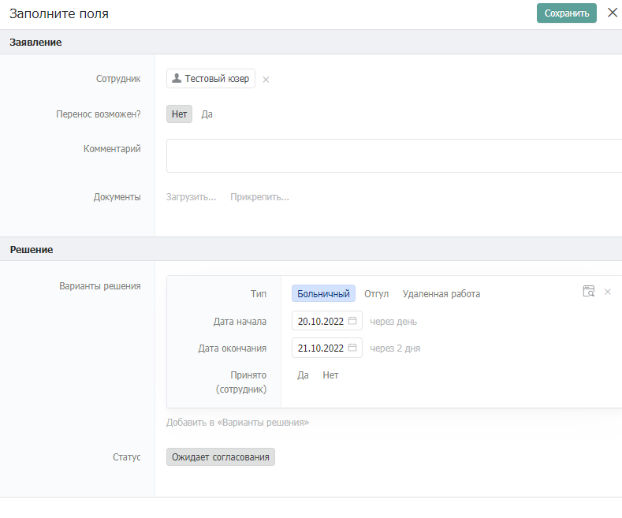<figcaption></figcaption></figure>

После создания заявки на больничный в каталоге «Согласования» создается дублирующая запись заявки, которую должен согласовать руководитель. Он может либо согласовать/отклонить больничный сразу, либо предложить свои корректировки по датам или типу больничного:

<figure>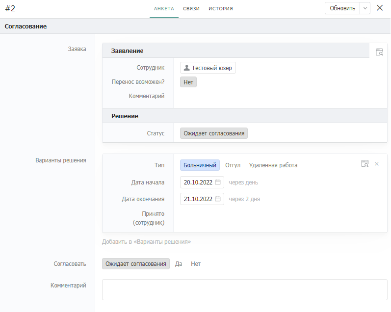<figcaption></figcaption></figure>

Если руководитель предложил правки, то процесс внесения правок повторяется (сотрудник также может вносить правки) до тех пор, пока руководитель не примет окончательное решение. Если руководителя устраивает заявка, то он переводит статус согласования в значение «Да» и заявка одобряется:

<figure>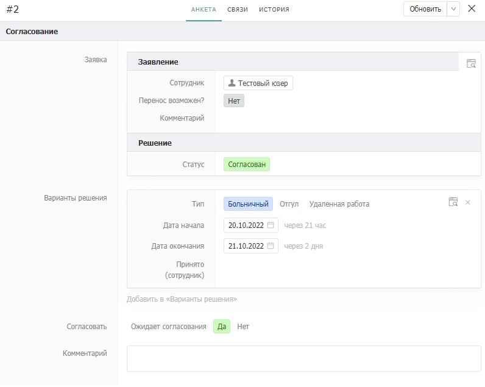<figcaption></figcaption></figure>

## **3. Принцип работы**

<figure>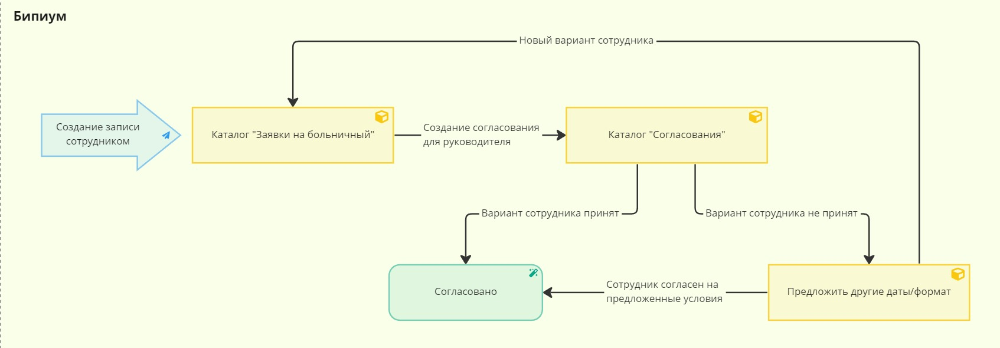<figcaption></figcaption></figure>

Сотрудник создает в каталоге «Заявки на больничный» запись с указанием желаемых сроков больничного и формат (отгул, работа из дома, больничный). После сохранения сценарий создает в каталоге «Согласования» запись для руководителя. Согласование происходит когда руководителя устраивает заявка сотрудника, либо сотрудник согласен с предложенными поправками.&#x20;

Руководитель может:

* Согласовать желаемый сотрудником формат больничного
* Предложить свои корректировки с учетом требований компании
* Фильтровать согласования по статусам (ожидают согласования, согласовано, не согласовано).

## **4. Реализация**

### **4.1. Структура каталогов**

#### **Каталог «Варианты решения»**

Создайте каталог «Варианты решения». Это служебный каталог, в котором не нужно работать напрямую. Записи этого каталога будут доступны из заявлений и согласований.

<figure>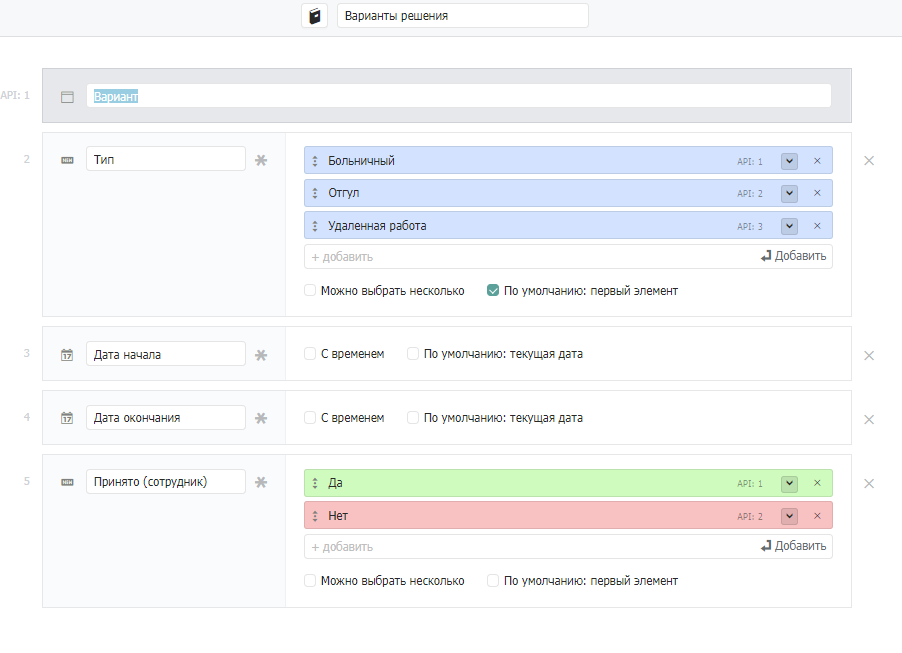<figcaption></figcaption></figure>

* **Тип** (Статус)\
  Описание: Предложенный сотрудником или руководителем формат.\
  Настройки: По умолчанию: первый элемент.
* **Дата начала** (Дата)\
  Описание: Дата начала больничного.
* **Дата окончания** (Дата)\
  Описание: Дата окончания больничного.
* **Принято** (сотрудник) (Статус)\
  Описание: Согласие сотрудника с предложенным вариантом.\
  Варианты: «Да», «Нет».

#### **Каталог «Заявки на больничный»**

Создайте каталог «Заявки на больничный». В каталоге будут содержаться заявки на больничные от сотрудников. В записи сотрудник указывает вариант больничного и статус возможности переноса. При необходимости загружает файлы для подтверждения и оставляет комментарий.

<figure>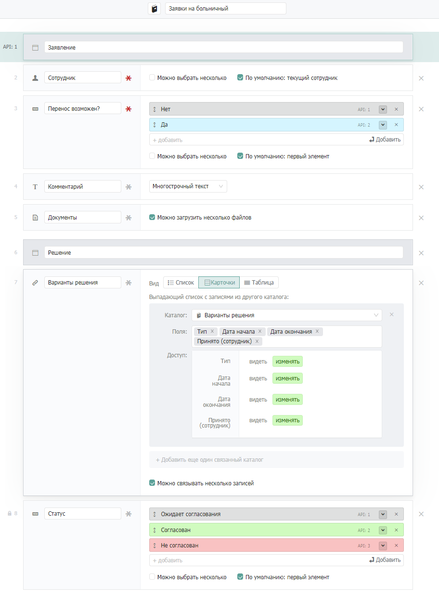<figcaption></figcaption></figure>

* **Сотрудник** (Сотрудник)\
  Описание: Сотрудник подавший заявление.\
  Настройки: По умолчанию: текущий сотрудник.
* **Перенос возможен?** (Статус)\
  Описание: Информация о возможности переноса.\
  Настройки: По умолчанию: первый элемент.
* **Комментарий** (Текст)\
  Описание: Комментарий сотрудника.\
  Настройки: Многострочный текст.
* **Документы** (Файл)\
  Описание: Файлы с подтверждением по необходимости.\
  Настройки: Можно загрузить несколько файлов.
* **Варианты решения** (Связанный каталог)\
  Описание: Предложенные сотрудником и работодателем варианты.\
  Настройки: Связь с каталогом «Варианты решения», можно связывать несколько записей, снимите галочку с «Можно выбирать из существующих», поставьте галочку на «Создание без всплывающего окна», добавьте к отображению расширенные поля (изменять): «Тип», «Дата начала», «Дата окончания», «Принято (сотрудник)».
* **Статус** (Статус)\
  Описание: Результат согласования больничного.\
  Настройки: По умолчанию: первый элемент, Редактируемое только через API.

Кроме указанных полей, вы можете добавить любые другие, если это необходимо.

#### **Каталог «Согласования»**

Создайте каталог «Согласования». В каталоге будут содержаться заявки на согласование больничного. Согласования будут создаваться системой с ссылкой на заявление сотрудника.

<figure>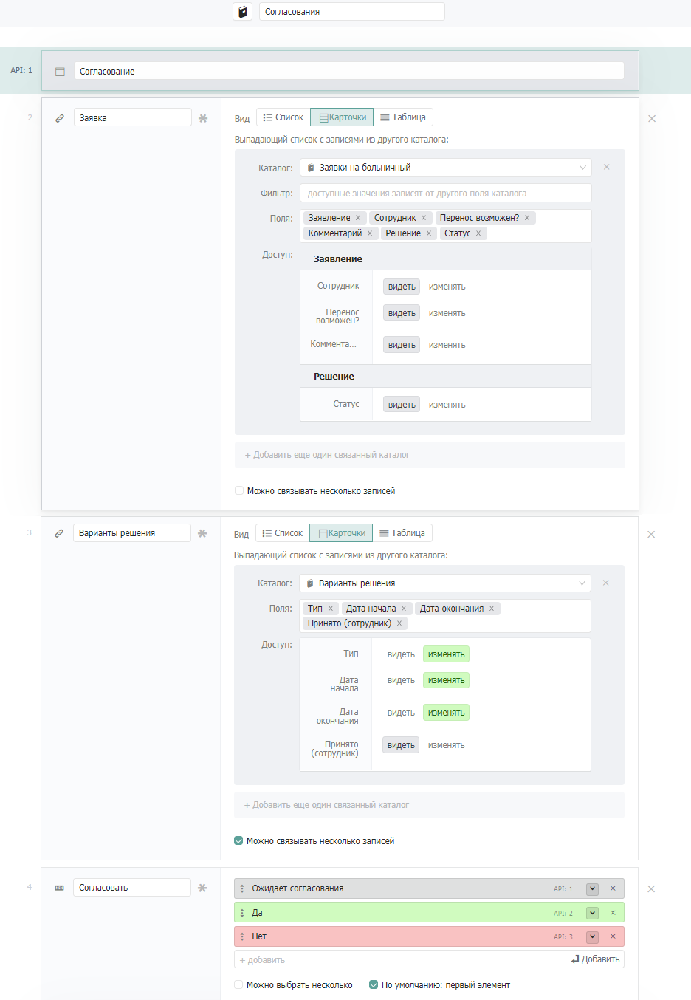<figcaption></figcaption></figure>

* **Заявка** (Связанный каталог)\
  Описание: Заявка которую необходимо согласовать.\
  Настройки: Редактируемое только через API.
* **Варианты решения** (Связанный каталог)\
  Описание: Связь с каталогом «Варианты решения».\
  Настройки: Связь с каталогом «Варианты решения», можно связывать несколько записей, снимите галочку с «Можно выбирать из существующих», поставьте галочку на «Создание без всплывающего окна», добавьте к отображению расширенные поля: «Тип» (изменять), «Дата начала» (изменять), «Дата окончания» (изменять), «Принято (сотрудник)» (видеть).
* **Согласовать** (Статус)\
  Описание: Решение руководителя сотрудника.\
  Настройки: По умолчанию: первый элемент.
* **Комментарий** (Текст)\
  Описание: Комментарий руководителя.\
  Настройки: Многострочный текст.

### **4.2. Создание автоматизаций**

#### **Автоматическое создание варианта**

В процессе создания заявки можно автоматизировать появление карточки с желаемыми условиями больничного (вариант решения). Для этого используется событие типа «Изменено поле во время редактирования», которое отслеживает автозаполняемое поле с сотрудником.

В системном каталоге «События» создайте новую запись и заполните ее следующим образом:

<figure>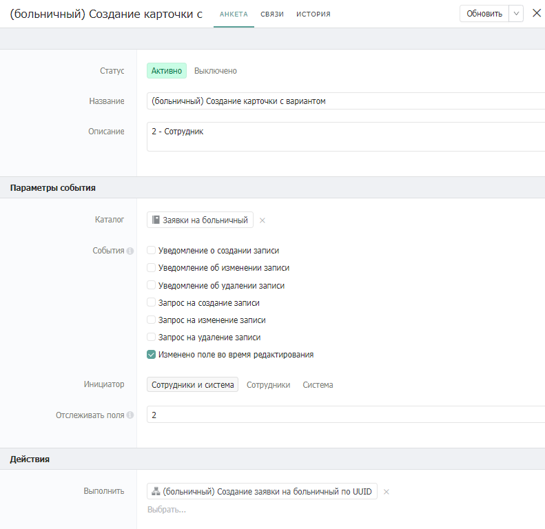<figcaption></figcaption></figure>

Это событие будет отслеживать автоматическое добавление сотрудника при создании записи. В качестве сценария загрузите [сценарий генерации карточки в каталоге «Заявки на больничный»](https://drive.google.com/file/d/1sAAN_NSXJsGqaGJ9RUZuQIh2kiSz_ckk/view?usp=sharing).

Сценарий выглядит следующим образом:

<figure>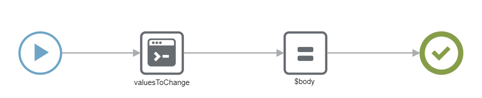<figcaption></figcaption></figure>

Сценарий выполняет:

* Создание варианта в блоке кода
* Передачу карточки варианта в заявление

В сценарии нужно изменить компоненты:

* «valuesToChange»: В возвращаемом значении передается id поля «Варианты решения» в каталоге «Заявки на больничный». Если порядок полей отличается нужно будет поменять id поля и catalogId на Ваш номер каталога «Варианты решения».

#### **Перенос варианта в согласование**

Эта автоматизация отслеживает создание/изменение заявки на больничный и синхронизирует ее с записью согласования руководителя. Если согласования нет — оно создается, если есть — изменяется в соответствии с заявкой.

В системном каталоге «События» создайте новую запись и заполните ее следующим образом:

<figure><figcaption></figcaption></figure>

При изменении поля с вариантами в заявках будет запущен сценарий. В качестве сценария загрузите [сценарий переноса варианта в запись каталога «Согласования»](https://drive.google.com/file/d/18GDbdqN2VRQVxvBRfMHn9Yr8HKTFiLJg/view?usp=sharing).

Сценарий выглядит следующим образом:

<figure>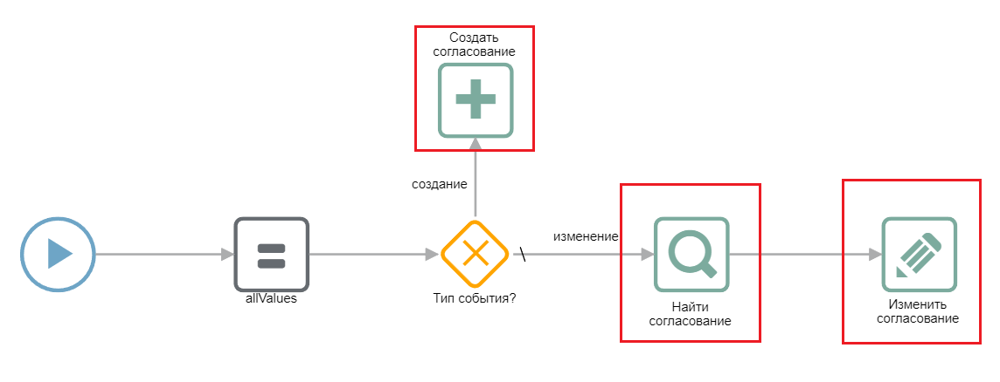<figcaption></figcaption></figure>

Сценарий выполняет:

* Создание записи в каталоге «Согласования» и переносит вариант сотрудника
* Переносит варианты при изменении

В сценарии нужно изменить выделенные компоненты. В описании компонента «Создать согласование» содержится дополнительная информация по id полей, которые нужно изменить.

#### **Перенос варианта в заявление**

В случае когда предложенный сотрудником вариант не подходит, руководитель может предложить сотруднику альтернативный. Это событие аналогично предыдущему событию, но работает в обратную сторону: при изменении записи согласования руководителем синхронизируется связанная запись заявки на больничный.

В системном каталоге «События» создайте новую запись и заполните ее следующим образом:

<figure>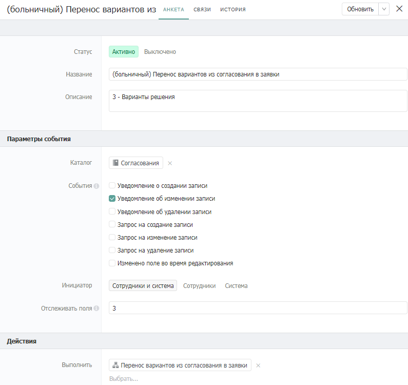<figcaption></figcaption></figure>

При изменении поля с вариантами в согласованиях будет запущен сценарий. В качестве сценария загрузите [сценарий переноса варианта в запись каталога «Заявки на больничный»](https://drive.google.com/file/d/1b0yscmUHdvEwQT4OF6UoYiqw0v3Njqog/view?usp=sharing).

Сценарий выглядит следующим образом:

<figure>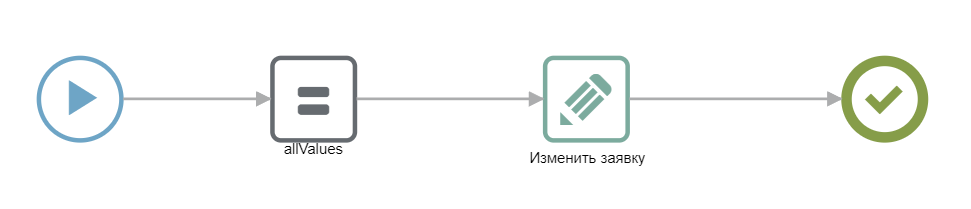<figcaption></figcaption></figure>

Сценарий выполняет:

* Перенос предложения руководителя в заявку сотрудника.

В сценарии нужно изменить компоненты:

* «Изменить заявку»: Измените id полей в компоненте согласно его описанию.

#### **Синхронизация статусов решения**

Когда руководителя и сотрудника устраивают даты и формат больничного происходит согласование. Последний сценарий переносит результат согласования в запись заявки.

В системном каталоге «События» создайте новую запись и заполните ее следующим образом:

<figure>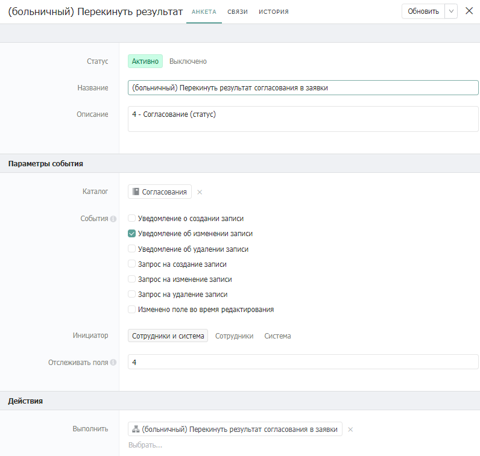<figcaption></figcaption></figure>

Событие будет отслеживать изменение статуса в согласовании. В качестве сценария загрузите [сценарий переноса статуса](https://drive.google.com/file/d/1VEssJXv4A407yrZ9eooPvDpA-DwT1Ok9/view?usp=sharing).

Сценарий выглядит следующим образом:

<figure><figcaption></figcaption></figure>

Сценарий выполняет:

* Переносит статус согласования руководителя в заявку.

В сценарии нужно изменить компоненты:

* «Изменить заявку»: Измените id полей в компоненте согласно его описанию.

## **5. Тестирование**

В каталоге «Заявки на больничный» создайте запись, например:

<figure><figcaption></figcaption></figure>

В каталоге «Согласования» появится новая запись:

<figure><figcaption></figcaption></figure>

При одобрении руководителя, заявка на больничный переходит в статус «Согласован»:

<figure><figcaption></figcaption></figure>
