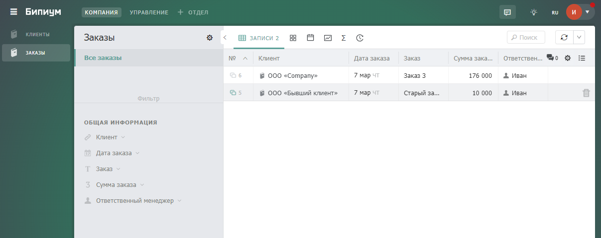

# Генерация документов в реальном времени

## 1. **Введение**

**Генерация документов в реальном времени** – способ запуска сценария генерации документа при непосредственной загрузке файла документа. Процесс генерации в реальном времени призван устранить необходимость использования технических статусов, событий и т.п., выступающих в качестве триггера для запуска сценария генерации документа. Генерация документа происходит непосредственно во время открытия файла.

Процесс генерации документов в реальном времени подходит только для генерации документов небольшого объема, так как процесс генерации завязан на механизме отправки данных во внешний запрос синхронным образом. Время работы синхронного процесса ограничено одной минутой, поэтому если работа вашего сценария по генерации документа занимает больше времени, то данный механизм не будет корректно работать. В этом случае необходимо использовать другие методы генерации, такие как служебные поля типа «Статус» или события на уведомление о создании/изменении записи.

## **2. Принцип работы**

При клике на файл с документом в необходимом каталоге запускается внешний запрос со сценарием генерации документа. После окончания процесса генерации документ сразу же загружается на устройство.

## **3. Реализация**

### **3.1. Привязка сценария генерации документа к внешнему запросу**

#### **3.1.1. Внешний запрос для запуска сценария генерации документа**

В системном каталоге «Внешние запросы» создайте новую запись и заполните ее следующим образом:

.png>)

В качестве сценария в поле «Выполнить» прикрепите ваш сценарий генерации документа.

#### **3.1.2. Редактирование сценария генерации документа**

В сценарий для формирования документа необходимо добавить следующие компоненты в начало и конец соответственно:

.png>)

Компонент «query» получает id каталога и записи, из которой сценарии получает данные для своей работы. id забираются из query-параметров адресной строки, по которой запускается внешний запрос. Процесс формирования адресной строки для внешнего запроса будет описан ниже. Компонент «query» необходимо заполнить следующим образом:

.png>)

Компонент «Получить необходимую запись» получает необходимую запись по ранее объявленным переменным «catalogId» и «recordId». Компонент «Получить необходимую запись» необходимо заполнить следующим образом:

.png>)

Компонент «values» переименовывает полученные значения полей из компонента «Получить необходимую запись» для минимизации процесса переписывания других компонентов сценария генерации отчета, получающих значения полей из одноименной переменной. Компонент «values» необходимо заполнить следующим образом:

.png>)

Важно учитывать, что если ваш сценарий генерации отчета ссылается на поля типа «prevValues» или же «allValues» получаемой записи, то необходимо переписать в сценарии все соответствующие переменные на «values».

В текущей версии Бипиума для генерации файла с отчетом могут использоваться два компонента: «Загрузить файл» и “Конвертировать документ». Пример заполнения обоих компонентов представлен ниже:

* **«Конвертировать документ»** \
  При использовании компонента «Конвертировать документ» для генерации файла с отчетом необходимо в поле «Сохранить как» секции «Результат» выбрать значение «URL в переменную», задать имя файла с расширением в поле «Имя файла» и переменную для сохранения ссылки на файл в поле «Сохранить URL файла в». Остальные поля генерации не меняются и остаются в том же виде, в котором они были до настройки сценария. Пример заполнения компонента представлен ниже:

.png>)

* **«Загрузить файл»** \
  ****При использовании компонента «Загрузить файл» для генерации файла с отчетом необходимо в поле «Сохранить как» секции «Результат» выбрать значение «Вернуть ID файла» и задать переменную для сохранения ссылки на файл в поле «Сохранить URL файла в». Остальные поля генерации не меняются и остаются в том же виде, в котором они были до настройки сценария. Пример заполнения компонента представлен ниже:

.png>)

Компонент «redirect» перенаправляет адрес внешнего запроса на сгенерированную ссылку из компонентов «Загрузить файл» или «Конвертировать документ». Перенаправление на адрес сгенерированного файла позволяет открыть документ сразу после окончания работы сценария. Заполнить компонент «redirect» необходимо следующим образом:

.png>)

На этом процесс редактирования сценария завершается.

### 3.2. Файл с адресом внешнего запроса

#### 3.2.1. Добавление поля с файлом в каталог

В том случае, если в необходимом каталоге нет поля, куда ваш сценарий генерировал отчет (например, если файл с отчетом записывался в другой каталог), то в этом каталоге необходимо создать поле с типом файл, куда впоследствие будет загружен файл отчета. Если сценарий, описанный ранее, генерировал файл в другое файловое поле, то необходимо настроить компоненты генерации файла в генерирование отчета в созданное поле.

#### **3.2.2. Событии на добавление файла в запись**

В системном каталоге «События» создайте новую запись и заполните ее следующим образом:

.png>)

В поле “Каталог» выберите каталог, с созданным ранее полем типа «файл». Назначением этого события является автоматическое проставление фиктивного файла с адресом ранее настроенного внешнего запроса, в котором хранится сценарий для генерации отчета. Настройка сценария, прикрепленного в созданном событии описана ниже.

#### **3.2.3. Сценарий генерации файла с адресом внешнего запроса**

В созданном выше событии необходимо добавить единственный компонент «Добавление файла с ссылкой на внешний запрос»:

.png>)

Настроить компонент необходимо следующим образом:

.png>)

В поле «Каталог» вместо «Ваш каталог с отчетом» выберите из списка каталог, в котором будет находиться файл с отчетом. В поле «Значения полей» вместо 159 введите id поля с файлом, а вместо «домен» - домен вашей системы на Бипиуме.

## **4. Тестирование**

### **4.1. Создание каталогов**

В системе создайте каталоги «Каталог для тестов отчета на лету» и «Шаблоны отчетов» и заполните их следующим образом:

**«Каталог для тестов отчета на лету»**

.png>)

* **ФИО (Текст)**\
  Описание: Содержит ФИО человека.\
  Настройки: Обязательное поле.
* **Возраст (Число)**\
  ****Описание: Содержит возраст человека.\
  Настройки: Обязательное поле.
* **Увлечения (Многострочный текст)**\
  ****Описание: Содержит набор увлечений человека.\
  Настройки: Обязательное поле.
* **Отчет (Файл)**\
  ****Описание: Содержит файл отчета.\
  Настройки: Редактируемое только через API.

**«Шаблоны отчетов»**

.png>)

* **Наименование отчета (Текст)**\
  ****Описание: Содержит название отчета.\
  Настройки: Обязательное поле.
* **Шаблон (Файл)**\
  ****Описание: Содержит файл с шаблоном отчета.\
  Настройки: Обязательное поле.

### **4.2. Создание сценариев**

В системном каталоге «Сценарии» создайте новую запись и заполните ее следующим образом:

.png>)

В качестве сценария приложите [следующий файл](https://drive.google.com/file/d/1QvHWB-thA9N14hmfAYlT9AWK7-N7jlK4/view?usp=sharing). Отредактируйте выделенный компонент сценария согласно описанию внутри него:

.png>)

Создайте ещё одну запись в каталоге «Сценарии» и заполните ее следующим образом:

.png>)

В качестве сценария приложите [следующий файл](https://drive.google.com/file/d/1dWLo1rBNNL7YTfnqhaJ-6Wd94xNK9\_XX/view?usp=sharing). Отредактируйте выделенный компонент сценария согласно описанию внутри него:

.png>)

### **4.3. Создание записей**

#### **4.3.1. Событие на создание файла с отчетом**

В системном каталоге «События» создайте новую запись и заполните ее следующим образом:

.png>)

В качестве сценария выберите созданный ранее сценарий с наименованием «Сценарий: заполнение в карточке записи поля с файлом».

#### **4.3.2. Внешний запрос генерации отчета**

В системном каталоге «Внешние запросы» создайте новую запись и заполните ее следующим образом:

.png>)

В качестве сценария выберите созданный ранее сценарий с наименованием «Сценарий генерации отчета».

#### **4.3.3. Каталог «Шаблоны отчетов»**

Создайте в каталоге новую запись. Прикрепите в поле «Шаблон» [следующий файл](https://docs.google.com/document/d/1LTQZ95BdoOBKnpAfUXjASfSsxRHafhO4/edit?usp=sharing\&ouid=114574548545438103624\&rtpof=true\&sd=true). Пример заполнения записи:

.png>)

#### **4.3.4. Каталог «Каталог для тестов отчета на лету»**

Создайте в каталоге новую запись и заполните все обязательные поля. Файл в поле документ появится автоматически после сохранения записи. Пример заполнения записи:

#### **4.3.5. Результат генерации**

В заполненной записи в каталоге **«**Каталог для тестов отчета на лету» кликните на сгенерированный документ. При клике на документ запускается сценарий генерации отчета. После окончания работы сценария файл отчета будет загружен на ваше устройство. Пример сгенерированного файла представлен ниже:

.png>)

****
