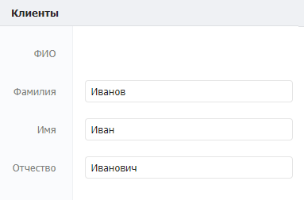

# Генерация полных наименований в каталогах

## **1. Принцип работы**

При сохранении или изменении записи в каталоге запускается сценарий, который собирает значения полей, объединяет их и записывает в одно нередактируемое поле той же записи.

## **2.**Реализация&#x20;

### 2.1. Настройка структуры каталога «Клиенты»&#x20;

Создайте каталог «Клиенты», данный каталог является справочником всех клиентов в системе. При создании каталога нужно добавить и настроить поля следующим образом:

* **ФИО (текст)**\
  ****Описание: хранит ФИО клиента.\
  Настройка: редактируемое только через API.
* **Фамилия (текст)**\
  ****Описание: хранит фамилию клиента.
* **Имя (текст)**\
  ****Описание: хранит имя клиента.
* **Отчество (текст)**\
  **Описание: хранит отчество клиента.**

### 2.2. Настройка автоматизации&#x20;

#### 2.2.1. Создание и настройка события&#x20;

Для создания события нужно зайти в каталог «События» (обычно он находится в отделе Управление). Нажать кнопку Добавить и заполнить карточку события как указано на скриншоте ниже.

#### 2.2.2. Создание записи сценария&#x20;

Создайте сценарий в каталоге «Сценарии». Данный сценарий предназначен для импорта данных из Excel файла в каталог «Клиенты». При создании записи сценария прикрепите к нему [следующий файл](https://drive.google.com/file/d/14y8leVo3nrFUZuvBPH3X7POs8L1M-VD0/view?usp=sharing), нажав на кнопку «Загрузить…»:

#### 2.2.3. Настройка файла сценария

Откройте файл сценария в поле «Сценарий» и отредактируйте следующие компоненты, согласно комментариям внутри них:&#x20;

**Компонент «Записать ФИО».**

Внесите в компонент следующие изменения:

* **Каталог:** Укажите название каталога в который должны импортироваться данные**.**
* **Значения полей:** Замените API из каталога в который нужно записать данные.
* **Значения полей:** Замените API из каталога из которого должны браться данные для объединения.

## **3. Тестирование**

### **3.1. Каталог «Импорт данных»**

Запишите новую запись в каталоге и заполните ее следующим образом:

### **3.2. Результат**

.png>)
