# Генерация счет-фактуры

## 1. Введение

В Бипиуме вы можете автоматически генерировать счет-фактуры согласно заданному шаблону. Автоматическая генерация избавляет от ручной работы и снижает вероятность возникновения опечаток.

## 2. Принцип работы

При нажатии на кнопку «Сгенерировать» в каталоге «Заявки» запускается сценарий генерации счет-фактуры. Сценарий собирает данные о покупателе и выбранных позициях и генерирует счет-фактуры из заданного шаблона.

## 3. **Реализация**

### 3.1. **Настройка структуры данных**

#### **Каталог «Клиенты»**

Создайте каталог «Клиенты». В этом каталоге будут собраны все клиенты, с которыми вы взаимодействуете. Заполните каталог следующим образом:

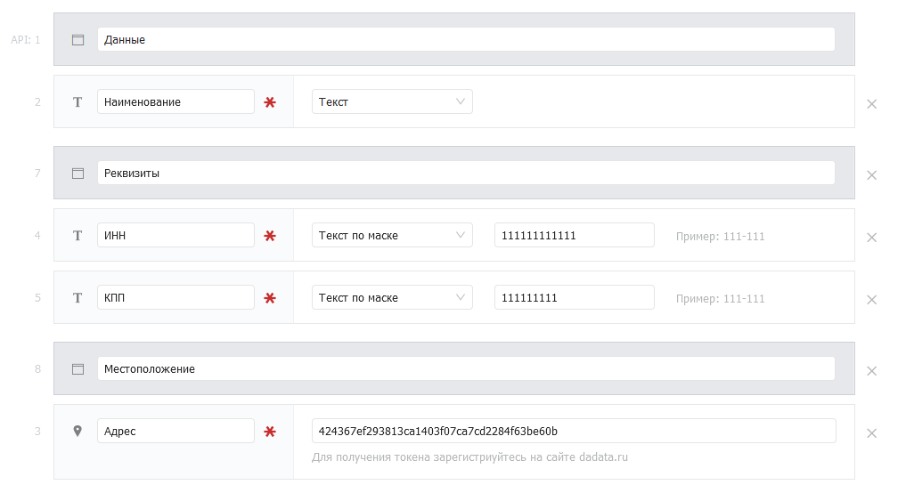

* **Наименование** (текст).\
  _Описание_: Наименование покупателя, например ФИО.\
  _Настройки_: Обязательное поле.
* **ИНН** (текст по маске).\
  _Описание_: ИНН клиента в формате 12 цифр.\
  _Настройки_: Обязательное поле, маска ввода — 111111111111.
* **КПП** (текст по маске).\
  _Описание_: КПП клиента в формате 9 цифр.\
  _Настройки_: Обязательное поле, маска ввода - 111111111.
* **Адрес** (Адрес).\
  _Описание_: Адрес клиента.\
  _Настройки_: Обязательное поле, введите в поле [токен сервиса «dadata.ru»](https://docs.bpium.ru/integrations/integration/cases/integraciya-s-servisom-dadata#2.1.-poluchenie-tokena-servisa-dadata.ru).

#### **Каталог «Типы товаров»**

Создайте каталог «Типы товаров». В этом каталоге будут собраны все ваши товары. Заполните каталог следующим образом:

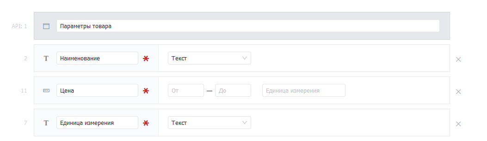

* **Наименование** (текст)**.**\
  _Описание_: Наименование товара.\
  _Настройки_: Обязательное поле.
* **Цена** (число).\
  _Описание_: Цену товара за его единицу.\
  _Настройки_: Обязательное поле.
* **Единица измерения** (текст).\
  _Описание_: Единица измерения товара \
  (например, шт., кг., л. и так далее).\
  _Настройки_: Обязательное поле.

#### **Каталог «Позиции»**

Создайте каталог «Позиции». Это связующий каталог, содержащий покупателя, товар и количество товара. Заполните каталог следующим образом:

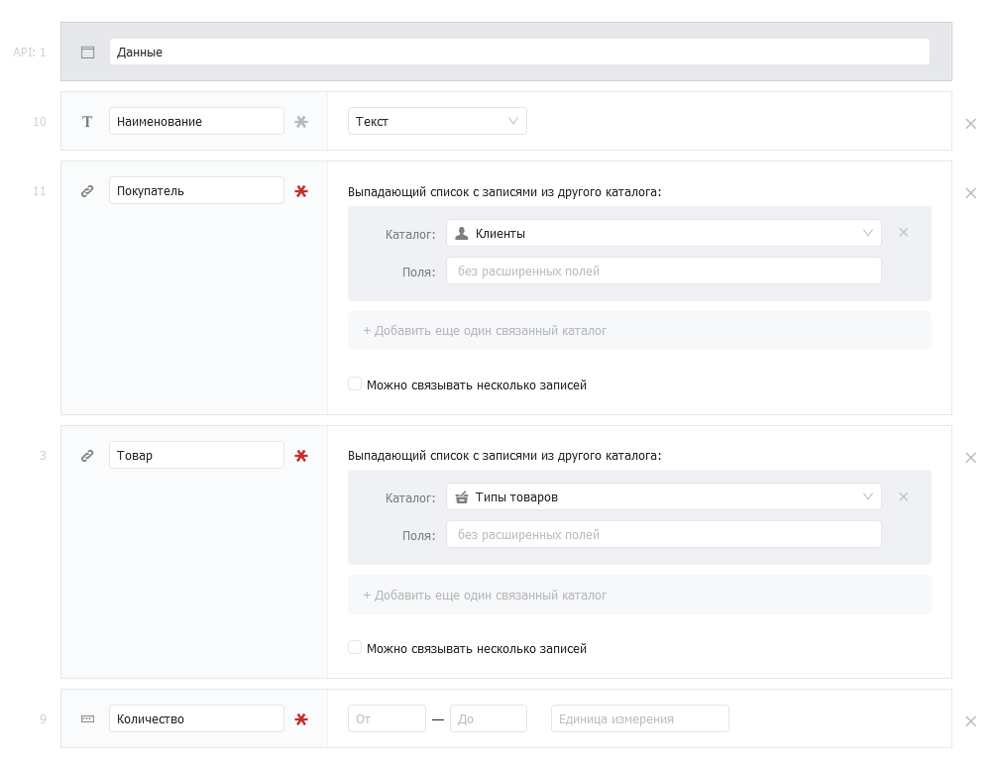

* **Наименование** (текст).\
  _Описание_: Наименование позиции для быстрого поиска.
* **Покупатель** (связанный каталог).\
  _Описание_: Клиент, оформляющий позицию.\
  _Настройки_: Связь с каталогом «Клиенты», обязательное поле.
* **Товар** (связанный каталог).\
  _Описание_: Товар в позиции.\
  _Настройки_: Связь с каталогом «Товары», обязательное поле.
* **Количество** (число).\
  _Описание_: Количество товара в позиции.\
  _Настройки_: Обязательное поле.

#### **Каталог «Заявки»**

Создайте каталог «Заявки». В этом каталоге собраны позиции покупателя. Заполните каталог следующим образом:

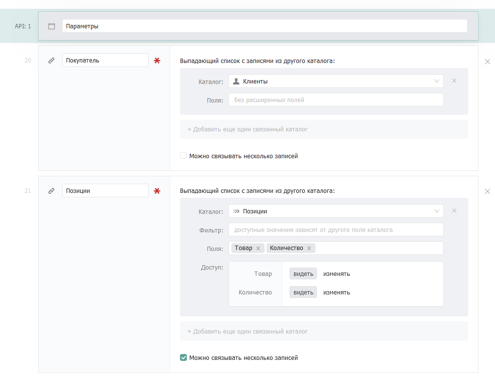

* **Покупатель** (связанный каталог)**.**\
  _Описание_: Клиент, оформляющий заявку.\
  _Настройки_: Обязательное поле.
* **Позиции** (связанный каталог).\
  _Описание_: Позиции заявки.\
  _Настройки_: Обязательное поле, «Можно связывать несколько записей».

.png>)

* **Ответственный** (сотрудник).\
  _Описание_: Ответственный за заявку сотрудник.\
  _Настройки_: «По умолчанию: текущий сотрудник».
* **Сгенерировать счет-фактуры** (статус).\
  _Описание_: Запускает сценарий генерации счет-фактуры.\
  _Настройки_: Добавьте одно значение и назовите его «Сгенерировать».
* **Счет-фактура** (файл).\
  _Описание_: Сгенерированный .docx-документ счет-фактуры.\
  _Настройки_: «Редактируемое только через API».

#### &#x20;**Каталог «Типы отчетов»**

Создайте каталог «Типы отчетов». В этом каталоге будут собраны шаблоны отчетов. Заполните его следующим образом:

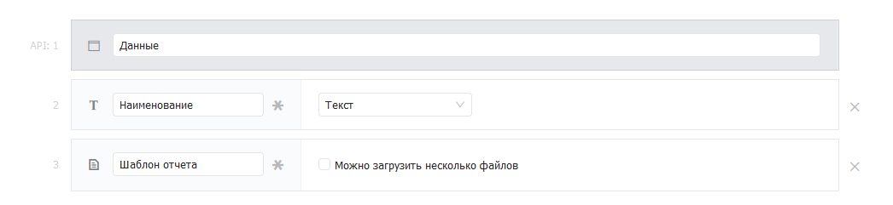

* **Наименование** (текст)**.**\
  _Описание_: Хранит наименование отчета.
* **Шаблон отчета** (файл).\
  _Описание_: Хранит шаблон отчета, для подстановки в него данных по отчету**.**

#### **Формирование шаблона счет-фактуры**

Вы можете сформировать свой шаблон счет-фактуры в формате .docx или загрузить готовый [файл шаблона](https://docs.google.com/document/d/1J2iMenYdScbtE9pmN\_R\_exU88gXqRV3F/edit?usp=sharing\&ouid=111627820568305603912\&rtpof=true\&sd=true). Готовый шаблон выглядит следующим образом:

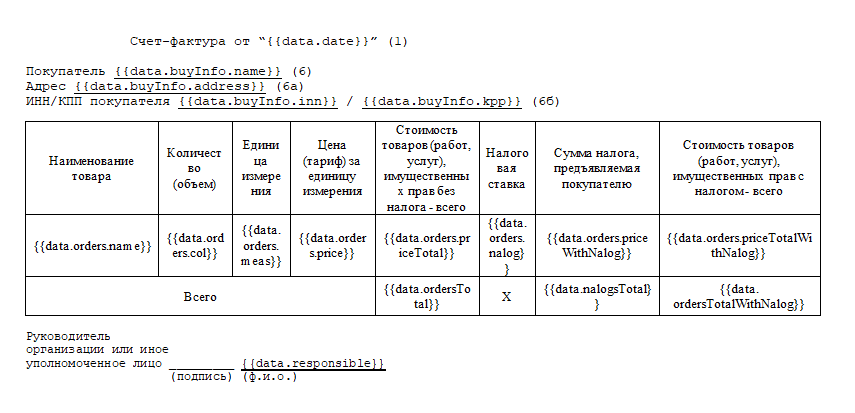

Встраиваемые в отчет значения записываются в обрамляющих фигурных скобках, например \{{value\}}. После обработки сценария на место \{{value\}} будет записана сценарная переменная с тем же именем.

#### **Описание сценарных переменных в шаблоне**

* \{{data.date\}} — дата формирования счета-фактуры. По умолчанию: текущая дата.
* \{{data.buyInfo.address\}} — адрес покупателя из каталога «Клиенты».\{{data.buyInfo.address\}} - адрес покупателя из каталога «Клиенты».
* \{{data.buyInfo.inn\}} — ИНН покупателя из каталога «Клиенты».\{{data.buyInfo.inn\}} — ИНН покупателя из каталога «Клиенты».
* \{{data.buyInfo.kpp\}} — КПП покупателя из каталога «Клиенты».
* \{{data.orders.name\}} — наименование товара из каталога «Типы товаров».
* \{{data.orders.col\}} — количество товара из каталога «Позиции».
* \{{data.orders.price\}} — цена за единицу товара из каталога «Типы товаров».
* \{{data.orders.priceTotal\}} — полная стоимость за все количество товаров. Считается по формуле: цена за единицу товара \* количество товара.
* \{{data.orders.nalog\}} — налоговая ставка на единицу товара, задается в коде. По умолчанию: 20.
* \{{data.orders.priceWithNalog\}} — цена за единицу товара с учетом налоговой ставки. Считается по формуле: цена за товар \* ((100 + налоговая ставка) / 100).
* \{{data.orders.priceTotalWithNalog\}} — полная стоимость за все количество товаров с учетом налоговой ставки. Считается по формуле: цена за единицу товара с учетом налоговой ставки \* количество товара.
* \{{data.ordersTotal\}} — сумма по всем полным стоимостям всех товаров.
* \{{data.nalogsTotal\}} — сумма по всем ценам за единицу товара с учетом налоговой ставки.
* \{{data.ordersTotalWithNalog\}} — сумма по всем полным стоимостям товара с учетом налоговой ставки.
* \{{data.responsible\}} — ответственное за заявку лицо из каталога «Заявки».

#### **Создание записи в каталоге «Типы отчетов»**

Создайте запись в каталоге «Типы отчетов» и прикрепите к ней шаблон счет-фактуры:

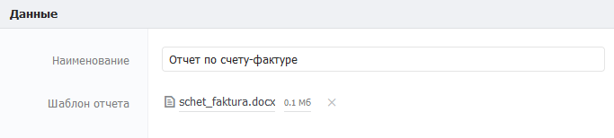

### **3.2. Настройка автоматизации**

#### **Создание и настройка события**

В системном каталоге «События» создайте новую запись и заполните её следующим образом:

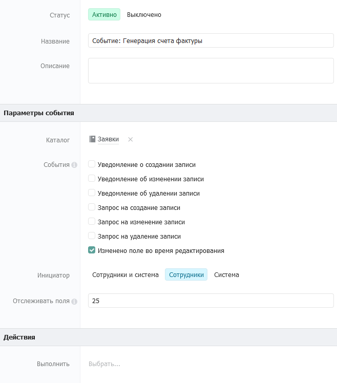

В поле «Отслеживать поля» впишите ID поля «Сгенерировать счет-фактуру» из каталога «Заявки».

#### **Сценарий генерации счет-фактруы**

Создайте сценарий в каталоге «Сценарии». Сценарий предназначен для генерации отчета счет-фактуры. При создании записи сценария прикрепите к нему [следующий файл](https://drive.google.com/file/d/1sHDwFS0wh2mUF4p0oe2ZBtxjVAffsXJq/view?usp=sharing), нажав на кнопку «Загрузить…»:

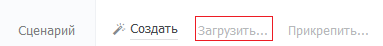

Прикрепите сценарий к записи ранее созданного события.

#### **Настройка сценария**

Откройте файл сценария в поле «Сценарий» и отредактируйте следующие компоненты, согласно комментариям внутри них:

* Условная стрелка к компоненту «Не заполнены необходимые поля». Замените следующие API ID, указанные в одинарных кавычках стрелки: 20 - API ID поля «Покупатель» в каталоге «Заявки». 21 - API ID поля «Позиции» в каталоге «Заявки».
* Компонент «Получение данных покупателя».
* Компонент «Получение всех заказчиков».
* Компонент «Собрать нужные данные в jsonы & i по заказам».
* Компонент «Получить запись заказа».
* Компонент «Пуш заказа в массив отформатированных заказов».
* Компонент «Все в data».
* Компонент «Генерация счета-фактуры».

Компоненты сценария, в которые нужно внести изменения:

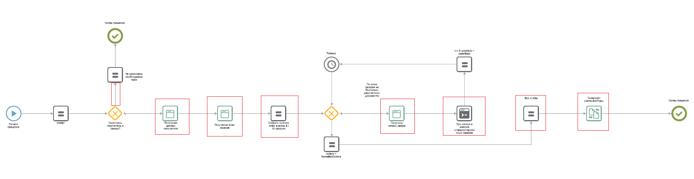

## **4.** Тестирование

Создайте запись в каталоге «Клиенты». Пример заполнения:

#### **Каталог «Типы товаров»**

Создайте одну или несколько записей в каталоге «Типы товаров». Пример заполнения:

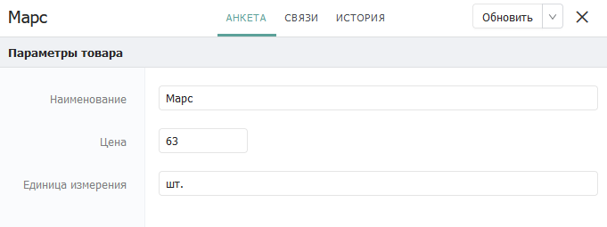

**Каталог «Позиции»**

Создайте одну или несколько записей в каталоге «Позиции». Пример заполнения:

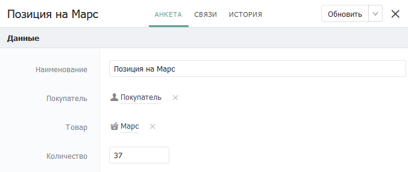

**Каталог «Заявки»**

Создайте запись в каталоге «Заявки». Пример заполнения:

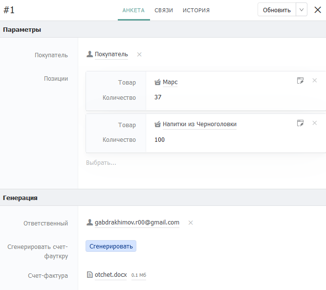

**Примечание**: Поле «Счет-фактура» нередактируемое и заполняется сгенерированным файлом счет-фактуры.

## **5. Генерация счет-фактуры**

После создания всех записей в каталогах, перейдите в заполненную запись каталога «Заявки» и нажмите на статус-кнопку «Сгенерировать». После окончания процесса  генерации, сохраните запись и откройте сгенерированный файл отчета. Пример данных в сгенерированном .docx файле:

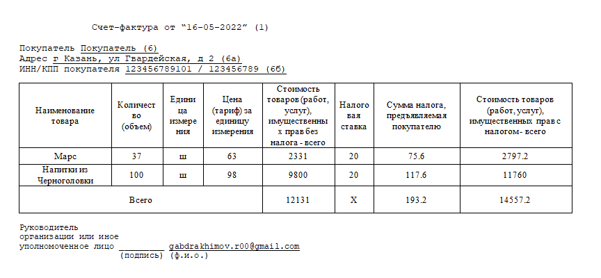
