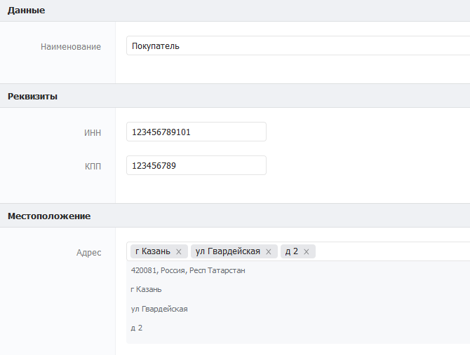

# Генерация счет-фактуры

## 1. Принцип работы

При нажатии на кнопку «Сгенерировать» в каталоге «Заявки» запускается сценарий «Сценарий генерации счета-фактуры». Сценарий собирает данные о покупателе и выбранных позициях из соответствующих полей в карточке и генерирует счет-фактуры из шаблона, находящегося в каталоге «Типы отчетов».

## 2. **Реализация**

### 2.1. **Настройка структуры данных**

#### **2.1.1. Настройка каталога «Клиенты»**

Создайте каталог «Клиенты», данный каталог является справочников всех покупателей в системе. При создании каталога нужно добавить и настроить поля следующим образом:

* **Наименование** (текст).\
  ****Описание: Хранит наименование покупателя.\
  Настройки: Обязательное поле.
* **ИНН** (текст по маске).\
  Описание: В данном поле хранится ИНН покупателя в формате 12 цифр.\
  Настройки: Обязательное поле, маска ввода — 111111111111.
* **КПП** (текст по маске).\
  ****Описание: В данном поле хранится КПП покупателя в формате 9 цифр.\
  Настройки: Обязательное поле, маска ввода - 111111111.
* **Адрес** (Адрес).\
  Описание: Хранит фактическое местоположение покупателя.\
  Настройки: Обязательное поле, в поле необходимо ввести токен сервиса «dadata.ru».

#### **2.1.2 Настройка каталога «Типы товаров»**

Создайте каталог «Типы товаров». В данном каталоге хранится информация о всех товарах в системе. Заполните каталог следующими полями:

* **Наименование** (текст)**.**\
  ****Описание: В данном поле хранится наименование товара.\
  Настройки: Обязательное поле.
* **Цена** (число).\
  Описание: Хранит цену товара за его единицу.\
  Настройки: Обязательное поле.
* **Единица измерения** (текст).\
  Описание: В данном поле указывается единица измерения товара \
  (например, шт., кг., л. и так далее).\
  Настройки: Обязательное поле.

#### 2.1.3. **Настройка каталога «Позиции»**

Создайте каталог «Позиции». Данный каталог является связующим и хранит данные о покупателе, покупаемом товаре и его количестве. Настройте поля каталога следующим образом:

* **Наименование** (текст).\
  ****Описание: Хранит наименование позиции, как идентификатор для быстрого служебного поиска.
* **Покупатель** (связанный каталог).\
  Описание: Данное поле является связанным с каталогом «Клиенты» и служит для определения покупателя товара.\
  Настройки: Обязательное поле.
* **Товар** (связанный каталог).\
  Описание: Данное поле является связанным с каталогом «Типы товаров». Необходимо для определения покупаемого товара в позиции.\
  Настройки: Обязательное поле.
* **Количество** (число).\
  Описание: Поле характеризующее число покупаемых единиц товара.\
  Настройки: Обязательное поле.

#### 2.1.4. **Настройка каталога «Заявки»**

Создайте каталог «Заявки». Данный каталог необходим для сбора данных о покупателе и его позициях и формирования счета-фактуры. Наполните каталог следующими данными:

* **Покупатель** (связанный каталог)**.**\
  ****Описание: Данное поле является связанным с каталогом «Клиенты». Используется для определения покупателя.\
  Настройки: Обязательное поле.
* **Позиции** (связанный каталог).\
  Описание: Данное поле является связанным с каталогом «Позиции». Используется для определения перечня товаров и их количества покупателя.\
  Настройки: Обязательное поле, галочка напротив «Можно связывать несколько записей».

.png>)

* **Ответственный** (сотрудник).\
  Описание: Необходимо для фиксирования ответственного за заявку сотрудника.\
  Настройки: Поставьте галочку напротив «По умолчанию: текущий сотрудник».
* **Сгенерировать счет-фактуры** (статус).\
  Описание: Поле необходимо для запуска сценария генерации счета-фактуры.\
  Настройки: Добавьте внутри статуса одно поле и назовите его «Сгенерировать».
* **Счет-фактура** (файл).\
  Описание: Хранит в себе .docx файл счета-фактуры, сгенерированный сценарием после нажатия на кнопку «Сгенерировать» в предыдущем поле.\
  Настройки: Поставьте галочку напротив «Редактируемое только через API».

#### 2.1.5. **Настройка каталога «Типы отчетов»**

Создайте каталог «Типы отчетов». Заполните его следующими полями:

* **Наименование** (текст)**.**\
  ****Описание: Хранит наименование отчета.
* **Шаблон отчета** (файл).\
  Описание: Хранит шаблон отчета, для подстановки в него данных по отчету**.**

#### **2.1.6. Формирование шаблона счета-фактуры**

Вы можете самостоятельно сформировать собственный шаблон счета-фактуры в формате .docx или загрузить [файл шаблона](https://docs.google.com/document/d/1J2iMenYdScbtE9pmN\_R\_exU88gXqRV3F/edit?usp=sharing\&ouid=111627820568305603912\&rtpof=true\&sd=true). Файл шаблона счета-фактуры выглядит следующим образом:

Все встраиваемые в отчет значения записываются в обрамляющих фигурных скобках, например \{{value\}}. После обработки сценария на место \{{value\}} будет записана сценарная переменная с тем же именем.

#### **2.1.7.  Описание сценарных переменных в шаблоне**

* \{{data.date\}} — дата формирования счета-фактуры. По умолчанию: текущая дата.
* \{{data.buyInfo.address\}} — адрес покупателя из каталога «Клиенты».\{{data.buyInfo.address\}} - адрес покупателя из каталога «Клиенты».
* \{{data.buyInfo.inn\}} — ИНН покупателя из каталога «Клиенты».\{{data.buyInfo.inn\}} — ИНН покупателя из каталога «Клиенты».
* \{{data.buyInfo.kpp\}} — КПП покупателя из каталога «Клиенты».
* \{{data.orders.name\}} — наименование товара из каталога «Типы товаров».
* \{{data.orders.col\}} — количество товара из каталога «Позиции».
* \{{data.orders.price\}} — цена за единицу товара из каталога «Типы товаров».
* \{{data.orders.priceTotal\}} — полная стоимость за все количество товаров. Считается по формуле: цена за единицу товара \* количество товара.
* \{{data.orders.nalog\}} — налоговая ставка на единицу товара, задается в коде. По умолчанию: 20.
* \{{data.orders.priceWithNalog\}} — цена за единицу товара с учетом налоговой ставки. Считается по формуле: цена за товар \* ((100 + налоговая ставка) / 100).
* \{{data.orders.priceTotalWithNalog\}} — полная стоимость за все количество товаров с учетом налоговой ставки. Считается по формуле: цена за единицу товара с учетом налоговой ставки \* количество товара.
* \{{data.ordersTotal\}} — сумма по всем полным стоимостям всех товаров.
* \{{data.nalogsTotal\}} — сумма по всем ценам за единицу товара с учетом налоговой ставки.
* \{{data.ordersTotalWithNalog\}} — сумма по всем полным стоимостям товара с учетом налоговой ставки.
* \{{data.responsible\}} — ответственное за заявку лицо из каталога «Заявки».

#### **2.1.8. Создание записи в каталоге «Типы отчетов»**

Добавьте в каталог «Типы отчетов» запись и заполните её следующими данными:

В поле «Шаблон отчета» загрузите файл шаблона счета-фактуры.

### **2.2. Настройка автоматизации**

#### **2.1.2. Создание и настройка события**

Для создания события нужно зайти в каталог «События» (обычно он находится в отделе Управление). Нажать кнопку Добавить и заполнить карточку события как указано на скриншоте ниже.

В поле «Отслеживать поля» впишите ID поля “Сгенерировать счет-фактуру” из каталога «Заявки».

#### **2.1.3. Создание записи сценария**

Создайте сценарий в каталоге «Сценарии». Данный сценарий предназначен для генерации отчета счет-фактуры. При создании записи сценария прикрепите к нему следующий файл, нажав на кнопку «Загрузить…»:

#### **2.1.4. Настройка файла сценария**

Откройте файл сценария в поле «Сценарий» и отредактируйте следующие компоненты, согласно комментариям внутри них:

* Условная стрелка к компоненту «Не заполнены необходимые поля». Замените следующие API ID, указанные в одинарных кавычках стрелки: 20 - API ID поля «Покупатель» в каталоге «Заявки». 21 - API ID поля «Позиции» в каталоге «Заявки».
* Компонент «Получение данных покупателя».
* Компонент «Получение всех заказчиков».
* Компонент «Собрать нужные данные в jsonы & i по заказам».
* Компонент «Получить запись заказа».
* Компонент «Пуш заказа в массив отформатированных заказов».
* Компонент «Все в data».
* Компонент «Генерация счета-фактуры».

Компоненты сценария, в которые нужно внести изменения:

## **3.** Тестирование

Создайте запись в каталоге «Клиенты» и заполните её данными. Пример заполнения представлен на скриншоте ниже:

#### **3.1. Каталог «Типы товаров»**

Создайте одну или несколько записей в каталоге «Типы товаров» и заполните их данными. Пример заполнения представлен на скриншоте ниже:

**3.2. Каталог «Позиции»**

Создайте одну или несколько записей в каталоге «Позиции» и заполните их данными. Пример заполнения представлен на скриншоте ниже:

**3.3. Каталог «Заявки»**

Создайте запись в каталоге «Заявки» и заполните её данными. Пример заполнения представлен на скриншоте ниже:

Примечание: Поле «Счет-фактура» нередактируемое и заполняется файлом сгенерированным файлом счета-фактуры после запуска процесса генерации.

## **4. Генерация счет-фактуры**

После создания всех записей в каталогах, перейдите в заполненную запись каталога «Заявки» и нажмите на статус-кнопку «Сгенерировать». После окончания процесса  генерации, сохраните запись и откройте сгенерированный файл отчета. Пример данных в сгенерированном .docx файле:

