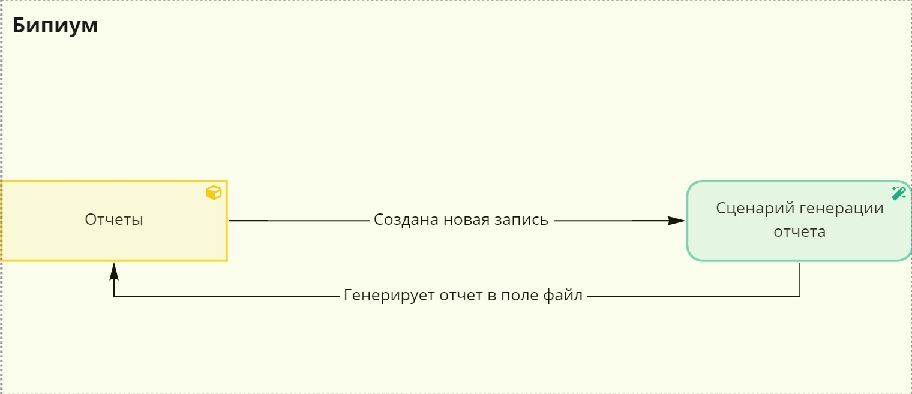
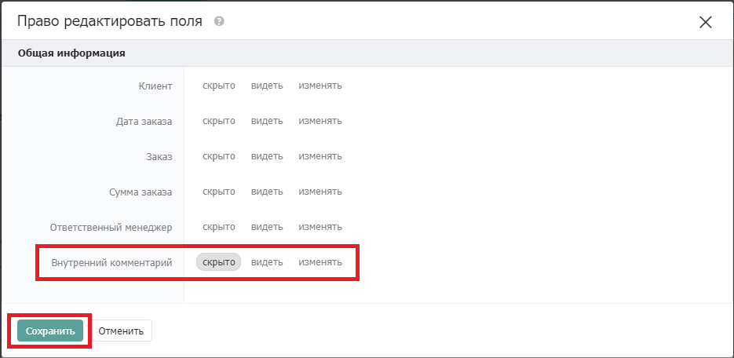
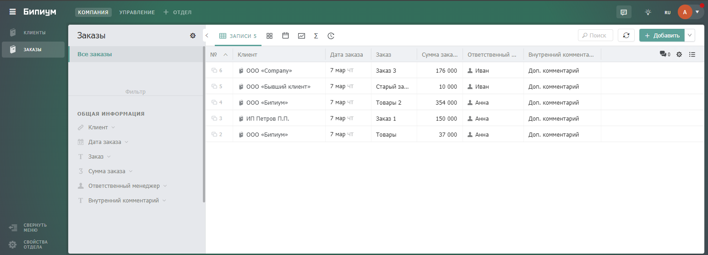

# Генерация excel-отчетов

## 1. Введение

**Генерация отчетов** — это сервис, который позволяет автоматизировать формирование отчетов по указанному алгоритму и с учетом указанных фильтров.

## 2. Принцип работы

При создании новой записи в каталоге **«Отчеты»** запускается **«Сценарий генерации отчета».** Далее сценарий собирает данные по заранее заложенному алгоритму и с учетом указанных фильтров**,** из получившихся данных формируется отчет по заранее заданному шаблону и сохраняется в поле файл карточки отчета в каталоге **«Отчеты»**.

## 3. Реализация

### 3.1. Настройка структуры данных

#### 3.1.1. Создание и настройка каталога «Отчеты»

Создайте каталог **«Отчеты»**. Данный каталог является «хранилищем» сгенерированных отчетов, именно здесь они будут храниться. При создании каталога нужно добавить и настроить поля следующим образом:

.png>)

* **Типы отчетов** (связанный каталог).\
  _Описание:_ Данный каталог является «справочником», в котором содержатся все типы шаблонов.
* **Компании** (связанный каталог).\
  _Описание:_ Данный каталог является «справочником», в котором содержатся все компании.

.png>)

 (1) (1).png>)

* **Услуга** (связанный каталог).\
  _Описание:_ Данный каталог является «справочником», в котором содержатся все типы услуг.
* **Статус формирования** (статус).\
  _Описание:_ Отражает на какой стадии сейчас находится генерация.
* **Описание ошибки** (текст).\
  _Описание:_ Описывает ошибку.
* **Файл** (файл).\
  _Описание:_ В данном поле будет хранится сгенерированный отчет.

#### 3.1.2. Создание и настройка каталога «Типы отчетов»

Создайте каталог **«Типы отчетов»**. Данный каталог предназначен для хранения шаблонов отчетов. При создании каталога нужно добавить и настроить поля следующим образом:

.png>)

* **Название** (текст).\
  _Описание:_ Название для типа отчета.
* **Шаблон** (файл).\
  _Описание:_ В данном поле указывается шаблон для генерации отчета.

#### 3.1.3. Создание и настройка каталога «Компании»

Создайте каталог **«Компании»**. Данный каталог предназначен для хранения данных о компаниях, которым мы оказываем услуги. При создании каталога нужно добавить и настроить поля следующим образом:

.png>)

* **Название** (текст).\
  _Описание:_ Название для компании.

#### 3.1.4. Создание и настройка каталога «Услуги»

Создайте каталог **«Услуги»**. Данный каталог предназначен для хранения данных о предоставляемых нами услугах. При создании каталога нужно добавить и настроить поля следующим образом:

.png>)

* **Название** (текст).\
  _Описание:_ Название для услуги.

#### 3.1.5. Создание и настройка каталога «Заявки»

Создайте каталог **«Заявки»**. Данный каталог предназначен для хранения всего перечня наших заявок. При создании каталога нужно добавить и настроить поля следующим образом:

.png>)

* **Дата заявки** (дата).\
  _Описание:_ Дата поступления заявки.
* **Статус заявки** (статус).\
  _Описание:_ В каком статусе сейчас находится заявка.
* **Компания** (связанный каталог).\
  _Описание:_ Данный каталог является «справочником», в котором содержатся все компании.

.png>)

* **Услуга** (связанный каталог).\
  _Описание:_ Данный каталог является «справочником», в котором содержатся все типы услуг.
* **Сумма** (число).\
  _Описание:_ Общая сумма оказанных нами услуг.

### 3.2. Настройка автоматизации

#### 3.2.1. Создание и настройка события

Для создания события нужно зайти в каталог **«События»** (обычно он находится в отделе Управление). Нажать кнопку Добавить и заполнить карточку события как указано на скриншоте ниже.

Карточка события выглядит следующим образом:

.png>)

#### 3.2.2. Создание и настройка сценария

Создайте сценарий в каталоге **«Сценарии»**. Данный сценарий предназначен для генерации отчетов. При создании сценария нужно добавить и настроить компоненты следующим образом:

.png>)

Для того, чтобы реализовать данный сценарий в системе нужно изменить следующие компоненты:

**3.2.2.1. Компонент «company && service»**

Требуется изменить компонент «company && service»:

.png>)

В переменных service лежит значение поля «Услуга» из каталога «Отчет».

В переменных company лежит значение поля «Компания» из каталога «Отчет».

**3.2.2.2.Компонент «Изменить запись отчета»**

Требуется изменить компонент **«Изменить запись отчета»:**

 (1).png>)

В значении полей изменить значение 12 на API ID поля «Статус формирования» в каталоге «Отчет», также изменить значение 13 на API ID поля «Описание ошибки» в каталоге «Отчет».

**3.2.2.3.Компонент «Найти записи заявок»**

Требуется изменить компонент **«Найти записи заявок:**

.png>)

В фильтре изменить значения с 5, 4 на API ID полей «Услуга» и «Компания» в каталоге «Заявки».

**3.2.2.4.Компонент «Ищем заказчика»**

Требуется изменить компонент **«Код (javascript)»:**

.png>)

Изменить r.values\[ 2 ] на r.values\[ id поля «Дата заявки» из каталога «Заявки» ]. Изменить r.values\[ 3 ] на r.values\[ id поля «Статус заявки» из каталога «Заявки» ].

Изменить r.values\[ 4 ] на r.values\[ id поля «Компания» из каталога «Заявки» ].

Изменить r.values\[ 5 ] на r.values\[ id поля «Услуга» из каталога «Заявки» ].

Изменить r.values\[ 7 ] на r.values\[ id поля «Сумма» из каталога «Заявки» ]

**3.2.2.5.Компонент «Изменить запись отчета»**

Требуется изменить компонент **«Изменить запись отчета»:**

В значение полей изменить значения с 12 на API ID поля «Статус формирования» в каталоге «Отчет».

Добавляем созданный сценарий в поле «Выполнить» в карточке события созданного в пункте 3.2.1.

.png>)

#### 3.2.3 Создание шаблона Отчета

Для создания шаблона нужно создать excel файл следующего вида:

.png>)

Теперь нужно загрузить его в систему. Для этого необходимо перейти в каталог «Типы отчетов» и создать карточку следующим образом:

## 4. Тестирование

Тестирование функционала происходит следующим образом. Создаем карточку отчета в каталоге «Отчет»

Заполняем поля «Тип отчета» и «Услуга»

.png>)

Проверяем сгенерированный документ:

