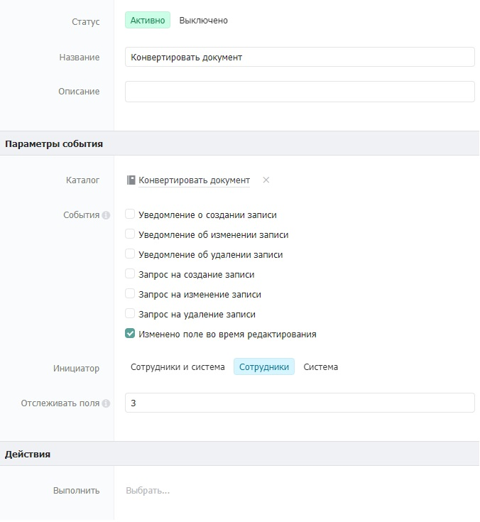

# Импорт данных из Excel

## 1. **Принцип работы**

При нажатии на кнопку «Конвертировать» в каталоге «Импорт клиентов» запускается сценарий «Конвертировать документ». Сценарий конвертирует Excel таблицу и полученные данные записывает в каталог «Клиенты**».**

## **2. Реализация**

### **2.1. Настройка структуры данных**

#### **2.1.1.** Настройка каталога «Клиенты»

Создайте каталог «Клиенты», данный каталог является справочником всех клиентов в системе. При создании каталога нужно добавить и настроить поля следующим образом:

* **Фамилия** (текст).\
  Описание: хранит фамилию клиента.
* **Имя** (текст).\
  Описание: хранит имя клиента.
* **Отчество** (текст).\
  Описание: хранит отчество клиента.
* **Телефон** (контакт).\
  Описание: хранение номера телефона клиента.\
  Настройки: тип поля — «Телефон».
* **Email** (контакт).\
  Описание: хранение номера телефона клиента.\
  Настройки: тип поля — «Электронная почта»

#### 2.1.2. Настройка каталога «Импорт клиентов»

Создайте каталог «Импорт клиентов». В данный каталог загружается Excel файл с информацией о клиентах. Заполните каталог следующими полями:

* **Excel** (файл).\
  Описание: В данное поле загружается Excel файл с информацией о клиентах.
* **Конвертировать** (статус).\
  Описание: При выборе статуса «конвертировать», данные с Excel файла импортируются в каталог «клиенты».

### 2.2. **Настройка автоматизации**

#### **2.2.1.** Создание и настройка события

Для создания события нужно зайти в каталог «События» (обычно он находится в отделе Управление). Нажать кнопку Добавить и заполнить карточку события как указано на скриншоте ниже.

В поле «Отслеживать поля» впишите ID поля «Конвертировать» из каталога «Импорт клиентов».

#### 2.2.2. **Создание записи сценария**

Создайте сценарий в каталоге «Сценарии». Данный сценарий предназначен для импорта данных из Excel файла в каталог **«**Клиенты». При создании записи сценария прикрепите к нему файл ниже, нажав на кнопку «Загрузить…»:



#### 2.2.3. **Настройка файла сценария**

Откройте файл сценария в поле «Сценарий» и отредактируйте следующие компоненты, согласно комментариям внутри них:

Компоненты сценария, в которые нужно внести изменения:

* **Каталог**: Укажите название каталога в который должны импортироваться данные**.**
* **Значения полей**: Замените API из каталога в который должны импортироваться данные.
* **Значения полей**: Замените название листа и столбец из Excel файла.

## 3. **Тестирование**

### **3.1. Каталог «Импорт данных»**

Загрузите Excel файл в каталог «Импорт клиентов», сохраните и выберите статус «конвертировать**»**.

Пример заполнения Excel файла представлен ниже:

### 3.2. **Каталог «Клиенты»**

Результат импорта:

