# Очередь сценариев

## 1. Введение

Когда один сценарий запускается несколько раз за короткий промежуток времени возникает нагрузка на сервисы API и базу данных Бипиума. Если сценарий совершает много операций с данными, повышенная нагрузка приведет к серверной ошибке из-за большого числа запросов к API (429, Too Many Requests). Чтобы избежать этого, используйте очередь сценариев.

Очередь сценариев позволяет:

* **Последовательно запускать одинаковые сценарии**\
  Следующий сценарий не начнет выполнение пока предыдущий не завершит работу.
* **Параллельно запускать разные сценарии**\
  Разные сценарии будут запущены независимо друг от друга.
* **Повторно запускать сценарии завершенные с ошибкой**\
  Если сценарий завершился с ошибкой, очередь попытается выполнить его еще раз. Например, когда сценарий обращается к внешнему сервису который на данный момент недоступен.

## 2. Принцип работы

.jpg>)

* В каталоге «Очередь» фиксируются записи со сценариями и их входными данными.
* Сценарий обработки очереди реагирует на добавление записи в каталог: запускает указанный в записи сценарий с его параметрами запуска.
* При успешном завершении сценарий фиксирует это статусом и больше не попадает в очередь.
* При завершении с ошибкой, сценарий очереди запустит его повторно. Количество попыток можно задать параметром в сценарии обработки очереди.

## **3. Реализация**

### **3.1. Каталог для хранения сценариев в очереди**

Создайте каталог «Очередь». При создании каталога нужно добавить и настроить поля следующим образом. Создавать поля нужно в том же порядке, не нарушая последовательности их id.

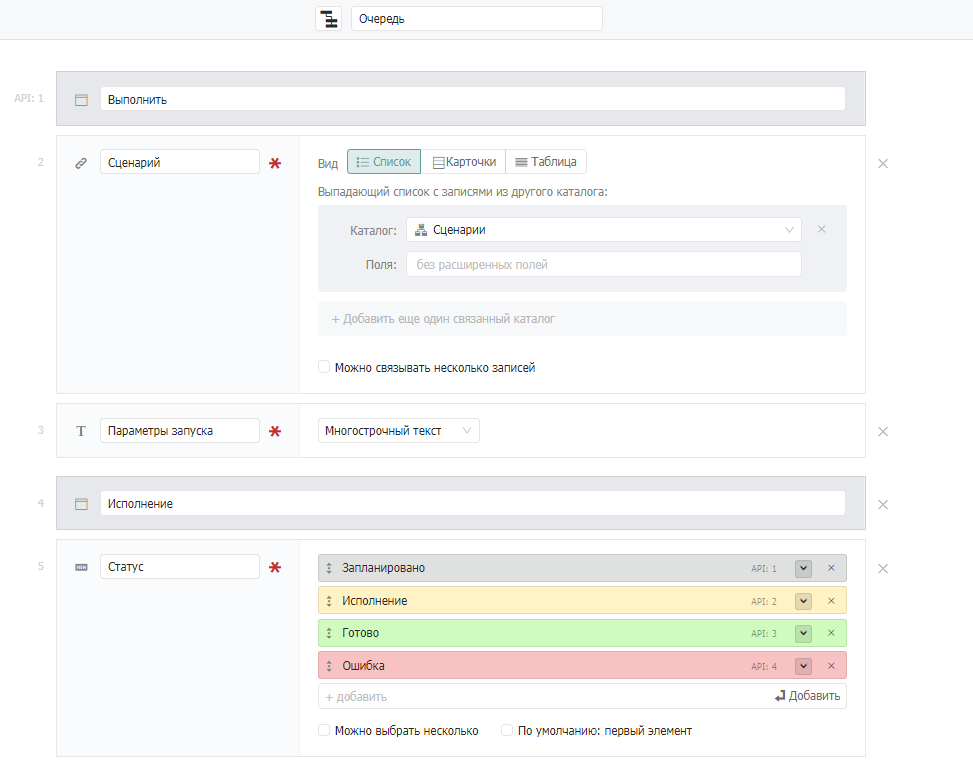

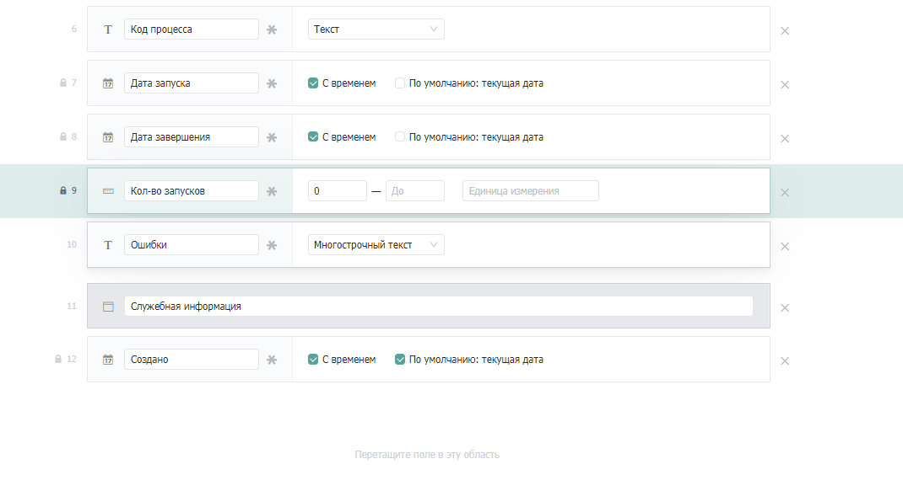

* **Выполнить** (Секция)
* **Сценарий** (связанный каталог)\
  Описание: Сценарий, который будет выполнен.\
  Связанный каталог: Сценарии.\
  Настройки: Обязательное поле.
* **Параметры запуска** (Текст)\
  Описание: Свойства и их значения, к которым может обращаться запущенный сценарий.\
  Формат вводимых данных: JSON-объект.\
  Настройки: Многострочный текст, обязательное поле.
* **Исполнение** (Секция)
* **Статус** (Статус)\
  Описание: Текущее состояние сценария.\
  Значения: Запланировано, Исполнение, Готово, Ошибка.\
  Настройки: Обязательное поле, по умолчанию: первый элемент.
* **Код процесса** (Текст)\
  Описание: Код запущенного экземпляра сценария.\
  Настройки: Текст.
* **Дата запуска** (Дата)\
  Описание: Дата последнего запуска сценария.\
  Настройки: Дата со временем.
* **Дата завершения** (Дата)\
  Описание: Дата последнего завершения сценария (с ошибкой или успешно).\
  Настройки: Дата со временем.
* **Кол-во запусков** (Число)\
  Описание: Количество запусков сценария.\
  Настройки: Минимальное значение — 0.
* **Ошибки** (Текст)\
  Описание: Описание ошибки сценария.\
  Настройки: Многострочный текст.
* **Служебная информация** (Секция)
* **Создано** (Дата)\
  Описание: Дата создания записи.\
  Настройки: Со временем, по умолчанию: текущее время, редактируемое только через API.

Пример заполненной карточки в каталоге «**Очередь**»:

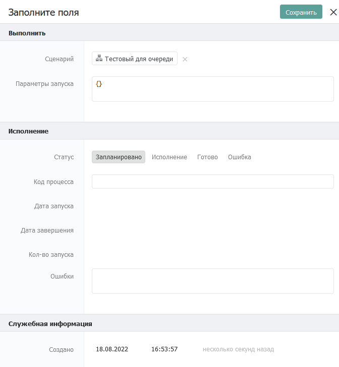

### **3.2. Событие для запуска сценария обработки очереди**

В каталоге «События» создайте новую запись и заполните ее следующим образом:

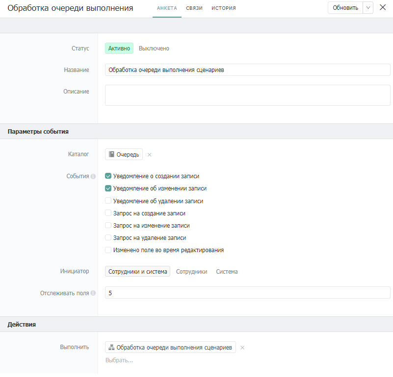

В качестве сценария загрузите [сценарий обработки очереди](https://drive.google.com/file/d/1VPwKsN5-9o8WxxjOV7_neEg2e8OCQNc6/view?usp=sharing).

### **3.3. Сценарий обработки очереди**

Сценарий обработки очереди выглядит следующим образом:

.png>)

В зависимости от типа события, происходит следующее:

* Если тип события «Уведомление о создании записи», сценарий задает количество запусков как 0. Далее сценарий проверяет есть ли другие записи в очереди с тем же сценарием, которые должны выполниться раньше. Если таких сценариев нет – запускает в работу сценарий из созданной записи.
* Если тип события «Уведомление об изменении записи», то логика следующая:\
  \
  Если сценарий в измененной записи завершился с ошибкой, сценарий очереди запускает его еще раз. Максимальное число повторных запусков - 5.\
  Если сценарий в измененной записи завершился успешно - сценарий очереди берет из очереди следующую запись и запускает сценарий в ней.


Сценарий обработки очереди работает по статусам записей в очереди, но не проставляет их. Для корректной работы очереди вам нужно изменить статус записи очереди самостоятельно, из запускаемого в записи очереди сценария. Для этого в каждый запускаемый очередью сценарий передаются следующие параметры запуска:

* queueRecordId — id записи в каталоге «Очередь», из которой вызывается сценарий.
* queueStartCount — Число запусков сценария в этой записи очереди.
* payload — произвольные входные данные для сценария в формате JSON. Передаются из поля «Параметры запуска» этой записи очереди.


Ко всем описанным выше параметрам запуска есть доступ из вызванного очередью сценария.

### **3.4. Сценарий в записи очереди**

Сценарий в записи очереди может быть любым. Единственное ограничение - необходимость простановки из него статуса и числа запусков в запись очереди, из которой он был запущен.

Запись очереди необходимо изменять:

* В начале работы сценария (после компонента «Начало процесса»). Необходимо проставить статус «Исполняется» и увеличить число запусков на 1 в записи очереди. Здесь же можно проставить «Дату запуска» и «Код процесса», но эти поля не обязательны.
* В конце работы сценария (перед компонентом «Конец процесса»). Необходимо проставить статус «Готово». Здесь же можно проставить «Дату завершения».
* Во всех компонентах, в которых возможно возникновение ошибки. В качестве неудачной ветки можно использовать выход из компоненты по [ошибке](https://docs.bpium.ru/manual/processes/scripts/components/error) или же прописать собственную логику, приводящую к ошибке. Необходимо проставить статус «Ошибка» и увеличить количество запусков на 1 в записи очереди.

Пример простого сценария, обращающегося к стороннему сервису в записи очереди:

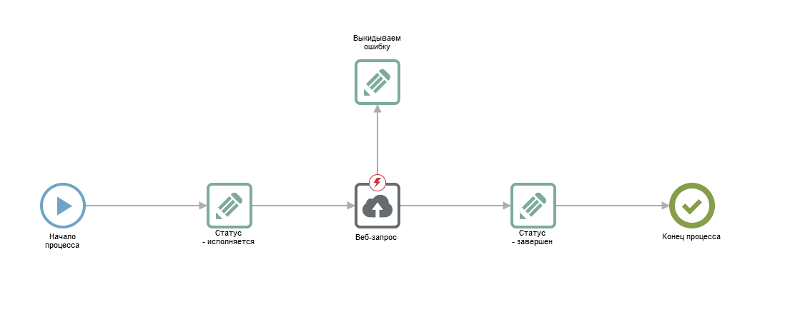

Пример заполнения компонентов, назначающих статусы исполнения в запись очереди:

* Компонент «Статус **—** исполняется»:

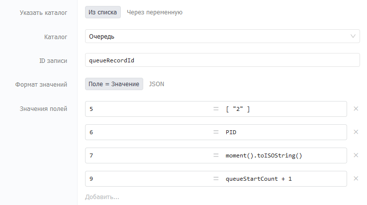

* Компонент «Выкидываем ошибку»:

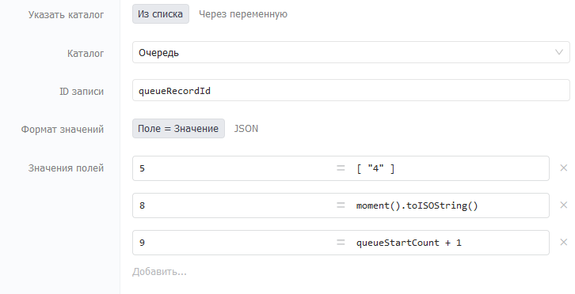

* Компонент «Статус — завершен»:

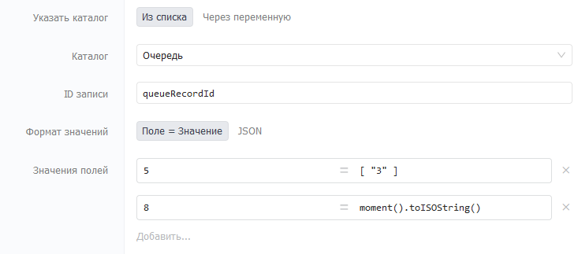

## **4. Тестирование**

### **4.1. Создание тестового сценария**

В каталоге «Сценарии» создайте тестовый сценарий для проверки очереди. Для большей наглядности используйте компонент «[Таймер](https://docs.bpium.ru/manual/processes/scripts/components/timer)», чтобы увеличить время работы сценария. Пример сценария:

Компоненты «Статус **—** исполняется» и «Статус — завершен» заполните согласно скриншотам выше.

### **4.2. Создание записей в Очереди**

В каталоге «Очередь» создайте запись с созданным ранее тестовым сценарием. В качестве входных данных укажите произвольный JSON, например - {}. Пример заполнения:

После создания записи ее статус перейдет в состояние «Исполнение»:

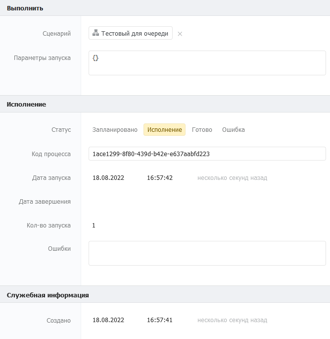

Во время исполнения сценария создайте еще одну запись в каталоге «Очередь» с тем же сценарием. Созданная запись останется в статусе «Запланировано»:

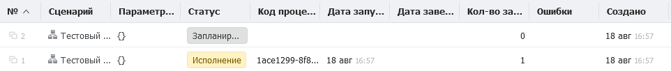

Дождитесь окончания выполнения сценария в первой записи очереди. После окончания выполнения сценария, статус в первой записи очереди изменится на «Готово»:

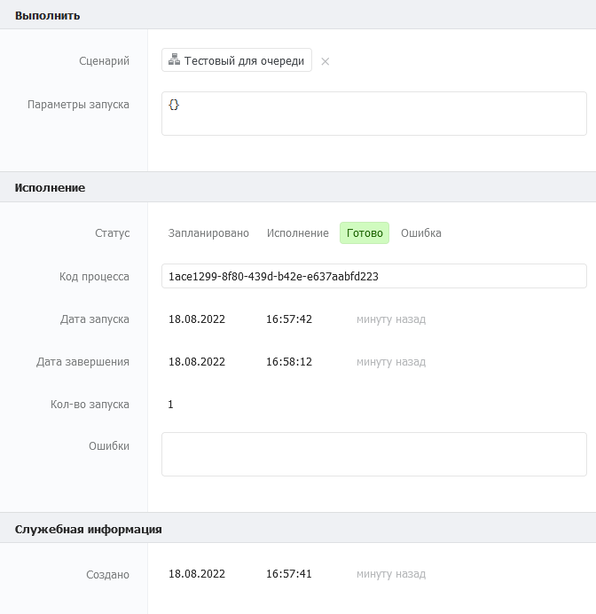

В это же время начнет выполняться сценарий во второй записи очереди:

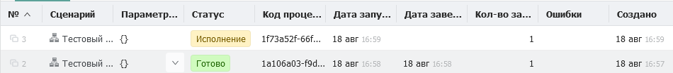
