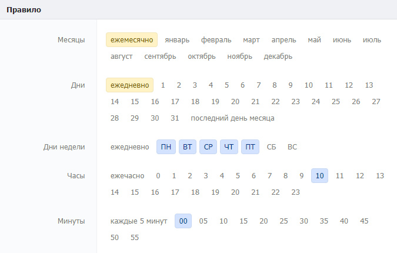
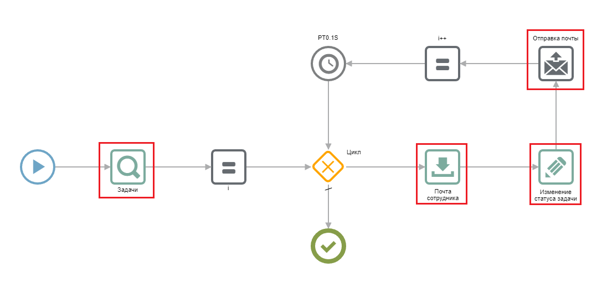

# Контроль сроков исполнения по планировщику

## 1. **Принцип работы**

Принцип работы механизма контроля сроков опирается на каталог «[Планировщик задач](https://docs.bpium.ru/cases/automations/planirovshik-zadach)» в Бипиуме. В указанные в планировщике дату и время, запускается сценарий, который проверяет дедлайн всех задач из каталога «Задачи». Если задача просрочена (дедлайн задачи уже прошел), то в записи этой задачи в соответствующем статусе отмечается факт просрочки. По каждой просроченной задаче осуществляется рассылка уведомлений ответственным за задачи лицам с целью их оповещения о срыве сроков дедлайнов.

## 2. Реализация

В процессе реализации механизма контроля сроков исполнения необходимо создать тестовый каталог, в котором предполагается вести учет просроченных задач. Ниже представлен пример заполненной карточки тестового каталога с задачами:

Следует понимать, что в каталоге «Задачи» набор полей может быть произвольным: вы можете добавлять в него любые другие поля, не указанные на скриншоте выше и продумать для них собственную иную логику автоматизаций. Ключевыми же полями, которые необходимо использовать для реализации механизма являются:

* **Статус** — фиксирует в себе этап выполнения задачи ответственным.
* **Ответственный** — содержит ответственного за выполнение задачи сотрудника.
* **Дедлайн** — хранит в себе срок крайней даты задачи.
* **Просрочен?** — свидетельствует о статусе просрочки задачи.

Помимо создания каталога с задачами необходимо также настроить «Планировщик задач» для ежедневной проверки сроков по всем записям задач в каталоге. Пример настроенного планировщика задач представлен на скриншоте ниже:

Настроить планировщик можно произвольным образом. Мы рекомендуем настроить планировщик на разовую проверку статусов по всем задачам в будние дни, так как более частая или редкая проверка сроков зачастую не требуется. Однако, для более специфичных кейсов, вы можете самостоятельно выбрать даты планировщика, исходя из собственных соображений.

К созданной записи планировщика необходимо приложить сценарий автоматизаций для контроля сроков дедлайнов по всем задачам. Описание сценария с реализованным файлом сценария представлено [здесь](https://docs.google.com/document/d/1eqrvu8DM\_HSHyIgz9xPW2wdBWuU-nwm440T4phdWaMw/edit#heading=h.zhlpjvtmjmnu).

После создания каталога с задачами, его наполнения и создания соответствующей записи в планировщике, в даты согласно записи планировщика будет осуществляться проверка срывов сроков дедлайнов для всех задач в каталоге. Если задача оказывается просроченной, то сценарий автоматизации отправит сообщение на электронную почту ответственного сотрудника и переведет статус задачи в соответствующее просрочке значение.

### 2.1. Настройка каталога «Задачи»

Создайте каталог «Задачи». Данный каталог необходим для отслеживания выполнения задач. Обратите внимание, что все поля должны создаваться в том же порядке, в каком они созданы на скриншоте ниже, это необходимо для корректного обращения к полям каталога из сценария по их значениям id. При создании каталога нужно добавить и настроить поля следующим образом:

* **Статус** (Статус)\
  Описание: **** Содержит этап выполнения задачи ответственным лицом.\
  Настройки: Значения: «Новая», «В работе», «Готово». \
  По умолчанию: первый элемент. Обязательное поле.
* **Описание** (Многострочный текст)\
  Описание: Описание сути задачи, работ, которые необходимо выполнить.\
  Настройки: Обязательное поле.
* **Ответственный** (Сотрудник)\
  Описание: Ответственный за выполнение задачи сотрудник.\
  Настройки: Укажите «по умолчанию: текущий сотрудник». Обязательное поле.
* **Дедлайн** (Дата)\
  Описание: Хранит дату и время дедлайна задачи.\
  Настройки:  Укажите дату «с временем».
* **Просрочено?** (статус)\
  Описание: Данное поле указывает просроченность дедлайна задачи.\
  Настройки: Значения: «нет», «да». Укажите «по умолчанию: первый элемент». Сделайте поле редактируемым только через API.

### 2.2. Создание и настройка планировщика задач

Создайте и настройте каталог «Планировщик задач». Процесс создания каталога описан в статье [«Планировщик задач](https://docs.bpium.ru/cases/automations/planirovshik-zadach)», настоятельно рекомендуем вам ознакомиться с ней, так как вся работа механизма контроля сроков во многом опирается именно на механизм работы планировщика.

#### **2.2.1. Настройка даты и времени запуска сценария**

Укажите дни и время, в которые должны проверяться дедлайны задач. Например, для проверки дедлайна по будням в 10:00, настройте планировщик следующим образом:

В качестве сценария необходимо загрузить следующий [файл сценария](https://drive.google.com/file/d/1f7YxUePBhhOXLl25VtKzFGb7HQ6yWc8S/view?usp=sharing).

#### 2.2.2. Настройка сценария планировщика

Сценарий для проверки дедлайна всех задач выглядит следующим образом:

Сценарий запускается во время, указанное в планировщике задач. Он осуществляет сбор всех просроченных записей задач компонентом «Задачи» и в цикле по каждой такой записи осуществляет следующие действия:

* Получение почты ответственного сотрудника (Компонент «Почта сотрудника»).
* Изменение статуса задачи на просрочено (компонент «Изменение статуса задачи»).
* Отправка на почту ответственного сотрудника уведомления о просрочки задачи (компонент «Отправка почты»).

В цикле, помимо описанных выше компонентов, присутствуют компоненты увеличения значения счетчика и таймера. Компонент увеличения значения счетчика необходим для начала обработки следующей записи. Компонент таймера необходим для осуществления временной задержки при переходе к следующей записи.

В сценарии необходимо изменить выделенные компоненты в соответствии с описанием ниже. Список компонентов к изменению:

* **Задачи**
* **Почта сотрудника**
* **Изменение статуса задачи**
* **Отправка почты**

**В каждом из этих компонентов необходимо указать каталог «Задачи» и id созданных в нем полей. Если поля в каталоге «Задачи» и значения всех статусов создавались в том же порядке, что и на** [**скриншоте выше**](https://docs.google.com/document/d/1eqrvu8DM\_HSHyIgz9xPW2wdBWuU-nwm440T4phdWaMw/edit#bookmark=id.maczo185pz2h)**, то изменять id полей не требуется. Если же порядок полей отличается, то необходимо сопоставить id полей и значений вашего каталога с соответствующими полями и значениями** [**на скриншоте**](https://docs.google.com/document/d/1eqrvu8DM\_HSHyIgz9xPW2wdBWuU-nwm440T4phdWaMw/edit#bookmark=id.maczo185pz2h)**. Подробная настройка всех изменяемых компонентов представлена ниже.**

Компонент «Задачи»

.png>)

Компонент осуществляет выборку просроченных записей из каталога «Задачи» по правилу сформированному в значении поля «5» на скриншоте выше.

В поле «Каталог» необходимо указать созданный вами каталог «Задачи». Остальные выделенные значения необходимо сопоставить с соответствующими id в созданном вами каталоге. Если все поля и значения в каталоге создавались [в том же порядке](https://docs.google.com/document/d/1eqrvu8DM\_HSHyIgz9xPW2wdBWuU-nwm440T4phdWaMw/edit#bookmark=id.maczo185pz2h), то изменять числовые значения не нужно.

Компонент «Почта сотрудника»

.png>)

Компонент осуществляет получение почты ответственного за просроченную задачу сотрудника.

В поле «Каталог» необходимо выбрать ваш каталог «Сотрудники». В поле «ID записи» вместо значения «4» необходимо вписать id поля «Ответственный» из вашего каталога «Задачи» (если по скриншоту, то менять не нужно).

В секции «Получить» в поле «ID полей» необходимо указать id поля с электронной почтой в вашем каталоге «Сотрудники». Если вы не редактировали структуру каталога «Сотрудники» по умолчанию, то менять значение не нужно.

Компонент «Изменения статуса задачи»

.png>)

Компонент осуществляет проставление статуса просроченности в записи задачи.

В поле «Каталог» выберите ваш каталог «Задачи». В поле значения полей укажите id вашего статуса «Просрочен», а в его значении укажите значение статуса «да» (если по [скриншоту](https://docs.google.com/document/d/1eqrvu8DM\_HSHyIgz9xPW2wdBWuU-nwm440T4phdWaMw/edit#bookmark=id.maczo185pz2h), то менять не нужно).

Компонент «Отправка почты»

 (1).png>)

Для подробного описания компонента настоятельно рекомендуем ознакомиться со [следующей статьей](https://docs.bpium.ru/manual/processes/scripts/components/email#gmail).

Компонент осуществляет отправку сообщения о просрочке на почту ответственного сотрудника. В данном примере предполагается отправка сообщения на почту Яндекса, если же в вашем случае используется другой почтовый сервис (например Gmail), то ознакомьтесь со [статьей по компоненту](https://docs.bpium.ru/manual/processes/scripts/components/email#gmail).

Укажите адрес сервера, порт (если у сотрудника почта Яндекса, то оставьте поля без изменений). Введите логин и пароль почты, с которой будут отправляться уведомления и заполните остальные поля согласно скриншоту. В поле «Текст» сформируйте произвольное сообщение (как простой текст или HTML-верстку) и вставьте ссылку на задачу.

При необходимости вместо (или совместно) с отправкой сообщения на почту можно реализовать рассылку в Telegram. Механизм реализации рассылки в Telegram из Бипиум описан в статье [Интеграция с Telegram-ботом](https://docs.bpium.ru/cases/automations/integraciya-s-telegram-botom).

## **3. Тестирование**

Создайте несколько записей в каталоге «Задачи» с наступившими и еще не наступившими датами дедлайнов. Пример заполнения записи представлен ниже, статус просрочен заполнять не нужно, он проставится автоматически в дальнейшем:

Дождитесь выполнения сценария, в указанное в планировщике время. В результате работы сценария, запущенного планировщиком, задачи с наступившим дедлайном должны оказаться в просроченном статусе:

По всем просроченным задачам на почту ответственных сотрудников должно прийти уведомление о просроченных задачах с ссылкой на них. При переходе по ссылке из сообщения открывается задача с просроченным дедлайном:

