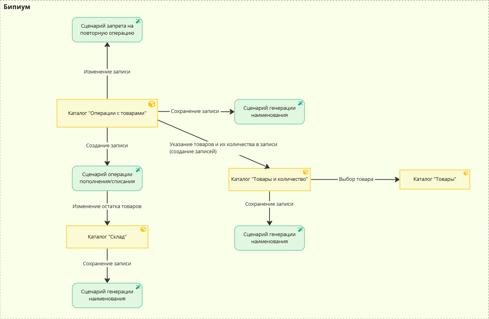

# Массовое изменение записей

## **Введение**

Компонент «Найти записи» в Бипиуме имеет ограничение на максимальное число возвращаемых записей. Максимальное число записей компонента - 1000. Для того, чтобы обойти это ограничение используется механизм массового изменение записей. Примеры использования:&#x20;

* В каталоге с более чем 1000 записями было добавлено новое поле. Это поле нужно заполнить фиксированным значением во всех записях. Например, в каталоге «Клиенты» проставить статус активности значением «Да».
* В каталоге нужно изменить часть записей по фильтру. Количество отфильтрованных записей больше 1000. Например, в каталоге «Клиенты» больше 1000 записей с датой последней активности более года назад. Нужно проставить статус активности значением «Нет».

Сценарий массового изменения перебирает все записи в каталоге и изменяет значение требуемых полей.

## 2. Принцип работы

При обращении к внешнему запросу запускается сценарий на изменение записей в каталоге. Сценарий проходит по всем записям из каталога и меняет необходимое поле/поля, записывая нужное значение.

## **3. Реализация**

### **3.1. Настройка структуры данных**

#### Создание сценария изменения записей

В системном каталоге «Сценарии» создайте новую запись и заполните карточку, согласно скриншоту ниже. В качестве файла сценария необходимо загрузить [следующий файл](https://drive.google.com/file/d/1fEiPcSiiSp6igwBgxudOrn8MfORwsbO\_/view?usp=sharing).

.png>)

#### Создание внешнего запроса для сценария

В системном каталоге «Внешние запросы» создайте новую запись и заполните ее следующим образом:

 (1).png>)

В качестве сценария внешнего запроса выберите сценарий, созданный ранее.

### **3.2. Настройка сценария автоматизации**

Сценарий для массового изменения записей выглядит следующим образом:

.png>)

Сценарий выполняет:

* Циклическую выборку из limit записей нужного каталога компонентом «Получение пачки записей». limit - число записей в одной выборке, задается в компоненте «more & limit & offset» (макс. значение limit - 1000).
* По записям выбранным компонентом «Получение пачки записей» запускается цикл. В цикле по записям из «пачки» для каждой записи изменяется значение требуемого поля компонентом «Изменение i-ой записи в пачке».
* После изменения всех записей из полученной «пачки» (с limit записей) внешний цикл по «пачкам» записей получает новую «пачку» и процесс повторяется до исчерпания всех записей в каталоге.

Подробнее о цикле в сценариях.

В сценарии необходимо отредактировать выделенные компоненты, согласно описанию внутри каждого из них. Компоненты, которые необходимо отредактировать:

* Получение пачки записей
* Изменение i-ой записи в пачке

В каждом из компонентов нужно указать каталог для изменения записей. В компоненте «Получение пачки записей» можно указать фильтры для выборки «пачки» записей.

### 3.3. Запуск сценария из внешнего запроса

Для запуска сценария во внешнем запросе используется HTTP-клиент Postman. Для запуска сценария необходимо отправить асинхронный GET запрос на адрес внешнего запроса, созданного ранее. Пример создания запроса представлен на скриншоте ниже:

 (2) (1).png>)

Вместо «your» впишите свой домен системы на Бипиуме. После отправки запроса запустится сценарий массового изменения записей в каталоге. Отслеживать статус работы сценария можно из системного каталога «Процессы».

## **4. Тестирование**

### **4.1. Настройка структуры данных**

#### **Создание целевого каталога для тестирования**

Для тестирования процесса массового изменения записи создайте в системе новый тестовый каталог и заполните его следующим образом. Поля создавать нужно в том же порядке:

.png>)

* **Текстовое поле** (Текст)\
  Описание: Поле для хранения произвольного текста.\
  Настройки: Текст.
* **Число** (Число)\
  Описание: Поле для хранения произвольного числа.
* **Дата** (Дата)\
  Описание: Поле для хранения произвольной даты.
* **Статус** (Статус)\
  Описание: Поле с произвольными статусами.\
  Настройка значения: Раз, Два, Три.
* **Файл** (Файл)\
  Описание: Поле для хранения произвольного файла.

#### Создание сценария заполнения каталога

В системном каталоге «Сценарии» создайте новую запись и заполните карточку следующим образом:

.png>)

В качестве файла сценария приложите [следующий файл](https://drive.google.com/file/d/1mK6jFu3Xid8dZc5U3w8BqrSajQZwDsPW/view?usp=sharing).

#### **Создание внешнего запроса для сценария заполнения каталога**

В системном каталоге «Внешние запросы» создайте новую запись и заполните ее следующим образом:

 (1).png>)

В качестве сценария запроса выберите созданный на предыдущем шаге сценария заполнения каталога.

### **4.2. Настройка сценария заполнения каталога**

Сценарий для заполнения каталога выглядит следующим образом:

 (1).png>)

Сценарий выполняет:

* Создание length тестовых записей в каталоге тестирования. По умолчанию: length=1200. Изменить количество создаваемых записей можно в переменной length компонента «‎i».&#x20;

В сценарии необходимо отредактировать выделенный компонент «Создать запись». В поле «Каталог» карточки компонента необходимо выбрать созданный ранее тестовый каталог «Массовое изменение записей».

### **4.3. Запуск сценариев**

#### **Запуск сценария заполнения каталога**

Для запуска сценария заполнения каталога через HTTP-клиент Postman отправьте следующий запрос:

 (1).png>)

Вместо «your» впишите домен вашей системы на Бипиуме. Статус работы сценария можно отслеживать из системного каталога «Процессы».

В процессе работы сценария в тестовом каталоге будут постепенно создаваться 1200 тестовых записей. Результаты работы представлены ниже:

.png>)

#### **Запуск сценария массового изменения записей**

Для запуска сценария массового изменения записей в каталоге через HTTP-клиент Postman отправьте следующий запрос:

 (2) (1).png>)

Вместо «your» впишите домен своей системы на Бипиуме. Статус работы сценария можно отслеживать из системного каталога «Процессы».

### **4.4. Результат**

В результате работы сценария во все файлы каталога был добавлен файл в соответствующее поле. Результат работы представлен на скриншоте ниже:

 (2).png>)
