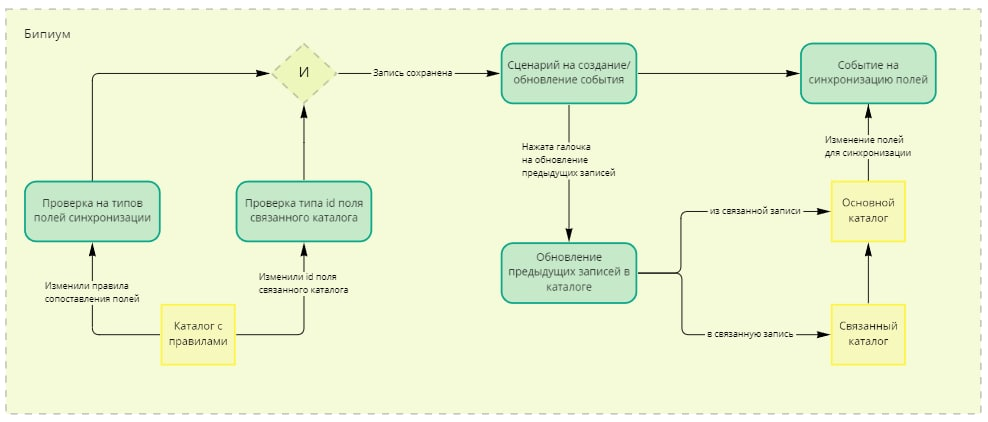
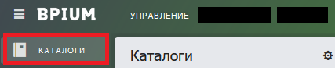
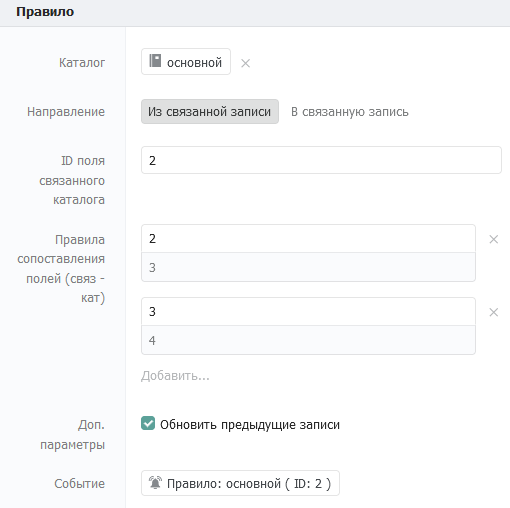
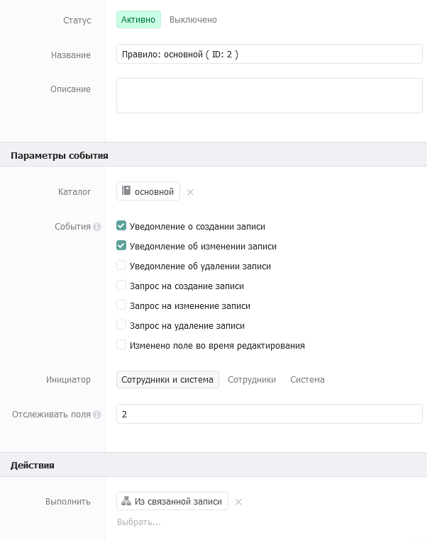
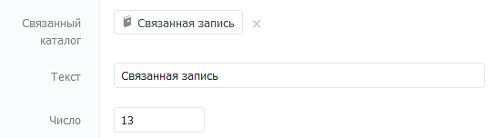

# Переброс данных между связанными каталогами

## 1. Введение

Если вы хотите автоматически перебрасывать значения однотипных полей из одного каталога в другой, то нужно писать для целевого каталога переброса сценарий автоматизаций.&#x20;

Например: у вас есть каталог «‎Контакты» с полями «‎Фамилия», «‎Имя» и «‎Отчество». Также, у вас есть каталог «‎Заявки», в котором есть связь с каталогом «‎Контакты» и точно такие же поля «‎Фамилия», «‎Имя», «‎Отчество». Вы хотите заполнять поля в «‎Заявках» автоматически и пишете для этого сценарий переброса данных из связанного каталога «‎Контакты». В случае с одним каталогом — процесс несложный, но если каталогов становится несколько, то писать под каждый отдельный сценарий — нецелесообразно.&#x20;

Процесс переброса данных — однотипный, поэтому в этом случае используется универсальный каталог с правилами переброса.&#x20;

В каталоге правил фиксируется целевой каталог для переброса, связанный каталог из которого (или в который) нужно дублировать значения полей и правило сопоставления полей между каталогами.

## **2. Принцип работы**

<figure><figcaption></figcaption></figure>

* При сохранении записи в каталоге с правилами сценарий обработки каталога проверяет типы полей для переброса в целевом каталоге и его связанном каталоге. Типы перебрасываемых полей в обоих каталогах должны быть идентичными. Если они не совпадают, то сценарий выдаст ошибку и завершится.
* Если проверка прошла успешно, в каталоге «События» создается новая запись (или обновляется существующая), которая будет отслеживать изменения указанных полей в выбранном каталоге.
* При необходимости можно обновить все ранее созданные записи согласно новому правилу переброса, выбрав соответствующий пункт в записи каталога правил.
* При изменении записи в выбранном каталоге сценарий переброса автоматически обновит запись в связанном каталоге.

## **3. Реализация**

### **3.1. Открытие каталога каталогов**

Бипиум хранит список всех каталогов в виде записей в служебном каталоге «Каталоги». Этот каталог по умолчанию скрыт в системе. Для того, чтобы реализовать механизм переброса значений полей нужно открыть отображение этого каталога.

Создайте новую запись в каталоге «Внешние запросы». В качестве сценария прикрепите следующий [файл сценария](https://drive.google.com/file/d/1mcxJw2Ib1a6ZGs990OAcBDQsoZ20LwXY/view?usp=sharing).

Файл сценария выглядит следующим образом:

<figure><figcaption></figcaption></figure>

Этот сценарий открывает отображение каталога «Каталоги» в вашей системе.

В сценарии нужно изменить:

* Компонент «Открываем каталог каталогов». В поле «Заголовки (headers)» в значении заголовка «from» укажите поддомен вашей системы. Например, для домена https://test.bpium.ru нужно указать «test».

Запустите сценарий во внешнем запросе, перейдя по полному адресу внешнего запроса.&#x20;

Если все сделано правильно, в отделе «Управление» появится каталог «Каталоги» со списком всех каталогов в системе.

<figure><figcaption></figcaption></figure>

### **3.2. Создание каталога правил переброса**

Создайте каталог «Правила». В этом каталоге будут собраны правила переброса значений полей между каталогами. Поля каталога нужно создавать в том же порядке, не нарушая последовательность id полей:

<figure><figcaption></figcaption></figure>

* **Правило** (секция)
* **Каталог** (Связанный каталог)\
  Описание: Содержит каталог, для которого будет применено правило переброса.\
  Настройки: Обязательно поле, связь с каталогом «Каталоги».
* **Направление** (статус)\
  Описание: Выборка целевого каталога для переброса: возможен переброс данных в связанную запись основного каталога или из связанного каталога в основной.\
  Значения: «Из связанной записи», «В связанную запись».\
  Настройки: Обязательное поле.
* **ID поля связанного каталога** (текст)\
  Описание: Содержит id поля связанного каталога в основном каталоге. \
  Настройки: Обязательное поле.
* **Правила сопоставления полей** (Контакт)\
  Описание: Содержит сопоставление полей основного и связанного каталогов, данные из которых будут синхронизироваться. В основном поле указываются id полей связанного каталога, в дополнительном – основного.\
  Настройки: Обязательное поле, телефон.
* **Доп. параметры** (Набор галочек)\
  Описание: Содержит дополнительные параметры синхронизации. По умолчанию параметр один - «Обновить предыдущие записи». Если он проставлен, то вместе с созданием правила синхронизации будут обновлены все предыдущие записи в целевом каталоге.\
  Настройки: По умолчанию: первый элемент.
* **Событие** (Связанный каталог)\
  Описание: Содержит в себе созданное по правилу переброса событие. Будет проставляться автоматически при создании правила.\
  Настройки: Связь с каталогом «События», редактируемое только через API.

### **3.3. События обработки каталога правил**

В системном каталоге «События» нужно создать три события для каталога «Правила»:

* Событие: Создание/обновление событий по правилу

<figure><figcaption></figcaption></figure>

Событие отслеживает создание/изменение записей (уведомление) в каталоге правил и запускает сценарий создания или обновления события для целевого каталога.

В качестве сценария прикрепите [сценарий создания/обновления события по правилу](https://drive.google.com/file/d/1sxePcmsDZLEO-LOMqZKL8Wx4yZarXulr/view?usp=sharing).

* Событие: Проверка типов связанных полей

<figure><figcaption></figcaption></figure>

Событие отслеживает создание/изменение записей (запрос) в каталоге правил и запускает сценарий проверки типов синхронизируемых полей. Сценарий проверяет типы полей в целевом и связанном каталогах из поля «Правила сопоставления полей» на соответствие друг другу. Если поля идентичны по типу, то сценарий завершается. Если тип полей не идентичен – выбивает ошибку и не дает сохранить запись в каталоге правил. В качестве сценария прикрепите [сценарий проверки типов связанных полей](https://drive.google.com/file/d/1XwCVxV7OTuQGKQ8\_0cRtB-6YAnc850NI/view?usp=sharing).

* Событие: Проверка типа поля связанного каталога

<figure><figcaption></figcaption></figure>

Событие отслеживает создание/изменение записей (запрос) в каталоге правил и запускает сценарий проверки типа поля связанного каталога. Сценарий проверяет на заполненность поля «Каталог» и «ID связанного каталога» и не дает сохранить запись, если они заполнены некорректно. В качестве сценария прикрепите [сценарий проверки типа поля связанного каталога](https://drive.google.com/file/d/17Mg7noEV6a-gPrbelKTzjeVVQwgX4kNO/view?usp=sharing).

### **3.4. Сценарии переброса данных**

В системном каталоге «Сценарии» создайте две записи и приложите к ним файлы сценария:

* [**Сценарий «В связанную запись»**](https://drive.google.com/file/d/1FIFqshxfZURoB4yexkkH1KwUwHPm5IIF/view?usp=sharing)
* [**Сценарий «Из связанной записи»**](https://drive.google.com/file/d/10dGhKaGg-jUmzWll2jhkoTYD\_15rSYwz/view?usp=sharing)

Эти сценарии не связаны с событиями описанными выше. Они запускаются из создаваемого сценарием «Создание/обновление событий по правилу» (описан выше) событию. Это событие создается для целевого каталога при сохранении записи в каталоге правил.

Оба сценария идентичны по алгоритму работы, но различаются по направлению переброса данных. Первый прокидывает данные полей в целевой каталог ИЗ его связанной записи («Из связанной записи»). Второй прокидывает данные из целевого каталога В его связанную запись («В связанную запись»).

#### **Сценарий переброса в связанную запись**

Сценарий выглядит следующим образом:

<figure><figcaption></figcaption></figure>

Сценарий выполняет:

* Поиск правила сопоставления полей в каталоге правил (поле «Правила сопоставления полей»)
* Изменение значений полей в связанной записи по правилам сопоставления.

В сценарии нужно изменить:

* В компоненте «Ищем правило дублирования полей» в поле «Каталог» выберите ваш каталог с правилами переброса.

#### **Сценарий переброса из связанной записи**

Сценарий выглядит следующим образом:

<figure><figcaption></figcaption></figure>

Сценарий выполняет:

* Поиск правила сопоставления полей в каталоге правил (поле «Правила сопоставления полей»).
* Получение значения полей связанной записи.
* Изменение значений полей в основной записи по правилам сопоставления.

В сценарии нужно изменить:

* В компоненте «Ищем правило дублирования полей» в поле «Каталог» выберите ваш каталог с правилами переброса.

### **3.5. Сценарии обработки каталога правил**

#### **3.5.1. Сценарий создания/обновления события по правилу**

Сценарий выглядит следующим образом:

<figure><figcaption></figcaption></figure>

Сценарий выполняет:

* Формирование списка отслеживаемых полей из поля «Правила сопоставления полей».
* Создание для указанного в поле «Каталог» нового события с одним из сценариев переброса («Из связанной записи», «В связанную запись») или изменение существующего события.
* Обновление предыдущих записей в каталоге, если был выбран доп. параметр «Обновить предыдущие записи».

В сценарии нужно изменить:

* В компоненте «Изменяем событие по правилу» выберите системный каталог «События».
* В компоненте «Создать событие для правила» выберите системный каталог «События».
* В компонента «Зафиксировать созданное событие» выберите каталог правил.
* В компоненте «Запуск процесса» выберите сценарий обновления предыдущих записей (описан ниже).

#### **3.5.2. Сценарий обновления предыдущих записей**

Если в каталоге правил выбран доп. параметр «Обновить предыдущие записи», то сценарий «Создания/обновления событий по правилу» запускает сценарий обновления предыдущих записей в целевом каталоге. Создайте в системном каталоге «Сценарии» новую запись и прикрепите к ней сценарий обновления предыдущих записей. Этот же сценарий нужно выбрать в компоненте «Запуск процесса» сценария, описанного выше.

Сценарий обновления предыдущих записей выглядит следующим образом:

<figure><figcaption></figcaption></figure>

Сценарий выполняет:

* Получение всех записей целевого каталога.
* Изменение данных в полученных записях по полю «Правила сопоставления полей» каталога правил.

#### **3.5.3. Сценарий проверки типов связанных полей**

Сценарий выглядит следующим образом:

<figure><figcaption></figcaption></figure>

Сценарий выполняет:

* Получение структуры основного и связанного каталога.
* Проверку типов полей в каталогах на соответствие друг другу.
* Если типы полей не совпадают, выводит сообщение с ошибкой и не дает сохранить запись.

**3.5.4. Сценарий проверки типа поля связанного каталога**

Сценарий выглядит следующим образом:

<figure><figcaption></figcaption></figure>

Сценарий выполняет:

* Получение структуры основного каталога.
* Проверку типа поля с id из «ID поля связанного каталога».
* Если тип поля не связанный каталог, то выводится сообщение с ошибкой и запись не сохраняется.

### **4. Тестирование**

Для тестирования создайте два тестовых каталога с одинаковыми по типу полями, из которых планируется перебрасывать данные. В одном из каталогов добавьте поле типа «Связанный каталог» и свяжите его со вторым тестируемым каталогом.

В каталоге «Правила» создайте новую запись с направлением «Из связанной записи». Выберите тестовый каталог (основной), в котором есть связь со вторым тестовым каталогом. Введите id поля типа «Связанный каталог» выбранного каталога и укажите поля, которые должны синхронизироваться в поле «Правила сопоставления полей». В основное поле введите нужные поля из связанного каталога. В дополнительное – поля основного каталога. При необходимости, отметьте доп. параметр «Обновить предыдущие записи». Пример заполнения записи в каталоге «Правила»**:**

<figure><figcaption></figcaption></figure>

Если правила сопоставления каталогов верны, то сценарий создаст новую запись в каталоге «‎События»:

<figure><figcaption></figcaption></figure>

При создании новой записи в целевом каталоге с выбранным связанным каталогом, значения полей связанного каталога будут переброшены в целевой каталог:

<figure><figcaption></figcaption></figure>

В каталоге «Правила» измените направление на «В связанную запись». При необходимости, отметьте доп. параметр «Обновить предыдущие записи». Пример заполнения записи в каталоге «Правила»:

<figure><figcaption></figcaption></figure>

Если правила сопоставления каталогов верны, то сценарий изменит созданную ранее запись в каталоге «‎События»:

<figure><figcaption></figcaption></figure>

При изменении записи в целевом каталоге, значения полей будут переброшены в связанный каталог:

<figure><figcaption></figcaption></figure>
