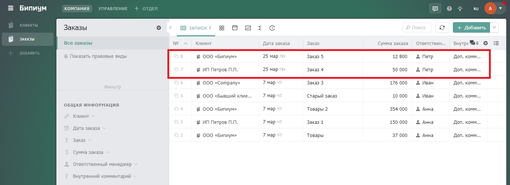
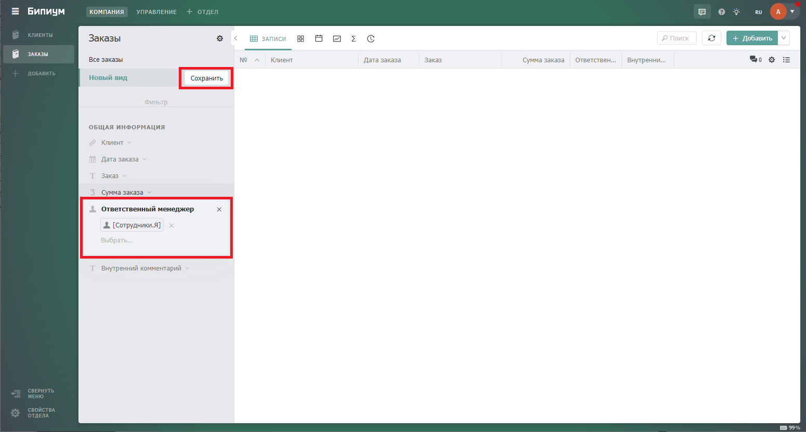
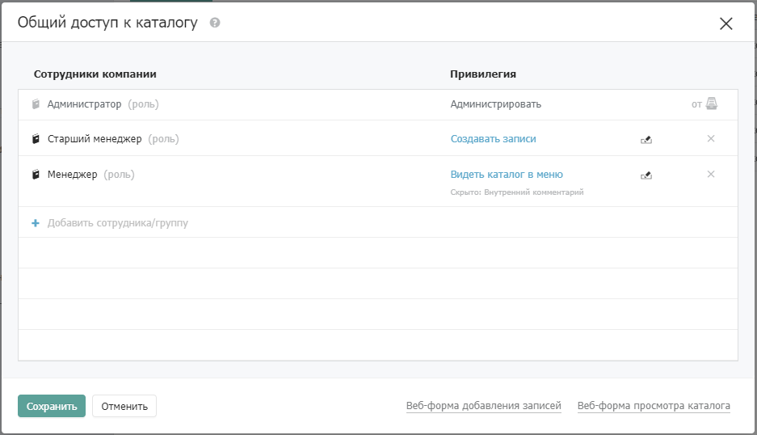
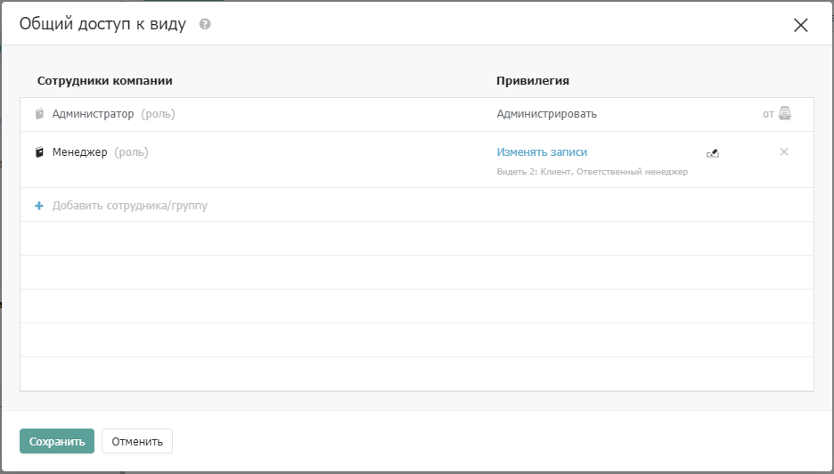
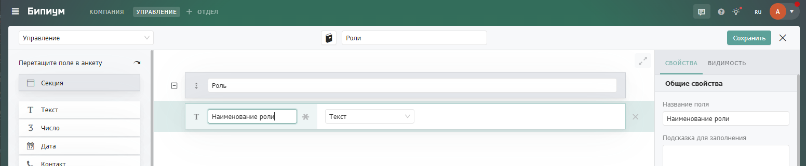

# Перенос данных между системами Бипиума

## 1. **Принцип работы**

.jpg>)

Процесс переноса системы представляет из себя комбинацию из нескольких внешних запросов, запускающих сценарии по переносу архитектуры и данных между системами. Обращение к внешним запросам должно происходить строго последовательно по следующей схеме: перенос секций -> перенос каталогов в секциях -> перенос полей каталогов -> перенос записей без заполненных связанных полей -> заполнение перенесенных записей связанными полями. Каждый из внешних запросов в вышеописанной схеме запускает сценарий, который обращается в экспортируемую систему Бипиума и переносит в импортируемую систему соответствующие данные. Каждый из сценариев переноса обращается к каталогу «Сопоставление ID», находящемуся в импортируемой системе, для записи или чтения сопоставлений между каталогами экспорта и импорта.

## **2. Реализация**

### **2.1. Настройка структуры данных**

#### 2.1.1. Настройка каталога «Сопоставление ID»

В импортируемой системе создайте каталог «Сопоставление ID». Данный каталог необходим для сопоставления идентификатора сущностей экспортируемой системы с аналогичными сущностями в импортируемой системе. Обратите внимание, что все поля должны создаваться в том же порядке, в каком они созданы на скриншоте ниже, это необходимо для корректного обращения к полям каталога из сценариев. После переноса всех необходимых данных, данный каталог можно удалить из системы. При создании каталога нужно добавить и настроить поля следующим образом:

.png>)

* **Статус** (Статус)\
  Описание: Конкретизирует перенесенную сущность.
* **ID секции (ориг)** (Число)\
  Описание: Хранит ID секции в экспортируемой системе.\
  Настройки: Задайте видимость при значениях статуса «Секция» и «Каталог».
* **ID секции (конеч)** (Число)\
  Описание: Хранит ID перенесенной секции в импортируемой системе.\
  Настройки: Задайте видимость при значениях статуса «Секция» и «Каталог».
* **ID каталога (ориг)** (Число)\
  Описание: Хранит ID каталога в экспортируемой системе.\
  Настройки: Задайте видимость при значениях статуса «Каталог», «Поле», «Запись».
* **ID каталога (конеч)** (Число)\
  Описание: Хранит ID перенесенного каталога в импортируемой системе.\
  Настройки: Задайте видимость при значениях статуса «Каталог», «Поле», «Запись».
* **ID поля (ориг)** (Число)\
  Описание: Хранит ID поля каталога в экспортируемой системе.\
  Настройки: Задайте видимость при значении статуса «Поле».
* **ID поля (конеч)** (Число)\
  Описание: Хранит ID перенесенного поля в импортируемой системе.\
  Настройки: Задайте видимость при значении статуса «Поле».

.png>)

* **ID записи (ориг)** (Число)\
  Описание: Хранит ID записи в экспортируемой системе.\
  Настройки: Задайте видимость при значении статуса «Запись».
* **ID записи (конеч)** (Число)\
  Описание: Хранит ID перенесенной записи в импортируемой системе.\
  Настройки: Задайте видимость при значении статуса «Запись».

**2.1.2. Создание внешних запросов для переноса**

В системном каталоге «Внешние запросы» создайте пять записей и заполните их следующим образом:

.png>)

В качестве сценариев к созданным запросам необходимо загрузить следующие файлы:

* [**Внешний запрос для переноса секций**](https://drive.google.com/file/d/1guoZ5gOzWp8E9btFG8StqXbZyHkRlmP9/view?usp=sharing)
* [**Внешний запрос для переноса каталогов**](https://drive.google.com/file/d/1ZkYQ8-FNHi6YTD17aTMui8gTmiDh-Du1/view?usp=sharing)
* [**Внешний запрос для переноса полей**](https://drive.google.com/file/d/1vOv3hsuGI50WQML69MhtBfFiRG1VHWJ1/view?usp=sharing)
* [**Внешний запрос для переноса записей без связанных полей**](https://drive.google.com/file/d/1OA4R3tYEx8mXZc8pOnSCxNMp8UxXqirE/view?usp=sharing)
* [**Внешний запрос для переноса связанных полей в записи**](https://drive.google.com/file/d/1knQZZV3\_c\_fWslkwwyNKo57nhaHIRdIr/view?usp=sharing)

### **2.2. Настройка сценариев автоматизации**

#### 2.2.1. Настройка сценария по переносу секций

Сценарий по переносу секций из системы выглядит следующим образом:

 (1) (1).png>)

В сценарии необходимо изменить выделенные компоненты в соответствии с описанием внутри них. Список компонентов к изменению:

* Найти сопоставление по этой секции
* Создание записи на сопоставление ID

#### **2.2.2. Настройка сценария по переносу каталогов**

Сценарий по переносу каталогов из системы выглядит следующим образом:

 (2).png>)

В сценарии необходимо изменить выделенные компоненты в соответствии с описанием внутри них. Список компонентов к изменению:

* Найти сопоставление по этому каталогу
* Получение сопоставления по секции
* Создание записи на сопоставление ID

#### **2.2.3. Настройка сценария по переносу полей каталогов**

Сценарий по переносу полей каталогов выглядит следующим образом:

 (1).png>)

В сценарии необходимо изменить выделенные компоненты в соответствии с описанием внутри них. Список компонентов к изменению:

* Получить все сопоставления по каталогам
* Получение маппинга каталога
* fieldMapping
* Создание записи в сопоставлении

#### **2.2.4. Настройка сценария по переносу записей**

Сценарий по переносу записей каталогов выглядит следующим образом:

 (2) (1).png>)

В сценарии необходимо изменить выделенные компоненты в соответствии с описанием внутри них. Список компонентов к изменению:

* Найти сопоставление каталога
* Получить сопоставление полей по обрабатываемому каталогу
* Получение сопоставления записи из импортируемой системы
* Создание записи сопоставления записи

#### **2.2.5. Настройка сценария по переносу связанных записей в записи**

Сценарий по переносу связанных записей в записи выглядит следующим образом:

.png>)

 (2).png>)

В сценарии необходимо изменить выделенные компоненты в соответствии с описанием внутри них. Список компонентов к изменению:

* Получение сопоставления каталога в импортируемой системе
* Получение сопоставлений полей для каталогов
* Получение сопоставления записи в импортируемой системе
* Получение сопоставления записи

### **2.3. Отправка запросов по адресам внешних запросов**

Для работы сценариев по адресам внешних запросов необходимо сформировать запрос с необходимыми данными для выгрузки. В данной статье в качестве HTTP-клиента для формирования запросов используется Postman. Запросы на адреса внешних запросов необходимо отправлять методом POST, с заданными в body параметрами запроса. Примеры заполненных body для всех внешних запросов приведены ниже.

#### 2.3.1. Параметры body для внешнего запроса на перенос секций

Параметры в body для внешнего запроса на перенос секций выглядят следующим образом:

.png>)

Поля, которые необходимо изменить:

**Объект «export»:**

* В поле «domain» замените «export» на домен системы Бипиума, из которой необходимо экспортировать секции.
* В поле «login» замените «user» на адрес электронной почты сотрудника с доступом в экспортируемую систему Бипиума.
* В поле «password» замените «password» на пароль сотрудника с доступом в экспортируемую систему Бипиума.

**Объект «import»:**

* В поле «domain» замените «import» на домен системы Бипиума, в которую необходимо импортировать секции.
* В поле «login» замените «user» на адрес электронной почты сотрудника с доступом в импортируемую систему Бипиума.
* В поле «password» замените «password» на пароль сотрудника с доступом в импортируемую систему Бипиума.

**Объект «sections»:**

* Заполните массив идентификаторами секций (id) из экспортируемой системы. Узнать id секции, как и id каталога, можно из адресной строки браузера в системе:

#### **2.3.2. Параметры body для остальных внешних запросов**

Параметры в body для внешнего запроса на перенос всех остальных сущностей одинаковы и выглядят следующим образом:

Поля, которые необходимо изменить:

**Объект «export»:**

* В поле «domain» замените «export» на домен системы Бипиума, из которой необходимо экспортировать секции.
* В поле «login» замените «user» на адрес электронной почты сотрудника с доступом в экспортируемую систему Бипиума.
* В поле «password» замените «password» на пароль сотрудника с доступом в экспортируемую систему Бипиума.

**Объект «import»:**

* В поле «domain» замените «import» на домен системы Бипиума, в которую необходимо импортировать секции.
* В поле «login» замените «user» на адрес электронной почты сотрудника с доступом в импортируемую систему Бипиума.
* В поле «password» замените «password» на пароль сотрудника с доступом в импортируемую систему Бипиума.

**Объект «catalogs»:**

* Заполните массив идентификаторами каталогов (id) из экспортируемой системы. Узнать id секции, как и id каталога, можно из адресной строки браузера в системе:

Важно! Порядок следования в массиве каталогов имеет значение при переносе полей каталогов. В первую должны переноситься каталоги без связанных полей, являющиеся значениями связанных полей для остальных каталогов. Например, если Каталог А имеет поле связанной записи с Каталогом Б, то в первую очередь необходимо перенести каталог Б для корректной записи связанного поля в каталоге А. В случае же если это правило не будет соблюдаться, перенесенные поля со связанными записями не будет ссылаться на нужные каталоги и их придется связывать в структуре вручную.

#### **2.3.3. Адреса для отправки запросов**

Сформированный POST-запрос с заполненным телом сообщения необходимо отправить на адреса внешних запросов с заданными ранее URL-идентификаторами. Адреса для отправки внешних запросов выглядят следующим образом:

* **Перенос секций:**\
  [**https://import.bpium.ru/api/webrequest/sections/?async=true**](https://import.bpium.ru/api/webrequest/sections/?async=true)
* Перенос каталогов:[
  \
  ](https://import.bpium.ru/api/webrequest/sections/?async=true)[**https://import.bpium.ru/api/webrequest/catalogs/?async=true**
  ](https://import.bpium.ru/api/webrequest/catalogs/?async=true)
* **Перенос полей каталогов:**\
  [**https://import.bpium.ru/api/webrequest/fields/?async=true**](https://import.bpium.ru/api/webrequest/fields/?async=true)
* **Перенос записей без связанных полей:**\
  [**https://import.bpium.ru/api/webrequest/records/?async=true**](https://import.bpium.ru/api/webrequest/records/?async=true)
* **Перенос связанных полей в записи:**\
  [**https://import.bpium.ru/api/webrequest/records/obj/?async=true**](https://import.bpium.ru/api/webrequest/records/obj/?async=true)

Вместо «import» необходимо вписать домен системы на Бипиуме в которую предполагается импорт.&#x20;

Обратите внимание, что запросы отправляются асинхронно, так как работа сценариев по переносу сущностей может занимать различное время в зависимости от количества переносимых сущностей. Сценарии по переносу секций и каталогов занимают меньше времени чем сценарии по переносу полей, записей и связанных записей. Сценарий Бипиума, запущенный синхронно, ограничен временем работы в 1 минуту, этого времени может не хватить для переноса требуемых сущностей, и Бипиум принудительно остановит выполнение такого сценария. Для сценария, запущенного асинхронно, такого ограничения нет.

### **2.4. Нюансы переноса**

Сценарии переноса записей переносят записи из экспортируемой системы в полном объеме за исключением заполнения полей типа «Сотрудник». Полный перенос каталога «Сотрудники» из экспортируемой системы нецелесообразен и небезопасен. Во всех записях каталогов с типом поля «Сотрудник» сотрудник не будет заполнен. При необходимости самостоятельно введите сотрудников в новую систему или перенесите их из экспортируемой системы вышеописанным способом. Во всех необходимых записях проставьте сотрудников вручную.

## **3. Тестирование**

В системном каталоге «Внешние запросы» в импортируемой системе должны быть созданы записи с каждой сущностью к переносу: перенос секций, перенос каталогов, перенос полей каталогов, перенос записей без связанных полей, перенос связанных полей в записи. Статусы записей должны находится в состоянии «Активно».

.png>)

Далее в HTTP-клиенте необходимо сформировать POST запрос с определенным телом сообщения для каждого запроса и отправить его.

После отправки сформированного запроса на адрес внешнего запроса в системном каталоге «Процессы» создается запись со статусом выполнения сценария по переносу. Возможные статусы:

* Исполняется — сценарий еще не завершил работу.
* Готово — сценарий завершил работу.
* Ошибка — произошла ошибка в процессе работы сценария.

Контролировать работу сценария также можно из созданного ранее каталога «Сопоставления ID». В процессе работы сценария на перенос конкретной сущности в каталоге в реальном времени создаются записи о перенесенных на данный момент сущностях. Например, так выглядят записи, созданные в результате работы сценария на перенос двух секций:

### **3.1. Формирование данных к переносу**

В экспортируемой системе для переноса были сформирована структура данных, состоящая их двух секций по два каталога в каждой и некоторым количеством записей внутри этих каталогов. Секции для переноса в импортируемую систем**у** представлены ниже:

 (1).png>)

Каталоги для переноса в импортируемую систему внутри секции «Секция с людьми»:

 (1).png>)

Структура переносимого каталога «Люди»:

Записи в переносимом каталоге «Люди»:

 (1).png>)

Структура переносимого каталога «Группы людей»:

.png>)

Записи в переносимом каталоге «Группы людей»:

Каталоги для переноса в импортируемую систему внутри секции «Секция с товарами»:

.png>)

Структура переносимого каталога «Товары»:

Записи в переносимом каталоге «Товары»:

.png>)

Структура переносимого каталога «Товары на складе»:

Записи в переносимом каталоге «Товары на складе»:

### **3.2. Перенос секций**

Для переноса секций в импортируемую систему в HTTP-клиенте «Postman» был сформирован и отправлен следующий POST-запрос:

.png>)

В результате работы сценария, запущенного внешним запросом по переносу секций, в импортируемой системе создались записи со статусом «Секция», хранящие следующую информацию:

* ID секции в экспортируемой системе.
* ID секции в импортируемой системе.

.png>)

Секции успешно перенеслись в импортируемую систему и аналогичные секциям из экспортируемой системы.

### **3.3. Перенос каталогов**

Для переноса каталогов в импортируемую систему в HTTP-клиенте «Postman» был сформирован и отправлен следующий POST-запрос:

В результате работы сценария, запущенного внешним запросом по переносу каталогов, в импортируемой системе создались записи со статусом «Каталог», хранящие следующую информацию:

* ID секции каталога в экспортируемой системе.
* ID секции каталога в импортируемой системе.
* ID каталога в экспортируемой системе.
* ID каталога в импортируемой системе.

.png>)

Каталоги успешно перенеслись в импортируемую систему и аналогичны каталогам из экспортируемой системы.

### 3.4. Перенос полей каталогов

Для переноса каталогов в импортируемую систему в HTTP-клиенте «Postman» был сформирован и отправлен следующий POST-запрос:

.png>)

В результате работы сценария, запущенного внешним запросом по переносу полей каталогов, в импортируемой системе создались записи со статусом «Поле», хранящие следующую информацию:

* ID каталога в экспортируемой системе.
* ID каталога в импортируемой системе.
* ID поля каталога в экспортируемой системе.
* ID поля каталога в импортируемой системе.

Поля каталогов успешно перенеслись в импортируемую систему и аналогичны полям каталогов из экспортируемой системы.

### 3.5. Перенос записей без связанных полей

Для переноса записей из каталогов в импортируемую систему в HTTP-клиенте «Postman» был сформирован и отправлен следующий POST-запрос:

В результате работы сценария, запущенного внешним запросом по переносу полей каталогов, в импортируемой системе создались записи со статусом «Поле», хранящие следующую информацию:

* ID каталога записи в экспортируемой системе.
* ID каталога записи в импортируемой системе.
* ID записи в экспортируемой системе.
* ID записи в импортируемой системе.

Записи из каталогов успешно перенеслись в импортируемую систему и аналогичны полям каталогов из экспортируемой системы, за исключением наличия связанных записей.

### 3.6. Перенос связанных записей

Для переноса связанных записей в ранее перенесенные записи в импортируемую систему в HTTP-клиенте «Postman» был сформирован и отправлен следующий POST-запрос:

В результате работы внешнего запроса в перенесенные ранее записи в соответствующие поля проставились корректные связанные записи.
