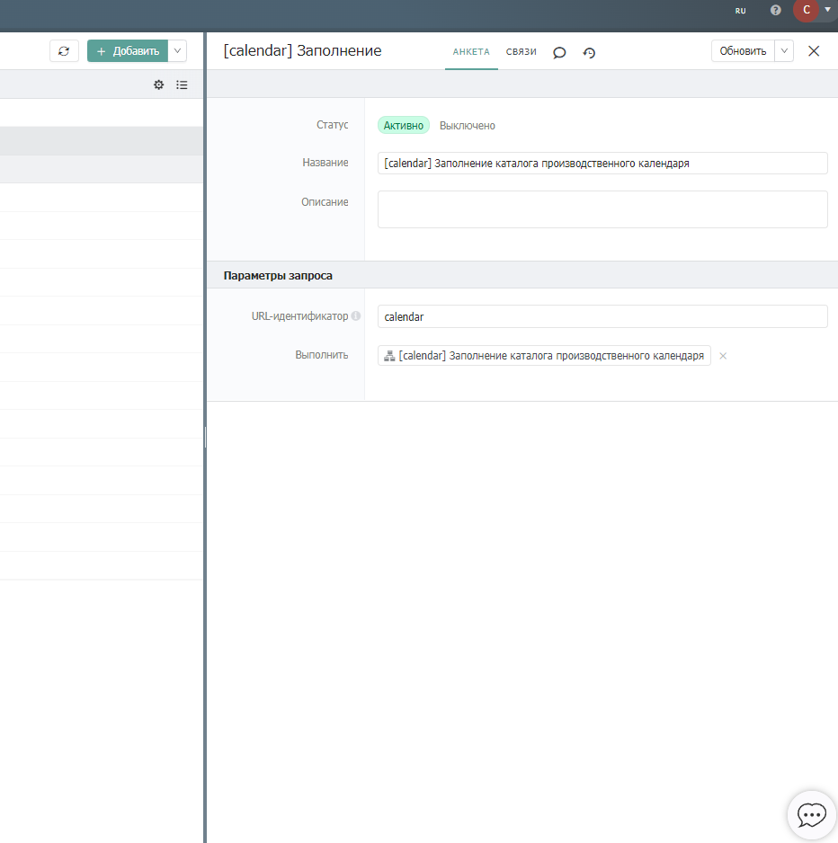

# Производственный календарь

### Описание

Время от времени для различных задач в системе требуется информация о том, какие вообще дни в текущем году являются выходными а какие нет, например чтобы предусматривать планирование и распределение задач различных сотрудников в системе, в зависимости от текущего дня. Для этих целей можно реализовать отдельный каталог, оформленный в виде справочника.

### Сценарии использования

Предположим, что у нас есть каталог приема обращений, тезисной сущностью этого каталога являются обращения от граждан по различному поводу, соответственно на каждое обращение должен отреагировать какой либо специализированный на этом вопросе менеджер в рамках какого либо времени. Но тут важно иметь ввиду, что у организации может быть выходное время в данный день или период времени и соответственно день в день он не сможет обработать обращение, значит нам нужно сдвинуть время обработки до ближайшей рабочей даты. Собственно говоря, в этом вопросе нам и должен помощь каталог производственного календаря.

### Структура

#### Каталог обращений

Давайте первую очередь создадим самую верхнеуровневую сущность, а именно каталог обращений.

Для реализации подобного, нам нужно создать в системе Бипиум структуру будущего каталога и сохранить ее.

Пример структуры каталога:

<figure><figcaption></figcaption></figure>

Соответственно у обращения как сущности есть приставленный к нему сотрудник, его статус рассмотрения, так же время в которое данное обращение будет рассмотрено.

#### Каталог производственного календаря

Ниже представлена структура производственного календаря.

<figure><figcaption></figcaption></figure>

Соответственно по этой структуре, какой либо день имеет: дату и тип.&#x20;

А так же, время начала рабочего дня и его окончания.

### Автоматизации

Для того чтобы заполнить каталог производственного календаря, нужно создать запись сценария и прикрепить файл bpmn ниже,  далее приложить его к внешнему запросу таким образом:

<figure><figcaption></figcaption></figure>

Далее, внутри самого сценария нужно поправить данные в первой компоненте назначения переменных на актуальные, так же в компоненте создания записей выбрать заранее созданный каталог производственного календаря:

<figure><figcaption></figcaption></figure>


Файл сценария


После перечисленных манипуляции нужно перейти на адрес: https://\[наименование домена].bpium.ru/api/webrequest/\[указанный идентификатор внешнего запроса ранее]

После того, как отработает сценарий мы сможем обратиться к каталогу производственного календаря и увидеть те данные которые соответствуют всему текущему году:

<figure><figcaption></figcaption></figure>

Следующим шагом будет написание сценария, который автоматически подставлять дату следующего рабочего дня при создании обращения, для этого нужно в каталоге событий создать подобную запись:

<figure><figcaption></figcaption></figure>

Далее нужно создать и приложить сценарий ниже:



Внутри самого сценария, нужно отредактировать необходимый каталог в компоненте поиска записей.

<figure><figcaption></figcaption></figure>

Теперь остается только сохранить сценарий и соответсвенно при появлении записи в каталоге обращений время обработки автоматически установится в начало ближайшего рабочего дня.

<figure><figcaption></figcaption></figure>
