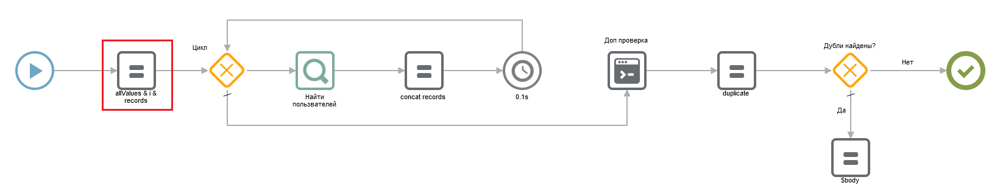

# Запрет на создание дубликатов в каталоге

## 1. Введение

Дубликаты записей в каталоге могут появляться по различным причинам, например по невнимательности оператора или при импорте данных. Если нужно, чтобы дубликаты не появлялись, то запретите создание дубликатов по одному или нескольким уникальным полям (например по полю email в «Пользователях»).

Почему дубликаты не нужны:

* Засоряют каталог
* Данные по одной сущности хранятся в нескольких записях
* Невозможно вести отчётность
* Логика сценариев автоматизации может быть нарушена

## 2. Принцип работы

<figure><figcaption></figcaption></figure>

При сохранении записи сценарий по указанному полю (например, email «Контакты») ищет другие записи с тем же значением поля. Если такие записи найдутся — сценарий запретит сохранение текущей записи и выведет ошибку.

## 3. Реализация

Создайте тестовый каталог «Пользователи». Записи этого каталога будут представлять упрощенную модель пользователя. Критерием уникальности будет поле «Почтовый адрес», так как его значения не могут пересекаться у разных пользователей.

<figure><figcaption></figcaption></figure>

* **Имя** (текст)\
  Описание: Имя пользователя.\
  Настройки: Текст.
* **Фамилия** (текст)\
  Описание: Фамилия пользователя.\
  Настройки: Многострочный текст.
* **Почтовый адрес** (контакт)\
  Описание: Почтовый адрес, по нему будет определяться уникальность пользователя.\
  Настройки: Электронная почта.

Общий принцип не зависит от конкретной реализации, и зависит от бизнес-процессов. В случае, например, с каталогом заказов это может быть сложный критерий из нескольких полей, например: ИНН + сумма + адрес.

### 3.1. Событие для запуска

Создайте событие для запуска сценария проверки дубликатов. Для запуска сценария используется событие с типами «Запрос на создание записи» и «Запрос на изменение записи». Это событие отслеживает поле с почтой и запускается при его изменении.

<figure><figcaption></figcaption></figure>

При изменении поля с почтой в карточке каталога и сохранении записи событие запускает [сценарий проверки](https://drive.google.com/file/d/1aDPilKFseHh75ksXZ_9me_i_1HYDvOGd/view?usp=sharing).

### 3.2. Сценарий проверки

Сценарий для проверки записи на уникальность выглядит следующим образом:

<figure><figcaption></figcaption></figure>

Сценарий выполняет:

* Поиск записей в которых указаны почты из текущей записи. Поиск производится для всех почт (осуществляется в цикле по всем почтам записи).
* Добавление найденных записей в массив дубликатов.
* Дополнительную проверку на полное соответствие найденных и текущих почт в блоке «Код». Этот шаг нужен для того чтобы исключить записи с почтами которые были найдены по вхождению подстроки.
* Проверку массива дубликатов. Если он пуст – разрешает сохранение записи. Если нет – запрещает сохранение и выводит предупреждение.

В сценарии необходимо изменить следующие компоненты: allValues & i & records

Замените в компоненте значение переменной targetCatalogId на id каталога «Пользователи» и значение targetFiledId на id поля с почтой в этом каталоге.

## 4. Тестирование

Создайте несколько записей в каталоге «Пользователи». Далее, попробуйте сохранить новую запись с ранее использованным адресом электронной почты. Если все настроено верно, то система запретит создание записи и выведет на экран предупреждение.

<figure><figcaption></figcaption></figure>
