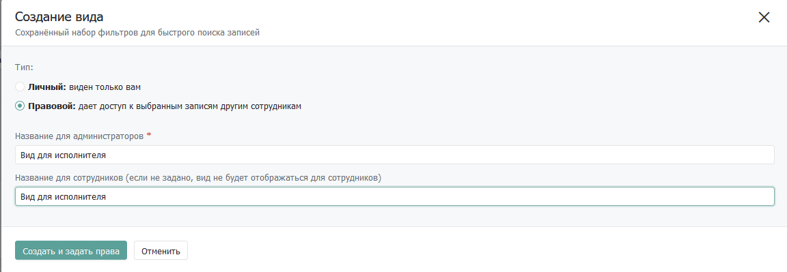

# Реализация механизма согласования записей

## 1. **Введение**

На предприятиях встречается кейс, когда необходимо согласовывать результаты работы в рамках некоторых задач с ответственным по этим задачам лицом. Рассматривая способы реализации подобного механизма в Бипиуме, одним из возможных путей решения является отождествление задач с записями в каталоге. Тогда, в рамках подобной модели, процесс согласования задач будет представлять собой согласование записи в Бипиуме: создание записи ответственным лицом, заполнение результатов работы исполнителем, согласование записи ответственным.

## **2. Принцип работы**

.jpg>)

Сотрудник с повышенными привилегиями создает запись в каталоге и назначает ее ответственному на заполнение. Ответственный видит новую запись в каталоге и начинает заполнять ее, переводя статус заполнения в соответствующее значение. После окончания процесса заполнения сотрудник переводит статус в значение «Заполнено», тем самым отправляя запись на рассмотрение сотруднику с повышенными привилегиями. Повышенный сотрудник выносит вердикт о корректности данных. Если данные корректны, то запись принимается, если нет — **** отправляется на дозаполнение, меняя статус работ с «Заполнено» на «В работе». Контроль над процессом перевода статусов осуществляет сценарий ролевой приемки, запрет определенных полей к редактированию производится с использованием правовых привилегий и видов Бипиума.

## **3. Реализация**

Частный случай реализации механизма согласования можно описать следующим образом. Существует каталог, в котором необходимо согласовывать записи. Этот каталог может содержать в себе произвольные поля, однако обязательно должен иметь набор полей, являющихся пусковыми для запуска механизма согласования. Набор пусковых полей для каталога можно сформировать следующим образом:

* Необходим статус, указывающий на текущее состояние заполненности записи. Исполнитель должен изменять его в процессе заполнения записи и при окончании заполнения. Этот статус необходим для подтверждения исполнителем факта заполненности записи и оповещении системы о том, что запись необходимо отправить на согласование.
* Второй необходимый статус **—** статус согласования. Статус согласования заполняется ответственным за запись сотрудником и оповещает систему о корректно или же некорректно заполненной записи. Если запись была заполнена некорректно, то система переводит статус работы над записью в положение, сигнализирующее о том, что запись все еще не заполнена. В случае же корректно заполненной записи ответственный выставляет соответствующее значение статуса, что сигнализирует системе о том, что процесс согласования завершился.

Пример подобной реализации механизма согласования можно увидеть на скриншотах ниже. В этой реализации для каждого из сотрудников были созданы соответствующие роли и настроены права таким образом, чтобы только сотрудники с соответствующими ролями могли редактировать пусковые поля записи. Сотрудник с противоположной от меняющего ролью может только видеть это поле, но не редактировать его. Переключение статусов в этом случае осуществляет соответствующий сценарий, который следит за значениями пусковых статусов.

Выше представлен скриншот записи, которую создает ответственный сотрудник. Он может редактировать все поля записи, кроме полей «Статус работ», «Описание выполненных работ» и «Принимающий». Поля «Статус работ» и «Описание выполненных работ» заполняются только исполнителем, поле «Принимающий» - доступно для изменения только через API и по умолчанию содержит в себе сотрудника, который создает эту запись.

Рассмотрим эту же запись, но от лица назначенного за ее заполнение исполнителя:

Видим, что исполнитель не может редактировать поля, которые ему не предназначены. В процессе заполнения исполнитель выставляет пусковой «Статус работ» в значение «В работе», по окончанию заполнения - в значение «Готово». При переключении статуса в любые из значений система понимает, что исполнитель произвел с записью некоторые действия и, соответственно, может отреагировать. В нашем примере система реагирует только на переключение статуса в значение «Готово», однако, при необходимости, всегда можно обрабатывать и состояние «В работе».

В том случае, если исполнитель отметил запись как заполненную (перевел «Статус работ» в значение «Готово»), сценарий обработки записи автоматически задаст значение «Статусу приемки» - «На рассмотрении».

Новое значение поля «Статус приемки» сигнализирует ответственному сотруднику о готовности записи к проверке. При открытии этой же карточки ответственный выносит вердикт о корректности данных и запись может перейти в два состояния:

Первое состояние — запись была отправлена на доработку.

При отправке записи на доработку «Статус работ» меняется на значение «В работе». Это сигнализирует исполнителю о необходимости корректировки записи, так как в процессе согласования она была отклонена. После доработки записи исполнитель вновь отправляет ее на согласование переведя «Статус работ» в значение «Готово» и процесс согласования повторяется.

Второе состояние — запись была принята.

В случае успешного согласования записи ответственным сотрудником процесс согласования завершается. Оба статуса остаются в своих выставленных значениях, а «Статус приемки» - «Принято» информирует исполнителя о том, что запись была согласована. В описанном выше варианте система не предпринимает дальнейших действий после перевода «Статуса приемки» в состояние «Принято», однако, при необходимости, можно обрабатывать и этот случай, например отправлять уведомления исполнителю о том, что его запись успешно согласовали.

Далее описан механизм настройки каталога в системе для работы аналогичным описанному выше образом.

### 3.1. Создание ролей и привязка сотрудников

#### **3.1.1. Создание ролей в системе**

Первым шагом в реализации механизма согласования является создание ролей в системе. Роли необходимы для группирования некоторого числа сотрудников по различным зонам ответственности. В нашем кейсе это необходимо для разделения пользователей, которые могут быть ответственными за согласование от исполнителей.

В секции «Управление» создайте новый каталог «Роли» и заполните его, следуя инструкции ниже:

* **Роль** (текст)\
  ****Описание: Наименование роли.\
  Настройки: Обязательное.

Заполните созданный каталог, согласно ролевой политике, которую вы собираетесь использовать в системе. Например:

.png>)

Впоследствие каждого сотрудника в системе можно отождествлять с соответствующей ролью в системе. Связь сотрудника с ролью необходима для настройки правовых политик системы под конкретные роли и их применения для всех сотрудников с соответствующей ролью. Например, можно закрыть доступ к созданию записей в определенном каталоге для всех сотрудников с ролью «Исполнитель», ограничить видимость каталогов или целых отделов и тому подобное.

Подробнее с описанием правовой системы Бипиума можно ознакомиться в [соответствующей](https://docs.bpium.ru/manual/rights) статье.

В нашем конкретном примере ролевой приемки необходимо создать две роли - «Исполнитель» и «Проверяющий». Роль «Админ» необходима для администратора системы, пользователя с полным доступом к системе.

#### 3.1.2. Привязка ролей к сотрудникам

В системном каталоге «Сотрудники» (обычно находится в секции «Управление») добавьте новое поле типа «Связанный каталог» и назовите его «Роль»:

* **Роль** (связанный каталог)\
  Описание: Связывает сотрудника в системе с определенной ролью.\
  Настройки: Связь с каталогом «Роли».

После создания нового поля для существующих сотрудников появится возможность выбора созданных ролей, например:

После выбора определенной роли у сотрудника, ему будет открыт доступ только к тем секциям/каталогам/записям, для доступа к которым у него есть соответствующее разрешение. Для разработчика системы назначьте роль «Админ», это необходимо сделать для того, чтобы не столкнуться с ролевыми ограничениями в процессе настройки правовой политики в дальнейшем. На данном этапе выбор роли ни на что не влияет, так как правовые виды еще не настроены. Процесс настройки правовой политики и видов будет описан ниже.

### 3.2. Настройка каталога ролевой приемки

#### 3.2.1. Настройка структуры каталога

В каталоге, в котором необходимо реализовать ролевую приемку, создайте следующие поля:

* **Исполнитель** (Сотрудник)\
  Описание: Содержит ответственного за заполнение записи сотрудника.\
  Только этот сотрудник может изменять статус «Статус для исполнителя» (описан ниже).\
  Настройки: Обязательное поле.
* **Статус для исполнителя** (Статус)\
  Описание: Отражает статус заполнения записи в каталоге назначенным в поле «Исполнитель» сотрудником. Является пусковым полем.\
  Значения: «В работе», «Готово».
* **Статус для принимающего** (Статус)\
  Описание: Отражает статус приемки записи сотрудником из поля «Принимающий». Является пусковым полем.\
  Значения: «На рассмотрении», «Принято», «На доработку».
* **Принимающий** (Сотрудник)\
  Описание: Содержит ответственного за приемку записи сотрудника. Как правило этот же сотрудник создает запись.\
  Настройки: Редактируемое только через API, По умолчанию: текущий сотрудник.

Процесс приемки происходит следующим образом:

* Сотрудник с ролью «Проверяющий» создает запись в каталоге, назначает исполнителя в поле «Исполнитель» и сохраняет запись.
* Сотрудник с ролью «Исполнитель» открывает запись, переводит «Статус для исполнителя» в значение «В работе» и заполняет оставшиеся произвольные поля, которые для него предназначены.
* После полного заполнения всех своих полей «Исполнитель» переводит «Статус для исполнителя» в статус «Готово», тем самым сценарно меняя «Статус для проверяющего» в значение «На рассмотрении».
* Сотрудник с ролью «Проверяющий» видит, что «Статус для принимающего» перевелся в значение «На рассмотрении» и оценивает заполненные «Исполнителем» данные.
* «Принимающий» выносит вердикт о корректности введенных данных и переводит «Статус для Принимающего» в соответствующее значение. Если «Принимающий» переводит статус в значение «Принято», то запись принимается и ничего не происходит. Если он переводит статус в значение «На доработку», то «Статус для исполнителя» сценарно переводится в значение «В работе» и процесс приемки начинается сначала.

Для того, чтобы реализовать механизм вышеописанным образом необходимо реализовать сценарий переключения статусов и настроить правовые виды в каталоге. Механизмы настройки правовых видов и реализации сценария описаны ниже.

#### 3.2.2. Настройка правовой политики

**Права доступа к каталогу**

В каталоге ролевой приемки необходимо настроить два типа прав: права доступа каталога и правовые виды.

Для настройки прав доступа каталога откройте окно настройки прав следующим образом:

Открывшееся окно выглядит следующим образом:

В этом окне необходимо настроить ролевой доступ к каталогу для всех ролей, которые будут в нем работать. Подробное описание возможных значений доступа описано [здесь](https://docs.bpium.ru/manual/rights/rules). В нашем конкретном примере нас интересуют роли «Проверяющий» и «Исполнитель».

* «Проверяющий» должен иметь полный доступ к каталогу (изменение, создание, удаление записей). В конкретном выше кейсе указан вариант, когда проверяющий может редактировать все поля каталога, кроме «Статуса для исполнителя» и дополнительного текстового поля, которое заполняет только «Исполнитель». В общем случае это ограничение можно убрать и дать возможность «Проверяющему» редактировать любые поля в записи.
* «Исполнитель» должен иметь доступ «Видеть каталог в меню». Оставшиеся доступы будут назначены исполнителю в рамках его собственного правового вида.

**Правовые виды**

Для сотрудника с ролью «Исполнитель» необходимо назначить правовой вид для возможности сотрудника изменять созданные «Проверяющим» записи. Окно создания правового вида возможно открыть при сохранении выбранных в каталоге фильтров:

В данном кейсе рассматривается случай, когда «Исполнитель» может видеть только те записи, в которых он является ответственным. В общем случае можно дать доступ «Исполнителю» видеть все записи, если это необходимо, выбрав какой-либо иной критерий для фильтрации записей.

После нажатия кнопки «Сохранить» открывается окно создания правового вида:

Необходимо выбрать «Тип» - «Правовой», для того, чтобы вид был доступен для всех сотрудников с определенной ролью. Далее открывается окно назначения сотрудников/ролей:

Необходимо добавить роль «Исполнитель» с возможностью изменения записи, однако «Исполнитель» должен иметь доступ к изменению только определенных полей в записи. Для настройки доступа «Исполнителя» к конкретным полям откройте окно редактирования доступа к полям каталога, нажав на иконку справа от «Изменять записи»:

На скриншотах выше представлен пример настройки доступа к полям у «Исполнителя». В общем случае «Исполнителю» в обязательном порядке необходимо дать доступ к изменению его статуса (на скриншоте выше - «Статус работ») и изменению иных полей, которые ему предназначены. Доступ ко всем остальным полям необходимо перевести в значение «Видеть».

Итоговый результат настройки прав:

* «Исполнитель» имеет доступ к изменению только тех полей, которые ему предназначены в записях, в которых он является ответственным.
* «Проверяющий» может создавать новые записи, изменять существующие и удалять их. «Проверяющий» назначает «Исполнителя» на запись. «Проверяющий» не может изменять только те поля, которые предназначены для заполнения «Исполнителем».

### 3.3. Настройка автоматизации

#### **3.3.1 Создание сценария ролевой приемки**

В системном каталоге «Сценарии» создайте новую запись и заполните ее следующим образом:

В качестве файла сценария приложите [следующий файл](https://drive.google.com/file/d/12u01kbPp519TlKjOXGhVYn-UnFkR5ZUo/view?usp=sharing).

Загруженный сценарий выглядит следующим образом:

Сценарий проверяет статусы заполняемости/приемки и производит следующий действия:

* При изменении статуса работ на «Готово» проверяет пользователя, который перевел статус. Если статус перевел пользователь из поля «Ответственный», то сценарий меняет статус приемки на значение «На рассмотрении». Если статус перевел другой пользователь, то сценарий запрещает изменение записи и уведомляет пользователя о невозможности перевести статус в это значение.
* При изменении статуса приемки на значение «На доработку» меняет статус работ на значение «В работе».

Внутри сценария необходимо изменить следующие компоненты:

* Условная стрелка к компоненту «Меняет ответственный»\
  ****Замените значение «6» на id поля статуса для «Исполнителя».
* Условная стрелка к компоненту «Какой статус работ выставлен?»\
  Замените значение «4» на id поля «Ответственный».
* Условная стрелка к компоненту «Статус приемки — На рассмотрении»\
  Замените значение «6» на id поля статуса для «Исполнителя».
* Компонент «Статус приемки — На рассмотрении»\
  Замените значение «9» на id поля статуса для «Принимающего».\
  Замените значение «1» на значение статуса «На рассмотрении».
* Условная стрелка к компоненту «Статус приемки — На доработку?»\
  Замените значение «9» на id поля статуса для «Принимающего».
* Условная стрелка к компоненту «Статус работ — В работе»\
  Замените значение «9» на id поля статуса для «Принимающего».\
  Замените значение «3» на значение статуса «На доработку».
* Компонент «Статус работ — В работе»\
  Замените значение «6» на id поля статуса для «Исполнителя».\
  Замените значение «1» на значение статуса «В работе».

#### **3.3.2 Создание события для сценария приемки**

В системном каталоге «События» создайте новую запись и заполните ее следующим образом:

Вместо значений «6» и «9» впишите id ваших полей типа статус для «Исполнителя» и «Принимающего». Таким образом, сценарий будет запускаться каждый раз при изменении одного из этих статусов при создании/изменении записи.

## **4. Тестирование**

### 4.1. Настройка структуры данных

#### 4.1.1. Настройка структуры каталога ролевой приемки

Создайте каталог «Каталог для приемки» и настройте его, как показано на скриншоте ниже. Все поля необходимо создавать в том же порядке, для сохранения последовательности их id:

* **Наименование** (Текст)\
  ****Описание: Содержит наименование работы для приемки. Может заполняться только пользователями с ролью «Проверяющий».\
  Настройки: Обязательное поле, Текст.
* **Описание работ** (Текст)\
  Описание: Содержит описание работ, которые необходимо выполнить. Может заполняться только пользователями с ролью «Проверяющий».\
  Настройки: Обязательное поле, Многострочный текст.
* **Ответственный** (сотрудник)\
  Описание: Содержит в себе сотрудника, ответственного за выполнение работы. Только сотрудник, выбранный в этом поле может изменять поле «Статус работ». Может заполняться только пользователями с ролью «Проверяющий».\
  Настройки: Обязательное поле.
* **Статус работ** (статус)\
  Описание: Содержит статус выполнения работы, заполняется ответственным из поля «Ответственный».\
  Значения: «В работе», «Готово».
* **Описание выполненных работ** (текст)\
  Описание: Содержит описание проведенных ответственным работ.\
  Настройки: Многострочный текст.

* **Статус приемки** (статус)\
  Описание: Содержит результат проверки записи Принимающим. Может заполняться только «Проверяющим», создавшим запись.\
  Значения: «На рассмотрении», «Принято», «На доработку».
* **Принимающий** (сотрудник)\
  Описание: Содержит сотрудника с ролью «Проверяющий», создавшим запись.\
  Настройки: По умолчанию: текущий сотрудник.

### 4.2. Настройка ролевой политики

#### 4.2.1. Создание ролей и их привязка

В каталоге роли создайте следующие роли и свяжите их с тестовыми сотрудниками:

#### 4.2.2. Настройка правового доступа

Настройте правовой доступ к созданному каталогу следующим образом:

.png>)

Для «Проверяющего» выставьте значение полей «Статус работ» и «Описание выполненных работ» в значение «видеть». Все остальные поля оставьте в значении «изменять»:

Таким образом, сотрудник с ролью «Проверяющий» сможет изменять значения всех полей кроме «Статус работ» и «Описание выполненных работ». Эти поля «Проверяющий» сможет только видеть.

В панели фильтров выберите значение поля «Ответственный» — «Сотрудники.Я» и создайте новый правовой вид, согласно скриншотам ниже:

.png>)

Для «Исполнителя» выставьте значение полей «Статус работ» и «Описание выполненных работ» в значение «изменять». Все остальные поля переведите в значение «видеть».

Таким образом, сотрудник с ролью «Исполнитель» сможет изменять только поля «Статус работ» и «Описание выполненных работ». Остальные поля он сможет только видеть.

### 4.3. Настройка автоматизации

В качестве сценария загрузите [сценарий](https://drive.google.com/file/d/12u01kbPp519TlKjOXGhVYn-UnFkR5ZUo/view?usp=sharing), описанный выше. Если все поля в тестовом каталоге создавались в том же порядке, как описано выше, то вносить правок в сценарий не требуется. Если порядок полей отличается, то предварительно отредактируйте сценарий, согласно комментариям выше.

В системном каталоге «События» создайте новую запись и заполните ее следующим образом:

Если все поля в тестовом каталоге создавались в том же порядке, как описано выше, то вносить правок в сценарий не требуется. Если порядок полей отличается, то впишите вместо значений «6» и «9» id полей типа статус для «Исполнителя» и «Проверяющего».

### 4.4. Тестирование приемки

Авторизуйтесь пользователем с ролью «Проверяющий» и создайте в настроенном каталоге новую запись. В качестве ответственного выберите пользователя с ролью «Исполнитель». Пример заполнения записи:

.png>)

Обратите внимание, что в конкретном кейсе поля «Статус работ» и «Описание выполненных работ» недоступны для редактирования «Проверяющему».

Далее авторизуйтесь пользователем с ролью «Исполнитель», который был выбран в поле «Ответственный» и перейдите в тот же каталог. В каталоге должна появиться запись, заполненная ранее. Откройте эту карточку. Пример открытой карточки:

«Исполнителю» доступны для изменения только два поля: «Статус работ» и «Описание выполненных работ». Заполните поле «Описание выполненных работ» и переведите поле «Статус работ» в значение «Готово». «Статус приемки» должен поменять свое значение на «На рассмотрении»:

Обратите внимание, что если статус работ каким-либо образом будет изменен пользователем не из поля «Ответственный», то сценарий не даст сохранить запись, выдав при сохранении соответствующее сообщение:

Вновь авторизуйтесь пользователем с ролью «Проверяющий», создавшим запись, и откройте карточку. Переведите «Статус приемки» в значение «На доработку» и сохраните запись. Поле «Статус работ» должно изменить значение на «В работе»:

