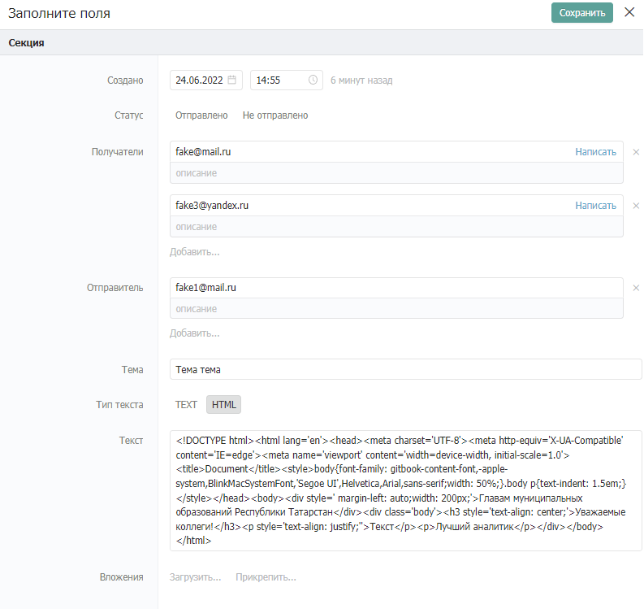
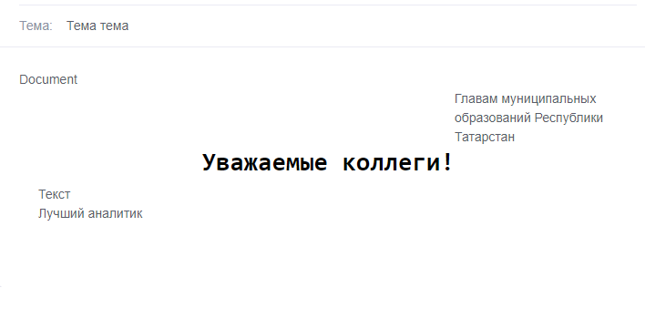

# Создание каталога для рассылки почты

## 1. **Введение**

Каталог для рассылки почты — способ отправки сформированных сообщений на почтовые ящики получателей. Отправка сообщения производится с использованием специального каталога, в записях которого фиксируются адреса получателей, тема и текст сообщения. Текст сообщения может быть задан как обычный текст, так и произвольная HTML-разметка. Каталог позволяет удобно отправлять сообщения путем создания новых записей и следить за историей всех отправленных сообщений.

## **2. Принцип работы**

При создании записи в каталоге «Уведомления» срабатывает сценарий по отправке сообщения по данным из полей созданной записи. После выполнения в записи появляется информация о статусе отправки и сообщение отправляется адресату.

## **3. Реализация**

### **3.1. Настройка структуры каталога «Уведомления»**

Создайте каталог «Уведомления», данный каталог будет содержать информацию о всех осуществленных рассылках. Создание записи в каталоге инициирует рассылку сообщения на почтовые адреса, указанные в записи каталога. Настройка полей представлена на скриншоте ниже, создавать поля необходимо в том же порядке:

* **Создано** (Дата)\
  Описание: содержит информацию дате начала рассылки.\
  Настройки: по умолчанию текущая дата и время.
* **Статус** (Статус)\
  Описание: информация о результате рассылки.
* **Получатели** (Контакт)\
  Описание: Почтовые адреса получателей.
* **Отправитель** (Контакт)\
  Описание: Почтовый адрес отправителя.
* **Тема** (Текст)\
  Описание: Тема письма.
* **Тип текста** (Статус)\
  Описание: Выбор типа данных в поле «Текст». Значения поля: «TEXT», «HTML».
* **Текст** (Текст)\
  Описание: Сообщение отправляемое по почте.
* **Вложения** (Файл)\
  Описание: Прикрепляемые к сообщению документы.

### **3.2. Настройка автоматизации**

#### **3.2.1. Создание записи сценария**

Создайте новую запись в системном каталоге «Сценарии». Заполните обязательные поля карточки произвольным образом и прикрепите в поле «Сценарий» [следующий файл](https://drive.google.com/file/d/1UWCBzrNEju3rt6PO-0IqBL6Pn\_KzYKEq/view?usp=sharing), нажав на кнопку «Загрузить…»:

.png>)

#### **3.2.2. Создание записи события**

Перейдите в системный в каталог «События» (обычно он находится в отделе Управление) и создайте новую запись. Заполните запись следующим образом:

В поле «Выполнить» в качестве сценария выберите созданный на предыдущем шаге сценарий.

**3.2.3. Настройка файла сценария**

Сценарий для отправки сообщения выглядит следующим образом:

<figure><figcaption></figcaption></figure>

В загруженном сценарии отредактируйте следующие компоненты, согласно комментариям внутри них:

**Компоненты «Отправка почты».**

* Адрес сервера и Порт: укажите действующий логин и пароль почтового ящика в кавычках.

**Компоненты** **«Фиксируем удачную отправку» и «Фиксируем ошибку отправки».**

* Каталог: укажите ID каталога «Уведомления», либо из выпадающего списка выберите каталог «Уведомления».

## **4. Тестирование**

### **4.1. Каталог «Уведомления»**

Создайте запись в каталоге «Уведомления». В поле «Отправитель» введите почту, аналогичную почте в компоненте разработанного сценария. В поле «Получатели» введите почты всех получателей. Выберите тип письма, введите его тему, текст и при необходимости приложите вложения. Пример заполнения представлен ниже:

После заполнения всех необходимых полей сохраните запись.

### 4.2. Результат

После сохранения записи проставляется значение в поле «Статус». Проставленное значение сигнализирует об успешной или неудачной отправке сообщения. При успешной отправке сообщения на все почты получателей будет отправлено письмо. Пример полученного письма из данных, описанных выше:

