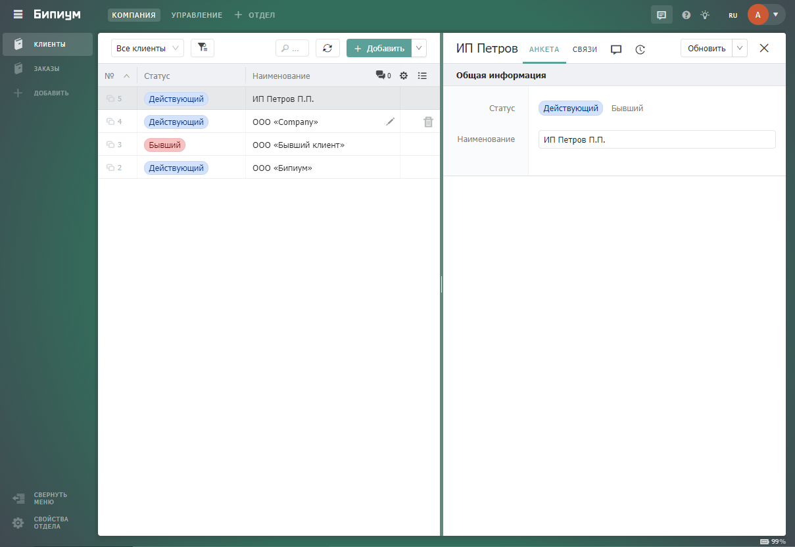
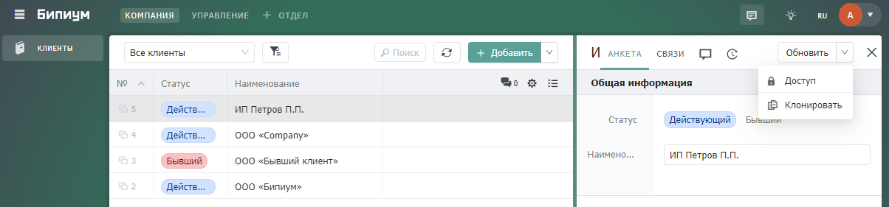
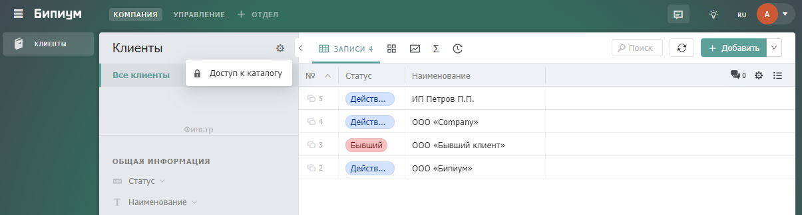

# Складской учет

## 1. Введение

Вы ведете деятельность, связанную с товарооборотом: обработку поступлений и списаний товаров, фиксацию остатка товаров на складе. Бипиум автоматизирует процесс складского учета товаров, позволяя хранить весь остаток по товарам в одном месте. Вы можете в один клик формировать операции поступления или списания и фиксировать их для быстрого доступа к истории всех таких операций.

## **2. Принцип работы**

<figure><figcaption></figcaption></figure>

Параметры товаров хранится в каталоге «Товары». При создании записи в каталоге «Операции с товарами» для выбранных товаров производятся операции поступления или списания, изменяя их остаток на складе. При этом:

* Если товара на складе (каталог «Склад») еще нет – то при поступлении он появится на складе.
* Если остаток по товару меньше чем число списания, то товар списан не будет.
* Если производится попытка произвести операцию из записи, откуда она уже была проведена, то сценарий запрета не даст это сделать.
* Для указанных на схеме каталогов есть [сценарии генерации наименования](https://docs.bpium.ru/cases/automations/sozdanie-naimenovanii-zapisei).

## **3. Реализация**

### **3.1. Структура каталогов**

#### **3.1.1. Каталог «Товары»**

Создайте каталог «Товары». В этом каталоге будут собраны все товары с их атрибутами. В качестве примера для товаров оставлены два ключевых атрибута: наименование и цена. Пример структуры каталога:

<figure><figcaption></figcaption></figure>

* **Наименование** (текст)\
  Описание: Наименование товара, например «Шоколадный батончик».\
  Настройки: Текст.
* **Цена** (число)\
  Описание: Цена за единицу товара.\
  Настройки: Укажите единицу измерения.

Кроме указанных полей, вы можете добавить любые другие, если это необходимо.

#### **3.1.2. Каталог «Склад»**

Создайте каталог «Склад». В этом каталоге фиксируется остаток товаров на складе. Пример структуры каталога:

<figure><figcaption></figcaption></figure>

* **Наименование** (текст)\
  Описание: Наименование товара в складе. Будет автоматически сгенерировано сценарием.\
  Настройки: Текст, редактируемое только через API.
* **Товар** (связанный каталог)\
  Описание: Связь с каталогом «Товары», нужна для выбора товара.\
  Настройки: Связь с каталогом «Товары».
* **Остаток** (число)\
  Описание: Хранит остаток товара на складе.\
  Настройки: Укажите единицу измерения.

Кроме указанных полей, вы можете добавить любые другие, если это необходимо.

#### **3.1.3. Каталог «Товары и количество»**

Создайте каталог «Товары и количество». Это служебный каталог, который содержит в своей записи товар и его количество. Записи в этом каталоге создаются через каталог «Операции с товарами». Заполните структуру каталога следующим образом:

<figure><figcaption></figcaption></figure>

* **Наименование** (текст)\
  Описание:  Наименование записи. Будет автоматически сгенерировано сценарием.\
  Настройки: Текст, редактируемое только через API.
* **Товар** (связанный каталог)\
  Описание: Связь с каталогом «Товары». Нужна для выбора товара в записи.\
  Настройки: Связь с каталогом «Товары».
* **Количество** (число)\
  Описание: Содержит число выбранного товара в записи.
* **Системная информация** (секция)\
  Описание: Логическое разделение заполняемых и системных полей.
* **Связи (связанный каталог)**\
  ****Описание: Связь с каталогом «Операции с товарами», откуда будут создаваться записи в каталоге «Товары и количество».\
  Настройки: Связь с каталогом «Операции с товарами», редактируемое только через API.

#### **3.1.4. Каталог «Операции с товарами»**

Создайте каталог «Операции с товарами». Этот каталог производит списание/начисления выбранных товаров на склад в заданном количестве. Заполните структуру каталога следующими полями:

<figure><figcaption></figcaption></figure>

* **Наименование** (текст)\
  Описание: Наименование записи операции. Генерируется автоматически сценарием.\
  Настройки: Многострочный текст.
* **Операция** (статус)\
  Описание: Используется для выбора между поступлением и списанием.\
  Варианты: Поступление, Списание.
* **Дата** (дата)\
  Описание: Дата операции.
* **Товары** (связанный каталог)\
  Описание: Связь с каталогом «Товары и количество», используется для выбора товаров и их количества для совершения операции.\
  ****Настройки: Связь с каталогом «Товары и количество», можно связывать несколько записей, убрать галочку «можно выбирать из существующих», проставить галочку «создание без всплывающего окна», расширенные поля: «Товар» (изменять), «Количество» (изменять).
* **Документы** (файл)\
  Описание: Документы, связанные с операцией (напр. накладные).\
  Настройки: Можно загрузить несколько файлов.
* **Выполнение** (секция)\
  Описание: Разделение полей с результатами операции.
* **Статус** (статус)\
  Описание: Статус завершенности операции.\
  Варианты: Готово, Ошибка.\
  Настройки: Редактируемое только через API.
* **Описание ошибки** (текст)\
  Описание: Сообщение ошибки.\
  Настройки: Многострочный текст, видимость по значению статуса «Ошибка».
* **Системная информация** (секция)\
  Описание: Разделение полей с системной информацией.
* **Создано** (дата)\
  Описание: Время создания записи.\
  Настройки: С временем, по умолчанию: текущая дата, редактируемое только через API.
* **Создал** (сотрудник)\
  Описание: Сотрудник, создавший запись.\
  Настройки: По умолчанию: текущий сотрудник, редактируемое только через API.

### **3.2. Создание автоматизаций**

#### **3.2.1. Генерация наименований**

В процессе архитектуры складского учета вы можете столкнуться с необходимостью генерировать наименования созданных записей. О том зачем это нужно и как это реализовать подробно описано в статье «[Создание наименований записей](https://docs.bpium.ru/cases/automations/sozdanie-naimenovanii-zapisei)».

Наименования нужно генерировать в следующих каталогах:

* Склад
* Товары и количество
* Операции с товарами

**3.2.2. Наименования в каталоге «Склад»**

В системном каталоге «События» создайте новую запись и заполните ее следующим образом:

<figure><figcaption></figcaption></figure>

Это событие будет отслеживать сохранение записи при редактировании полей «Товар» и «Остаток». Из этих полей будет генерироваться наименование. В качестве сценария загрузите [сценарий генерации наименования в каталоге «Склад»](https://drive.google.com/file/d/1KDz4Tyh-kHAbWXJ5T7trTvf5NIBYpYAC/view?usp=sharing).

Сценарий генерации наименования в каталоге «Склад» выглядит следующим образом:

<figure><figcaption></figcaption></figure>

Сценарий выполняет:

* Генерацию наименования компонентом «Формируем тайтл»
* Запись наименования компонентом «Прокидываем тайтл в текущую запись»

В сценарии нужно изменить компоненты:

* fields:\
  Измените тестовые id полей в компоненте, согласно его описанию.

Изменить шаблон наименования можно в компоненте «Формируем тайтл».

#### **3.2.3. Наименования в каталоге «Товары и количество»**

В «Событиях» создайте новую запись и заполните ее следующим образом:

<figure><figcaption></figcaption></figure>

Это событие будет отслеживать сохранение записи при редактировании полей «Товар» и «Количество». Из этих полей будет генерироваться наименование. В качестве сценария загрузите [сценарий генерации наименования в каталоге «Товары и количество»](https://drive.google.com/file/d/1HHE-mhJBuPFac8b2GTxAOHRvSyIi-Ssi/view?usp=sharing).

Сценарий генерации наименования в каталоге «Товары и количество» выглядит следующим образом:

<figure><figcaption></figcaption></figure>

Принцип работы сценария полностью аналогичен предыдущему.

В сценарии нужно изменить компоненты:

* fields:\
  Измените тестовые id полей в компоненте, согласно его описанию.

Изменить шаблон наименования можно в компоненте «Формируем тайтл».

#### **3.2.4. Наименования в каталоге «Операции с товарами»**

В «Событиях» создайте новую запись и заполните ее следующим образом:

<figure><figcaption></figcaption></figure>

В качестве сценария загрузите [сценарий генерации наименования в каталоге «Операции с товарами»](https://drive.google.com/file/d/1rgyRvM8gcnjQwNiY-VYa1TH3OhyYvgIQ/view?usp=sharing).

Сценарий генерации наименования в каталоге «Товары и количество» выглядит следующим образом:

<figure><figcaption></figcaption></figure>

Принцип работы сценария полностью аналогичен предыдущему.

В сценарии нужно изменить компоненты:

* fields:\
  Измените тестовые id полей в компоненте, согласно его описанию.

Изменить шаблон наименования можно в компоненте «Формируем тайтл».

**3.2.5. Пополнение/списание количества товаров на складе**

В каталоге «События» создайте новую запись и заполните ее следующим образом:

<figure><figcaption></figcaption></figure>

Это событие отслеживает сохранение записи в каталоге «Операции с товарами». Сценарий запускается при изменении поля с товарами. В качестве сценария загрузите [сценарий списания/пополнения товара на складе](https://drive.google.com/file/d/1qWOaTeAk-NfYS352RQfpfazn-BxB8bvD/view?usp=sharing).

Сценарий списания/пополнения товара на складе выглядит следующим образом:

<figure><figcaption></figcaption></figure>

Сценарий выполняет:

* Проверку назначения типа операции и выбора товаров для операции.
* Циклическое увеличение или списание товаров на складе. Зависит от выбранного типа операции (поступление/списание).
* Проверку на возможность списания: если количество списываемого товара больше остатка на складе (или на складе нет выбранного товара) – сценарий выведет ошибку и не спишет товар со склада.
* Создание записи товара на складе при поступлении товара: если на складе не было записи с поступившим товаром, то она будет создана автоматически.

В сценарии необходимо изменить компоненты:

* fields:\
  Измените тестовые id полей в компоненте, согласно его описанию.

**3.2.6. Запрет на повторное проведение операции**

Запрещает повторное проведение операции из записи, по которой она уже проводилась.

В каталоге «События» создайте новую запись и заполните ее следующим образом:

<figure><figcaption></figcaption></figure>

Это событие отслеживает сохранение записи в каталоге «Операции с товарами». Сценарий запускается при изменении поля с товарами. В качестве сценария загрузите [сценарий запрета на повторное проведение операции](https://drive.google.com/file/d/1TN87rA-tksCFLq3uLo8v\_7RT9Kvjx4Z9/view?usp=sharing).

Сценарий запрета на повторное проведение операции выглядит следующим образом:

<figure><figcaption></figcaption></figure>

Сценарий выполняет:

* Проверку записи операции на завершенность: произошло ли ранее по этой записи начисление или списание.
* Если операция по записи уже проводилась – запрещает создание записи и выводит сообщение сотруднику.

В сценарии необходимо изменить компоненты:

* fields:\
  Измените тестовые id полей в компоненте, согласно его описанию.

**3.2.7. Прокидывание записи операции в запись товара и количества**

~~Автоматизация, прокидывающая созданную запись операции в записи товаров в этой операции. Нужно для обратной связи записей из каталога «Товары и количество» с записью каталога «Операции над товарами». Позволяет быстро найти все записи из «Товаров и количества», принадлежащие записям «Операций над товарами».~~

В каталоге «События» создайте новую запись и заполните ее следующим образом:

<figure><figcaption></figcaption></figure>

Это событие отслеживает сохранение записи в каталоге «Операции с товарами». Сценарий запускается при изменении поля с товарами. В качестве сценария загрузите [сценарий прокидывания операции в «Товары и количество»](https://drive.google.com/file/d/1WhfJBjyFOF3G23tFjoHPagWnSRMofD7o/view?usp=sharing).

Сценарий прокидывания операции в товары и количество выглядит следующим образом:

<figure><figcaption></figcaption></figure>

Сценарий выполняет:

* Циклическую подстановку созданной записи операции во все связанные записи из каталога «Товары и количество».

В сценарии необходимо изменить компоненты:

* fields:\
  ****Измените тестовые id полей в компоненте, согласно его описанию.

## **4. Тестирование**

В каталоге «Товары» создайте несколько записей товаров, например:

<figure><figcaption></figcaption></figure>

Перейдите в каталог «Операции с товарами». Создайте поступление для каждого из товаров:

<figure><figcaption></figcaption></figure>

Если всё настроено верно, то в каталоге «Склад» появятся записи для каждого из товаров с числами поступления:

<figure><figcaption></figcaption></figure>

Перейдите в каталоге «Операции с товарами». Создайте списание для каждого из товаров:

<figure><figcaption></figcaption></figure>

Если все настроено верно, то в каталоге «Склад» произойдет списание введенных количеств товаров:

<figure><figcaption></figcaption></figure>
