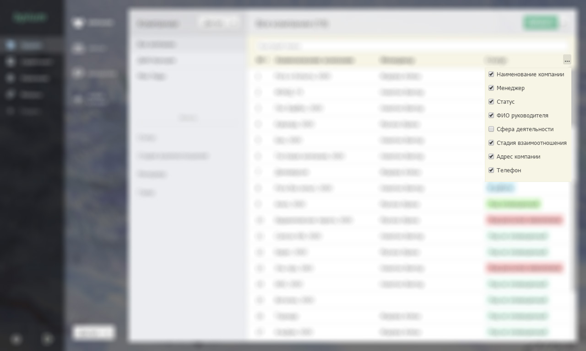

# Настройка отображения

## Режимы просмотра

На текущий момент Бипиум поддерживает два вида отображения записей — табличный и плиточный.

.png>)

Записи в табличном режиме отображения подгружаются по мере пролистывания вниз.

Записи  в плиточном режиме отображения загружаются в количестве 500 штук.

### Возможности в режиме таблицы

### Просмотр широкой таблицы

Когда отображено много колонок, таблицу можно смещать горизонтально. Для этого захватите мышкой за свободной место и потяните в соответствующую сторону. Если вы кликните над текстом, то вместо сдвига таблицы начнет выделяться текст.



### Сортировка записей

Чтобы отсортировать таблицу по одной из колонок, кликните по её заголовку. Повторный клик отсортирует данные в обратном порядке.

### Выбор колонок для отображения

В правом углу расположена кнопка выбора колонок — «...». Вы можете выбрать какие колонки отображать и в какой последовательности. Для этого перетащите названия колонок в списке мышкой.



Бипиум запомнит ваши настройки для дальнейшей работы.

### Изменение ширины колонок

Вы можете уменьшить или увеличить ширину колонок потянув за границу между ними.



### Поиск записей

Поле быстрого поиска позволяет находить записи по данным в текстовых полях: названиях, именах контактов, телефонах и адресах электронной почты. Для расширенного поиска используйте фильтры.



### Возможности в плиточном режиме

### Переход в плиточный режим

Для перехода в плиточный режим нужно нажать кнопку справа от кнопки Записи.

.png>)

### Построение

В плиточном режиме вы можете настроить параметры вывода по горизонтали и вертикали. Для этого необходимо нажать на шестеренку в правом углу где появится список настроек.&#x20;

.png>)

Так же можно подкрасить плитки цветом значения одного из полей типа Категория для более информативного отображения. \
В настройках существует возможность сортировать полученные данные по признаку выбранного вами поля.&#x20;

### Содержимое плитки

Нажав на кнопку настройки содержимого.

.png>)

После нажатия выпадет список где можно настроить поля которые вы хотите видеть и очередность их отображения.

### Изменение размеров столбцов

Для изменения размера столбцов необходимо навести курсор на границу столбца в строке разложения по горизонтали и потянуть в нужную сторону. \
При изменении размеров одного столбца автоматически меняется размер других.\
Отдельно можно настроить ширину столбца разложения по вертикали

### Поиск записей

Поле быстрого поиска так же работает и в Плиточном режиме. Оно позволяет находить записи по данным в текстовых полях: названиях, именах контактов, телефонах и адресах электронной почты. Для расширенного поиска используйте фильтры.
