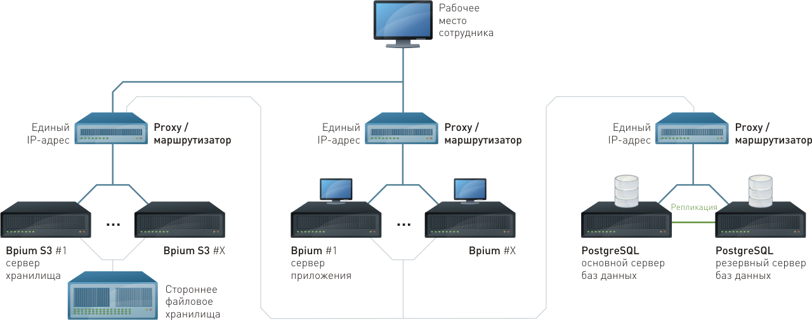
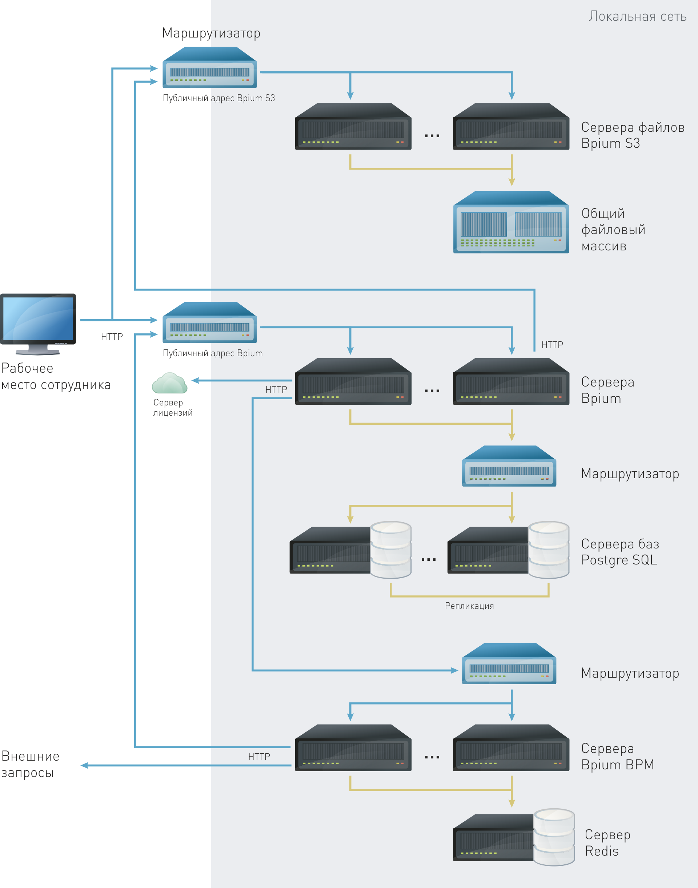

# Архитектура и компоненты

## Структура

Bpium Enterprise состоит из 3 независимых приложений. Серверные приложения могут быть установлены на одном или разных серверах.

* **Bpium** — сервер приложения и логики
* **Bpium S3** — сервер файлового хранилища
* **Bpium BPM** — сервер исполнения процессов

Также для работы используются другие приложения

* **Postgre SQL** — сервер баз данных
* **Redis**— сервер хранилища состояния процессов и очереди заданий
* **Веб-сервер** (опционально) — веб-сервер для балансировки и HTTPS

Приложения для работы сотрудников:

* **Веб-приложение** — приложение для настройки системы и работы сотрудников
* **Мобильное приложение** — приложение для работы сотрудников

### Операционная система

Bpium — кроссплатформенное решение. Поддерживаются операционные системы Windows, на базе Linux, Alpine, Mac OS X.

Поддерживаются разные способы разворачивания системы: из файлов, через Docker-образы, в середе Kubernetres, PM2 и других.

## **Одиносерверная архитектура**

Все сервисы могут работать на одном выделенном или виртуальном сервере:

**Особенности:**

* Сервисы Bpium и Bpium S3 должны иметь публичные внешние адреса.

## **Многосервисность**

Возможно разделить сервисы по серверам для увеличения производительности и независимости:

.png>)

**Особенности:**

* Остальные сервисы могут не иметь внешних адресов, но должны быть досягаемы между собой
* Сервис Bpium BPM должен иметь доступ во вне и к сервису Bpium
* Сохранение состояния исполнения процессов реализуется за счет хранилища/очереди Redis

## Многосерверная архитектура

Сервисы могут находится на разных серверах и стоять за маршрутизаторами, внешними веб-серверами или балансировщиками нагрузки:

**Особенности**

* Сервис Bpium должен иметь доступ к сервису Bpium S3 через интернет (по внешнему адресу)
* Сервис Bpium BPM должен иметь доступ к сервису Bpium через интернет (по внешнему адресу)

### **Каналы взаимодействия сервисов**

Все сервисы Bpium рассчитаны на многосерверную распределенную параллельную работу:

**Особенности:**

* Сервера Bpium S3 должны иметь общую папку для хранения файлов
* Синхронизация баз данных реализуется через репликацию на уровне PostgreSQL
* Синхронизация серверов Bpium BPM реализуется за счет хранилища/очереди Redis
