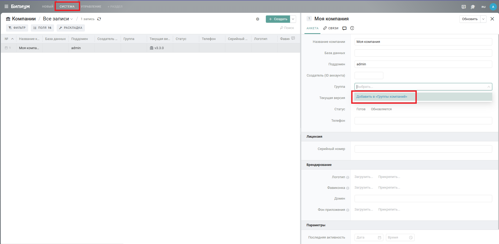
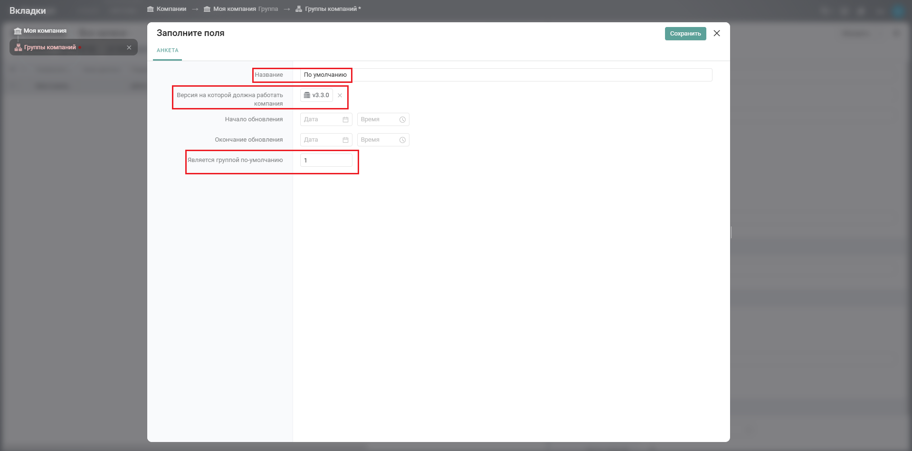
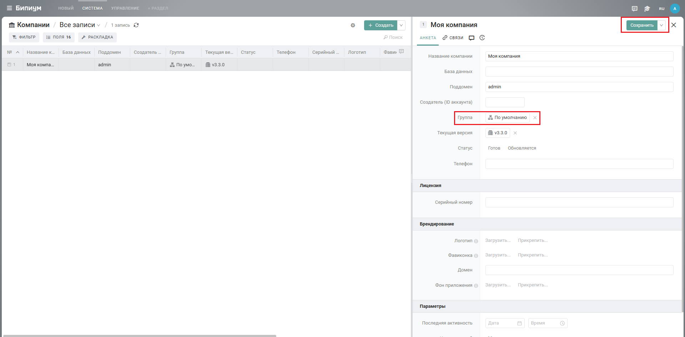
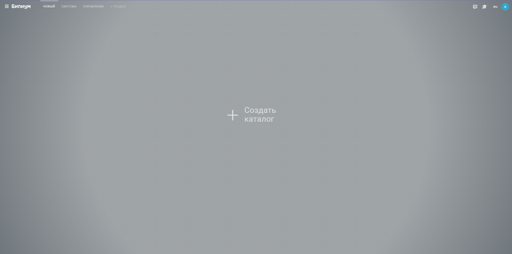
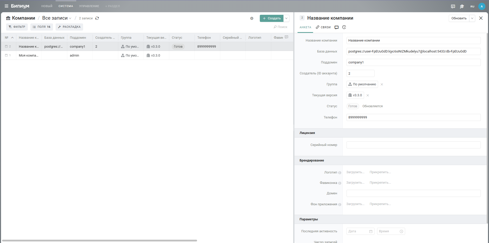
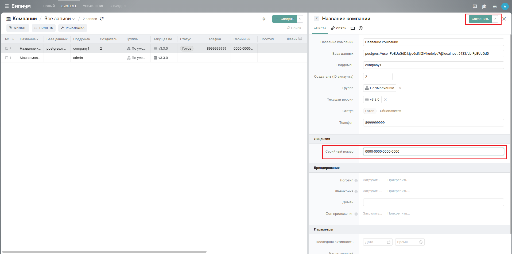

Мультидоменная среда -- возможность создавать и управлять одной и более системами Бипиум. Мультидоменная среда позволяет разграничить деятельность одной компании в нескольких независимых друг от друга системах или создавать отдельные системы под разные компании, разворачивая таким образом свое собственное облако.

## Требования

-  Соответствующая лицензия, которая позволяет развернуть мультидоменную среду Бипиум. Лицензии и цены размещены на [сайте](https://bpium.ru/price#PriceServer). Также вы можете написать в отдел продаж sales@bpium.ru.

-  Развернутая обычная серверная версия Бипиум. Инструкция по разворачиванию здесь ([служба](./../skhemy-razvorachivaniya/service)/[docker](./../skhemy-razvorachivaniya/docker)).

-  Доменное имя для сервера (DNS).

-  Wildcard-сертификат Class 2 или более высокий SSL-сертификат.

## Настройка

В конфигурационном файле сервера приложения Бипиум (bpium) необходимо внести следующие изменения:

-  Добавить параметр:\
   `BPIUM_USE_SUB_DOMAINS=true`

-  Указать зарегистрированное доменное имя вместо IP адреса. Параметр:\
   `BPIUM_HOST=доменное_имя`

-  Указать путь к полученному сертификату и его ключу. Параметры:\
   `HTTPS_CERTIFICATE_PATH=путь_к_сертификату`

   `HTTPS_KEY_PATH=путь_к_ключу_сертификата`

-  Добавить параметры электронной почты в соответствии с почтовым сервисом. Параметры:\
   `EMAIL_SERVICE=`[`поддерживаемые_сервисы`](https://community.nodemailer.com/2-0-0-beta/setup-smtp/well-known-services/)

   `EMAIL_LOGIN=******`

   `EMAIL_PASSWORD=******`

Когда все параметры внесены, необходимо перезапустить все службы/поды приложения  Бипиум. Главная компания будет находится по адресу: `admin.доменное_имя`.

## Добавление компаний

Перед тем как добавлять новые компании необходимо создать группу компаний по умолчанию. Для этого переходим в секцию «Система», выбираем каталог «Компании» и открываем 1-ю запись. Затем напротив поля «Группа» нажимаем «Выбрать», после «Добавить в ...».

{width=1911px height=934px}

В открывшемся окне в поле «Название» указываем название группы, например, «По умолчанию», в поле «Версия на которой должна работать компания» выбираем текущую версию, а в поле «Является группой по умолчанию» указываем цифру «1». После сохраняем запись группы компаний и изменение в записи компании.

{width=1920px height=952px}

{width=1919px height=946px}

Теперь, когда группа компаний создана, можно создавать новые компании. Компанию можно создать отправив письмо, которое будет содержать дальнейшие инструкции. Для этого необходимо выполнить следующий веб-запрос:

```
URL: http://admin.доменное_имя/auth/createInvite
Method: POST
Auth: Basic Auth (login & password)

Request Body:
{
    "name": "имя получателеля письма",
    "email": "почта на которую будет отправлено письмо",
    "company": "наименование компании",
    "phone": "номер телефона"
}

Responce Body:
{
    "result": true
}
```

Письмо будет содержать ссылку на создание компании, перейдя по которой появится окно создания компании. В поле «Название компании» указываем название компании. В поле «Адрес компании в системе» указываем адрес, по которому в будущем будем переходить в систему, например, «company1». В поле «Телефон» указываем номер телефона. В поле «Ваше имя» указываем ФИО. В конце вводим пароль, который будет использоваться для авторизации в системе, и нажимаем «Создать». Процесс создания компании занимает около 1 минуты.

<figure>

.png>)

<figcaption>


</figcaption>

</figure>

<figure>

.png>)

<figcaption>


</figcaption>

</figure>

{width=1915px height=952px}

Созданная компания появится в списке всех компаний в главной системе.

{width=1918px height=954px}

## Лицензирование компаний

Для каждой компании приобретается отдельная серверная лицензия. Список лицензий и цены размещены на [сайте](https://bpium.ru/price#PriceServer). Также вы можете обратиться в отдел продаж sales@bpium.ru.

После приобретения лицензии необходимо ввести полученный серийный номер в поле «Серийный номер» в записи созданной компании и сохранить ее.

{width=1916px height=952px}