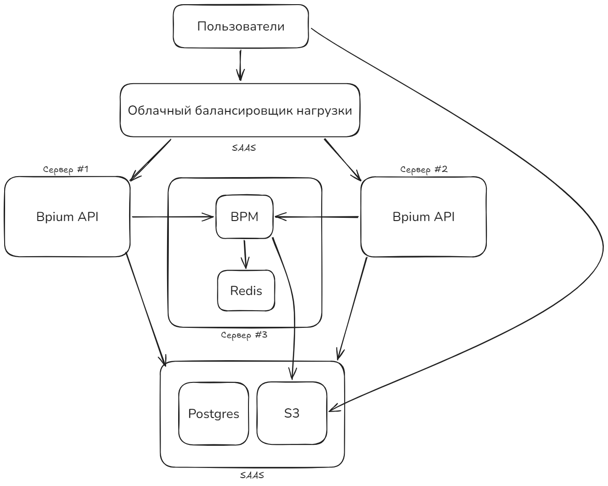
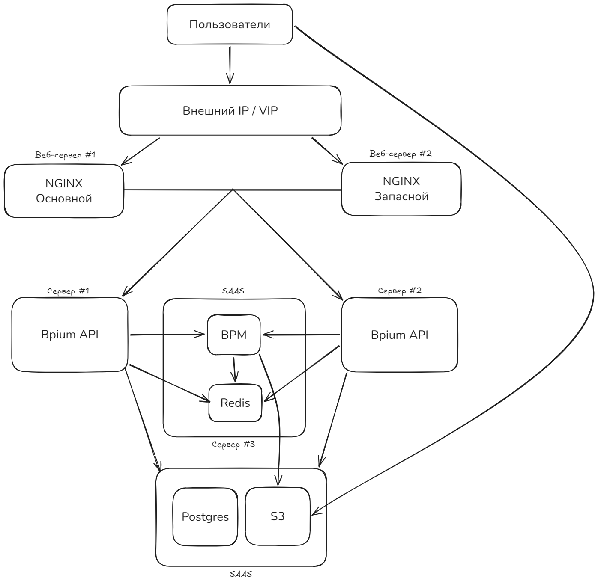

В этой статье описан процесс горизонтального развертывания приложения с использованием **системных служб (systemd)** на нескольких независимых серверах.

Такой подход используется для повышения отказоустойчивости и производительности системы без использования контейнеризации (Docker/Kubernetes).

## Архитектура системы

{width=1314px height=1051px}

В распределенной конфигурации компоненты приложения разделены по ролям и изолированы друг от друга:

-  **Облачный балансировщик нагрузки (SaaS):** Внешняя точка входа. Принимает трафик от пользователей и распределяет его между серверами API.

-  **Сервер #1 и Сервер #2 (Bpium API):** Изолированные серверы, обрабатывающие запросы пользователей.

-  **Сервер #3 (BPM и Redis):** Выделенный инстанс для сервера исполнения процессов (BPM) и сервера хранилища состояния процессов и очереди заданий (Redis).

-  **База данных (Postgres) и S3 (SaaS):** Облачный слой хранения данных. База данных доступна для серверов API. Хранилище S3 доступно серверам API и серверу BPM (Сервер #3), а также напрямую пользователям для скачивания статических файлов.

## Подготовка сетевого окружения (Firewall)

Настройте правила безопасности на сетевых экранах серверов:



---

*  

   Сервер

*  

   Открытый порт

*  

   Кто имеет доступ

*  

   Назначение

---

*  

   Сервер #1 и #2 (Bpium API)

*  

   `80` (порт Bpium API по умолчанию)

*  

   Cloud Load Balancer

*  

   Прием веб-трафика

---

*  

   Сервер #3 (BPM)

*  

   `2030` (порт BPM)

*  

   Сервер #1 и Сервер #2

*  

   Запросы от Bpium API к BPM

---

*  

   Сервер #3 (Redis)

*  

   `6379`

*  

   `127.0.0.1` (только локально)

*  

   Закрыт внутри сервера для BPM



:::lab 

Доступ к облачным SaaS-сервисам (DB и S3) со стороны инстансов осуществляется через интернет или защищенные шлюзы провайдера (Endpoints).

Подробнее об Endpoints: <https://yandex.cloud/ru/docs/vpc/concepts/private-endpoint>

:::

## Развертывание компонентов

### Сервер #1 и #2

#### Bpium API

Установить Bpium на серверы #1 и #2. Процесс идентичен для обоих серверов.

Инструкция разворачивания службами: <https://docs.bpium.ru/docs/deployment/skhemy-razvorachivaniya/service#установка-bpium>

### Сервер #3

#### Redis

Установите Redis и убедитесь, что он слушает только локальный интерфейс (`bind 127.0.0.1` в `/etc/redis/redis.conf`).

**Инструкция по установке:**

Введите в терминале следующие команды:

```bash
sudo apt-get install lsb-release curl gpg
curl -fsSL https://packages.redis.io/gpg | sudo gpg --dearmor -o /usr/share/keyrings/redis-archive-keyring.gpg
sudo chmod 644 /usr/share/keyrings/redis-archive-keyring.gpg
echo "deb [signed-by=/usr/share/keyrings/redis-archive-keyring.gpg] https://packages.redis.io/deb $(lsb_release -cs) main" | sudo tee /etc/apt/sources.list.d/redis.list
sudo apt-get update
sudo apt-get install redis
```

Откройте конфигурационный файл Redis:

```bash
sudo nano /etc/redis/redis.conf
```

Убедитесь что в конфигурации присутствует строчка `bind 127.0.0.1 -::1`.

#### BPM

Установите BPM, используя инструкцию: <https://docs.bpium.ru/docs/deployment/skhemy-razvorachivaniya/service#установка-bpium-bpm>

### Настройка балансировки

Так как сессии пользователей хранятся в базе данных (Postgres), серверы API работают в режиме *stateless*. Это позволяет использовать стандартный алгоритм балансировки **Round Robin** (по очереди).

#### Облачный балансировщик нагрузки

1. В консоли вашего облачного провайдера создайте Сетевой балансировщик нагрузки (Network Load Balancer).

   :::info 

   Название сетевого балансировщика может отличаться у разных провайдеров.

   :::

2. Создайте целевую группу (Target Group) и добавьте в неё внутренние IP-адреса `Сервер #1` и `Сервер #2`.

#### Альтернативный вариант: Инфраструктура On-Premise (Keepalived + Nginx)

Если приложение разворачивается на собственных физических серверах клиента, где нет готового облачного балансировщика, схему входа необходимо изменить во избежание появления единой точки отказа.

**Схема отказоустойчивости с Keepalived:**

Вместо облачного балансировщика нагрузки создаются два одинаковых инстанса веб-сервера (например, `Nginx-Основной` и `Nginx-Запасной`).

1. **Virtual IP (VIP):** Выделяется один свободный IP-адрес в локальной сети. Именно он привязывается к доменному имени приложения.

2. **Служба Keepalived:** Устанавливается на оба сервера Nginx и работает по протоколу VRRP. Она «вешает» VIP-адрес на основной сервер.

3. **Отказоустойчивость:** Если основной Nginx выходит из строя, служба `keepalived` на резервном сервере замечает пропажу сигналов, за доли секунды перехватывает Virtual IP-адрес на себя, и пользователи не замечают сбоя.


{width=1396px height=1365px}

## Заключение

Вынос компонентов приложения на отдельные серверы и их запуск в виде системных служб -- это ключевой шаг в эволюции инфраструктуры проекта. Переход от монолитного размещения «всё на одном сервере» к распределенной архитектуре решает три главные задачи:

-  **Надежность без усложнения:** Мы убрали «точки отказа». Падение одного сервера API больше не приводят к полной остановке системы. Пользователи продолжают работать с приложением без прерывания сессий.

-  **Гибкое масштабирование и экономия ресурсов:** Теперь каждый компонент системы потребляет ресурсы изолированно. Если возрастает нагрузка на бизнес-логику, достаточно добавить еще один сервер API в группу балансировки.