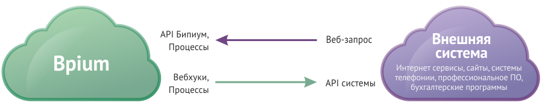

# Интеграция данных

Позволяет наладить двухсторонний обмен данными и командами с внешними системами.

## Схема

**Внешняя система.** В качестве внешней системы может выступать облачный сервис или ПО установленное на собственных серверах. Это может быть система учета, системы телефонии, бухгалтерские программы, профессиональное и отраслевое ПО, а также интернет сервисы, социсети, корпоративные системы и сайты.

## Внешняя система → Бипиум

Бипиум принимает данные/команды из внешней системы.

**Типовые решения:**

* Импорт данных из других систем
* Прием заявок с сайта или корпоративной системы
* Получение данных из Бипиума для операций во внешней системе
* Получение данных из Бипиума для отображения на сайте
* Изменение данных в Бипиуме например смена ответственного, даты или статуса
* Генерация данных в Бипиуме (лог событий/операций, история звонков)
* Прикрепление файлов (счет, акт, запись разговора) к записям Бипиума из внешних систем&#x20;

**Способы:**

* API — доступ к данным Бипиума (создание/изменение данных)
* Процессы — прием и обработка произвольных внешних веб-запросов
* База данных — чтение данных Бипиума напрямую через базу данных (не рекомендуется)

### API

API — публичные методы для взаимодействия с данными Бипиуме из вне.

**Технология:** веб-запросы по методологии REST по протоколу HTTP/HTTPS, формат данных JSON.\
**Формат обмена:** в формате Бипиума.\
Подробнее в статье «[API](../integrations/api/)».

### Процессы

Бипиум умеет принимать произвольные запросы и запускать процессы, которые обрабатывают полученные данные и могут вернуть ответ внешней системе.

**Технология:** веб-запросы по протоколу HTTP/HTTPS, формат данных JSON, XML, POST-параметры, производный.\
**Формат обмена:** в формате внешней системы.\
Подробнее в разделе «Бизнес-процессы» в статье «[Внешние запросы](../processes/events/web-requests.md)».

### База данных

Архитектура базы данных Бипиума представляет собой перечень таблиц с данными. Для каждого каталога в системе создается своя таблица.

Стоит учитывать, что структура базы данных периодически меняется. Если связи будут нарушены, Бипиум не сможет показать данные в системе. Поэтому мы не рекомендуем интеграции на уровне базы данных и в крайних случаях разрешаем доступ только на чтение данных. Доступ на уровне базы данных идет без учета правовой политики доступа к данным в Бипиуме.

**Технология:** SQL-запросы.\
**Формат обмена:** запросы к структуре данных Бипиума.

Интеграция на уровне базы данных возможна только в версии Бипиума, установленной на свои сервера.

## Бипиум → Внешняя система

Бипиум отправляет данные и команды во внешнюю систему.

**Типовые решения:**

* Синхронизация данных с другой системой
* Отправка сообщений через месендежры и электронную почту
* Получение данных из внешней системы
* Запрос на формирования документов (счета, акта, договора)
* Проверка наличия товаров, счета, и других условий по данным внешней системы
* Генерация данных во внешней системе (событий в календаре, задач в системе трекенга)

**Способы:**

* Вебхуки — веб-запросы к внешним системам с уведомлением от изменении данных
* Процессы — веб-запросы к API внешних систем для получения и изменения данных
* База данных — sql-запросы к внешним системам через механизм процессов

### Вебхуки (WebHooks)

Когда сотрудники создают новые записи или меняют существующие, Бипиум генерирует события — вебхуки. Эти события Бипиум может рассылать внешним системам, передавая изменённые данные. Эти запросы Бипиум шлет в своем формате, который должна принять и понять внешняя система. Использование этого метода подразумевает настройку на стороне внешней системы.

**Технология:** веб-запросы по протоколу HTTP/HTTPS, формат данных JSON.\
**Формат обмена:** в формате Бипиума.\
Подробнее в статье «[Вебхуки](../webhooks.md)».

### Процессы

Бипиум, через механизм бизнес-процессов может совершать веб-запросы к внешним системам для получения и создания данных. Этот метод позволяет делать запросы в том формате, в котором ожидает внешняя система. Для этого внешняя система должна иметь публичное API по протоколу HTTP. Для использования этого метода доработка внешней системы не требуется.

**Технология:** веб-запросы по протоколу HTTP/HTTPS, формат данных JSON, XML, POST-параметры, произвольный.\
**Формат обмена:** формат внешней системы.\
Подробнее в статье «[Бизнес-процессы](../processes.md)» и в описании компоненте «[Веб-запрос](../processes/components/web.md)».

### База данных

Бипиум, через механизм бизнес-процессов может также совершать SQL-запросы к базам данных других систем. Поддерживаются MS SQL, Oracle, MySQL, Postgree. Для использования этого метода доработка внешней системы не требуется.

**Технология:** SQL-запросы.\
**Формат обмена:** запросы к структуре данных внешней системы.\
Подробнее в статье «[Бизнес-процессы](../processes.md)» и в описании компоненте «[SQL-запрос](../processes/components/sql.md)».
