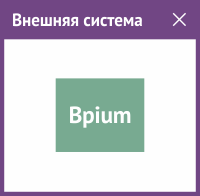
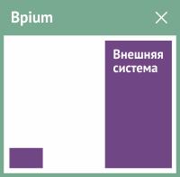

# Интеграция интерфейса

Позволяет расширить интерфейс Бипиума новыми возможностями и работать с карточками Бипиума во внешних системах.

## Бипиум внутри внешней системы

Бипиум позволяет отображать карточки записей во внешних системах. Это может быть карточка редактирования определенной записи или карточка создания новой записи.

**Типовые задачи:**

* Отображение форм Бипиума в сторонних системах&#x20;
* Отображение форм Бипиума на сайтах

**Примеры интерфейсных интеграций:**

* Карточка клиента/звонка в форме программы для операторов колл-центра
* Анкета на сайте или в личном кабинете корпоративной системы.

Подробнее в статье «[Веб-формы](../web-forms.md)».

## Внешняя система внутри Бипиума

Бипиум имеет механизм подключения внешних модулей. Модули — это мини программы, которые встраиваются в веб-приложение Бипиума. Они могут менять его вид или поведение, добавлять новые функции.

**Типовые задачи:**

* Дополнительные кнопки для работы с данными внутри Бипиума
* Дополнительные режимы работы с данными
* Дополнительные модули внешних систем для взаимодействия в одном интерфейса

**Примеры интерфейсных интеграций:**

* Телефонные модули
* Кнопки для совершения звонков, отправки писем
* Изменение вида отображения прикрепленных файлов
* Изменение дизайна приложения

Модули представляют собой javascript-библиотеки.

Подробнее в статье «[Веб-расширения](../web-modules.md)».
