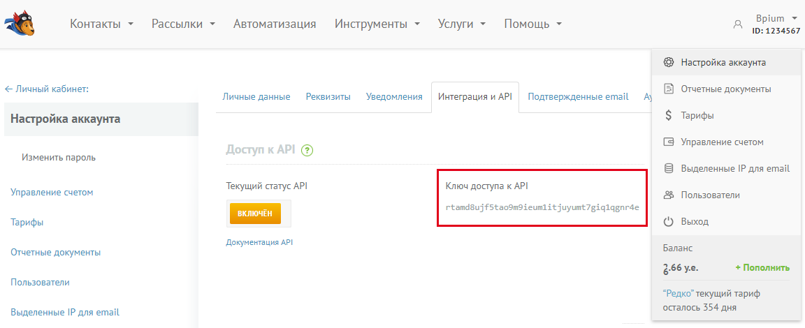
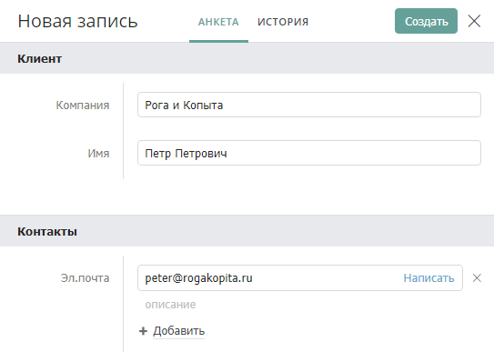
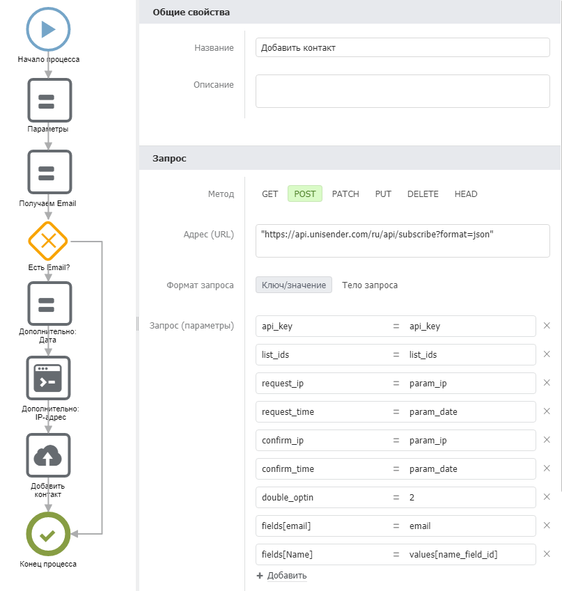

# UniSender

Российский сервис для массовой рассылки email и SMS сообщений по базе клиентов. Специализируется на работе в странах СНГ.

## Особенности

**Каналы связи**\
E-mail, SMS

**Типы рассылок**\
Рассылки в виде последовательных писем, одиночные массовые рассылки, одиночные письма.

**Стоимость**  \
0,28 руб/письмо или от 560 руб/месяц

**Бесплатный тариф**  \
до 100 контактов и до 1500 писем/месяц

## Возможности интеграции

Бипиуму позволяет управлять списками рассылок и рассылками Унисендера:

* Добавлять контакты в списки
* Удалять контакты из списков
* Создавать новые списки
* Запускать отправку рассылок

Унисендер также дает возможность:

* Отправлять из Бипиума письма используя шаблоны Унисендера
* Получать информацию о статусе отправки письма
* Получать статистику по отправке рассылок
* Контролировать балланс

## Способ интеграции

#### На стороне Unisender

Получите ключи доступа в личном кабинете:

#### На стороне Бипиума

Для интеграции потребуется модуль бизнес-процессов Бипиума. Бипиум через сценарии может вызывать методы Унисендера: управлять cписками контактов, отправлять рассылки и индивидуальные письма.

1. Настройте событие, по которому будет запускаться процесс. Например, событие об изменении данных в каталоге Клиенты. Подробнее в статье «[События](../../../../manual/structure/systemcatalogs/events.md)».
2. В каталоге «[Сценарии](../../../../manual/processes/scripts/)» создайте сценарий. С помощью компонента [веб-запрос](../../../../manual/processes/scripts/components/webrequest.md) настройте обращение к Унисендеру.

Описание API Унисендера: [www.unisender.com/ru/support/integration/api](https://www.unisender.com/ru/support/integration/api/)

## Пример интеграции

### Автоматическое добавление клиента в список рассылки

Данный пример описывает как автоматически добавлять клиента в список рассылки Унисендера. При этом подготовка писем и отправка рассылок остается в Унисендере.

При дополнительной настройке можно сделать правила добавления клиента в разные списки при определенных параметрах в карточке клиента.

#### 1. Создайте список в Унисендере

Для работы потребуется список контактов в Унисендере. Вы можете создать новый или использовать существующий.

В созданный список вы можете импортировать список контактов из существующего каталога в Бипиуме. Для этого воспользуйтесь функцией [экспорта записей](../../../../manual/structure/catalogs/export.md).

**ID списка** написан под названием списка.

#### 2. Создайте каталог Клиенты

Создайте каталог Клиентов или используйте существующий. Важно, чтобы в каталоге было поле типа контакт для хранения адресов эл.почты.

Электронная почта также может хранится и в простом текстовом поле анкеты, но в этом примере рассмотрен вариант с полем контакт.

#### 3. Создайте событие на создание Клиента

При создании записи в каталоге Клиенты будет запускаться сценарий, который будет добавлять контакт в список Унисендера. Задайте параметры события в каталоге Управление/События:

В поле выполнить выберите первый пункт Создать новый сценарий. Создайте и настройте сценарий.

#### 4. Настройте сценарий

Пример сценария, получающего почту созданного клиента и сохраняющего его в список Унисендера:

**Особенности сценария**

* Сценарий сохраняет почту в список, если она указана. Если указано несколько почт, то сохраняет первую. Если необходимо сохранить несколько, создайте цикл в сценарии.
* Сценарий генерирует дополнительные параметры, позволяющие увеличить ограничение числа добавляемых почт в Унисендер с 20 до 50 в сутки.
* Если вы попытаетесь добавить более 50 адресов в сутки, то Унисендер начнет отправлять клиентам письмо с подтверждением подписки (за это отвечает параметр double\_optin). Шаблон письма-подтверждения можно настроить в Унисендере.

**Адаптация сценария под себя**

При адаптации сценария под себя вам потребуется изменить стыковку с каталогом Клиенты. В созданном вами каталоге коды полей могут отличатся от указанных в сценарии. Сценарий построен так, что все важные для логики поля сохраняются в переменные в компоненте «Параметры». Измените ссылки на поля, учитывая коды полей в вашем каталоге. Коды полей можно увидеть в режиме редактирования каталога.

Вам также потребуется указать ваш личный API ключ и код списка. Эти параметры также задаются в компоненте присвоения значений «Параметры».

Сценарий: [скачать](http://download.bpium.ru/docs/scripts/unisender.version.1.bpmn).

### Другие кейсы

#### Обновление **почты в списке при изменение клиента в Бипиуме**

Вы также можете настроить сценарий на изменение записи в каталоге Клиенты. Например, если адрес эл.почты изменился, то нужно удалить прежний и добавить новый. Для этого воспользуйтесь событие «Запрос на изменение данных». Это событие срабатывает до сохранения данных в базу, а значит вы сможете получить ранее указанный адрес почты в карточке клиента и удалить его из базы. Для этого используйте метод API Унисендера «[exclude](https://www.unisender.com/ru/support/integration/api/exclude)».

#### У**далении почты из списка при удалении клиента в Бипиуме**

Дополнительным сценарием вы можете удалять клиента из базы Унисендера, при удалении из каталога Клиенты. Для этого воспользуйтесь событие «Запрос на изменение данных». Это событие срабатывает до сохранения данных в базу, а значит вы сможете получить ранее указанный адрес почты в карточке клиента и удалить его из базы. Для этого используйте метод API Унисендера «[exclude](https://www.unisender.com/ru/support/integration/api/exclude)».

#### Несколько списков

В сценарии вы можете настроить логику, при которой клиенты с разными параметрами в карточке будут добавляться в разные списки. Например, в зависимости от статуса (вип/не вип) или от заказанных услуг.
